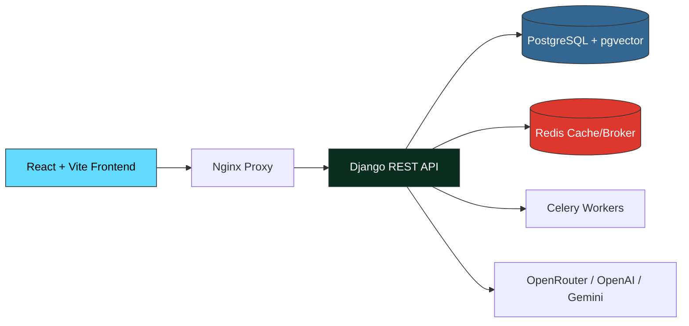

# Persian Legal RAG System — سیستم پرسش و پاسخ هوشمند حقوقی

<p dir="rtl" align="center">
  <strong>یک سیستم پیشرفته RAG ( retrieval-augmented generation ) برای متون حقوقی فارسی</strong>
  <br />
  <strong>پرسش بپرس، پاسخ بگیر، با استناد به منابع معتبر حقوقی</strong>
</p>

---

## فهرست مطالب

- [معرفی پروژه](#معرفی-پروژه)
- [فازهای پروژه](#فازهای-پروژه)
  - [فاز ۱: دستیار خوانش اسناد ✅](#فاز-۱-دستیار-خوانش-اسناد-)
  - [فاز ۲: پژوهشگر حقوقی ✅](#فاز-۲-پژوهشگر-حقوقی-)
  - [فاز ۳: استراتژیست تعاملی 🔮](#فاز-۳-استراتژیست-تعاملی-)
  - [فاز ۴: موتور اقدام 🔮](#فاز-۴-موتور-اقدام-)
- [معماری فنی](#معماری-فنی)
- [تکنولوژی‌های استفاده شده](#تکنولوژی‌های-استفاده-شده)
- [شروع سریع (راه‌اندازی با Docker)](#شروع-سریع-راهاندازی-با-docker)
- [ساختار پروژه](#ساختار-پروژه)
- [مشارکت](#مشارکت)

---

## معرفی پروژه

**Persian Legal RAG System** یک سیستم هوشمند پرسش و پاسخ حقوقی است که با استفاده از تکنیک **بازیابی افزایش‌یافته (RAG)** به وکلا، حقوقدانان و دانشجویان حقوق اجازه می‌دهد:

- اسناد حقوقی فارسی (قراردادها، آرای قضایی، مواد قانونی) را **آپلود** کنند و از آن سوال بپرسند
- از **سه مرجع حقوقی** (قوانین مصوب، رویه‌های قضایی، نظریات مشورتی) به صورت همزمان جستجو کنند
- پاسخ‌های **مستند و دارای منبع** با استناد دقیق دریافت کنند
- در آینده: **تحلیل استراتژیک پرونده** و **تهیه پیش‌نویس دادخواست** انجام دهند

این پروژه با هدف **عدالت دسترسی به اطلاعات حقوقی** در ایران طراحی شده و کاملاً **فارسی‌محور** است.

---

## فازهای پروژه

### فاز ۱: دستیار خوانش اسناد ✅

**وضعیت:** ✅ کامل شده  
**شعار:** با PDFهای خود گفتگو کنید.

یک سیستم RAG تک‌سند که کاربران می‌توانند یک PDF حقوقی فارسی (مثلاً قرارداد، رأی دادگاه، یا مقاله حقوقی) آپلود کرده و درباره محتوای آن سوال بپرسند. سیستم بخش‌های مرتبط از آن سند را بازیابی کرده و پاسخ‌های مستند با استناد تولید می‌کند.

**قابلیت‌های کلیدی:**
- آپلود و پردازش PDF با PyMuPDF و تشخیص ساختار حقوقی فارسی (مواد، تبصره، بند، فصل)
- جستجوی ترکیبی (Hybrid Search): شباهت برداری (pgvector) + جستجوی تمام‌متن (FTS) + تطبیق فازی Trigram
- ترکیب نتایج با الگوریتم RRF (Reciprocal Rank Fusion) با وزن‌های [3.0, 1.0, 1.0]
- فرمول‌بندی پرسش با HyDE (تولید پاسخ فرضی توسط LLM برای بهبود بازیابی)
- استخراج خودکار استنادها از پاسخ LLM
- پخش زنده پاسخ (Streaming) با رویدادهای SSE
- تاریخچه گفتگوی ۱۰ مرحله‌ای برای پرسش‌های پیگیری
- نرمال‌سازی متون فارسی (تبدیل حروف عربی به فارسی، اعداد، فرم‌های نمایشی)

**معماری:**
```
آپلود PDF → PyMuPDF Extraction → Legal Structural Chunking
    → Embedding (bge-m3, 1024d) → pgvector Storage
    → Hybrid Search (Vector + FTS + Trigram, RRF Fusion)
    → LLM Generation (OpenRouter / OpenAI / Gemini)
```

---

### فاز ۲: پژوهشگر حقوقی ✅

**وضعیت:** ✅ کامل شده  
**شعار:** سوال حقوقی بپرس، پاسخ را از سه مرجع حقوقی دریافت کن.

سیستم را از پرسش و پاسخ تک‌سند به یک **پژوهشگر حقوقی چندمرجعی** تبدیل می‌کند. کاربران سوالات حقوقی خود را به فارسی می‌پرسند و سیستم از سه مرجع تخصصی حقوقی به صورت همزمان جستجو کرده و پاسخ جامعی با استنادهای دقیق تولید می‌کند.

**سه مرجع حقوقی:**

| مرجع | توضیح | منبع داده |
|------|-------|-----------|
| ⚖️ قوانین مصوب | قوانین مهم کشور | `قوانین مهم.json` |
| 📜 رویه‌های قضایی | آرای وحدت رویه و دیوان عدالت اداری | `آرای وحدت رویه.json` + `آرای هیئت عمومی.json` |
| 💡 نظریات مشورتی | نظریات اداره کل حقوقی و نشست‌های قضایی | `نظرات مشورتی.json` + `مشروح نشست‌های قضایی.json` |

**قابلیت‌های کلیدی:**
- **مسیریاب پرسش (Question Router):** LLM پرسش را تحلیل کرده و به مراجع مرتبط هدایت می‌کند
- **جستجوی چندمرجعی:** `multi_hub_search()` با فیلتر `hub_type` در تمام اسناد مرجع
- **ساخت زمینه چندمنبعی:** برچسب‌گذاری بخش‌ها بر اساس مرجع و سند
- **حالت Lite:** یک مرحله ترکیب با زمینه چندمنبعی
- **حالت Full:** پاسخ‌های جزئی هر مرجع + سنتز نهایی با تشخیص تعارض
- **سازگاری با فاز ۱:** قابلیت Local RAG همچنان کار می‌کند

**معماری:**
```
سوال کاربر
    │
    ▼
┌──────────────────────────────┐
│  مسیریاب پرسش (LLM)          │ ← تجزیه سوال به زیرپرسش‌ها
│  هدایت به مرجع مرتبط         │    به تفکیک نوع مرجع
└──────────┬───────────────────┘
           │
           ▼
    ┌──────┴──────┐
    ▼             ▼             ▼
┌─────────┐ ┌─────────┐ ┌─────────┐
│قوانین   │ │رویه‌های │ │نظریات   │
│مصوب     │ │قضایی    │ │مشورتی   │
│hybrid_  │ │hybrid_  │ │hybrid_  │
│search() │ │search() │ │search() │
└────┬────┘ └────┬────┘ └────┬────┘
     │           │           │
     ▼           ▼           ▼
┌──────────────────────────────┐
│  ترکیب زمینه چندمنبعی        │ ← برچسب مرجع + سند
└──────────┬───────────────────┘
           │
           ▼
┌──────────────────────────────┐
│  سنتز پاسخ توسط LLM          │
└──────────┬───────────────────┘
           │
           ▼
    پاسخ نهایی + استنادهای دقیق + ابرداده مرجع
```

---

### فاز ۳: استراتژیست تعاملی 🔮

**وضعیت:** 📋 برنامه‌ریزی شده  
**شعار:** پرونده خود را توصیف کن، تحلیل استراتژیک با احتمال موفقیت دریافت کن.

یک **استراتژیست حقوقی هوشمند** که با کاربر مصاحبه می‌کند تا اطلاعات پرونده را جمع‌آوری کند، سپس قدرت پرونده را در برابر پایگاه داده حقوقی موجود تحلیل می‌کند. این فاز کاملاً مکالمه‌محور است و نیازی به آپلود سند ندارد.

**مراحل:**
1. **مصاحبه با کاربر:** پرسش‌های هدفمند برای تکمیل اطلاعات (طرفین، موضوع، زمان‌بندی، ادله، مرجع قضایی)
2. **پژوهش حقوقی:** جستجو در هر ۳ مرجع برای قوانین، رویه‌ها و نظریات مرتبط
3. **تحلیل احتمال موفقیت:** ارزیابی نقاط قوت، ضعف، ریسک‌ها و شانس موفقیت
4. **گزارش استراتژیک:** گزارش ساختاریافته با استناد و توصیه‌های عملی

---

### فاز ۴: موتور اقدام 🔮

**وضعیت:** 📋 برنامه‌ریزی شده  
**شعار:** هدف حقوقی خود را توصیف کن، نقشه راه گام‌به‌گام و پیش‌نویس دریافت کن.

یک **موتور اقدام حقوقی** که نقشه‌های راه عملی و متون حقوقی هدفمند (دادخواست، اظهارنامه، کلوزهای قراردادی) را با استناد به قوانین ایران و رویه‌های قضایی تولید می‌کند.

**مراحل:**
1. **شفاف‌سازی هدف:** پرسش‌های هدفمند برای درک خواسته کاربر
2. **پژوهش مسیر حقوقی:** جستجو در ۳ مرجع برای رویه‌ها، مدارک الزامی و مبنای قانونی
3. **تولید نقشه راه:** راهنمای عملی با زمان‌بندی، اقدامات الزامی و مراحل
4. **تهیه پیش‌نویس:** تولید متون حقوقی با فرمت و استناد مناسب

---

## معماری فنی



---

## تکنولوژی‌های استفاده شده

### فرانت‌اند
- **React 18** با **TypeScript**
- **Vite** (build tool)
- **TailwindCSS** + **shadcn/ui** (کامپوننت‌های UI)
- **Zustand** (state management)

### بک‌اند
- **Django 5** + **Django REST Framework**
- **PostgreSQL** با افزونه **pgvector** (جستجوی برداری)
- **Redis** (کش و message broker)
- **Celery** (پردازش وظایف پس‌زمینه)
- **Gunicorn** (وب سرور)

### هوش مصنوعی و پردازش اسناد
- **LangChain** (framework RAG)
- **PyMuPDF** (استخراج متن PDF)
- **OpenRouter API / OpenAI / Gemini** (embeddings و chat)
- **bge-m3** (مدل embedding، ۱۰۲۴ بعدی)

### DevOps
- **Docker** + **Docker Compose**
- **Nginx** (reverse proxy)
- **GitHub Actions** (CI/CD)

---

## شروع سریع (راه‌اندازی با Docker)

### پیش‌نیازها
- [Docker](https://docker.com) و **Docker Compose**
- یک کلید API از OpenRouter (یا OpenAI / Gemini)

### مراحل

```bash
# ۱. کلون کردن ریپازیتوری
git clone https://github.com/HadiTighsazan/Legal_Persian_Agent_For_Lawyers.git
cd Legal_Persian_Agent_For_Lawyers

# ۲. تنظیم متغیرهای محیطی
cp .env.example .env
```

فایل `.env` را ویرایش کرده و مقادیر زیر را تنظیم کنید:
- `DJANGO_SECRET_KEY`: یک کلید امن Django (با دستور `python -c "from django.core.management.utils import get_random_secret_key; print(get_random_secret_key())"`)
- `OPENROUTER_API_KEY`: کلید API خود از [OpenRouter](https://openrouter.ai/keys)
- سایر مقادیر پیش‌فرض برای توسعه مناسب هستند

```bash
# ۳. ساخت و اجرای سرویس‌ها
docker-compose up --build

# ۴. اجرای migrationهای دیتابیس (در ترمینال جداگانه)
docker-compose exec backend python manage.py migrate

# ۵. ایجاد کاربر ادمین
docker-compose exec backend python manage.py createsuperuser
```

### دسترسی به سرویس‌ها

| سرویس | آدرس | توضیح |
|-------|------|-------|
| فرانت‌اند | http://localhost:5173 | رابط کاربری React |
| API بک‌اند | http://localhost/api | (از طریق Nginx) |
| پنل ادمین | http://localhost/admin | مدیریت Django |
| PostgreSQL | port 5432 | دیتابیس |
| Redis | port 6379 | کش |

---

## ساختار پروژه

```
.
├── docs/                        # مستندات
│   ├── roadmap.md              # نقشه راه محصول
│   └── references/             # مراجع فنی
│       ├── database-schema.md  # ساختار دیتابیس
│       └── api-registry.md     # ثبت API‌ها
├── src/
│   ├── backend/                # بک‌اند Django
│   │   ├── conversations/      # اپ گفتگو و RAG
│   │   ├── documents/          # اپ اسناد و پردازش
│   │   ├── users/              # اپ کاربران و احراز هویت
│   │   ├── tasks/              # اپ وظایف پس‌زمینه
│   │   ├── core/               # اپ اصلی
│   │   └── config/             # تنظیمات Django
│   └── frontend/               # فرانت‌اند React
│       ├── src/
│       │   ├── components/     # کامپوننت‌های UI
│       │   ├── pages/          # صفحات
│       │   ├── stores/         # state management
│       │   ├── api/            # کلاینت API
│       │   └── hooks/          # hooks سفارشی
│       └── ...
├── docker/                     # تنظیمات Docker
│   ├── backend/
│   ├── frontend/
│   └── nginx/
├── docker-compose.yml          # orchestration سرویس‌ها
├── .env.example                # نمونه متغیرهای محیطی
└── README.md                   # این فایل
```

---

## مشارکت

لطفاً برای مشارکت در پروژه:

1. از **TDD Flow** پیروی کنید (RED → GREEN → REFACTOR)
2. مستندات مرجع (دیتابیس و API) را به‌روز نگه دارید
3. از قانون **Single Responsibility Principle** پیروی کنید
4. فایل‌ها را کوچک و ماژولار نگه دارید (حداکثر ۳۰۰-۴۰۰ خط)
5. از **تایپ‌دهی دقیق** (TypeScript برای فرانت‌اند، Python Type Hints برای بک‌اند) استفاده کنید
6. تست‌های بک‌اند را با **Pytest** و تست‌های فرانت‌اند (منطق غیر UI) را با **Vitest** بنویسید

---

<p dir="rtl" align="center">
  ساخته شده با ❤️ برای جامعه حقوقی ایران
</p>
