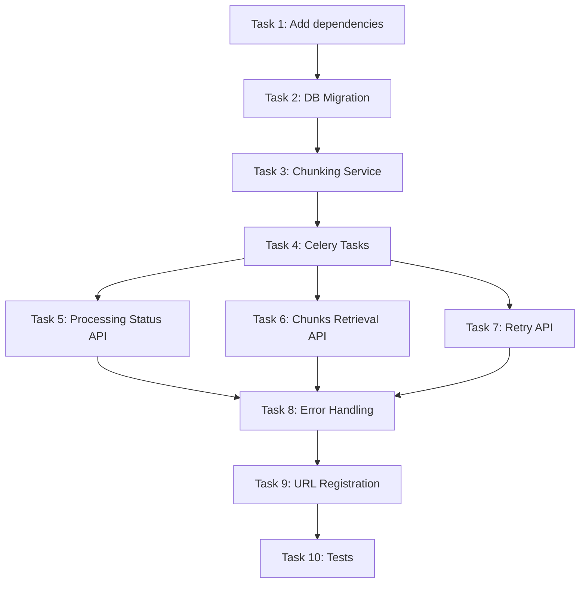

# Implementation Plan: E-04 Document Processing Pipeline

**Epic:** E-04 Document Processing Pipeline  
**Status:** Planned  
**Dependencies:** E-03 (Document Upload & Storage) ✅ Done  
**Downstream:** E-05 (Embedding & Vector Storage)

---

## Overview

This epic implements an asynchronous Celery-based document processing pipeline that:
1. Extracts text from uploaded PDFs using PyMuPDF (`fitz`)
2. Applies intelligent recursive character-based chunking
3. Tracks processing status end-to-end via `ProcessingTask` and `Document` models
4. Exposes REST APIs for triggering processing, checking status, retrieving chunks, and retrying failures

---

## Architecture Diagram

```mermaid
flowchart LR
    A[User uploads PDF via POST /documents/upload] --> B[Document saved to storage]
    B --> C[POST /documents/{id}/process]
    C --> D[Celery Task: process_document]
    D --> E[Task: extract_text_from_pdf]
    E --> F[Task: chunk_document]
    F --> G[Chunks stored in document_chunks]
    G --> H[Status: completed]
    E -.-> I[Status: failed on error]
    F -.-> I
    D --> J[GET /documents/{id}/processing-status]
    D --> K[POST /processing-tasks/{id}/retry]
```

---

## Current State Analysis

### What Already Exists

| Component | Status | Details |
|-----------|--------|---------|
| `Document` model | ✅ Done | In [`documents/models.py`](src/backend/documents/models.py:12). Has `status`, `error_message`, `total_pages` fields |
| `DocumentChunk` model | ✅ Done | In [`documents/models.py`](src/backend/documents/models.py:50). Has `chunk_index`, `page_start`, `page_end`, `content`, `token_count`, `metadata`. **Already migrated** in `0001_initial.py` |
| `ProcessingTask` model | ✅ Done | In [`tasks/models.py`](src/backend/tasks/models.py:12). Has `task_type`, `celery_task_id`, `status`, `progress`, `error_message`. **Already migrated** in `tasks/migrations/0001_initial.py` |
| Celery config | ✅ Done | [`config/celery.py`](src/backend/config/celery.py) — Celery app with auto-discovery |
| Celery settings | ✅ Done | In [`settings.py`](src/backend/config/settings.py:216) — Redis broker/backend, JSON serialization, time limits |
| Docker Compose | ✅ Done | `celery_worker` and `celery_beat` services defined in [`docker-compose.yml`](docker-compose.yml:81) |
| Document upload endpoint | ✅ Done | `POST /documents/upload/` in [`documents/views.py`](src/backend/documents/views.py:27) |
| Document URLs | ✅ Done | Only `upload/` route in [`documents/urls.py`](src/backend/documents/urls.py) |

**Important clarification:** Both `DocumentChunk` and `ProcessingTask` models were **already created during earlier epics** as forward-looking schema scaffolding. The PRD lists them as "new tables" because it was written as a specification before implementation began. They exist in the codebase but are **dormant** — no Celery tasks, no chunking service, and no API endpoints use them yet.

### What Needs to Be Built

| Component | Priority | Description |
|-----------|----------|-------------|
| Add PyMuPDF & tiktoken to requirements | High | New dependencies for text extraction & token counting |
| Migration for Document fields | High | Add `processing_status`, `total_chunks`, `extracted_text_length`, `processing_error` |
| Chunking Service | High | New `documents/services/chunking_service.py` — recursive character-based chunking |
| Celery Tasks | High | New `documents/tasks/document_processing.py` — extract, chunk, orchestration tasks |
| Processing Status API | High | `POST /documents/{id}/process`, `GET /documents/{id}/processing-status` |
| Chunks Retrieval API | High | `GET /documents/{id}/chunks` with pagination |
| Retry API | Medium | `POST /processing-tasks/{id}/retry` |
| Error Handling | High | Edge cases: corrupted PDFs, password-protected, empty PDFs, non-PDF files |
| Tests | High | Unit tests for chunking service, task tests, API endpoint tests |

---

## Detailed Task Breakdown

### Task 1: Add Dependencies to requirements.txt

**Files:** [`src/backend/requirements.txt`](src/backend/requirements.txt)

**Changes:**
- Add `PyMuPDF>=1.23.0` — PDF text extraction
- Add `tiktoken>=0.5.0` — OpenAI token counting

**Acceptance Criteria:**
- `pip install` succeeds with new dependencies
- Docker build succeeds

---

### Task 2: Add Processing Fields to Document Model + Migration

**Files:**
- [`src/backend/documents/models.py`](src/backend/documents/models.py) (modify)
- [`src/backend/documents/migrations/0003_add_processing_fields.py`](src/backend/documents/migrations/) (new)

**Changes to `Document` model:**
Add these fields:

| Field | Type | Default | Description |
|-------|------|---------|-------------|
| `processing_status` | `CharField(max_length=20, default='pending')` | `'pending'` | Tracks pipeline stage: pending, processing, completed, failed |
| `total_chunks` | `IntegerField(default=0)` | `0` | Total number of chunks after processing |
| `extracted_text_length` | `IntegerField(default=0)` | `0` | Length of extracted text in characters |
| `processing_error` | `TextField(null=True, blank=True)` | `None` | Error message if processing failed |

**Note:** The existing `status` field on `Document` tracks upload status. The new `processing_status` field specifically tracks the document processing pipeline stage.

**Acceptance Criteria:**
- Migration runs successfully
- Fields have correct defaults
- No data loss for existing documents

---

### Task 3: Implement Chunking Service

**Files:**
- [`src/backend/documents/services/chunking_service.py`](src/backend/documents/services/) (new)

**Implementation Details:**
- Create `ChunkingService` class with a `chunk_text(text, chunk_size=1000, overlap=200)` method
- Implement recursive character-based splitting:
  1. If text length <= chunk_size, return as single chunk
  2. Find the last sentence boundary (`.`, `!`, `?`) within chunk_size
  3. If no sentence boundary found, find last space within chunk_size
  4. If no space found, hard-split at chunk_size
  5. Apply overlap by going back `overlap` characters from the split point for the next chunk
- Track page numbers: parse page markers from extracted text (PyMuPDF provides per-page text)
- Calculate token count using `tiktoken` with `cl100k_base` encoding
- Return list of `ChunkResult` dataclass objects with: `content`, `page_start`, `page_end`, `char_count`, `token_count`, `metadata`

**Acceptance Criteria:**
- Chunks respect max size (1000 chars)
- Overlap (200 chars) implemented correctly
- Sentence boundaries preserved (no mid-sentence splits)
- Token count accurate via tiktoken
- Page numbers tracked correctly

---

### Task 4: Implement Celery Tasks

**Files:**
- [`src/backend/documents/tasks/__init__.py`](src/backend/documents/tasks/) (new directory)
- [`src/backend/documents/tasks/document_processing.py`](src/backend/documents/tasks/) (new)

**Why place under `documents/` instead of `app/`:** The `app/` directory doesn't exist in this project. Django apps are organized under `src/backend/` with app directories like `documents/`, `tasks/`, `users/`, etc. The `tasks/` app already exists for the `ProcessingTask` model, but Celery task logic belongs in the `documents/` app since it operates on documents.

#### Subtask 4a: `extract_text_from_pdf(document_id)`

**Logic:**
1. Fetch `Document` and `ProcessingTask` records from DB
2. Update `ProcessingTask.status = 'running'`, `started_at = now()`
3. Update `Document.processing_status = 'processing'`
4. Open PDF file from `file_path` using `fitz.open()`
5. Iterate through pages, extract text page-by-page
6. Store page markers in extracted text (e.g., `[PAGE 1]\n...`)
7. Update `Document.extracted_text_length`
8. Return extracted text with page markers
9. On error: update status to 'failed', store error message

**Error Handling:**
- `fitz.FileDataError` → corrupted PDF → status 'failed'
- Password-protected → detect via `fitz.open()` exception → status 'failed'
- Empty PDF (0 pages) → return empty string (handled by chunking task)

#### Subtask 4b: `chunk_document(document_id, extracted_text)`

**Logic:**
1. If `extracted_text` is empty → set `total_chunks = 0`, status 'completed', return
2. Call `ChunkingService.chunk_text(extracted_text)`
3. Bulk insert all chunks into `document_chunks` table using `bulk_create()`
4. Update `Document.total_chunks`
5. Update `ProcessingTask.status = 'completed'`, `completed_at = now()`
6. Update `Document.processing_status = 'completed'`

#### Subtask 4c: `process_document(document_id)` (Orchestration)

**Logic:**
1. Create `ProcessingTask` record with `task_type='extract'`
2. Use Celery **chain**: `extract_text_from_pdf.s(document_id) | chunk_document.s(document_id)`
3. Store Celery `task_id` in `ProcessingTask.celery_task_id`
4. Handle chain-level failures → update status to 'failed'
5. Log all errors with stack traces

**Acceptance Criteria:**
- Tasks execute in sequence via Celery chain
- Status tracking works end-to-end
- Failures logged and stored properly
- Bulk insert is efficient

---

### Task 5: Implement Processing Status API

**Files:**
- [`src/backend/documents/views.py`](src/backend/documents/views.py) (modify)
- [`src/backend/documents/serializers.py`](src/backend/documents/serializers.py) (modify)
- [`src/backend/documents/urls.py`](src/backend/documents/urls.py) (modify)

#### Endpoint: `POST /documents/{document_id}/process/`

**View:** `DocumentProcessView`

**Logic:**
1. Verify document exists and belongs to authenticated user
2. Check document is not already processing
3. Call `process_document.delay(document_id)`
4. Return `202 Accepted` with `{ "task_id": "...", "status": "pending" }`

#### Endpoint: `GET /documents/{document_id}/processing-status/`

**View:** `DocumentProcessingStatusView`

**Logic:**
1. Query `ProcessingTask` by document_id
2. Optionally check Celery `AsyncResult` for real-time state
3. Return status, progress, error message if any

**Response:**
```json
{
  "document_id": "uuid",
  "status": "processing",
  "progress": 45,
  "tasks": [
    { "task_type": "extract", "status": "completed", "progress": 100 },
    { "task_type": "chunk", "status": "running", "progress": 60 }
  ]
}
```

**Acceptance Criteria:**
- Endpoints follow API registry schema
- Returns proper HTTP status codes (202, 200, 404)
- Handles non-existent document_id with 404
- Only document owner can access

---

### Task 6: Implement Chunks Retrieval API

**Files:**
- [`src/backend/documents/views.py`](src/backend/documents/views.py) (modify)
- [`src/backend/documents/serializers.py`](src/backend/documents/serializers.py) (modify)

#### Endpoint: `GET /documents/{document_id}/chunks/`

**View:** `DocumentChunksListView`

**Query Parameters:**
- `page` (int, default=1)
- `page_size` (int, default=20)

**Logic:**
1. Verify document exists and belongs to authenticated user
2. Query `DocumentChunk` filtered by document_id, ordered by `chunk_index` ASC
3. Apply pagination
4. Return paginated response with chunk content, metadata, page numbers

**Acceptance Criteria:**
- Pagination works correctly
- Returns chunks in order
- Handles empty results (200 with empty list)
- Only document owner can access

---

### Task 7: Implement Retry API

**Files:**
- [`src/backend/documents/views.py`](src/backend/documents/views.py) (modify)
- [`src/backend/documents/urls.py`](src/backend/documents/urls.py) (modify)

#### Endpoint: `POST /documents/processing-tasks/{task_id}/retry/`

**View:** `ProcessingTaskRetryView`

**Logic:**
1. Fetch `ProcessingTask` by task_id
2. Verify task belongs to authenticated user's document
3. Check task status is 'failed'
4. Check `retry_count < 3` (max retries)
5. Increment `retry_count`
6. Reset status to 'pending', clear error_message
7. Re-trigger `process_document.delay(document_id)`
8. Update `celery_task_id` with new task ID
9. Return `200 OK` with new task info

**Acceptance Criteria:**
- Retry limit (3) enforced
- New Celery task_id generated
- Old error cleared
- Returns 400 if max retries exceeded
- Returns 400 if task not in 'failed' state

---

### Task 8: Error Handling & Edge Cases

**Files:**
- [`src/backend/documents/tasks/document_processing.py`](src/backend/documents/tasks/) (modify)
- [`src/backend/documents/services/error_handler.py`](src/backend/documents/services/) (new)

**Edge Cases to Handle:**

| Scenario | Behavior |
|----------|----------|
| Password-protected PDF | Status 'failed', error: "PDF is password-protected" |
| Corrupted PDF | Status 'failed', error: "PDF file is corrupted or unreadable" |
| Empty PDF (0 pages) | Status 'completed', 0 chunks, no error |
| Non-PDF file uploaded | Status 'failed', error: "File is not a valid PDF" |
| Celery task timeout | Status 'failed', error: "Task timed out" |
| Database error during chunk insert | Status 'failed', error: "Database error during chunking" |

**Celery Configuration (in [`settings.py`](src/backend/config/settings.py)):**
- Add `CELERY_TASK_ACKS_LATE = True` (tasks re-queued if worker crashes)
- Add `CELERY_TASK_REJECT_ON_WORKER_LOST = True`
- Add exponential backoff retry for transient errors (max 3 retries)
  - `CELERY_TASK_RETRY_BACKOFF = True`
  - `CELERY_TASK_RETRY_BACKOFF_MAX = 600`
  - `CELERY_TASK_RETRY_JITTER = True`

**Logging:**
- Log all errors with stack traces via `logger.exception()`
- Log processing milestones (start, extract complete, chunk complete, done)

---

### Task 9: URL Registration

**Files:**
- [`src/backend/documents/urls.py`](src/backend/documents/urls.py) (modify)

**URL Structure:**
```
documents/
├── upload/                                   # POST (existing)
├── <uuid:document_id>/process/               # POST (new)
├── <uuid:document_id>/processing-status/     # GET  (new)
├── <uuid:document_id>/chunks/                # GET  (new)
└── processing-tasks/<uuid:task_id>/retry/    # POST (new)
```

**Note:** No changes needed in [`config/urls.py`](src/backend/config/urls.py) — it already includes `documents/` URLs via `path('documents/', include('documents.urls'))`.

---

### Task 10: Write Tests

**Files:**
- [`src/backend/tests/test_processing.py`](src/backend/tests/) (new)

**Test Categories:**

1. **Chunking Service Tests** (unit tests, no DB needed):
   - Test chunking with text <= chunk_size → 1 chunk
   - Test chunking with text > chunk_size → multiple chunks
   - Test overlap is correct
   - Test sentence boundary preservation
   - Test token count calculation
   - Test empty text → empty list
   - Test page number tracking

2. **Task Tests** (require DB + Celery):
   - Test `extract_text_from_pdf` with valid PDF
   - Test `extract_text_from_pdf` with corrupted PDF → status 'failed'
   - Test `extract_text_from_pdf` with empty PDF → empty result
   - Test `chunk_document` with extracted text
   - Test `chunk_document` with empty text → 0 chunks
   - Test `process_document` orchestration chain

3. **API Endpoint Tests** (require DB + HTTP):
   - Test `POST /documents/{id}/process` → 202 Accepted
   - Test `POST /documents/{id}/process` with non-existent doc → 404
   - Test `GET /documents/{id}/processing-status` → 200
   - Test `GET /documents/{id}/chunks` → 200 with pagination
   - Test `GET /documents/{id}/chunks` with empty doc → 200 empty list
   - Test `POST /processing-tasks/{id}/retry` → 200
   - Test `POST /processing-tasks/{id}/retry` with max retries → 400
   - Test authentication required for all endpoints

---

## Implementation Order

The tasks should be implemented in the following order:



---

## Files to Create

| # | File Path | Purpose |
|---|-----------|---------|
| 1 | `src/backend/documents/tasks/__init__.py` | Package init for tasks module |
| 2 | `src/backend/documents/tasks/document_processing.py` | Celery tasks (extract, chunk, orchestrate) |
| 3 | `src/backend/documents/services/chunking_service.py` | Chunking logic |
| 4 | `src/backend/documents/services/error_handler.py` | Error handling utilities |
| 5 | `src/backend/documents/migrations/0003_add_processing_fields.py` | Migration for new Document fields |
| 6 | `src/backend/tests/test_processing.py` | Tests for processing pipeline |

## Files to Modify

| # | File Path | Changes |
|---|-----------|---------|
| 1 | `src/backend/requirements.txt` | Add `PyMuPDF>=1.23.0`, `tiktoken>=0.5.0` |
| 2 | `src/backend/documents/models.py` | Add `processing_status`, `total_chunks`, `extracted_text_length`, `processing_error` fields |
| 3 | `src/backend/documents/views.py` | Add 4 new view classes |
| 4 | `src/backend/documents/serializers.py` | Add serializers for new endpoints |
| 5 | `src/backend/documents/urls.py` | Add 4 new URL routes |
| 6 | `src/backend/config/settings.py` | Add Celery retry/ack config |

---

## API Contract Summary

| Method | Endpoint | Purpose | Status Code |
|--------|----------|---------|-------------|
| POST | `/documents/{document_id}/process/` | Trigger processing | 202 Accepted |
| GET | `/documents/{document_id}/processing-status/` | Get processing status | 200 OK |
| GET | `/documents/{document_id}/chunks/` | List chunks (paginated) | 200 OK |
| POST | `/documents/processing-tasks/{task_id}/retry/` | Retry failed task | 200 OK |

All endpoints require JWT authentication (`IsAuthenticated`).

---

## Reference Documentation Updates

After implementation, the following reference files must be updated:

1. **`docs/references/database-schema.md`** — Add new `Document` fields (`processing_status`, `total_chunks`, `extracted_text_length`, `processing_error`) to the schema table
2. **`docs/references/api-registry.md`** — Add the 4 new endpoints with request/response schemas

---

## Risks & Mitigations

| Risk | Impact | Mitigation |
|------|--------|------------|
| Large PDFs (>100MB) cause memory issues | High | Stream processing page-by-page; set Celery time limits |
| PyMuPDF version incompatibility | Medium | Pin version `>=1.23.0` and test in Docker |
| Celery worker OOM | Medium | Configure `--concurrency=2` for memory-constrained environments |
| tiktoken model not found | Low | Use `cl100k_base` which is bundled with tiktoken |
