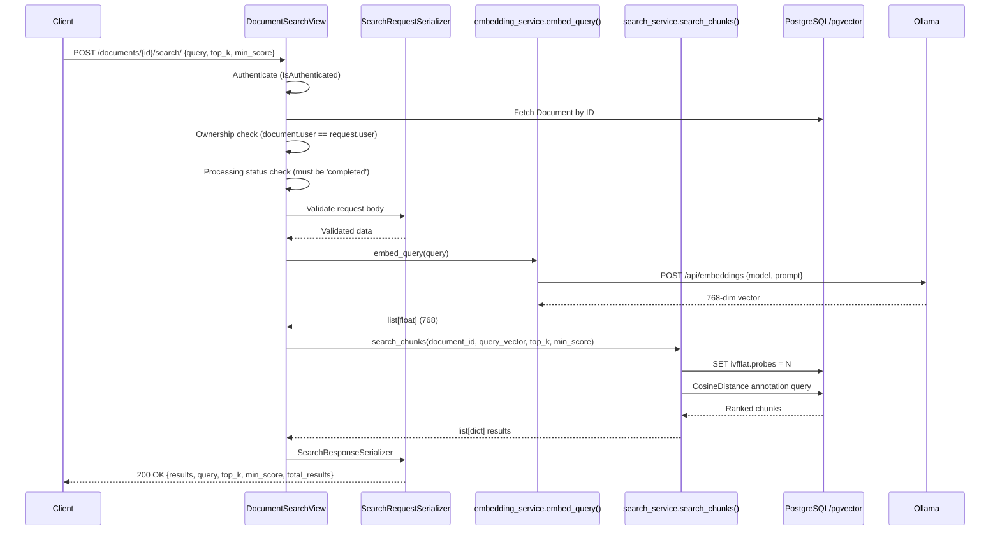

# Epic E06 — Semantic Search & Retrieval: Implementation Plan

**PRD Source:** [`docs/active-task/current-prd.md`](docs/active-task/current-prd.md)  
**Status:** Ready for Implementation  
**Dependencies:** E05 (Embedding & Vector Storage) ✅ Done  

---

## Overview

This epic implements a semantic search endpoint (`POST /documents/{document_id}/search/`) that:
1. Converts a user's natural-language query into a 768-dim vector via Ollama's `nomic-embed-text`
2. Performs cosine similarity search against `document_chunks.embedding` using pgvector's `<=>` operator
3. Returns top-k results filtered by a minimum relevance score
4. Enforces authentication, ownership, and document-completeness guards

No new database tables or migrations are required.

---

## Architecture & Data Flow



---

## Task Execution Order

```
Task 1 ──┐
         ├──> Task 3 ──> Task 4 ──> Task 5 ──> Task 6
Task 2 ──┘
```

- **Tasks 1 & 2** are independent and can be done in parallel
- **Task 3** depends on Task 2 (serializer shapes match service output)
- **Task 4** depends on Tasks 1, 2, 3 (view wires everything together)
- **Task 5** modifies Task 2's service (adds ivfflat.probes)
- **Task 6** is final integration + docs update

---

## Task 1 — Embedding Service: `embed_query()`

### Files to Modify
- [`src/backend/documents/services/embedding_service.py`](src/backend/documents/services/embedding_service.py) — Add `embed_query()` function
- [`src/backend/documents/tests/test_embedding.py`](src/backend/documents/tests/test_embedding.py) — Add 2 test methods

### Implementation Details

Add a new function `embed_query(text: str) -> list[float]` to the existing embedding service. This function:

1. **Reuses the existing Ollama client pattern** — same `_get_ollama_base_url()`, same `EMBEDDING_MODEL` (`nomic-embed-text`), same `_TIMEOUT_SECONDS` and `_MAX_RETRIES` constants
2. **Calls `POST /api/embeddings`** (the single-text endpoint, same as `generate_embedding()`)
3. **Raises `EmbeddingError` on failure** — unlike `generate_embedding()` which returns `None`, this function must raise an exception so the view can return a proper error response
4. **Returns `list[float]` of length 768** on success

**Key difference from `generate_embedding()`:** The existing function returns `None` on failure (silent). The new `embed_query()` must raise an exception so the view layer can catch it and return a 500/503 error. We need to define a custom exception class.

### New Exception Class

Add to [`src/backend/documents/services/embedding_service.py`](src/backend/documents/services/embedding_service.py):

```python
class EmbeddingError(Exception):
    """Raised when embedding generation fails."""
    pass
```

### Function Signature

```python
def embed_query(text: str) -> list[float]:
    """Convert a search query string into a 768-dim embedding vector.

    Args:
        text: The search query text (must be non-empty).

    Returns:
        A list of 768 floats representing the query embedding.

    Raises:
        EmbeddingError: If the Ollama API call fails or returns invalid data.
        ValueError: If *text* is empty or whitespace-only.
    """
```

### Tests to Add (in `test_embedding.py`)

| Test Method | What It Verifies |
|---|---|
| `test_embed_query_returns_768_floats` | Mock Ollama, assert `len(result) == 768` |
| `test_embed_query_raises_on_ollama_failure` | Mock failure (timeout/HTTP error), assert `EmbeddingError` raised |
| `test_embed_query_raises_on_empty_text` | Empty/whitespace input raises `ValueError` |

---

## Task 2 — Search Service: `search_chunks()`

### Files to Create/Modify
- [`src/backend/documents/services/search_service.py`](src/backend/documents/services/search_service.py) — **Create new file**
- [`src/backend/documents/tests/test_search_service.py`](src/backend/documents/tests/test_search_service.py) — **Create new file** with 5 tests

### Implementation Details

Create a pure service function (no HTTP `request` object) that:

1. **Uses Django ORM + pgvector's `CosineDistance`** annotation (from `pgvector.django`)
2. **Filters:** `document_id=document_id`, `embedding__isnull=False`
3. **Annotates** with `distance = CosineDistance("embedding", query_vector)`
4. **Computes** `relevance_score = 1 - distance` (cosine similarity from cosine distance)
5. **Filters** annotated queryset: `relevance_score >= min_score`
6. **Orders** by `distance ASC` (lowest distance = highest similarity)
7. **Limits** to `top_k` results
8. **Returns** `list[dict]` with keys: `chunk_id`, `chunk_index`, `page_start`, `page_end`, `content`, `relevance_score`, `token_count`, `metadata`

### Function Signature

```python
from pgvector.django import CosineDistance

def search_chunks(
    document_id: str,
    query_vector: list[float],
    top_k: int = 10,
    min_score: float = 0.0,
) -> list[dict]:
    """Search document chunks by cosine similarity to a query vector.

    Args:
        document_id: UUID of the document to search within.
        query_vector: 768-dim embedding vector for the query.
        top_k: Maximum number of results to return (default 10).
        min_score: Minimum relevance score threshold (default 0.0).

    Returns:
        A list of dicts ordered by relevance_score descending.
        Each dict has keys: chunk_id, chunk_index, page_start, page_end,
        content, relevance_score, token_count, metadata.
    """
```

### Tests to Add (in `test_search_service.py`)

| Test Method | What It Verifies |
|---|---|
| `test_search_chunks_returns_top_k` | Seed 5 chunks with known embeddings, assert only `top_k` returned |
| `test_search_chunks_filters_by_min_score` | Assert chunks below threshold excluded |
| `test_search_chunks_excludes_unembedded_chunks` | Chunk with `embedding=NULL` must not appear |
| `test_search_chunks_orders_by_relevance` | Assert results descending by `relevance_score` |
| `test_search_chunks_empty_result` | No matching chunks returns `[]` |

---

## Task 3 — Request/Response Serializers

### Files to Modify
- [`src/backend/documents/serializers.py`](src/backend/documents/serializers.py) — Add 3 new serializers
- [`src/backend/documents/tests/test_serializers.py`](src/backend/documents/tests/test_serializers.py) — Add 4 test methods

### Serializers to Add

#### `SearchRequestSerializer`

```python
class SearchRequestSerializer(serializers.Serializer):
    query = serializers.CharField(required=True, max_length=1000, help_text="...")
    top_k = serializers.IntegerField(required=False, default=10, min_value=1, max_value=50, help_text="...")
    min_score = serializers.FloatField(required=False, default=0.0, min_value=0.0, max_value=1.0, help_text="...")
```

#### `SearchResultSerializer`

```python
class SearchResultSerializer(serializers.Serializer):
    chunk_id = serializers.UUIDField(help_text="...")
    chunk_index = serializers.IntegerField(help_text="...")
    page_start = serializers.IntegerField(help_text="...")
    page_end = serializers.IntegerField(help_text="...")
    content = serializers.CharField(help_text="...")
    relevance_score = serializers.FloatField(help_text="...")
    token_count = serializers.IntegerField(allow_null=True, help_text="...")
    metadata = serializers.JSONField(help_text="...")
```

#### `SearchResponseSerializer`

```python
class SearchResponseSerializer(serializers.Serializer):
    results = SearchResultSerializer(many=True, help_text="...")
    query = serializers.CharField(help_text="...")
    top_k = serializers.IntegerField(help_text="...")
    min_score = serializers.FloatField(help_text="...")
    total_results = serializers.IntegerField(help_text="...")
```

### Tests to Add (in `test_serializers.py`)

| Test Method | What It Verifies |
|---|---|
| `test_search_request_defaults` | Omitting `top_k` and `min_score` gives defaults 10 and 0.0 |
| `test_search_request_top_k_max_validation` | `top_k=51` fails validation |
| `test_search_request_min_score_range` | `min_score=-0.1` and `min_score=1.1` fail validation |
| `test_search_request_empty_query` | Empty string fails validation |

---

## Task 4 — Search View + URL Registration

### Files to Modify
- [`src/backend/documents/views.py`](src/backend/documents/views.py) — Add `DocumentSearchView`
- [`src/backend/documents/urls.py`](src/backend/documents/urls.py) — Register search URL
- [`src/backend/documents/tests/test_views.py`](src/backend/documents/tests/test_views.py) — Add 7 test methods

### View Implementation

```python
class DocumentSearchView(APIView):
    """Semantic search within a document's chunks.

    Endpoint: POST /documents/<uuid:document_id>/search/
    """

    permission_classes = [IsAuthenticated]

    def post(self, request: Request, document_id: str) -> Response:
        # 1. Fetch document (404 if not found)
        # 2. Ownership check (403 if mismatch)
        # 3. Processing status check (422 if not 'completed')
        # 4. Validate request body with SearchRequestSerializer (400 on failure)
        # 5. Call embed_query() to get query vector
        # 6. Call search_chunks() to get results
        # 7. Serialize response with SearchResponseSerializer
        # 8. Return 200 OK
```

### URL Registration

Add to [`src/backend/documents/urls.py`](src/backend/documents/urls.py):

```python
path(
    "<uuid:document_id>/search/",
    DocumentSearchView.as_view(),
    name="document-search",
),
```

The URL is already included in [`src/backend/config/urls.py`](src/backend/config/urls.py) under `path('documents/', include('documents.urls'))`.

### Error Handling Matrix

| Condition | HTTP Status | Error Code |
|---|---|---|
| Document not found | 404 | `not_found` |
| Wrong user | 403 | `permission_denied` |
| Document not completed | 422 | `document_not_ready` |
| Invalid request body | 400 | DRF validation errors |
| Embedding failure | 500 | `embedding_failed` |

### Tests to Add (in `test_views.py`)

| Test Method | What It Verifies |
|---|---|
| `test_search_requires_auth` | Unauthenticated request returns 401 |
| `test_search_document_not_found` | Wrong UUID returns 404 |
| `test_search_document_wrong_user` | Other user's document returns 403 |
| `test_search_document_not_completed` | `processing_status='processing'` returns 422 |
| `test_search_valid_request` | Mock `embed_query` + `search_chunks`, assert 200 with correct shape |
| `test_search_invalid_top_k` | `top_k=0` returns 400 |
| `test_search_empty_results` | Valid request with no matches returns 200 with empty `results` |

---

## Task 5 — ivfflat Index Probe Tuning

### Files to Modify
- [`src/backend/documents/services/search_service.py`](src/backend/documents/services/search_service.py) — Add `SET ivfflat.probes` before query
- [`src/backend/config/settings.py`](src/backend/config/settings.py) — Add `VECTOR_SEARCH_PROBES` setting
- [`.env.example`](.env.example) — Add `VECTOR_SEARCH_PROBES=10`
- [`src/backend/documents/tests/test_search_service.py`](src/backend/documents/tests/test_search_service.py) — Add 1 test

### Implementation

In `search_service.py`, before executing the similarity query:

```python
from django.conf import settings
from django.db import connection

def _set_probes(probes: int = None) -> None:
    """Set ivfflat.probes for the current database session."""
    probes = probes or settings.VECTOR_SEARCH_PROBES
    with connection.cursor() as cursor:
        cursor.execute("SET ivfflat.probes = %s", [probes])
```

In `settings.py`:

```python
VECTOR_SEARCH_PROBES = env.int("VECTOR_SEARCH_PROBES", default=10)
```

In `.env.example`:

```
# pgvector ivfflat index probe count (1-100, higher = better recall but slower)
VECTOR_SEARCH_PROBES=10
```

### Test to Add

| Test Method | What It Verifies |
|---|---|
| `test_search_service_sets_probes` | Mock `connection.cursor`, assert `SET ivfflat.probes` is called with correct value |

---

## Task 6 — Integration Test & API Registry Update

### Files to Create/Modify
- [`src/backend/documents/tests/test_search_integration.py`](src/backend/documents/tests/test_search_integration.py) — **Create new file**
- [`docs/references/api-registry.md`](docs/references/api-registry.md) — Update implementation status

### Integration Test

Create an end-to-end test that:

1. Seeds one user, one document (`processing_status='completed'`), and 3 chunks with known real embedding vectors
2. Calls `POST /documents/{doc_id}/search/` with a query string
3. Mocks only `embed_query` (returns one of the known vectors)
4. Asserts response is 200, `total_results` >= 1, first result has highest `relevance_score`

### API Registry Update

In [`docs/references/api-registry.md`](docs/references/api-registry.md), update the `POST /documents/{document_id}/search` entry (currently under "Search & Retrieval" section, lines 798-823):

- Add `**Status:** ✅ Implemented`
- Add `**Implementation Date:** <today>`
- Add `**View:** DocumentSearchView`
- Add implementation notes matching actual code behavior

---

## File Change Summary

| File | Action | Task |
|---|---|---|
| `src/backend/documents/services/embedding_service.py` | Extend: add `EmbeddingError` exception + `embed_query()` | Task 1 |
| `src/backend/documents/services/search_service.py` | **Create new** | Task 2, Task 5 |
| `src/backend/documents/serializers.py` | Extend: add 3 serializers | Task 3 |
| `src/backend/documents/views.py` | Extend: add `DocumentSearchView` | Task 4 |
| `src/backend/documents/urls.py` | Extend: register search URL | Task 4 |
| `src/backend/config/settings.py` | Extend: add `VECTOR_SEARCH_PROBES` | Task 5 |
| `.env.example` | Extend: add `VECTOR_SEARCH_PROBES=10` | Task 5 |
| `src/backend/documents/tests/test_embedding.py` | Extend: add 3 tests | Task 1 |
| `src/backend/documents/tests/test_search_service.py` | **Create new**: 5 + 1 tests | Task 2, Task 5 |
| `src/backend/documents/tests/test_serializers.py` | Extend: add 4 tests | Task 3 |
| `src/backend/documents/tests/test_views.py` | Extend: add 7 tests | Task 4 |
| `src/backend/documents/tests/test_search_integration.py` | **Create new**: 1 integration test | Task 6 |
| `docs/references/api-registry.md` | Update: mark endpoint implemented | Task 6 |

---

## Definition of Done

- [ ] All 22+ tests pass with `pytest --tb=short`
- [ ] `POST /documents/{document_id}/search/` returns correct results against pgvector
- [ ] Ownership and auth guards enforced on the endpoint
- [ ] `422` returned for non-completed documents (not 400)
- [ ] `ivfflat.probes` is configurable via `VECTOR_SEARCH_PROBES` env var
- [ ] `api-registry.md` updated with implementation status
- [ ] No raw SQL — all queries via Django ORM + pgvector Django extension
- [ ] No breaking changes to existing endpoints
- [ ] No new pip packages required
