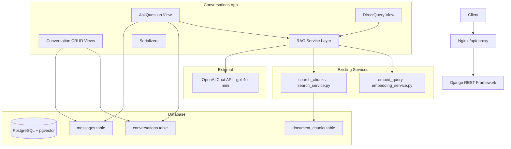

# Implementation Plan — Epic E07: Conversation & Q&A Engine

**Status:** 📋 Plan Ready  
**Epic ID:** E07  
**Depends On:** E02 (Auth), E03 (Documents), E04 (Processing Pipeline), E05 (Embeddings), E06 (Semantic Search)

---

## Overview

This plan implements the full RAG-based Q&A engine for DocuChat. It wires together the existing embedding + search infrastructure (E05/E06) with LangChain, conversation/message persistence, citation tracking, and hallucination mitigation. The output is two working endpoints: a **stateful conversation endpoint** and a **stateless direct-query endpoint**.

---

## Architecture Diagram



---

## Task Breakdown

### Task 1 — Django Models: `Conversation` & `Message`

**Status:** ✅ Already Complete  
**Files:** [`src/backend/conversations/models.py`](src/backend/conversations/models.py), [`src/backend/conversations/migrations/0001_initial.py`](src/backend/conversations/migrations/0001_initial.py)

The models and migration already exist. No action needed.

---

### Task 2 — Serializers for Conversations & Messages

**Scope:** [`src/backend/conversations/serializers.py`](src/backend/conversations/serializers.py) (new file)

**Serializers to implement:**

1. **`MessageSerializer`** — Fields: `id`, `role`, `content`, `sources`, `token_usage`, `created_at`. Read-only for `id`, `created_at`. Sources serialized as JSONB array.

2. **`ConversationListSerializer`** — For GET `/conversations`. Fields: `id`, `document_id`, `document_title` (via `source='document.title'`), `title`, `message_count` (as `SerializerMethodField` or annotated), `created_at`, `updated_at`.

3. **`ConversationDetailSerializer`** — For GET `/conversations/{id}`. Includes nested `messages` via `MessageSerializer(many=True)`. Fields: all from list + `messages`.

4. **`ConversationCreateSerializer`** — For POST `/conversations`. Input: `document_id` (UUIDField), `title` (CharField, optional).  
   - `validate(document_id)`: Check document exists → `ValidationError` if not.  
   - Check `document.user == request.user` → `ValidationError` if not.  
   - Check `document.processing_status == 'completed'` → `ValidationError` if not.

5. **`AskQuestionSerializer`** — For POST `/conversations/{id}/messages`. Input: `content` (CharField, required, min_length=1, max_length=10000).

6. **`DirectQuerySerializer`** — For POST `/documents/{document_id}/query`. Input: `question` (CharField, required, min_length=1), `top_k` (IntegerField, default=5, min=1, max=20).

**Acceptance Criteria:**
- All serializers have unit tests with valid and invalid inputs
- `ConversationCreateSerializer` raises `ValidationError` for: non-existent document, wrong-owner document, unprocessed document

---

### Task 3 — RAG Service Layer

**Scope:** [`src/backend/conversations/rag_service.py`](src/backend/conversations/rag_service.py) (new file)

**Functions to implement:**

#### `build_context(chunks: list[dict]) -> str`
- Format each chunk as `[Source {i+1} | Pages {page_start}-{page_end}]\n{content}`
- Trim total context to `RAG_CONTEXT_TOKEN_BUDGET` (4000 tokens) using `tiktoken` or char estimate (1 token ≈ 4 chars)
- Return formatted context string

#### `build_system_prompt(document_title: str) -> str`
- System prompt instructing the assistant to:
  - Only answer from provided context
  - Say "I don't have enough information" if insufficient
  - Cite sources using `[Source N]` markers
- Include document title in prompt

#### `extract_citations(content: str, chunks: list[dict]) -> list[dict]`
- Parse `[Source N]` references from assistant response using regex
- Return list of citation dicts matching the `sources` JSONB schema:
  ```json
  {
    "chunk_id": "uuid",
    "page_start": 1,
    "page_end": 3,
    "content_preview": "first 200 chars...",
    "relevance_score": 0.93
  }
  ```
- Only include chunks actually cited in the response

#### `run_rag_query(question, document_id, conversation_history, top_k=5) -> dict`
- Orchestrates the full RAG pipeline:
  1. Call `embed_query(question)` from [`embedding_service.py`](src/backend/documents/services/embedding_service.py)
  2. Call `search_chunks(document_id, query_embedding, top_k)` from [`search_service.py`](src/backend/documents/services/search_service.py)
  3. Call `build_context(chunks)`
  4. Build messages array: system prompt + conversation history (last `RAG_MAX_HISTORY_TURNS` turns) + user question with context
  5. Call OpenAI `chat.completions.create` with `model=settings.OPENAI_CHAT_MODEL`
  6. Call `extract_citations(response_content, chunks)`
  7. Return dict with `content`, `sources`, `token_usage`, `raw_chunks`
- Raises `RAGServiceException` on OpenAI API errors

#### `RAGServiceException` (custom exception class)
- Simple exception class for RAG service errors

#### Settings to add in [`src/backend/config/settings.py`](src/backend/config/settings.py):
```python
OPENAI_CHAT_MODEL = env("OPENAI_CHAT_MODEL", default="gpt-4o-mini")
OPENAI_CHAT_MAX_TOKENS = env.int("OPENAI_CHAT_MAX_TOKENS", default=1000)
RAG_MAX_HISTORY_TURNS = env.int("RAG_MAX_HISTORY_TURNS", default=10)
RAG_CONTEXT_TOKEN_BUDGET = env.int("RAG_CONTEXT_TOKEN_BUDGET", default=4000)
```

**Acceptance Criteria:**
- Unit tests with mocked OpenAI client and mocked search/embed services
- `run_rag_query` tested for: normal response, citation extraction, history truncation, OpenAI error handling
- `extract_citations` tested for: cited sources, uncited sources ignored, malformed references

---

### Task 4 — Conversation CRUD Views

**Scope:** [`src/backend/conversations/views.py`](src/backend/conversations/views.py) (new file)

**Views to implement:**

#### `ConversationListCreateView` — POST + GET `/conversations`

**POST:**
- Auth: `IsAuthenticated`
- Use `ConversationCreateSerializer` for input validation
- Pass `request.user` to serializer context for ownership validation
- Create `Conversation` object; set `user=request.user`
- Return `201 Created` with `ConversationDetailSerializer`
- Error: `404` if document not found, `403` if document belongs to another user, `422` if document not completed

**GET:**
- Auth: `IsAuthenticated`
- Filter: `Conversation.objects.filter(user=request.user)`
- Optional filter: `?document_id=uuid`
- Annotate with `message_count=Count('messages')`
- Paginate: `page` + `page_size` (default 20, max 100)
- Return `ConversationListSerializer`

#### `ConversationDetailView` — GET + DELETE `/conversations/{conversation_id}`

**GET:**
- Auth: `IsAuthenticated`
- Fetch with `.prefetch_related('messages')`
- Ownership check → `403`
- Return `ConversationDetailSerializer`

**DELETE:**
- Auth: `IsAuthenticated`
- Ownership check → `403`
- `conversation.delete()` → `204 No Content`

#### URL Registration:
- Create [`src/backend/conversations/urls.py`](src/backend/conversations/urls.py):
  ```python
  urlpatterns = [
      path('', ConversationListCreateView.as_view(), name='conversation-list-create'),
      path('<uuid:conversation_id>/', ConversationDetailView.as_view(), name='conversation-detail'),
  ]
  ```
- Register in [`src/backend/config/urls.py`](src/backend/config/urls.py):
  ```python
  path('conversations/', include('conversations.urls')),
  ```

**Acceptance Criteria:**
- All 4 CRUD operations tested (happy path + auth errors + ownership errors)
- Pagination tested (next/previous links)
- `document_id` filter tested

---

### Task 5 — Ask Question View (Core RAG Endpoint)

**Scope:** [`src/backend/conversations/views.py`](src/backend/conversations/views.py) — add `ConversationMessageView`

**POST `/conversations/{conversation_id}/messages`:**
- Auth: `IsAuthenticated`
- Validate: conversation exists + ownership check → `403`
- Use `AskQuestionSerializer` for input
- Persist the **user message** first
- Build `conversation_history` from `conversation.messages.all()` ordered by `created_at`
- Call `run_rag_query(question, document_id, conversation_history, top_k=5)`
- Persist the **assistant message** with `sources` and `token_usage`
- Touch `conversation.updated_at` (call `conversation.save()`)
- Return `201 Created` with `MessageSerializer` of the assistant message
- Error handling:
  - `RAGServiceException` → `502 Bad Gateway`
  - OpenAI rate limit → `429` with retry-after hint

**URL Registration** (in [`src/backend/conversations/urls.py`](src/backend/conversations/urls.py)):
```python
path('<uuid:conversation_id>/messages/', ConversationMessageView.as_view(), name='conversation-messages'),
```

**Acceptance Criteria:**
- Unit tests with mocked `run_rag_query`
- Integration test: full conversation flow (create → ask → check messages persisted)
- Error cases: invalid conversation_id, ownership violation, RAG service failure

---

### Task 6 — Direct Query View (Stateless RAG Endpoint)

**Scope:** [`src/backend/conversations/views.py`](src/backend/conversations/views.py) — add `DocumentDirectQueryView`

**POST `/documents/{document_id}/query`:**
- Auth: `IsAuthenticated`
- Ownership check on document → `403`
- Validate document `processing_status == 'completed'` → `422` if not
- Use `DirectQuerySerializer` for input: `question`, `top_k`
- Call `run_rag_query(question, document_id, conversation_history=[], top_k=top_k)`
- **Do NOT persist any messages or conversations**
- Return `200 OK` with `answer`, `sources`, `token_usage`

**URL Registration** (in [`src/backend/documents/urls.py`](src/backend/documents/urls.py)):
```python
path('<uuid:document_id>/query/', DocumentDirectQueryView.as_view(), name='document-query'),
```

**Acceptance Criteria:**
- Unit tests with mocked `run_rag_query`
- Verify no `Message` or `Conversation` objects are created
- Test: document not found, document not completed, RAG failure

---

### Task 7 — Integration Tests & Final QA

**Scope:** [`src/backend/conversations/tests/`](src/backend/conversations/tests/) directory

**Test files to create:**
- [`test_models.py`](src/backend/conversations/tests/test_models.py) — model creation, cascade delete, `__str__`
- [`test_serializers.py`](src/backend/conversations/tests/test_serializers.py) — all serializer validation cases
- [`test_rag_service.py`](src/backend/conversations/tests/test_rag_service.py) — unit tests for all service functions (mocked external calls)
- [`test_views_conversations.py`](src/backend/conversations/tests/test_views_conversations.py) — CRUD view tests
- [`test_views_messages.py`](src/backend/conversations/tests/test_views_messages.py) — ask-question endpoint tests
- [`test_views_query.py`](src/backend/conversations/tests/test_views_query.py) — stateless query endpoint tests
- [`test_integration.py`](src/backend/conversations/tests/test_integration.py) — end-to-end flow

**Coverage requirement:** ≥ 90% for the `conversations` app.

**Integration test scenario:**
1. Register user → get JWT
2. Upload + process + embed a test PDF (use fixtures)
3. Create conversation for that document
4. POST a question → assert assistant message returned with non-empty content and sources
5. GET conversation → assert 2 messages (user + assistant) in history
6. POST second question → assert history is passed to RAG (mock captures call args)
7. DELETE conversation → assert 204 + messages cascade-deleted

**Acceptance Criteria:**
- `pytest --cov=conversations --cov-report=term-missing` shows ≥ 90%
- All existing tests (E01–E06) still pass — no regressions
- `python manage.py check` passes clean

---

## Implementation Order

```
Task 2 → Task 3 → Task 4 → Task 5 → Task 6 → Task 7
```

- **Task 1** is already complete (models + migration exist)
- **Tasks 2 and 3** must be completed first (serializers + service layer)
- **Task 4** (CRUD views) can be developed in parallel with Task 3
- **Tasks 5 and 6** depend on Task 3 (RAG service layer)
- **Task 7** (tests) is the final validation step

---

## Files to Create/Modify

### New Files:
| File | Purpose |
|------|---------|
| [`src/backend/conversations/serializers.py`](src/backend/conversations/serializers.py) | All serializers for conversations & messages |
| [`src/backend/conversations/rag_service.py`](src/backend/conversations/rag_service.py) | Core RAG service layer |
| [`src/backend/conversations/views.py`](src/backend/conversations/views.py) | All views (CRUD + RAG endpoints) |
| [`src/backend/conversations/urls.py`](src/backend/conversations/urls.py) | URL routing for conversations app |
| [`src/backend/conversations/tests/__init__.py`](src/backend/conversations/tests/__init__.py) | Test package init |
| [`src/backend/conversations/tests/test_models.py`](src/backend/conversations/tests/test_models.py) | Model tests |
| [`src/backend/conversations/tests/test_serializers.py`](src/backend/conversations/tests/test_serializers.py) | Serializer tests |
| [`src/backend/conversations/tests/test_rag_service.py`](src/backend/conversations/tests/test_rag_service.py) | RAG service tests |
| [`src/backend/conversations/tests/test_views_conversations.py`](src/backend/conversations/tests/test_views_conversations.py) | CRUD view tests |
| [`src/backend/conversations/tests/test_views_messages.py`](src/backend/conversations/tests/test_views_messages.py) | Ask-question view tests |
| [`src/backend/conversations/tests/test_views_query.py`](src/backend/conversations/tests/test_views_query.py) | Direct query view tests |
| [`src/backend/conversations/tests/test_integration.py`](src/backend/conversations/tests/test_integration.py) | Integration tests |

### Modified Files:
| File | Change |
|------|--------|
| [`src/backend/config/settings.py`](src/backend/config/settings.py) | Add 4 new settings: `OPENAI_CHAT_MODEL`, `OPENAI_CHAT_MAX_TOKENS`, `RAG_MAX_HISTORY_TURNS`, `RAG_CONTEXT_TOKEN_BUDGET` |
| [`src/backend/config/urls.py`](src/backend/config/urls.py) | Add `path('conversations/', include('conversations.urls'))` |
| [`src/backend/documents/urls.py`](src/backend/documents/urls.py) | Add `path('<uuid:document_id>/query/', ...)` for stateless query |
| [`src/backend/requirements.txt`](src/backend/requirements.txt) | Add `langchain>=0.2.0`, `langchain-openai>=0.1.0` |
| [`.env.example`](.env.example) | Add `OPENAI_CHAT_MODEL`, `OPENAI_CHAT_MAX_TOKENS`, `RAG_MAX_HISTORY_TURNS`, `RAG_CONTEXT_TOKEN_BUDGET` |

---

## Key Design Decisions

1. **No LangChain dependency for core RAG** — The PRD mentions LangChain as optional. The `rag_service.py` can call OpenAI directly via `openai.ChatCompletion` (already in requirements). This avoids adding heavy LangChain dependencies. If LangChain is desired, it can be wrapped around the existing service functions.

2. **TDD Flow** — Follow Red/Green/Refactor per `.clinerules`. Write tests before or alongside implementation.

3. **No business logic in views** — All RAG logic lives in `rag_service.py`. Views only handle HTTP concerns (auth, serialization, response formatting).

4. **Stateless query does not persist** — The direct query endpoint (`POST /documents/{id}/query`) creates no database records.

5. **History truncation** — Conversation history passed to LLM is capped at `RAG_MAX_HISTORY_TURNS` (default 10) most recent user+assistant pairs.

6. **Citation extraction** — Uses regex to parse `[Source N]` markers from assistant response. Only chunks actually cited are included in the `sources` JSONB array.

---

## Environment Variables to Add

```env
# RAG & Chat Configuration
OPENAI_CHAT_MODEL=gpt-4o-mini
OPENAI_CHAT_MAX_TOKENS=1000
RAG_MAX_HISTORY_TURNS=10
RAG_CONTEXT_TOKEN_BUDGET=4000
```

---

## Reference Documents

- [PRD — Epic E07](docs/active-task/current-prd.md)
- [Database Schema](docs/references/database-schema.md)
- [API Registry](docs/references/api-registry.md)
- [WIP Context](docs/active-task/wip-context.md)
