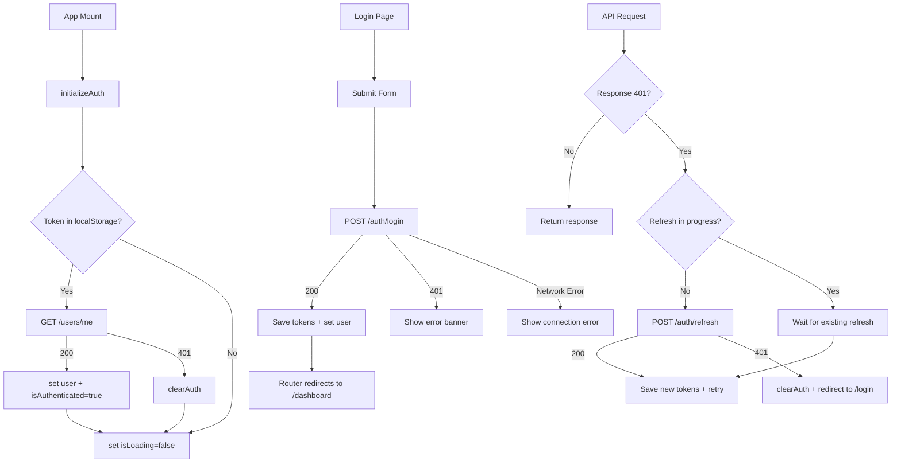

# Implementation Plan: Epic E08 — Frontend Auth & Layout

**File:** `plans/implementation-plan-E08.md`
**Status:** Draft — Awaiting Approval
**Epic:** E08
**Depends On:** E07 (all backend APIs live)
**Stack:** React 18 + Vite + TailwindCSS + shadcn/ui + React Router v6 + Axios + Zustand

---

## 1. Current State Assessment

### What Already Exists (Scaffolding Done)

| File | Status | Notes |
|------|--------|-------|
| `src/frontend/package.json` | ✅ | Has React 18, Vite, TailwindCSS, shadcn/ui, Vitest, Testing Library |
| `src/frontend/vite.config.ts` | ✅ | Has `@/` alias, `server.host: true`, polling for Docker |
| `src/frontend/tsconfig.json` | ✅ | Strict mode, path alias `@/*` |
| `src/frontend/vitest.config.ts` | ✅ | jsdom environment, setup file configured |
| `src/frontend/tailwind.config.js` | ✅ | shadcn/ui theme colors, forms + typography plugins |
| `src/frontend/postcss.config.js` | ✅ | Tailwind + autoprefixer |
| `src/frontend/index.html` | ✅ | Entry point |
| `src/frontend/src/index.css` | ✅ | Tailwind directives |
| `src/frontend/src/main.tsx` | ✅ | Renders `<App />` — needs RouterProvider |
| `src/frontend/src/App.tsx` | ✅ | **Needs complete rewrite** — currently a landing page |
| `src/frontend/src/components/ui/button.tsx` | ✅ | shadcn Button component |
| `src/frontend/src/test/setup.ts` | ✅ | jest-dom matchers, matchMedia mock |
| `docker-compose.yml` | ✅ | Frontend service already defined |
| `docker/frontend/Dockerfile` | ✅ | Node 20 Alpine, Vite dev server |
| `docker/nginx/nginx.conf` | ✅ | SPA routing via `try_files`, API proxy to backend |

### What's Missing (Needs Implementation)

- **Missing npm dependencies:** `react-router-dom`, `axios`, `zustand`, `react-hook-form`, `zod`, `@hookform/resolvers`
- **Missing shadcn components:** `input`, `label`, `form`, `card`, `dropdown-menu`, `avatar`, `toast`, `alert`
- **Missing directories:** `src/api/`, `src/stores/`, `src/types/`, `src/components/auth/`, `src/components/layout/`, `src/pages/`
- **Missing test directories:** `tests/auth/`, `tests/layout/`
- **Missing env files:** `.env.development`, `.env.production`

---

## 2. Architecture Overview

### Route Structure

```
/                  → Redirect to /dashboard
/login             → LoginPage (PublicRoute)
/register          → RegisterPage (PublicRoute)
/dashboard         → DashboardPage (PrivateRoute → AppShell)
* (404)            → Redirect to /dashboard
```

### Component Tree

```
<RouterProvider>
  ├── / → <Navigate to="/dashboard" />
  ├── PublicRoute
  │   ├── /login    → <LoginPage />
  │   └── /register → <RegisterPage />
  └── PrivateRoute
      └── AppShell
          ├── Topbar (user avatar + dropdown menu)
          ├── Sidebar (nav links)
          └── <Outlet /> → DashboardPage
```

### Data Flow

```
App Mount
  └── authStore.initializeAuth()
       ├── GET /users/me (via Axios)
       │    ├── Success → set user, isAuthenticated=true, isLoading=false
       │    └── Failure → clearAuth(), isLoading=false
       └── PrivateRoute/PublicRoute reads isLoading + isAuthenticated

Login Flow
  └── LoginPage → authStore.login(payload)
       ├── POST /auth/login → save tokens to localStorage
       ├── set user + isAuthenticated in store
       └── PrivateRoute detects isAuthenticated → renders AppShell

Token Refresh Flow (Axios interceptor)
  └── 401 response → POST /auth/refresh
       ├── Success → retry original request with new token
       └── Failure → clearAuth() → redirect to /login
```

---

## 3. Detailed Task Breakdown

### Task E08-T1: Install Missing Dependencies & shadcn Components

**What:** Add missing npm packages and shadcn/ui components.

**Steps:**
1. Install runtime deps: `react-router-dom`, `axios`, `zustand`, `react-hook-form`, `zod`, `@hookform/resolvers`
2. Add shadcn components: `input`, `label`, `form`, `card`, `dropdown-menu`, `avatar`, `toast`, `alert`, `separator`
3. Create `.env.development` and `.env.production` files
4. Verify `npm run dev` starts without errors

**Files Modified:**
- `src/frontend/package.json`
- `src/frontend/.env.development` (new)
- `src/frontend/.env.production` (new)

**Acceptance:** `npm run dev` works, shadcn components are importable.

---

### Task E08-T2: TypeScript Types & Axios API Client

**What:** Create typed interfaces and Axios instance with token refresh interceptor.

**Files to Create:**
- `src/frontend/src/types/auth.ts` — `User`, `AuthTokens`, `AuthResponse`, `LoginPayload`, `RegisterPayload`
- `src/frontend/src/api/axios.ts` — Axios instance with:
  - `baseURL` from `import.meta.env.VITE_API_URL ?? '/api'`
  - Request interceptor: attach Bearer token from localStorage
  - Response interceptor: on 401 → refresh token with queue mechanism → retry
- `src/frontend/src/api/authApi.ts` — Typed API functions: `loginApi`, `registerApi`, `refreshTokenApi`, `logoutApi`, `getMeApi`
- `src/frontend/tests/auth/axiosInterceptor.test.ts` — Tests for interceptor behavior

**Key Implementation Details:**
- Token refresh queue: use a promise-based queue so concurrent 401s trigger only one refresh
- On refresh failure: clear localStorage, redirect to `/login` via `window.location.href`
- All functions fully typed — no `any`

**Acceptance:** Tests pass for interceptor retry and redirect scenarios.

---

### Task E08-T3: Zustand Auth Store

**What:** Centralized auth state management.

**Files to Create:**
- `src/frontend/src/stores/authStore.ts` — Zustand store with:
  - State: `user`, `isAuthenticated`, `isLoading`
  - Actions: `login`, `register`, `logout`, `initializeAuth`, `setUser`, `clearAuth`
- `src/frontend/tests/auth/authStore.test.ts` — Tests for all store actions

**Key Implementation Details:**
- `login()`: call `loginApi()`, save tokens to localStorage, set user
- `register()`: same pattern as login
- `logout()`: call `logoutApi()`, call `clearAuth()` regardless of success/failure
- `clearAuth()`: remove tokens from localStorage, reset state
- `initializeAuth()`: set `isLoading=true`, call `getMeApi()`, handle success/failure, set `isLoading=false`
- No `zustand/middleware/persist` — manual localStorage only for tokens

**Acceptance:** All store action tests pass.

---

### Task E08-T4: Route Structure & Auth Guards

**What:** Set up React Router with `PrivateRoute` and `PublicRoute` guards.

**Files to Create:**
- `src/frontend/src/components/auth/PrivateRoute.tsx` — Reads `isAuthenticated` + `isLoading`, shows spinner while loading, redirects to `/login` if unauthenticated
- `src/frontend/src/components/auth/PublicRoute.tsx` — Redirects authenticated users to `/dashboard`
- `src/frontend/src/App.tsx` — Rewrite with `createBrowserRouter` and route config
- `src/frontend/src/main.tsx` — Update to call `initializeAuth()` before rendering `RouterProvider`
- `src/frontend/src/pages/DashboardPage.tsx` — Placeholder `<h1>Dashboard</h1>`
- `src/frontend/tests/auth/PrivateRoute.test.tsx`
- `src/frontend/tests/auth/PublicRoute.test.tsx`

**Key Implementation Details:**
- Spinner uses `lucide-react` `Loader2` icon with `animate-spin`
- `initializeAuth()` called once via `authStore.getState().initializeAuth()` in `main.tsx`
- Route config matches the PRD exactly

**Acceptance:** Route guard tests pass, navigation works correctly.

---

### Task E08-T5: Login Page

**What:** Full login form with React Hook Form + Zod validation.

**Files to Create:**
- `src/frontend/src/pages/LoginPage.tsx`
- `src/frontend/tests/auth/LoginPage.test.tsx`

**Key Implementation Details:**
- Centered card layout (standalone, not inside AppShell)
- Fields: `email` (type=email), `password` (type=password)
- Zod schema: email validation, password required
- Submit: disable form, show spinner, call `authStore.login()`
- Error handling: 401 → "Invalid email or password", 400 → generic, network → connection error
- Error banner using shadcn `Alert` destructive variant
- Link to `/register`

**Acceptance:** All 6+ test cases pass.

---

### Task E08-T6: Register Page

**What:** Full registration form with password confirmation.

**Files to Create:**
- `src/frontend/src/pages/RegisterPage.tsx`
- `src/frontend/tests/auth/RegisterPage.test.tsx`

**Key Implementation Details:**
- Same card layout as LoginPage
- Fields: `full_name`, `email`, `password`, `confirmPassword`
- Zod schema with `.refine()` for password match
- `confirmPassword` NOT sent to API
- Error handling: 409 → "An account with this email already exists"
- Password strength hint text

**Acceptance:** All test cases pass.

---

### Task E08-T7: App Shell Layout (Sidebar + Topbar)

**What:** Persistent authenticated layout.

**Files to Create:**
- `src/frontend/src/components/layout/AppShell.tsx` — Wraps Topbar + Sidebar + `<Outlet />`
- `src/frontend/src/components/layout/Sidebar.tsx` — Navigation sidebar with responsive toggle
- `src/frontend/src/components/layout/Topbar.tsx` — Top bar with user dropdown menu
- `src/frontend/src/pages/DashboardPage.tsx` — Update from placeholder to show welcome + stat cards
- `src/frontend/tests/layout/AppShell.test.tsx`
- `src/frontend/tests/layout/Topbar.test.tsx`

**Key Implementation Details:**
- Topbar: left = "DocuChat" logo, right = avatar + name with DropdownMenu (My Profile disabled, Sign Out)
- Sidebar: fixed left, w-64, nav items (Documents disabled, Conversations disabled, Dashboard active)
- Mobile: sidebar hidden by default, toggled via hamburger button in Topbar
- DashboardPage: "Welcome back, {name}" + 3 stat cards with "—"

**Acceptance:** All layout tests pass.

---

### Task E08-T8: Final Integration & QA

**What:** Wire everything together, run full test suite, verify Docker.

**Steps:**
1. Run `npm run test -- --coverage` — verify ≥ 70% on auth + store modules
2. Run `npm run build` — zero TypeScript errors
3. Manual smoke test checklist (8 items from PRD)
4. Verify frontend runs in Docker via `docker compose up`

**Acceptance:** All acceptance criteria from PRD Section 10 met.

---

## 4. Execution Order (Strict Sequential)

```
E08-T1 → E08-T2 → E08-T3 → E08-T4 → E08-T5 → E08-T6 → E08-T7 → E08-T8
```

Each task must be completed and its tests passing before moving to the next.

---

## 5. Key Design Decisions

1. **VITE_API_URL** env var: The existing docker-compose uses `VITE_API_BASE_URL` but the PRD specifies `VITE_API_URL`. Use `VITE_API_URL` as per PRD, update docker-compose accordingly.
2. **Test directory:** The PRD says `tests/` at root of frontend, but existing setup has `src/test/`. Follow PRD structure (`tests/auth/`, `tests/layout/`) and update vitest config if needed.
3. **Token refresh queue:** Implement a simple promise-based queue using a `refreshPromise` variable to prevent concurrent refresh calls.
4. **No persist middleware:** Tokens stored manually in localStorage, user object only in Zustand store (in-memory).
5. **shadcn components:** Use CLI to add, never edit manually.

---

## 6. Mermaid Diagram: Auth Flow



---

## 7. Risk Assessment

| Risk | Impact | Mitigation |
|------|--------|------------|
| Token refresh race condition | High — multiple concurrent 401s | Queue mechanism with shared promise |
| Missing shadcn components | Medium — UI breaks | Use CLI to add all needed components upfront |
| Test directory mismatch | Low — vitest config needs update | Update vitest.config.ts `include` paths |
| Docker volume for node_modules | Medium — slow rebuilds | Named volume or `/app/node_modules` as anonymous volume |
| CORS issues in development | Medium — API calls fail | Vite proxy config or Nginx handles it |

---

## 8. Files to Create (Summary)

| # | File Path | Task |
|---|-----------|------|
| 1 | `src/frontend/.env.development` | T1 |
| 2 | `src/frontend/.env.production` | T1 |
| 3 | `src/frontend/src/types/auth.ts` | T2 |
| 4 | `src/frontend/src/api/axios.ts` | T2 |
| 5 | `src/frontend/src/api/authApi.ts` | T2 |
| 6 | `src/frontend/tests/auth/axiosInterceptor.test.ts` | T2 |
| 7 | `src/frontend/src/stores/authStore.ts` | T3 |
| 8 | `src/frontend/tests/auth/authStore.test.ts` | T3 |
| 9 | `src/frontend/src/components/auth/PrivateRoute.tsx` | T4 |
| 10 | `src/frontend/src/components/auth/PublicRoute.tsx` | T4 |
| 11 | `src/frontend/src/pages/DashboardPage.tsx` | T4 |
| 12 | `src/frontend/tests/auth/PrivateRoute.test.tsx` | T4 |
| 13 | `src/frontend/tests/auth/PublicRoute.test.tsx` | T4 |
| 14 | `src/frontend/src/pages/LoginPage.tsx` | T5 |
| 15 | `src/frontend/tests/auth/LoginPage.test.tsx` | T5 |
| 16 | `src/frontend/src/pages/RegisterPage.tsx` | T6 |
| 17 | `src/frontend/tests/auth/RegisterPage.test.tsx` | T6 |
| 18 | `src/frontend/src/components/layout/AppShell.tsx` | T7 |
| 19 | `src/frontend/src/components/layout/Sidebar.tsx` | T7 |
| 20 | `src/frontend/src/components/layout/Topbar.tsx` | T7 |
| 21 | `src/frontend/tests/layout/AppShell.test.tsx` | T7 |
| 22 | `src/frontend/tests/layout/Topbar.test.tsx` | T7 |

## 9. Files to Modify (Summary)

| # | File Path | Task | Change |
|---|-----------|------|--------|
| 1 | `src/frontend/package.json` | T1 | Add new dependencies |
| 2 | `src/frontend/src/App.tsx` | T4 | Complete rewrite with Router |
| 3 | `src/frontend/src/main.tsx` | T4 | Add initializeAuth + RouterProvider |
| 4 | `src/frontend/src/pages/DashboardPage.tsx` | T7 | Update from placeholder to welcome + stats |
| 5 | `docker-compose.yml` | T1 | Update env var name if needed |
