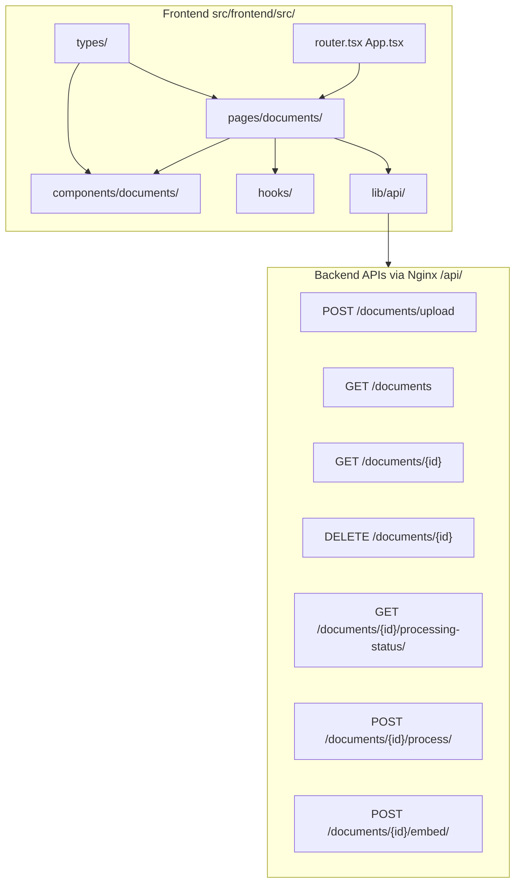
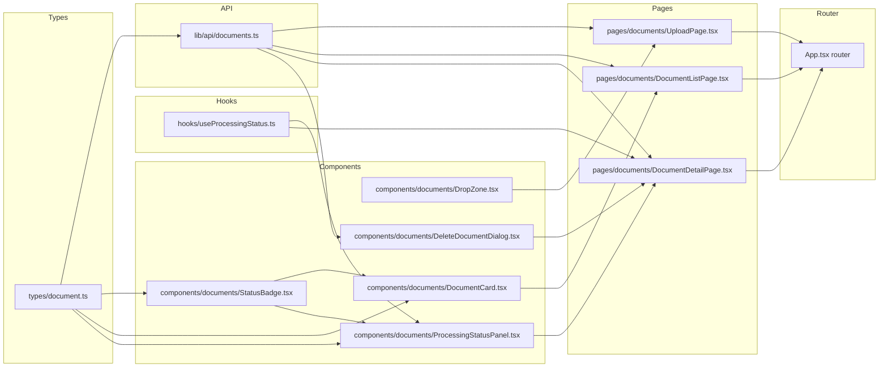

# Implementation Plan: E09 — Frontend Document Management

**Status:** Draft — Awaiting Approval  
**Epic:** E09  
**Depends On:** E08 (Auth & Layout shell ✅), E03–E05 (Backend APIs ✅)  
**Execution Order:** T05 → T01 → T02 → T03 → T04

---

## Architecture Overview

---

## Prerequisites — Missing shadcn/ui Components

The following shadcn/ui components referenced in the PRD are **not yet installed** and must be added first:

| Component | File Target | Reason |
|-----------|------------|--------|
| `Badge` | `src/frontend/src/components/ui/badge.tsx` | StatusBadge needs colored badges |
| `Progress` | `src/frontend/src/components/ui/progress.tsx` | Upload progress bar + processing panel |
| `Skeleton` | `src/frontend/src/components/ui/skeleton.tsx` | Loading skeletons for list/detail |
| `Dialog` | `src/frontend/src/components/ui/dialog.tsx` | Delete confirmation dialog |
| `use-toast` hook | `src/frontend/src/hooks/use-toast.ts` | Toast notifications (shadcn pattern) |

These can be added via `npx shadcn-ui@latest add badge progress skeleton dialog` or manually created following shadcn conventions.

---

## Micro-Task Breakdown

---

### T05 — Navigation Wiring & Route Registration (Do First)

**Goal:** Register all document routes and enable the Documents nav link.

**Files to modify:**
- [`src/frontend/src/App.tsx`](src/frontend/src/App.tsx) — Add document routes under `PrivateRoute` + `AppShell`
- [`src/frontend/src/components/layout/Sidebar.tsx`](src/frontend/src/components/layout/Sidebar.tsx) — Enable "Documents" nav link, add active-state detection for `/documents/*`

**Steps:**
1. Import `DocumentListPage`, `UploadPage`, `DocumentDetailPage` (lazy-loaded or direct imports — they won't exist yet, so use lazy `React.lazy()` or create placeholder components first)
2. Add routes under the existing `PrivateRoute` + `AppShell` children:
   - `/documents` → `DocumentListPage`
   - `/documents/upload` → `UploadPage`
   - `/documents/:documentId` → `DocumentDetailPage`
3. In `Sidebar.tsx`:
   - Remove `disabled: true` from the "Documents" nav item
   - Change active-state detection from `location.pathname === item.href` to `location.pathname.startsWith('/documents')` for the Documents item
4. Create **placeholder** page components (minimal `<>Document List Page</>` etc.) so the app compiles — these will be replaced by T01–T03

**Acceptance:** All 3 routes accessible when authenticated; redirect to `/login` when not; "Documents" nav highlights on any `/documents/*` path.

---

### T01 — Document Upload Page & Flow

**Goal:** Full upload flow with drag-and-drop, validation, progress bar, and redirect.

**New files to create:**

| File | Purpose |
|------|---------|
| [`src/frontend/src/types/document.ts`](src/frontend/src/types/document.ts) | `Document`, `UploadResponse`, `ProcessingStatusResponse`, `ProcessingTask`, `PaginatedResponse<T>` interfaces |
| [`src/frontend/src/lib/api/documents.ts`](src/frontend/src/lib/api/documents.ts) | `uploadDocument()` using `XMLHttpRequest` for progress tracking |
| [`src/frontend/src/components/documents/DropZone.tsx`](src/frontend/src/components/documents/DropZone.tsx) | Drag-and-drop file input with validation |
| [`src/frontend/src/pages/documents/UploadPage.tsx`](src/frontend/src/pages/documents/UploadPage.tsx) | Upload form with title input, progress bar, submit |
| [`src/frontend/src/components/documents/DropZone.test.tsx`](src/frontend/src/components/documents/DropZone.test.tsx) | Smoke + interaction tests |
| [`src/frontend/src/pages/documents/UploadPage.test.tsx`](src/frontend/src/pages/documents/UploadPage.test.tsx) | Smoke + interaction tests |

**Key implementation details:**
- `uploadDocument()` must use `XMLHttpRequest` (not `apiClient`) to access `upload.onprogress` for real progress tracking
- DropZone validates: PDF only (`application/pdf`), max 500MB — inline error, no API call
- Progress bar uses shadcn `<Progress>` component
- On `201`: toast "Document uploaded!" → navigate to `/documents/{id}`
- On error: toast per error code (401→login, 403→"Access denied", 4xx→field error, 5xx→"Server error")

**Test plan:**
- DropZone smoke test: renders without crashing
- DropZone interaction test: dropping a non-PDF file shows error message
- UploadPage smoke test: renders form elements

---

### T02 — Document List Page

**Goal:** Paginated, searchable, filterable document list with status badges.

**New files to create:**

| File | Purpose |
|------|---------|
| [`src/frontend/src/components/documents/StatusBadge.tsx`](src/frontend/src/components/documents/StatusBadge.tsx) | Colored badge mapping `processing_status` → color/label |
| [`src/frontend/src/components/documents/DocumentCard.tsx`](src/frontend/src/components/documents/DocumentCard.tsx) | Card showing document metadata, clickable → detail |
| [`src/frontend/src/pages/documents/DocumentListPage.tsx`](src/frontend/src/pages/documents/DocumentListPage.tsx) | List with search, filter, pagination, empty state |
| [`src/frontend/src/pages/documents/DocumentListPage.test.tsx`](src/frontend/src/pages/documents/DocumentListPage.test.tsx) | Smoke + interaction tests |

**Extend:**
- [`src/frontend/src/lib/api/documents.ts`](src/frontend/src/lib/api/documents.ts) — Add `listDocuments()` function

**Key implementation details:**
- `StatusBadge` mapping: `pending`→gray, `processing`→blue (animated pulse), `completed`→green, `failed`→red
- `DocumentCard`: title, filename, file_size (formatted KB/MB/GB), total_pages (or "—"), created_at (formatted), StatusBadge
- `DocumentListPage`:
  - On mount: fetch `GET /documents?page=1&page_size=20`
  - Loading: 3× `<Skeleton>` cards
  - Empty state: "No documents yet" + "Upload your first document" button → `/documents/upload`
  - Pagination: Previous/Next buttons, "Page X" display
  - Search: debounced 300ms input → re-fetches
  - Filter: dropdown (All / Ready / Processing / Failed)

**Test plan:**
- Smoke test: renders list with mocked API response
- Interaction test: empty state renders "Upload your first document" button

---

### T03 — Document Detail Page & Processing Status Polling

**Goal:** Detail view with real-time processing status polling, action buttons.

**New files to create:**

| File | Purpose |
|------|---------|
| [`src/frontend/src/hooks/useProcessingStatus.ts`](src/frontend/src/hooks/useProcessingStatus.ts) | Custom hook: polls every 3s, stops on completed/failed, cleans up on unmount |
| [`src/frontend/src/components/documents/ProcessingStatusPanel.tsx`](src/frontend/src/components/documents/ProcessingStatusPanel.tsx) | Per-task progress rows with status badges |
| [`src/frontend/src/pages/documents/DocumentDetailPage.tsx`](src/frontend/src/pages/documents/DocumentDetailPage.tsx) | Full detail page layout |
| [`src/frontend/src/pages/documents/DocumentDetailPage.test.tsx`](src/frontend/src/pages/documents/DocumentDetailPage.test.tsx) | Smoke + hook tests |

**Extend:**
- [`src/frontend/src/lib/api/documents.ts`](src/frontend/src/lib/api/documents.ts) — Add `getDocument()`, `getProcessingStatus()`, `triggerProcessing()`, `triggerEmbedding()`
- [`src/frontend/src/types/document.ts`](src/frontend/src/types/document.ts) — Add `ProcessingTask`, `ProcessingStatusResponse` interfaces

**Key implementation details:**
- `useProcessingStatus(documentId, enabled)`:
  - Uses `setInterval` at 3s
  - Stops when `status === 'completed'` or `'failed'`
  - `useEffect` cleanup clears interval
  - Returns `{ statusData, isPolling, error }`
- `DocumentDetailPage` layout:
  1. Back button → `/documents`
  2. Title (h1) + filename (subtitle)
  3. Metadata: file size, total pages, created date
  4. `ProcessingStatusPanel` (conditional)
  5. Action buttons: "Start Chat" (→ `/conversations/new?documentId=X`) | "Delete" (opens dialog)
- `ProcessingStatusPanel`:
  - Hidden when `processing_status === 'completed'`
  - Per-task rows: task type label, `<Progress>` bar, status badge, error message
  - "Start Processing" button if `status === 'uploaded'`
  - "Retry" button if `status === 'failed'`
  - "Generate Embeddings" button after processing completes

**Test plan:**
- Smoke test: renders detail page with mocked completed document
- Hook test: polling stops after status becomes `completed`

---

### T04 — Delete Document Flow

**Goal:** Confirmation dialog with loading state, success/error handling.

**New files to create:**

| File | Purpose |
|------|---------|
| [`src/frontend/src/components/documents/DeleteDocumentDialog.tsx`](src/frontend/src/components/documents/DeleteDocumentDialog.tsx) | shadcn `<Dialog>` with confirmation + loading state |
| [`src/frontend/src/components/documents/DeleteDocumentDialog.test.tsx`](src/frontend/src/components/documents/DeleteDocumentDialog.test.tsx) | Smoke + interaction tests |

**Extend:**
- [`src/frontend/src/lib/api/documents.ts`](src/frontend/src/lib/api/documents.ts) — Add `deleteDocument()`

**Key implementation details:**
- Trigger: "Delete" button on `DocumentDetailPage`
- Dialog: "Are you sure you want to delete **{title}**? ..."
- Two buttons: "Cancel" (closes) | "Delete" (red/destructive, shows spinner, disabled during deletion)
- On `204`: toast "Document deleted" → navigate to `/documents`
- On error: toast with error message, stay on page
- Dialog does NOT close on outside click while deletion is in progress

**Test plan:**
- Smoke test: dialog renders with title in confirmation text
- Interaction test: clicking Cancel closes dialog; clicking Delete calls `deleteDocument` once

---

## File Dependency Graph

---

## Execution Order Rationale

The PRD specifies: **T05 → T01 → T02 → T03 → T04**

1. **T05 (Routes)** first — so each subsequent page can be immediately tested in-browser
2. **T01 (Upload)** — foundational: creates types and API module used by all other tasks
3. **T02 (List)** — consumes types + API from T01
4. **T03 (Detail + Polling)** — extends API module further, uses StatusBadge from T02
5. **T04 (Delete)** — depends on T03's detail page for the trigger button

---

## Key Design Decisions

1. **API module pattern:** All document API functions live in [`src/frontend/src/lib/api/documents.ts`](src/frontend/src/lib/api/documents.ts), following the same pattern as [`src/frontend/src/api/authApi.ts`](src/frontend/src/api/authApi.ts). However, note the PRD specifies `src/frontend/src/lib/api/` path — this differs from the existing `src/frontend/src/api/` path. **Decision:** Use `src/frontend/src/lib/api/documents.ts` as specified in the PRD, since it's a new module and the PRD is explicit about file targets.

2. **Upload uses XMLHttpRequest:** The PRD explicitly requires real progress tracking via `XMLHttpRequest.upload.onprogress`. The existing `apiClient` (Axios) doesn't natively support upload progress events in the same way. **Decision:** Create `uploadDocument()` using raw `XMLHttpRequest` wrapped in a Promise, while all other API functions use the existing `apiClient`.

3. **Toast hook:** shadcn's `use-toast` hook is not yet installed. **Decision:** Create `src/frontend/src/hooks/use-toast.ts` following the standard shadcn pattern, or use a simpler inline toast approach if the full hook is too complex.

4. **Lazy loading:** Use `React.lazy()` for document page imports to keep the initial bundle small, since these are secondary routes.

5. **Active nav detection:** Change `Sidebar.tsx` to use `location.pathname.startsWith('/documents')` for the Documents nav item so it highlights on all sub-routes.

---

## Risks & Mitigations

| Risk | Mitigation |
|------|-----------|
| Missing shadcn components (Badge, Progress, Skeleton, Dialog) | Install via `npx shadcn-ui@latest add` or create manually |
| `XMLHttpRequest` upload doesn't match Axios interceptor pattern | Manually attach `Authorization` header and handle 401 in the upload function |
| Polling interval causes memory leak | `useEffect` cleanup function clears `setInterval`; verify with React Strict Mode |
| TypeScript strict mode errors | Define all API response shapes as interfaces in `types/document.ts`; no `any` types |
