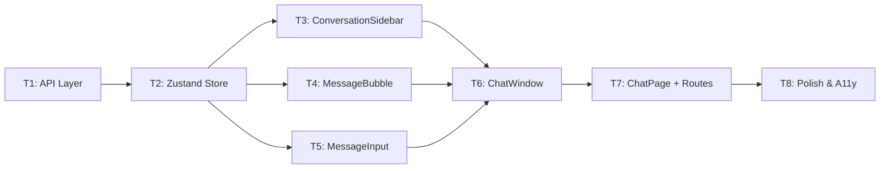

# Implementation Plan — Epic E10: Frontend Chat Interface

**Status:** Draft for Review  
**Epic ID:** E10  
**PRD:** [`docs/active-task/current-prd.md`](docs/active-task/current-prd.md)  
**API Registry:** [`docs/references/api-registry.md`](docs/references/api-registry.md)  
**Database Schema:** [`docs/references/database-schema.md`](docs/references/database-schema.md)  

---

## Overview

Build the full chat UI for the Document Q&A system. Users arrive at a document detail page, create or resume a conversation, send questions, and receive answers with source citations.

**No new API endpoints or DB tables required.** All backend work (E07) is complete.

---

## Execution Order (from PRD)

```
T1 (API Layer) → T2 (Store) → T3, T4, T5 (parallel) → T6 (ChatWindow) → T7 (Page) → T8 (Polish)
```

---

## Task Breakdown

### TASK 1 — Conversation API Service Layer
**File to Create:** [`src/frontend/src/api/conversations.ts`](src/frontend/src/api/conversations.ts)  
**Test File:** [`src/frontend/tests/api/conversations.test.ts`](src/frontend/tests/api/conversations.test.ts)  
**Test Type:** Vitest (pure non-UI logic)  
**Depends On:** Nothing (uses existing `apiClient` from E08)

**What to do:**
1. Create TypeScript interfaces: `Conversation`, `MessageSource`, `Message`, `ConversationDetail`, `PaginatedConversations`
2. Implement 6 functions using `apiClient`:
   - `createConversation(documentId, title?)` → `POST /conversations`
   - `listConversations(documentId?, page?)` → `GET /conversations`
   - `getConversation(conversationId)` → `GET /conversations/{id}`
   - `deleteConversation(conversationId)` → `DELETE /conversations/{id}`
   - `sendMessage(conversationId, content)` → `POST /conversations/{id}/messages/`
   - `directQuery(documentId, question, topK?)` → `POST /documents/{id}/query`
3. **TDD:** Write Vitest tests first (mock `fetch` via `apiClient`), then implement, then refactor

**Acceptance:**
- All 6 functions call correct endpoint with correct HTTP method
- Auth token attached via shared `apiClient`
- Non-2xx responses throw typed error
- No `any` types
- Tests pass: `docker-compose exec frontend npx vitest run tests/api/conversations.test.ts`

---

### TASK 2 — Conversation Store (Zustand)
**File to Create:** [`src/frontend/src/stores/conversationStore.ts`](src/frontend/src/stores/conversationStore.ts)  
**Test File:** [`src/frontend/tests/stores/conversationStore.test.ts`](src/frontend/tests/stores/conversationStore.test.ts)  
**Test Type:** Vitest (pure non-UI logic)  
**Depends On:** TASK 1

**What to do:**
1. Create Zustand store with state shape: `conversations`, `activeConversation`, loading flags, `error`
2. Implement actions: `fetchConversations`, `createConversation`, `loadConversation`, `sendMessage`, `deleteConversation`, `clearActiveConversation`, `clearError`
3. **Optimistic update in `sendMessage`:** Append user message immediately with temp `id`, then append real assistant response on success, or rollback + set `error` on failure
4. **TDD:** Mock the API module, test optimistic update, rollback on error, all state transitions

**Acceptance:**
- Optimistic user message appears before API responds
- On API error, optimistic message removed and `error` set
- `isSendingMessage` toggles correctly
- Store does not call `fetch` directly (delegates to `conversations.ts`)
- Tests pass

---

### TASK 3 — ConversationSidebar Component
**File to Create:** [`src/frontend/src/components/chat/ConversationSidebar.tsx`](src/frontend/src/components/chat/ConversationSidebar.tsx)  
**Test File:** [`src/frontend/tests/components/ConversationSidebar.spec.ts`](src/frontend/tests/components/ConversationSidebar.spec.ts)  
**Test Type:** Visual First → Playwright  
**Depends On:** TASK 2

**What to do:**
1. Implement component with props: `documentId`, `activeConversationId`, `onSelect`
2. UI elements:
   - Header: "Conversations" + "New Chat" button (`PlusIcon`)
   - List: title/fallback + relative time + hover-reveal delete icon (`Trash2`)
   - Active state: `bg-primary/10 text-primary` + left border accent
   - Empty state: centered message
   - Loading state: 3 skeleton divs
   - Delete flow: inline confirmation "Delete? [Yes] [No]"
3. Wire to `conversationStore`
4. **Visual First:** Implement → wait for browser approval → write Playwright tests

**Playwright scenarios (after approval):**
- Skeleton loaders, conversation list, click selection, hover delete, delete confirmation, "New Chat" creation, empty state

---

### TASK 4 — MessageBubble Component
**File to Create:** [`src/frontend/src/components/chat/MessageBubble.tsx`](src/frontend/src/components/chat/MessageBubble.tsx)  
**Test File:** [`src/frontend/tests/components/MessageBubble.spec.ts`](src/frontend/tests/components/MessageBubble.spec.ts)  
**Test Type:** Visual First → Playwright  
**Depends On:** Nothing (pure presentational)

**What to do:**
1. Install `react-markdown`: `docker-compose exec frontend npm install react-markdown`
2. Implement component with props: `message`, `isStreaming?`
3. **User message:** right-aligned bubble, `bg-primary text-primary-foreground`, `rounded-2xl rounded-tr-none`
4. **Assistant message:** left-aligned, full width, markdown rendered via `react-markdown`, blinking cursor `▌` when streaming
5. **Source citations:** collapsible section (shadcn/ui `Collapsible`), toggle text, each source as `Card` with page range + score + content preview
6. **Token usage:** tiny muted text
7. **Timestamp:** `HH:mm` format
8. **Visual First:** Implement with mock props → wait for approval → Playwright tests

---

### TASK 5 — MessageInput Component
**File to Create:** [`src/frontend/src/components/chat/MessageInput.tsx`](src/frontend/src/components/chat/MessageInput.tsx)  
**Test File:** [`src/frontend/tests/components/MessageInput.spec.ts`](src/frontend/tests/components/MessageInput.spec.ts)  
**Test Type:** Visual First → Playwright  
**Depends On:** Nothing (pure presentational)

**What to do:**
1. Implement component with props: `onSend`, `isDisabled?`, `placeholder?`
2. Auto-growing `Textarea` (max 5 lines, then scroll)
3. Send button (`SendHorizontal`) — disabled when empty or `isDisabled`
4. `Enter` submits, `Shift+Enter` adds newline
5. After send: clear input, refocus
6. While disabled: spinner (`Loader2`), placeholder = "Waiting for response..."
7. Character counter `X / 10,000` when length > 500
8. **Visual First:** Implement → wait for approval → Playwright tests

---

### TASK 6 — ChatWindow Component (Orchestrator)
**File to Create:** [`src/frontend/src/components/chat/ChatWindow.tsx`](src/frontend/src/components/chat/ChatWindow.tsx)  
**Test File:** [`src/frontend/tests/components/ChatWindow.spec.ts`](src/frontend/tests/components/ChatWindow.spec.ts)  
**Test Type:** Visual First → Playwright  
**Depends On:** TASK 3, TASK 4, TASK 5

**What to do:**
1. Implement component with props: `conversationId`
2. **Initial load:** call `loadConversation(id)` on mount/change, show skeleton while loading
3. **Message list:** `ScrollArea`, render `MessageBubble` per message, last assistant gets `isStreaming={isSendingMessage}`, auto-scroll via `messagesEndRef`
4. **Empty state (0 messages):** centered icon + "Ask your first question" + 3 clickable starter chips
5. **Sending flow:** `onSend` → `store.sendMessage()`, optimistic user message, streaming bubble
6. **Error handling:** non-blocking `Alert` above input for 429/502/generic errors, "Try again" button
7. **Visual First:** Implement → wait for approval → Playwright tests

---

### TASK 7 — ChatPage Route & Layout Integration
**Files to Create/Modify:**
- [`src/frontend/src/pages/ChatPage.tsx`](src/frontend/src/pages/ChatPage.tsx) ← **create**
- [`src/frontend/src/App.tsx`](src/frontend/src/App.tsx) ← **modify** to add route
- [`src/frontend/src/pages/documents/DocumentDetailPage.tsx`](src/frontend/src/pages/documents/DocumentDetailPage.tsx) ← **modify** "Chat with Document" button

**Test File:** [`src/frontend/tests/e2e/chat.spec.ts`](src/frontend/tests/e2e/chat.spec.ts)  
**Test Type:** Visual First → Playwright E2E  
**Depends On:** TASK 6

**What to do:**
1. Create `ChatPage.tsx` with two-panel layout:
   - Left: `ConversationSidebar` (250px)
   - Right: `ChatWindow`
2. Routes: `/documents/:documentId/chat` and `/documents/:documentId/chat/:conversationId`
3. On mount: load conversations for `documentId`
4. URL param `conversationId` → immediately load that conversation
5. Sidebar selection → navigate via `useNavigate`
6. **Mobile (< `md`):** sidebar hidden, "☰ Chats" button opens slide-over drawer
7. **DocumentDetailPage:** Add "Chat with Document" button (`MessageSquare` icon), only visible when `document.status === 'completed'`
8. **Visual First:** Implement → wait for approval → Playwright E2E tests

---

### TASK 8 — Accessibility, Polish & Error Boundaries
**Files to Create/Modify:**
- [`src/frontend/src/components/chat/ChatErrorBoundary.tsx`](src/frontend/src/components/chat/ChatErrorBoundary.tsx) ← **create**
- All chat components ← **audit and fix**

**Depends On:** TASK 7

**What to do:**
1. **Error Boundary:** Wrap `ChatWindow`. On crash: "Something went wrong. [Reload]"
2. **ARIA Labels:** textarea, send button, sidebar items, delete button
3. **Focus Management:** after send, focus returns to textarea
4. Message list: `aria-live="polite"` + `aria-busy` while loading
5. **Page Title:** `document.title = "Chat — {document_title} | DocuChat"`
6. **Visual First:** Implement → manual browser accessibility audit → Playwright tests

---

## Dependency Graph



## Key Design Decisions

1. **API Client Pattern:** Follow existing [`authApi.ts`](src/frontend/src/api/authApi.ts) pattern — use `apiClient` from [`axios.ts`](src/frontend/src/api/axios.ts) (handles auth tokens, refresh, base URL)
2. **Store Pattern:** Follow [`authStore.ts`](src/frontend/src/stores/authStore.ts) pattern — Zustand with separated state/actions interfaces
3. **Routing:** Add chat routes inside the existing `PrivateRoute` → `AppShell` layout in [`App.tsx`](src/frontend/src/App.tsx)
4. **Testing:** Vitest for pure logic (T1, T2), Playwright for UI components (T3–T8) — NO React Testing Library
5. **No DB/API changes:** All backend work is complete; this is purely frontend

## Files to Create (Summary)

| # | File | Purpose |
|---|------|---------|
| 1 | `src/frontend/src/api/conversations.ts` | Typed API client for conversation endpoints |
| 2 | `src/frontend/src/stores/conversationStore.ts` | Zustand store with optimistic updates |
| 3 | `src/frontend/src/components/chat/ConversationSidebar.tsx` | Conversation list sidebar |
| 4 | `src/frontend/src/components/chat/MessageBubble.tsx` | Single message renderer with markdown + citations |
| 5 | `src/frontend/src/components/chat/MessageInput.tsx` | Auto-growing textarea input |
| 6 | `src/frontend/src/components/chat/ChatWindow.tsx` | Main chat panel orchestrator |
| 7 | `src/frontend/src/components/chat/ChatErrorBoundary.tsx` | Error boundary wrapper |
| 8 | `src/frontend/src/pages/ChatPage.tsx` | Full-page chat route |

## Files to Modify

| # | File | Change |
|---|------|--------|
| 1 | `src/frontend/src/App.tsx` | Add chat routes |
| 2 | `src/frontend/src/pages/documents/DocumentDetailPage.tsx` | Update "Start Chat" button to link to `/documents/:id/chat` |

## Test Files to Create

| # | File | Type |
|---|------|------|
| 1 | `src/frontend/tests/api/conversations.test.ts` | Vitest (TDD) |
| 2 | `src/frontend/tests/stores/conversationStore.test.ts` | Vitest (TDD) |
| 3 | `src/frontend/tests/components/ConversationSidebar.spec.ts` | Playwright |
| 4 | `src/frontend/tests/components/MessageBubble.spec.ts` | Playwright |
| 5 | `src/frontend/tests/components/MessageInput.spec.ts` | Playwright |
| 6 | `src/frontend/tests/components/ChatWindow.spec.ts` | Playwright |
| 7 | `src/frontend/tests/e2e/chat.spec.ts` | Playwright E2E |

---

## Notes

- `react-markdown` needs to be installed in TASK 4
- The existing "Start Chat" button in [`DocumentDetailPage.tsx`](src/frontend/src/pages/documents/DocumentDetailPage.tsx:117) currently navigates to `/conversations/new?documentId=...` — this needs to be updated to `/documents/:id/chat` in TASK 7
- `wip-context.md` must be updated after every micro-task
- No `any` types allowed in new files
