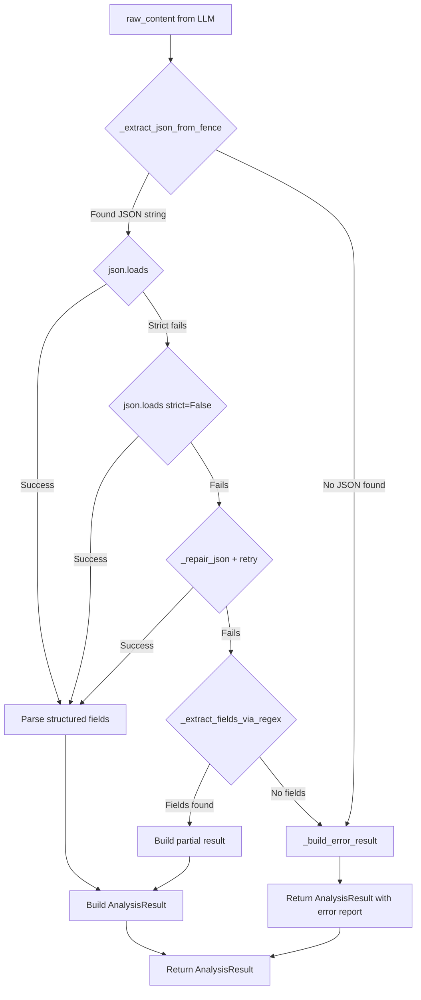

# Fix: JSON Parsing Bug in `_parse_analysis_response`

## Bug Summary

When the Strategist pipeline's LLM (DeepSeek) returns a valid JSON response containing Persian text with special Unicode characters (ZWNJ `\u200c`, ZWJ `\u200d`, etc.), the `_parse_analysis_response` method in [`strategist_service.py`](src/backend/conversations/strategist_service.py:827) fails to parse it. This causes a **silent failure**: an empty `AnalysisResult()` is returned, `raw_report` is `""`, the streaming loop at line 1214 skips everything, and the frontend receives a `"done"` event with empty content — the user sees a blank assistant message with no error.

## Root Cause Analysis

The method has three compounding issues:

### 1. Fragile code fence stripping (lines 841-848)

```python
if cleaned.startswith("```"):
    first_newline = cleaned.find("\n")
    if first_newline != -1:
        cleaned = cleaned[first_newline + 1:]
    if cleaned.endswith("```"):
        cleaned = cleaned[:-3].strip()
    elif "```" in cleaned:
        cleaned = cleaned[: cleaned.rfind("```")].strip()
```

- Only handles ` ``` ` at the **very start** — doesn't account for content before the code block
- `endswith("```")` fails if there's trailing whitespace/newline after the closing fence
- The `elif` branch using `rfind` is fragile with nested backticks in content

### 2. No JSON repair before parsing (lines 850-860)

```python
try:
    data = json.loads(cleaned)
except json.JSONDecodeError:
    try:
        data = json.loads(cleaned, strict=False)
    except json.JSONDecodeError:
        logger.warning("...")
        return AnalysisResult()
```

- No attempt to repair common LLM JSON issues: trailing commas, unescaped quotes, single quotes
- `strict=False` only helps with control characters in strings, not structural JSON issues
- Persian text with embedded double quotes (e.g., `"متن "با کوتیشن" داخل متن"`) breaks JSON

### 3. Silent failure with no user feedback (line 860)

- Returns `AnalysisResult()` with all defaults — no error is surfaced to the user
- The streaming code at line 1214 (`if report_text:`) silently skips everything
- The frontend gets `"done"` with empty `content` — no error event is emitted

## Fix Plan

### Step 1: Rewrite `_parse_analysis_response` with robust parsing

Replace the fragile fence-stripping + single-attempt JSON parsing with a multi-strategy pipeline:

#### Strategy 1: Robust code fence extraction (regex-based)

```python
import re

def _extract_json_from_fence(self, raw_content: str) -> str | None:
    """Extract JSON from markdown code fences using regex.
    
    Handles:
    - ```json\n{...}\n```
    - ```\n{...}\n```
    - ```json\n{...}\n``` (with trailing whitespace)
    - {json} without any fences
    """
    # Pattern 1: Content inside ```json or ``` fences
    fence_pattern = r'```(?:json)?\s*\n(.*?)```'
    match = re.search(fence_pattern, raw_content, re.DOTALL)
    if match:
        return match.group(1).strip()
    
    # Pattern 2: Try to find a top-level JSON object/array directly
    # Look for { or [ as the first non-whitespace character
    stripped = raw_content.strip()
    if stripped.startswith('{') or stripped.startswith('['):
        return stripped
    
    return None
```

#### Strategy 2: JSON repair utility

```python
def _repair_json(self, text: str) -> str:
    """Attempt to repair common JSON issues from LLM output."""
    # 1. Remove trailing commas before ] or }
    text = re.sub(r',\s*([\]}])', r'\1', text)
    
    # 2. Replace single quotes with double quotes (only around keys/string values)
    # This is a best-effort heuristic
    # ...
    
    return text
```

#### Strategy 3: Multi-stage parsing with fallbacks

```python
def _parse_analysis_response(self, raw_content: str) -> AnalysisResult:
    # Stage 1: Extract JSON from code fences
    json_str = self._extract_json_from_fence(raw_content)
    if json_str is None:
        logger.warning("_parse_analysis_response: No JSON found in response")
        return self._build_error_result(raw_content)
    
    # Stage 2: Try parsing (strict then non-strict)
    for parser in [json.loads, lambda s: json.loads(s, strict=False)]:
        try:
            data = parser(json_str)
            break
        except json.JSONDecodeError:
            continue
    else:
        # Stage 3: Try repairing and parsing again
        try:
            repaired = self._repair_json(json_str)
            data = json.loads(repaired)
        except json.JSONDecodeError:
            # Stage 4: Regex-based field extraction as last resort
            data = self._extract_fields_via_regex(json_str)
            if data is None:
                logger.warning("_parse_analysis_response: All parsing failed")
                return self._build_error_result(raw_content)
    
    # ... build AnalysisResult from data ...
```

#### Strategy 4: Regex field extraction fallback

```python
def _extract_fields_via_regex(self, text: str) -> dict | None:
    """Extract structured fields using regex as last-resort fallback."""
    result = {}
    
    prob = re.search(r'"success_probability"\s*:\s*([0-9.]+)', text)
    if prob:
        result["success_probability"] = float(prob.group(1))
    
    summary = re.search(r'"summary"\s*:\s*"([^"]+)"', text)
    if summary:
        result["summary"] = summary.group(1)
    
    # ... extract other fields ...
    
    return result if result else None
```

### Step 2: Non-silent failure — build an error report

Instead of returning an empty `AnalysisResult()`, build a Persian fallback report that explains the parsing failure:

```python
def _build_error_result(self, raw_content: str) -> AnalysisResult:
    """Build an AnalysisResult with an error report when parsing fails."""
    logger.error(
        "_parse_analysis_response: All parsing strategies failed. "
        "Full raw_content=%s",
        raw_content,
    )
    
    error_report = (
        "# گزارش تحلیل استراتژیک\n\n"
        "## خطا در پردازش\n\n"
        "متأسفانه در پردازش پاسخ تحلیل استراتژیک خطایی رخ داد. "
        "لطفاً دوباره تلاش کنید.\n\n"
        "### جزئیات فنی\n\n"
        "سیستم قادر به تجزیه پاسخ دریافتی از مدل زبانی نبود. "
        "این مشکل معمولاً موقتی است و با تلاش مجدد برطرف می‌شود.\n"
    )
    
    return AnalysisResult(
        success_probability=0.0,
        summary="خطا در پردازش تحلیل استراتژیک",
        raw_report=error_report,
    )
```

### Step 3: Improve logging

- Log the **full** raw content (not just first 200 chars) on failure for debugging
- Add structured logging with the parsing strategy that succeeded/failed

### Step 4: Add unit tests

Create tests in [`src/backend/conversations/tests/`](src/backend/conversations/tests/) for the new parsing logic:

| Test Case | Input | Expected |
|-----------|-------|----------|
| Valid JSON with Persian text | ` ```json\n{"summary": "خلاصه فارسی با نویسه‌های یونیکد \u200c و \u200d"}\n``` ` | Parsed correctly |
| JSON with trailing comma | `{"strengths": ["a", "b",]}` | Repaired and parsed |
| JSON without code fences | `{"success_probability": 0.85}` | Parsed directly |
| JSON with extra text before/after | `Here: ```json\n{...}\n``` ` | Extracted from fence |
| Malformed JSON (all parsers fail) | `not json at all` | Returns error `AnalysisResult` with non-empty `raw_report` |
| Empty string | `""` | Returns error `AnalysisResult` |
| JSON with single quotes | `{'key': 'value'}` | Repaired and parsed |

## Files to Modify

| File | Changes |
|------|---------|
| [`src/backend/conversations/strategist_service.py`](src/backend/conversations/strategist_service.py) | Rewrite `_parse_analysis_response` (lines 827-860), add helper methods `_extract_json_from_fence`, `_repair_json`, `_extract_fields_via_regex`, `_build_error_result` |
| [`src/backend/conversations/tests/test_strategist_parsing.py`](src/backend/conversations/tests/test_strategist_parsing.py) | **New file** — Unit tests for all parsing strategies |

## Execution Order

1. Add the new helper methods to `strategist_service.py` (before `_parse_analysis_response`)
2. Rewrite `_parse_analysis_response` to use the multi-strategy pipeline
3. Create the test file with comprehensive test cases
4. Run tests: `docker-compose exec backend pytest conversations/tests/test_strategist_parsing.py -v`
5. Update `docs/active-task/wip-context.md` with completion status

## Architecture Diagram



## Risk Assessment

| Risk | Mitigation |
|------|------------|
| Regex repair corrupts valid JSON | Repair is only attempted after `json.loads` and `json.loads(strict=False)` both fail |
| Regex extraction misses some fields | Partial result is better than empty result; `_build_fallback_report` fills in gaps |
| Performance overhead of multiple parsing attempts | Each attempt is O(n) on string length; total overhead < 1ms for typical LLM response sizes |
| New code introduces regressions | Comprehensive unit tests cover all edge cases before deployment |
