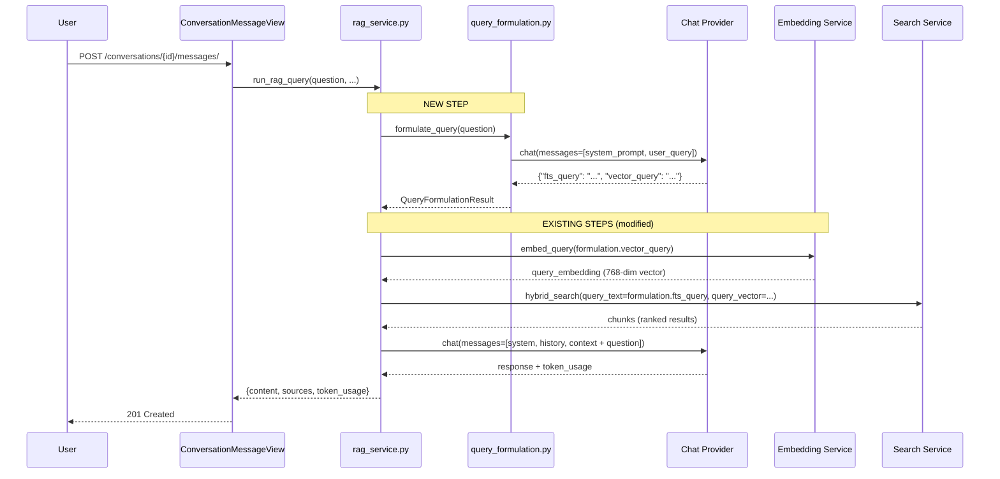
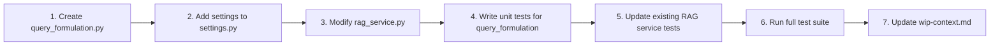

# Implementation Plan E11 — LLM Query Formulation / Keyword Extraction Layer

## Status: 📋 Draft (Pending Review)

---

## 1. Problem Summary

The current RAG pipeline feeds the user's raw query directly into both search engines:

```
User Query ──► embed_query() ──► vector_search()
           └─► raw text ──────► keyword_search() (FTS)
```

This causes two classes of failure:

| Scenario | Vector Search | FTS (Keyword) | Root Cause |
|----------|--------------|---------------|------------|
| **Mixed-language queries** (e.g. `"ماده 22 قانون مدنی رو برام توضیح بده"`) | Pushes the Persian conversational filler down the ranking, diluting the English/Persian legal terms | FTS uses `websearch` with AND logic; conversational words like `"رو"`, `"برام"`, `"بده"` don't exist in any chunk, causing zero matches | No query normalization/translation before search |
| **Conversational → Legal terminology gap** (e.g. `"حکم حبس برای کلاهبرداری چیه؟"`) | Embedding captures semantic similarity but may rank general concepts over specific legal articles | FTS misses because the document uses `"مجازات حبس"` and `"کلاهبرداری"` as formal legal terms, not conversational phrasing | No terminology translation layer |

---

## 2. Proposed Solution: LLM Query Formulation Layer

Insert a **lightweight LLM call** between the user's raw query and the search engines:

```
User Query
    │
    ▼
┌─────────────────────────────────────┐
│  LLM Query Formulation              │
│  (single chat completion call)      │
│                                     │
│  Input:  raw user query             │
│  Output: {                          │
│    "fts_query": "optimized FTS str",│
│    "vector_query": "optimized str"  │
│  }                                  │
└─────────────────────────────────────┘
    │                    │
    ▼                    ▼
embed_query(vector_query)    fts_query ──► keyword_search()
    │
    ▼
vector_search(query_vector)
```

### 2.1 Why This Works

- **FTS benefits**: The LLM strips conversational filler, translates informal Persian to formal legal terminology, and outputs a clean keyword string that matches the indexed `search_vector` content.
- **Vector search benefits**: The LLM outputs a distilled, entity-rich query string that, when embedded, produces a vector closer to the relevant chunk embeddings.
- **Single LLM call**: Only one extra chat completion per user query (not one per search engine).

---

## 3. Prompt Design

### 3.1 System Prompt

```text
You are a Persian legal search query optimizer. Your task is to transform a
user's conversational question into optimized search queries for a legal
document retrieval system.

The system uses two search methods:
1. **Full-Text Search (FTS)**: PostgreSQL `websearch` over Persian legal texts.
   Needs exact keyword matches. Persian digits must be converted to English
   digits (e.g., "۲۲" → "22").
2. **Vector Search**: Semantic similarity search. Benefits from a clean,
   entity-rich query free of conversational filler.

### Instructions:
1. Extract the core legal entities and concepts from the user's question.
2. Translate informal Persian terms to formal legal terminology.
   - Example: "حکم حبس" → "مجازات حبس"
   - Example: "چقدر باید بده" → "میزان مجازات"
   - Example: "کلاهبرداری" → "کلاهبرداری" (already formal)
3. For mixed-language queries, preserve English terms exactly as-is.
4. Output ONLY valid JSON with two keys:
   - "fts_query": A keyword string optimized for PostgreSQL websearch.
     - Use space-separated keywords (websearch handles AND implicitly).
     - Convert all Persian digits to English digits.
     - Remove stop words, filler, and conversational particles.
     - Include both the conversational term AND its formal legal equivalent
       when there's a terminology gap (e.g., "حبس مجازات_حبس").
   - "vector_query": A clean, natural-language query string optimized for
     embedding.
     - Remove filler words but keep the semantic structure.
     - Use formal legal terminology where applicable.
     - Keep the query as a natural sentence fragment, not just keywords.

### Examples:

Input: "ماده ۲۲ قانون مدنی رو برام توضیح بده"
Output:
{
  "fts_query": "ماده 22 قانون مدنی",
  "vector_query": "ماده 22 قانون مدنی"

Input: "حکم حبس برای کلاهبرداری چقدره؟"
Output:
{
  "fts_query": "مجازات حبس کلاهبرداری",
  "vector_query": "مجازات حبس برای جرم کلاهبرداری"
}

Input: "What is the penalty for کلاهبرداری under Islamic Penal Code?"
Output:
{
  "fts_query": "penalty کلاهبرداری Islamic Penal Code مجازات",
  "vector_query": "What is the penalty for کلاهبرداری under the Islamic Penal Code"
}
```

### 3.2 Key Design Decisions in the Prompt

| Decision | Rationale |
|----------|-----------|
| **Separate `fts_query` and `vector_query`** | FTS needs exact keyword matches; vector search benefits from semantic phrasing. Different strings optimize each. |
| **Persian digit normalization in `fts_query`** | The DB trigger uses `to_tsvector('simple', ...)` on digit-normalized content. FTS queries must match the normalized form. |
| **Include both conversational + formal terms in `fts_query`** | The `websearch` parser treats space-separated terms as AND. Including both forms increases recall without harming precision. |
| **`vector_query` as a sentence fragment** | Embedding models perform better on natural-language phrases than keyword lists. |
| **English terms preserved verbatim** | English legal terms (e.g., "Islamic Penal Code") are exact entities that should not be translated. |

---

## 4. Output Structure

The LLM response is parsed into a [`QueryFormulationResult`](src/backend/conversations/query_formulation.py) dataclass:

```python
@dataclass
class QueryFormulationResult:
    fts_query: str       # Optimized for PostgreSQL websearch FTS
    vector_query: str    # Optimized for embedding / vector search
```

### Validation Rules

| Field | Required | Max Length | Notes |
|-------|----------|------------|-------|
| `fts_query` | Yes | 500 chars | Must not be empty after stripping |
| `vector_query` | Yes | 1000 chars | Must not be empty after stripping |

If the LLM returns invalid JSON or missing fields, the fallback mechanism kicks in (see §6).

---

## 5. Pipeline Integration

### 5.1 New Module: [`src/backend/conversations/query_formulation.py`](src/backend/conversations/query_formulation.py)

This module contains:

1. **`QueryFormulationResult`** dataclass
2. **`formulate_query(user_query: str) -> QueryFormulationResult`** — The main entry point. Calls the chat provider with the system prompt, parses the JSON response.
3. **`_build_formulation_messages(user_query: str) -> list[dict]`** — Builds the messages array (system prompt + user query).
4. **`_parse_formulation_response(raw_content: str) -> QueryFormulationResult`** — Parses and validates the LLM JSON response.

### 5.2 Changes to [`src/backend/conversations/rag_service.py`](src/backend/conversations/rag_service.py)

Both [`run_rag_query()`](src/backend/conversations/rag_service.py:190) and [`run_rag_query_stream()`](src/backend/conversations/rag_service.py:304) need modification:

**Before (current):**
```python
# Step 1: Embed the question
query_embedding = embed_query(question)

# Step 2: Hybrid search
chunks = hybrid_search(
    document_id=document_id,
    query_vector=query_embedding,
    query_text=question,  # <-- raw question used for FTS
    top_k=top_k,
    filters=filters,
)
```

**After:**
```python
# Step 1: Formulate query via LLM
formulation = formulate_query(question)

# Step 2: Embed the optimized vector query
query_embedding = embed_query(formulation.vector_query)

# Step 3: Hybrid search with optimized FTS query
chunks = hybrid_search(
    document_id=document_id,
    query_vector=query_embedding,
    query_text=formulation.fts_query,  # <-- optimized FTS string
    top_k=top_k,
    filters=filters,
)
```

### 5.3 Pipeline Flow Diagram



---

## 6. Fallback Mechanism

### 6.1 Failure Scenarios

| Scenario | Handling |
|----------|----------|
| **LLM call fails** (network error, timeout, rate limit) | Log warning, fall back to using the raw `question` for both `fts_query` and `vector_query` |
| **LLM returns invalid JSON** | Log warning + raw content, fall back to raw question |
| **LLM returns valid JSON but empty/missing fields** | Log warning, fall back to raw question for the missing field |
| **LLM returns content exceeding max length** | Truncate to max length, log warning |
| **LLM takes too long** (latency concern) | See §7 for timeout configuration |

### 6.2 Implementation in [`formulate_query()`](src/backend/conversations/query_formulation.py)

```python
def formulate_query(user_query: str) -> QueryFormulationResult:
    """Attempt LLM-based query formulation, falling back to raw query on failure."""
    try:
        messages = _build_formulation_messages(user_query)
        provider = get_chat_provider()
        result = provider.chat(
            messages=messages,
            max_tokens=settings.QUERY_FORMULATION_MAX_TOKENS,
        )
        raw_content = result["content"]
        formulation = _parse_formulation_response(raw_content)
        
        # Validate non-empty
        if not formulation.fts_query.strip():
            logger.warning("formulate_query: fts_query empty, falling back")
            formulation.fts_query = user_query
        if not formulation.vector_query.strip():
            logger.warning("formulate_query: vector_query empty, falling back")
            formulation.vector_query = user_query
            
        return formulation
        
    except Exception as e:
        logger.warning("formulate_query: LLM call failed (%s), using raw query", e)
        return QueryFormulationResult(
            fts_query=user_query,
            vector_query=user_query,
        )
```

---

## 7. Latency Considerations

### 7.1 Expected Overhead

The query formulation step adds **one lightweight chat completion call** per user query. Using a fast model (e.g., `gpt-4o-mini` or the same configured chat provider), this should add:

| Model | Estimated Latency | Notes |
|-------|------------------|-------|
| `gpt-4o-mini` | 200–500ms | Most queries are short; output is tiny (~100 tokens) |
| `gemini-2.0-flash` | 300–600ms | Comparable speed |
| `llama3` (local via Ollama) | 500–1500ms | Depends on hardware; first-call cold start |

### 7.2 Mitigations

| Mitigation | Implementation |
|------------|---------------|
| **Low max_tokens** | Set [`QUERY_FORMULATION_MAX_TOKENS`](src/backend/config/settings.py) to 150 (the output is tiny) |
| **Configurable timeout** | Add [`QUERY_FORMULATION_TIMEOUT`](src/backend/config/settings.py) setting (default 5s). If the LLM call exceeds this, abort and fall back. |
| **Reuse same provider** | Use the already-configured [`get_chat_provider()`](src/backend/providers/registry.py) — no additional connection setup |
| **No streaming needed** | Use `provider.chat()` (non-streaming) since the output is a tiny JSON blob |
| **Optional: Skip for short queries** | If `len(user_query) < 10` chars, skip formulation entirely (unlikely to be conversational) |

### 7.3 New Settings

Add to [`src/backend/config/settings.py`](src/backend/config/settings.py):

```python
# Query Formulation (Epic E11)
QUERY_FORMULATION_ENABLED = env.bool("QUERY_FORMULATION_ENABLED", default=True)
QUERY_FORMULATION_MAX_TOKENS = env.int("QUERY_FORMULATION_MAX_TOKENS", default=150)
QUERY_FORMULATION_TIMEOUT = env.int("QUERY_FORMULATION_TIMEOUT", default=5)  # seconds
```

---

## 8. Files to Create / Modify

### 8.1 New Files

| File | Purpose |
|------|---------|
| [`src/backend/conversations/query_formulation.py`](src/backend/conversations/query_formulation.py) | Core module: `QueryFormulationResult`, `formulate_query()`, parsing helpers |

### 8.2 Modified Files

| File | Changes |
|------|---------|
| [`src/backend/conversations/rag_service.py`](src/backend/conversations/rag_service.py) | Import `formulate_query`; insert call before `embed_query`; pass `formulation.fts_query` to `hybrid_search` instead of raw `question` |
| [`src/backend/config/settings.py`](src/backend/config/settings.py) | Add 3 new settings: `QUERY_FORMULATION_ENABLED`, `QUERY_FORMULATION_MAX_TOKENS`, `QUERY_FORMULATION_TIMEOUT` |
| [`src/backend/conversations/tests/test_rag_service.py`](src/backend/conversations/tests/test_rag_service.py) | Update existing tests to mock `formulate_query`; add tests for the new pipeline step |
| [`src/backend/conversations/tests/test_query_formulation.py`](src/backend/conversations/tests/test_query_formulation.py) | **NEW test file** — unit tests for `formulate_query()` and `_parse_formulation_response()` |
| [`docs/references/api-registry.md`](src/docs/references/api-registry.md) | No API changes needed (internal pipeline change only) |
| [`docs/references/database-schema.md`](src/docs/references/database-schema.md) | No schema changes needed |
| [`docs/active-task/wip-context.md`](src/docs/active-task/wip-context.md) | Update after implementation |

---

## 9. Test Plan

### 9.1 Unit Tests for [`query_formulation.py`](src/backend/conversations/query_formulation.py)

| Test | Description |
|------|-------------|
| `test_formulate_query_success` | Mock chat provider returns valid JSON; verify `QueryFormulationResult` fields |
| `test_formulate_query_invalid_json` | LLM returns non-JSON; verify fallback to raw query |
| `test_formulate_query_missing_fields` | LLM returns JSON missing `fts_query`; verify fallback |
| `test_formulate_query_empty_fields` | LLM returns JSON with empty strings; verify fallback |
| `test_formulate_query_api_error` | Chat provider raises exception; verify fallback |
| `test_formulate_query_persian_digit_normalization` | Verify `fts_query` has Persian→English digit conversion |
| `test_formulate_query_mixed_language` | Verify English terms preserved in both fields |
| `test_parse_formulation_response_valid` | Valid JSON → correct dataclass |
| `test_parse_formulation_response_truncation` | Content exceeds max length → truncated |

### 9.2 Updated Tests for [`rag_service.py`](src/backend/conversations/rag_service.py)

| Test | Change |
|------|--------|
| `test_normal_response` | Add mock for `formulate_query` returning `QueryFormulationResult` |
| `test_citation_extraction_integration` | Add mock for `formulate_query` |
| `test_history_truncation` | Add mock for `formulate_query` |
| `test_custom_top_k` | Verify `formulation.fts_query` is passed as `query_text` to `hybrid_search` |
| `test_formulation_fallback_in_pipeline` | Mock `formulate_query` to raise; verify raw question is used as fallback |

---

## 10. Implementation Order



### Step-by-step

1. **Create [`query_formulation.py`](src/backend/conversations/query_formulation.py)** — The core module with `QueryFormulationResult`, `formulate_query()`, `_build_formulation_messages()`, `_parse_formulation_response()`.

2. **Add settings** — Three new settings in [`settings.py`](src/backend/config/settings.py) with environment variable support.

3. **Modify [`rag_service.py`](src/backend/conversations/rag_service.py)** — Insert the formulation step in both `run_rag_query()` and `run_rag_query_stream()`. The change is minimal: one import, one function call, one parameter change.

4. **Write [`test_query_formulation.py`](src/backend/conversations/tests/test_query_formulation.py)** — Comprehensive unit tests for the new module.

5. **Update [`test_rag_service.py`](src/backend/conversations/tests/test_rag_service.py)** — Add `formulate_query` mock to all existing tests; add new test for formulation fallback.

6. **Run full test suite** — `docker-compose exec backend pytest` to verify nothing is broken.

7. **Update [`wip-context.md`](docs/active-task/wip-context.md)** — Document the completed work.

---

## 11. Risks and Mitigations

| Risk | Impact | Mitigation |
|------|--------|------------|
| **LLM hallucinates keywords** | FTS returns irrelevant chunks | The RRF fusion with vector search acts as a safety net; irrelevant keyword results get low RRF scores |
| **Increased latency** | Poor UX | Configurable timeout + skip-for-short-queries optimization; the formulation model is the same fast chat provider already in use |
| **Increased cost** | Higher API bills | Each formulation call is ~100 output tokens; at `gpt-4o-mini` pricing ($0.15/M input, $0.60/M output), this is ~$0.00006 per query |
| **Persian-specific prompt failure** | Poor formulation quality | The prompt is explicitly designed for Persian legal text; examples cover the key patterns; easy to iterate on prompt without code changes |
| **LLM returns Persian digits in `fts_query`** | FTS mismatch | The prompt explicitly instructs digit conversion; can add a post-processing normalization step in `_parse_formulation_response()` as a safety net |
