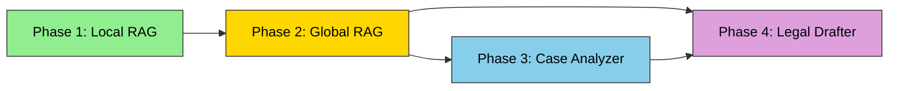

# DocuChat — Product Roadmap

> **Persian Legal RAG System** — A multi-phase evolution from single-document reading assistant to full legal reasoning engine.

---

## Phase 1: Local RAG — دستیار خوانش اسناد ✅ (Completed)

**Status:** ✅ Completed  
**Tagline:** Chat with your uploaded PDFs.

### What it does
A single-document RAG system where users upload a Persian legal PDF (e.g., a contract, a court ruling, a legal article) and ask questions about its content. The system retrieves relevant chunks from that single document and generates answers with citations.

### Technical Architecture
```
User Uploads PDF → PyMuPDF Extraction → Legal Structural Chunking
    → Embedding (Ollama bge-m3, 1024d) → pgvector Storage
    → Hybrid Search (Vector + FTS + Trigram, RRF Fusion)
    → LLM Generation (OpenAI / Gemini / Ollama)
```

### Key Capabilities
- **PDF upload & processing**: PyMuPDF text extraction, Persian legal structure detection (مواد, تبصره, بند, فصل)
- **Hybrid search**: Vector similarity (pgvector) + Full-Text Search (PostgreSQL) + Trigram fuzzy matching, fused via Reciprocal Rank Fusion (RRF) with weights [3.0, 1.0, 1.0]
- **HyDE query formulation**: LLM generates hypothetical answer + FTS keywords for better retrieval
- **Citation extraction**: Automatic extraction of source chunk references from LLM output
- **Streaming responses**: Server-Sent Events (SSE) for real-time token streaming
- **Conversation history**: 10-turn context window for follow-up questions
- **Persian text normalization**: Arabic-to-Persian character normalization, digit normalization, presentation form normalization

### Data Model
- `Document` (user_upload) → `DocumentChunk[]` with embeddings, FTS vectors, legal metadata
- `Conversation` → linked to one `Document` via ForeignKey
- `Message` → role-based (user/assistant) with `sources` (JSONB) and `token_usage` (JSONB)

### Limitations (addressed by Phase 2)
- ❌ Single document scope per conversation
- ❌ No cross-document reasoning
- ❌ No access to system legal reference databases
- ❌ Cannot answer questions about laws not in the uploaded document

---

## Phase 2: Global RAG — پژوهشگر حقوقی 🎯 (Current Target)

**Status:** 🔄 In Progress — see [`plans/plan-phase2-global-rag-refactoring.md`](../plans/plan-phase2-global-rag-refactoring.md)  
**Tagline:** Ask legal questions, get answers from all three legal hubs.

### What it does
Transforms the system from single-document Q&A to a **multi-hub legal researcher**. Users ask legal questions in Persian, and the system queries three specialized legal knowledge hubs in parallel, then synthesizes a comprehensive answer with precise citations.

### Three Legal Hubs

| Hub | Persian Name | Data Source | Record Count |
|-----|-------------|-------------|--------------|
| Legislation | قوانین مصوب | `قوانین مهم.json` | ~10 laws |
| Judicial Precedent | رویه‌های قضایی | `آرای وحدت رویه.json` + `آرای هیئت عمومی دیوان عدالت اداری.json` | Hundreds of judgments |
| Advisory Opinions | نظریات مشورتی و رویه عملی | `نظرات مشورتی اداره کل حقوقی.json` + `مشروح نشست های قضایی.json` | Thousands of opinions |

### Technical Architecture
```
User Question
    │
    ▼
┌──────────────────────────────┐
│  Question Router (LLM)       │  ← Decompose question into sub-queries
│  Route each to relevant hub  │     per hub type
└──────────┬───────────────────┘
           │
           ▼
    ┌──────┴──────┐
    ▼             ▼             ▼
┌─────────┐ ┌─────────┐ ┌─────────┐
│Legislation│ │Precedent│ │Advisory │
│Hub       │ │Hub      │ │Hub      │
│hybrid_   │ │hybrid_  │ │hybrid_  │
│search()  │ │search() │ │search() │
└────┬────┘ └────┬────┘ └────┬────┘
     │           │           │
     ▼           ▼           ▼
┌──────────────────────────────┐
│  Multi-Source Context Builder│  ← Label chunks by hub + document
└──────────┬───────────────────┘
           │
           ▼
┌──────────────────────────────┐
│  LLM Synthesis               │  ← Lite: single pass with multi-source
│  or Per-Hub + Synthesis      │     Full: per-hub partial + synthesis
└──────────┬───────────────────┘
           │
           ▼
    Final Answer + Per-Document Citations + Hub Metadata
```

### Key Capabilities (Phase 2a — Lite)
- **JSON dataset ingestion**: Management command imports 5 JSON files → one `Document` per record with proper chunking
- **Hub-aware search**: `multi_hub_search()` filters by `hub_type` across all reference documents
- **Question routing**: LLM decomposes questions and routes sub-queries to relevant hubs
- **Multi-source context**: Chunks labeled by hub type + document title for precise citations
- **Backward compatibility**: Existing Local RAG continues working; `mode: "global_rag"` parameter enables multi-hub mode

### Key Capabilities (Phase 2b — Full)
- **Per-hub partial answers**: Each hub generates its own answer using specialized prompts
- **Answer synthesis**: Merges partial answers with conflict detection and legal hierarchy resolution
- **Conflict reporting**: Identifies contradictions between hubs (e.g., law vs. precedent) with guidance

### Data Model Changes
- `Document.hub_type` — new field for reference law documents
- `DocumentChunk.hub_type` — denormalized field for efficient per-hub filtering
- `Message.hub_metadata` — new JSONB field for multi-hub query metadata

### Dependencies
- JSON datasets at `C:\Users\starlap\Desktop\دیتا ست ها\` (5 files, 3 hubs)
- Existing `ChunkingService` for legal structural chunking
- Existing `hybrid_search()` with hub-type filter support

---

## Phase 3: Case Analyzer — تحلیل‌گر پرونده 🔮 (Future)

**Status:** 📋 Planned  
**Tagline:** Upload a case file, get a legal analysis with cross-references.

### What it does
Combines Phase 1 (Local RAG on user's document) with Phase 2 (Global RAG on legal databases) to analyze a user's case file against the entire legal corpus. The user uploads a legal document (e.g., a court petition, a contract, a judgment) and the system:

1. **Analyzes the document** — extracts key legal claims, parties, subject matter, cited laws
2. **Cross-references with legal databases** — finds relevant laws, precedents, and advisory opinions
3. **Identifies conflicts** — spots contradictions between the document's claims and established law
4. **Generates a legal analysis report** — structured output with findings, risks, and recommendations

### Example Use Cases
- **Contract review**: "Analyze this contract and identify clauses that conflict with Iranian labor law"
- **Petition analysis**: "Check if this court petition's arguments are supported by recent judicial precedents"
- **Risk assessment**: "Identify legal risks in this real estate agreement based on current laws and precedents"

### Technical Architecture (Proposed)
```
User Uploads Case Document (PDF)
    │
    ▼
┌──────────────────────────────┐
│  Phase 1: Document Analysis  │
│  - Extract text + structure  │
│  - Identify legal entities   │
│  - Extract claims/citations  │
│  - Classify case type        │
└──────────┬───────────────────┘
           │
           ▼
┌──────────────────────────────┐
│  Phase 2: Cross-Reference    │
│  - Query all 3 legal hubs    │
│  - Find relevant laws        │
│  - Find matching precedents  │
│  - Find applicable opinions  │
└──────────┬───────────────────┘
           │
           ▼
┌──────────────────────────────┐
│  Phase 3: Conflict Detection │
│  - Compare doc claims vs law │
│  - Identify contradictions   │
│  - Flag missing citations    │
│  - Assess legal risks        │
└──────────┬───────────────────┘
           │
           ▼
┌──────────────────────────────┐
│  Phase 4: Report Generation  │
│  - Structured legal analysis │
│  - Risk scoring per clause   │
│  - Recommended actions       │
│  - Supporting citations      │
└──────────────────────────────┘
```

### Key Capabilities
- **Document understanding**: Extract legal entities, claims, cited laws from user's document
- **Multi-directional cross-reference**: Document → Law, Law → Precedent, Precedent → Document
- **Conflict detection engine**: Rule-based + LLM analysis of contradictions
- **Structured report output**: JSON/Markdown report with sections, risk levels, citations
- **Conversational follow-up**: User can ask clarifying questions about the analysis

### Data Model Changes (Estimated)
- `CaseAnalysis` model — stores analysis results, linked to Document + Conversation
- `LegalEntity` model — extracted entities (parties, laws, courts, dates)
- `ConflictReport` model — detected conflicts with severity levels

### Dependencies
- Phase 2 (Global RAG) must be complete and stable
- LLM with strong Persian legal reasoning capability
- Entity extraction pipeline for Persian legal documents

---

## Phase 4: Legal Drafter — تولیدکننده اسناد حقوقی 🔮 (Future)

**Status:** 📋 Planned  
**Tagline:** Generate legal documents with AI, grounded in Iranian law.

### What it does
An AI-powered legal document drafting assistant that generates contracts, petitions, and other legal documents based on user requirements, grounded in the actual text of Iranian laws and judicial precedents.

### Example Use Cases
- **Contract drafting**: "Draft an employment contract compliant with Iranian labor law for a software engineer"
- **Petition drafting**: "Write a petition for annulment of a administrative decision based on دیوان عدالت اداری precedent"
- **Legal memo drafting**: "Prepare a legal memorandum on the statute of limitations for fraud claims"
- **Document customization**: "Add a force majeure clause to this contract compliant with Iranian civil code"

### Technical Architecture (Proposed)
```
User Requirements (Natural Language)
    │
    ▼
┌──────────────────────────────┐
│  Phase 1: Requirements       │
│  Analysis                    │
│  - Parse user intent         │
│  - Identify document type    │
│  - Extract key parameters    │
│  - Determine legal domain    │
└──────────┬───────────────────┘
           │
           ▼
┌──────────────────────────────┐
│  Phase 2: Legal Research     │
│  - Query all 3 legal hubs    │
│  - Find governing laws       │
│  - Find template precedents  │
│  - Identify mandatory clauses│
└──────────┬───────────────────┘
           │
           ▼
┌──────────────────────────────┐
│  Phase 3: Draft Generation   │
│  - Generate document outline │
│  - Draft each section        │
│  - Cite supporting laws      │
│  - Apply legal formatting    │
└──────────┬───────────────────┘
           │
           ▼
┌──────────────────────────────┐
│  Phase 4: Review & Validate  │
│  - Check legal compliance    │
│  - Verify citations          │
│  - Flag missing elements     │
│  - Suggest alternatives      │
└──────────┬───────────────────┘
           │
           ▼
    Draft Document + Legal Review Notes
```

### Key Capabilities
- **Template-based generation**: Pre-defined templates for common document types (contracts, petitions, memos)
- **Legal compliance checking**: Auto-verify that generated clauses comply with relevant laws
- **Citation grounding**: Every clause cites the specific law article or precedent it's based on
- **Iterative refinement**: User can request modifications, and the system re-drafts with updated research
- **Export formats**: PDF, DOCX, plain text with proper Persian legal formatting

### Data Model Changes (Estimated)
- `DocumentTemplate` model — pre-defined legal document templates with variable slots
- `DraftSession` model — tracks the drafting process, user edits, version history
- `LegalClause` model — reusable clause library with legal metadata

### Dependencies
- Phase 2 (Global RAG) must be complete and stable
- Phase 3 (Case Analyzer) provides the document understanding foundation
- Template engine for legal document generation
- LLM with strong Persian legal drafting capability

---

## Visual Roadmap

```mermaid
gantt
    title DocuChat Product Roadmap
    dateFormat  YYYY-MM-DD
    axisFormat  %Y Q%q
    
    section Phase 1: Local RAG
    PDF Upload & Processing        :done, 2024-Q3, 2024-Q4
    Hybrid Search Engine           :done, 2024-Q4, 2025-Q1
    HyDE Query Formulation         :done, 2025-Q1, 2025-Q1
    Streaming & Citations          :done, 2025-Q1, 2025-Q2
    
    section Phase 2: Global RAG
    JSON Ingestion + hub_type      :active, 2025-Q2, 2025-Q2
    Multi-Hub Search               :active, 2025-Q2, 2025-Q2
    Question Router                :active, 2025-Q2, 2025-Q2
    Lite Multi-Hub RAG             :active, 2025-Q2, 2025-Q2
    Full Synthesis Mode            :2025-Q2, 2025-Q3
    
    section Phase 3: Case Analyzer
    Document Understanding         :2025-Q3, 2025-Q4
    Cross-Reference Engine         :2025-Q3, 2025-Q4
    Conflict Detection             :2025-Q4, 2025-Q4
    Report Generation              :2025-Q4, 2026-Q1
    
    section Phase 4: Legal Drafter
    Template System                :2026-Q1, 2026-Q2
    Draft Generation               :2026-Q1, 2026-Q2
    Legal Compliance Check         :2026-Q2, 2026-Q3
    Export & Iteration             :2026-Q2, 2026-Q3
```

---

## Dependency Graph



---

## Key Design Principles

1. **Backward Compatibility**: Each phase must not break the previous phase's functionality. New features are additive.
2. **Incremental Value**: Each phase delivers standalone value. Users benefit from Phase 2 even if Phase 3-4 are not yet built.
3. **Data Sovereignty**: All legal reference data is stored in PostgreSQL/pgvector — no external API dependencies for retrieval.
4. **Persian-First**: All prompts, citations, and outputs are designed for Persian legal language and formatting.
5. **Citation Integrity**: Every answer must cite its sources at the document level (not just file level) for legal verifiability.

---

## Current Status

| Phase | Status | Target Completion |
|-------|--------|-------------------|
| Phase 1: Local RAG | ✅ Completed | Done |
| Phase 2a: Global RAG (Lite) | 🔄 In Progress | Current sprint |
| Phase 2b: Global RAG (Full) | 📋 Planned | After Phase 2a |
| Phase 3: Case Analyzer | 🔮 Future | TBD |
| Phase 4: Legal Drafter | 🔮 Future | TBD |

For detailed implementation plan of Phase 2, see [`plans/plan-phase2-global-rag-refactoring.md`](../plans/plan-phase2-global-rag-refactoring.md).
