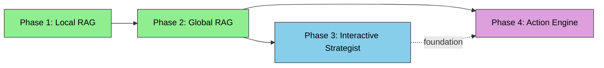

# DocuChat — Product Roadmap

> **Persian Legal RAG System** — A multi-phase evolution from single-document reading assistant to full legal reasoning engine.

---

## Phase 1: Local RAG — دستیار خوانش اسناد ✅ (Completed)

**Status:** ✅ Completed  
**Tagline:** Chat with your uploaded PDFs.

### What it does
A single-document RAG system where users upload a Persian legal PDF (e.g., a contract, a court ruling, a legal article) and ask questions about its content. The system retrieves relevant chunks from that single document and generates answers with citations.

### Technical Architecture
```
User Uploads PDF → PyMuPDF Extraction → Legal Structural Chunking
    → Embedding (Ollama bge-m3, 1024d) → pgvector Storage
    → Hybrid Search (Vector + FTS + Trigram, RRF Fusion)
    → LLM Generation (OpenAI / Gemini / Ollama)
```

### Key Capabilities
- **PDF upload & processing**: PyMuPDF text extraction, Persian legal structure detection (مواد, تبصره, بند, فصل)
- **Hybrid search**: Vector similarity (pgvector) + Full-Text Search (PostgreSQL) + Trigram fuzzy matching, fused via Reciprocal Rank Fusion (RRF) with weights [3.0, 1.0, 1.0]
- **HyDE query formulation**: LLM generates hypothetical answer + FTS keywords for better retrieval
- **Citation extraction**: Automatic extraction of source chunk references from LLM output
- **Streaming responses**: Server-Sent Events (SSE) for real-time token streaming
- **Conversation history**: 10-turn context window for follow-up questions
- **Persian text normalization**: Arabic-to-Persian character normalization, digit normalization, presentation form normalization

### Data Model
- `Document` (user_upload) → `DocumentChunk[]` with embeddings, FTS vectors, legal metadata
- `Conversation` → linked to one `Document` via ForeignKey
- `Message` → role-based (user/assistant) with `sources` (JSONB) and `token_usage` (JSONB)

### Limitations (addressed by Phase 2)
- ❌ Single document scope per conversation
- ❌ No cross-document reasoning
- ❌ No access to system legal reference databases
- ❌ Cannot answer questions about laws not in the uploaded document

---

## Phase 2: Global RAG — پژوهشگر حقوقی ✅ (Completed)

**Status:** ✅ Completed
**Tagline:** Ask legal questions, get answers from all three legal hubs.

### What it does
Transforms the system from single-document Q&A to a **multi-hub legal researcher**. Users ask legal questions in Persian, and the system queries three specialized legal knowledge hubs in parallel, then synthesizes a comprehensive answer with precise citations.

### Three Legal Hubs

| Hub | Persian Name | Data Source | Record Count |
|-----|-------------|-------------|--------------|
| Legislation | قوانین مصوب | `قوانین مهم.json` | ~10 laws |
| Judicial Precedent | رویه‌های قضایی | `آرای وحدت رویه.json` + `آرای هیئت عمومی دیوان عدالت اداری.json` | Hundreds of judgments |
| Advisory Opinions | نظریات مشورتی و رویه عملی | `نظرات مشورتی اداره کل حقوقی.json` + `مشروح نشست های قضایی.json` | Thousands of opinions |

### Technical Architecture
```
User Question
    │
    ▼
┌──────────────────────────────┐
│  Question Router (LLM)       │  ← Decompose question into sub-queries
│  Route each to relevant hub  │     per hub type
└──────────┬───────────────────┘
           │
           ▼
    ┌──────┴──────┐
    ▼             ▼             ▼
┌─────────┐ ┌─────────┐ ┌─────────┐
│Legislation│ │Precedent│ │Advisory │
│Hub       │ │Hub      │ │Hub      │
│hybrid_   │ │hybrid_  │ │hybrid_  │
│search()  │ │search() │ │search() │
└────┬────┘ └────┬────┘ └────┬────┘
     │           │           │
     ▼           ▼           ▼
┌──────────────────────────────┐
│  Multi-Source Context Builder│  ← Label chunks by hub + document
└──────────┬───────────────────┘
           │
           ▼
┌──────────────────────────────┐
│  LLM Synthesis               │  ← Lite: single pass with multi-source
│  or Per-Hub + Synthesis      │     Full: per-hub partial + synthesis
└──────────┬───────────────────┘
           │
           ▼
    Final Answer + Per-Document Citations + Hub Metadata
```

### Key Capabilities (Phase 2a — Lite)
- **JSON dataset ingestion**: Management command imports 5 JSON files → one `Document` per record with proper chunking
- **Hub-aware search**: `multi_hub_search()` filters by `hub_type` across all reference documents
- **Question routing**: LLM decomposes questions and routes sub-queries to relevant hubs
- **Multi-source context**: Chunks labeled by hub type + document title for precise citations
- **Backward compatibility**: Existing Local RAG continues working; `mode: "global_rag"` parameter enables multi-hub mode

### Key Capabilities (Phase 2b — Full)
- **Per-hub partial answers**: Each hub generates its own answer using specialized prompts
- **Answer synthesis**: Merges partial answers with conflict detection and legal hierarchy resolution
- **Conflict reporting**: Identifies contradictions between hubs (e.g., law vs. precedent) with guidance

### Data Model Changes
- `Document.hub_type` — new field for reference law documents
- `DocumentChunk.hub_type` — denormalized field for efficient per-hub filtering
- `Message.hub_metadata` — new JSONB field for multi-hub query metadata

### Dependencies
- JSON datasets at `C:\Users\starlap\Desktop\دیتا ست ها\` (5 files, 3 hubs)
- Existing `ChunkingService` for legal structural chunking
- Existing `hybrid_search()` with hub-type filter support

---

## Phase 3: Interactive Strategist — استراتژیست تعاملی 🔮 (Next)

**Status:** 📋 Planned  
**Tagline:** Describe your case, get a strategic analysis with success probability.

### What it does
An **AI-powered legal strategist** that conducts a guided interview with the user to gather case facts, then analyzes the strength of the case against the existing legal database. Unlike the original "Case Analyzer" concept (which required uploading a document), this phase works purely through conversation — critical because many real-world case files are handwritten, scanned, or illegible.

The user describes their legal situation in natural language, and the system:

1. **Interviews the user** — asks targeted questions to fill gaps in facts (parties, subject matter, timeline, evidence, jurisdiction)
2. **Researches the legal landscape** — queries all 3 legal hubs for relevant laws, precedents, and advisory opinions
3. **Analyzes success probability** — evaluates strengths, weaknesses, risks, and chances of success
4. **Delivers a structured strategic report** — actionable insights with citations

### Example Interaction Flow
```
User: "من یک قرارداد اجاره با مستاجر بستم و الان ۶ ماه است که اجاره را پرداخت نکرده"

System: "برای تحلیل دقیق پرونده، لطفاً اطلاعات زیر را تکمیل کنید:
  1. آیا قرارداد اجاره به صورت رسمی در دفترخانه ثبت شده یا عادی است؟
  2. آیا در قرارداد شرط فسخ یا تخلیه در صورت عدم پرداخت پیش‌بینی شده؟
  3. آیا اخطار رسمی به مستاجر ارسال کرده‌اید؟"

User: "قرارداد عادی است و شرط تخلیه دارد. اخطار رسمی ندادم"

System: [Researching all 3 hubs...]
  ─────────────────────────────────────────────
  📋 تحلیل پرونده اجاره
  
  ⚖️ قوانین مرتبط: مواد ۴۹۴ و ۴۹۵ قانون مدنی، قانون روابط موجر و مستاجر
  📜 آرای وحدت رویه مرتبط: رأی شماره ۷۴۲
  💡 شانس موفقیت: ۶۵٪
  🔴 ریسک‌ها: عدم اخطار رسمی می‌تواند روند را طولانی کند
  🟢 نقاط قوت: وجود شرط تخلیه در قرارداد
  📌 توصیه: ابتدا اخطار رسمی ارسال کنید، سپس دادخواست تخلیه بدید
```

### Technical Architecture
```
User Describes Case (Natural Language)
    │
    ▼
┌──────────────────────────────────┐
│  Phase 1: Fact-Finding Interview │
│  - LLM drives conversation       │
│  - Asks targeted questions       │
│  - Extracts structured facts     │
│  - Detects knowledge gaps        │
│  - Confirms completeness         │
└──────────────┬───────────────────┘
               │
               ▼
┌──────────────────────────────────┐
│  Phase 2: Legal Research         │
│  - Query all 3 legal hubs        │  ← Reuses existing multi_hub_search()
│  - Find governing laws           │
│  - Find matching precedents      │
│  - Find applicable opinions      │
└──────────────┬───────────────────┘
               │
               ▼
┌──────────────────────────────────┐
│  Phase 3: Strategic Analysis     │
│  - Evaluate success probability  │
│  - Identify strengths/weaknesses │
│  - Detect legal risks            │
│  - Assess evidence gaps          │
└──────────────┬───────────────────┘
               │
               ▼
┌──────────────────────────────────┐
│  Phase 4: Report Generation      │
│  - Structured strategic report   │
│  - Risk scoring                  │
│  - Recommended actions           │
│  - Supporting citations          │
└──────────────────────────────────┘
```

### Key Capabilities
- **LLM-driven interview**: The system asks questions, not the user. It guides the fact-gathering process.
- **Structured fact extraction**: Extracts entities, dates, claims, and evidence from conversation into a structured case profile.
- **Completeness detection**: Identifies missing critical facts and prompts the user to provide them.
- **Multi-hub legal research**: Reuses Phase 2's `multi_hub_search()` to find relevant laws, precedents, and opinions.
- **Success probability scoring**: LLM-based evaluation with explicit reasoning and citation support.
- **Structured strategic report**: Persian-language report with sections: summary, applicable laws, precedents, risk analysis, recommendations.
- **Conversational follow-up**: User can ask clarifying questions about the analysis.

### Data Model Changes (Estimated)
- `Conversation.mode` — new field to distinguish conversation types: `"strategist"`, `"action_engine"`, `"global_rag"`, `"local_rag"`
- `CaseProfile` model — stores structured extracted facts (parties, claims, evidence, timeline)
- `StrategicReport` model — stores the generated analysis report with scores and citations

### Dependencies
- Phase 2 (Global RAG) — complete and stable ✅
- LLM with strong Persian legal reasoning and structured output capability
- Prompt engineering for guided legal interview flow

---

## Phase 4: Action Engine — موتور اقدام 🔮 (Future)

**Status:** 📋 Planned  
**Tagline:** Describe your goal, get a step-by-step legal roadmap and drafted documents.

### What it does
An **AI-powered legal action engine** that generates practical, actionable legal roadmaps and drafts targeted legal texts (e.g., statements of claim, petition clauses, legal notices) grounded in Iranian law and judicial precedents.

The user describes their legal objective, and the system:

1. **Clarifies the objective** — asks targeted questions to understand what the user wants to achieve
2. **Researches the legal pathway** — queries all 3 legal hubs to find the correct procedures, required documents, and legal basis
3. **Generates a step-by-step roadmap** — practical guide with timelines, required actions, and procedural steps
4. **Drafts targeted legal texts** — generates specific clauses, petition sections, or legal notices with citations

### Example Interaction Flow
```
User: "می‌خواهم علیه شرکت X به خاطر نقض قرارداد شکایت کنم. قرارداد ما مبلغ ۵۰۰ میلیون تومان است"

System: "برای تهیه نقشه راه و پیش‌نویس دادخواست، لطفاً تکمیل کنید:
  1. قرارداد شما کتبی است یا شفاهی؟
  2. در قرارداد شرط داوری پیش‌بینی شده؟
  3. چه مدتی از نقض قرارداد می‌گذرد؟"

User: "قرارداد کتبی است. شرط داوری ندارد. ۲ ماه از نقض گذشته"

System: [Researching all 3 hubs...]
  ─────────────────────────────────────────────
  🗺️ نقشه راه اقدام حقوقی
  
  مرحله ۱: ارسال اخطار رسمی (ظرف ۱ هفته)
  مرحله ۲: تهیه دادخواست به شورای حل اختلاف یا دادگاه عمومی
  مرحله ۳: ارائه دلایل و مستندات
  مرحله ۴: پیگیری تا صدور رأی
  
  📄 پیش‌نویس دادخواست:
  ┌─────────────────────────────┐
  │  متن دادخواست به همراه     │
  │  استناد به مواد قانونی و   │
  │  آرای وحدت رویه...         │
  └─────────────────────────────┘
  
  ⚖️ مستندات قانونی:
  - ماده ۱۰ و ۲۱۹ قانون مدنی
  - رأی وحدت رویه شماره ...
```

### Technical Architecture
```
User Describes Legal Objective
    │
    ▼
┌──────────────────────────────────┐
│  Phase 1: Objective Clarification│
│  - Parse user's legal goal       │
│  - Identify document type needed │
│  - Ask clarifying questions      │
│  - Extract key parameters        │
└──────────────┬───────────────────┘
               │
               ▼
┌──────────────────────────────────┐
│  Phase 2: Legal Research         │
│  - Query all 3 legal hubs        │  ← Reuses existing multi_hub_search()
│  - Find governing laws           │
│  - Find procedural requirements  │
│  - Find template precedents      │
│  - Identify mandatory clauses    │
└──────────────┬───────────────────┘
               │
               ▼
┌──────────────────────────────────┐
│  Phase 3: Roadmap Generation     │
│  - Generate step-by-step guide   │
│  - Identify required documents   │
│  - Estimate timeline             │
│  - Flag potential obstacles      │
└──────────────┬───────────────────┘
               │
               ▼
┌──────────────────────────────────┐
│  Phase 4: Legal Text Drafting    │
│  - Draft petition / claim        │
│  - Draft legal notices           │
│  - Draft contract clauses        │
│  - Cite supporting laws          │
│  - Apply Persian legal format    │
└──────────────┬───────────────────┘
               │
               ▼
    Roadmap + Drafted Documents + Legal Citations
```

### Key Capabilities
- **Objective-driven interview**: Clarifies what the user wants to achieve before drafting
- **Procedural roadmap**: Step-by-step guide with practical actions, timelines, and required documents
- **Legal text generation**: Drafts specific legal texts (petitions, notices, clauses) with proper Persian legal formatting
- **Citation grounding**: Every clause and step cites the specific law article or precedent it's based on
- **Multi-hub research**: Reuses Phase 2's `multi_hub_search()` for comprehensive legal research
- **Iterative refinement**: User can request modifications, and the system re-drafts with updated research
- **Export-ready output**: Structured output that can be copied or exported for use in legal proceedings

### Data Model Changes (Estimated)
- `ActionPlan` model — stores the generated roadmap with steps, timelines, and required actions
- `LegalDraft` model — stores drafted legal texts with version history
- `DraftClause` model — individual clauses with legal metadata and citations

### Dependencies
- Phase 2 (Global RAG) — complete and stable ✅
- Phase 3 (Interactive Strategist) — provides the interview pattern and structured analysis foundation
- LLM with strong Persian legal drafting capability
- Prompt engineering for procedural roadmap generation

---

## Visual Roadmap

```mermaid
gantt
    title DocuChat Product Roadmap
    dateFormat  YYYY-MM-DD
    axisFormat  %Y Q%q
    
    section Phase 1: Local RAG
    PDF Upload & Processing        :done, 2024-Q3, 2024-Q4
    Hybrid Search Engine           :done, 2024-Q4, 2025-Q1
    HyDE Query Formulation         :done, 2025-Q1, 2025-Q1
    Streaming & Citations          :done, 2025-Q1, 2025-Q2
    
    section Phase 2: Global RAG
    JSON Ingestion + hub_type      :done, 2025-Q2, 2025-Q2
    Multi-Hub Search               :done, 2025-Q2, 2025-Q2
    Question Router                :done, 2025-Q2, 2025-Q2
    Lite Multi-Hub RAG             :done, 2025-Q2, 2025-Q2
    Full Synthesis Mode            :done, 2025-Q2, 2025-Q3
    
    section Phase 3: Interactive Strategist
    Fact-Finding Interview Engine  :2025-Q3, 2025-Q4
    Strategic Analysis Pipeline    :2025-Q3, 2025-Q4
    Report Generation              :2025-Q4, 2025-Q4
    Frontend Strategist Page       :2025-Q4, 2025-Q4
    
    section Phase 4: Action Engine
    Objective Clarification        :2025-Q4, 2026-Q1
    Procedural Roadmap Gen         :2025-Q4, 2026-Q1
    Legal Text Drafting            :2026-Q1, 2026-Q2
    Frontend Action Engine Page    :2026-Q1, 2026-Q2
```

---

## Dependency Graph



---

## Frontend Navigation Map

```mermaid
flowchart TD
    subgraph Sidebar
        D[Dashboard]
        Doc[Documents]
        LR[Legal Research]
        S[Strategist]
        AE[Action Engine]
        M[Monitoring]
    end
    
    subgraph Routes
        dash[/dashboard]
        docs[/documents]
        lr[/legal-research]
        strat[/strategist]
        act[/action-engine]
        mon[/monitoring]
    end
    
    D --> dash
    Doc --> docs
    LR --> lr
    S --> strat
    AE --> act
    M --> mon
    
    style S fill:#87CEEB,stroke:#333,color:#000
    style AE fill:#DDA0DD,stroke:#333,color:#000
    style strat fill:#87CEEB,stroke:#333,color:#000
    style act fill:#DDA0DD,stroke:#333,color:#000
```

---

## Key Design Principles

1. **Backward Compatibility**: Each phase must not break the previous phase's functionality. New features are additive.
2. **Incremental Value**: Each phase delivers standalone value. Users benefit from Phase 2 even if Phase 3-4 are not yet built.
3. **Data Sovereignty**: All legal reference data is stored in PostgreSQL/pgvector — no external API dependencies for retrieval.
4. **Persian-First**: All prompts, citations, and outputs are designed for Persian legal language and formatting.
5. **Citation Integrity**: Every answer must cite its sources at the document level (not just file level) for legal verifiability.
6. **Conversation-Driven UX**: Phases 3 and 4 are purely conversational — no document upload required, making them accessible even when case files are handwritten or illegible.
7. **Separate Frontend Destinations**: Each major feature (Document Chat, Legal Research, Strategist, Action Engine) has its own dedicated page and sidebar entry for clear user navigation.

---

## Current Status

| Phase | Status | Target Completion |
|-------|--------|-------------------|
| Phase 1: Local RAG | ✅ Completed | Done |
| Phase 2a: Global RAG (Lite) | ✅ Completed | Done |
| Phase 2b: Global RAG (Full) | ✅ Completed | Done |
| Phase 3: Interactive Strategist | 🔮 Planned | TBD |
| Phase 4: Action Engine | 🔮 Planned | TBD |

For detailed implementation plan of Phase 2, see [`plans/plan-phase2-global-rag-refactoring.md`](../plans/plan-phase2-global-rag-refactoring.md).
For detailed implementation plan of Phases 3 & 4, see [`plans/plan-phase3-4-strategist-action-engine.md`](../plans/plan-phase3-4-strategist-action-engine.md).
