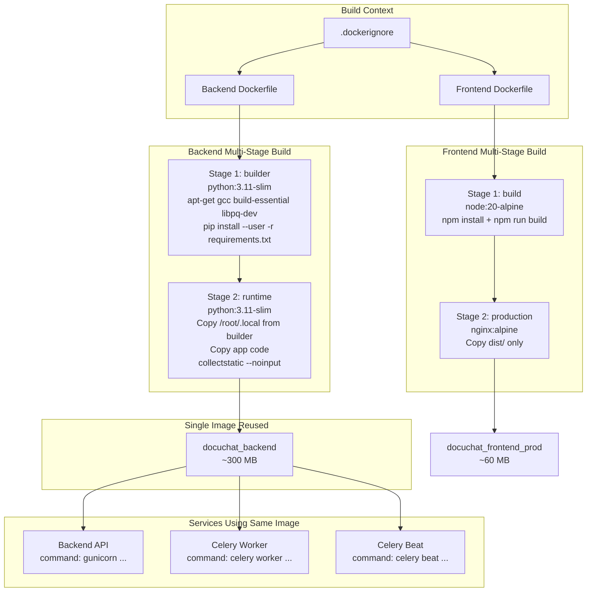

# Docker Image Optimization Plan for DocuChat

## 1. Current State Analysis

### Current Dockerfiles & Estimated Image Sizes

| Service | Base Image | Est. Current Size | Issues |
|---------|-----------|-------------------|--------|
| **Backend** | `python:3.11-slim` | ~500-700 MB | Single-stage build, includes build tools, dev dependencies, no layer cleanup |
| **Frontend** | `node:20-alpine` | ~400-500 MB | Single-stage dev image, includes full node_modules, source code, dev dependencies |
| **Nginx** | `nginx:alpine` | ~30-50 MB | Reasonably small, minimal optimization needed |
| **Celery Worker** | (same as backend) | ~500-700 MB | Shares backend image, same issues |
| **Celery Beat** | (same as backend) | ~500-700 MB | Shares backend image, same issues |

**Estimated Total: ~2-2.5 GB** (across all images)

---

## 2. Optimization Strategies

### Strategy A: Multi-Stage Build for Backend (HIGH Impact)

#### Backend (`docker/backend/Dockerfile`)

**Current Problems:**
- Single stage: all build tools, pip cache, and source code in final image
- Dev dependencies (`pytest`, `pytest-django`, `pytest-cov`) installed in production image
- `boto3` dependency included even if not used (S3 storage)
- No `.dockerignore` to exclude unnecessary files
- No `collectstatic` step — static files not collected during build

**Proposed Solution — Multi-Stage Build:**

```
Stage 1 (builder):
  - python:3.11-slim
  - apt-get update && apt-get install -y gcc build-essential libpq-dev
    (build tools needed for compiling Python packages like psycopg2, PyMuPDF, etc.)
  - Install Python packages via pip install --user
  - Clean apt cache after install

Stage 2 (runtime):
  - python:3.11-slim (clean)
  - Copy only installed packages from builder (no build tools)
  - Copy application code
  - Run python manage.py collectstatic --noinput
  - No build tools, no pip cache, no dev dependencies
```

**Estimated Reduction: ~500-700 MB → ~250-350 MB** (45-50% reduction)

---

### Strategy B: Frontend Production Build (MEDIUM Impact)

#### Frontend (`docker/frontend/Dockerfile`)

**Current Problems:**
- Currently a **development** image (runs `npm run dev`), not production
- Includes full `node_modules` (~200-300 MB)
- Includes dev dependencies (`@testing-library/*`, `vitest`, `eslint`, etc.)
- Source code copied directly (not just the built `dist/`)

**Proposed Solution — Production Multi-Stage Build:**

```
Stage 1 (build):
  - node:20-alpine
  - Install ALL npm dependencies
  - Run `npm run build` to generate dist/

Stage 2 (production):
  - nginx:alpine
  - Copy only dist/ from builder
  - No node_modules, no source code, no dev tools
```

**Note:** The current frontend container runs `npm run dev` for development. For production, the built static files are served by Nginx. We should:
1. Keep the dev Dockerfile as-is for development
2. Create a production build stage that outputs only `dist/`
3. The Nginx container already mounts `./src/frontend/dist:/usr/share/nginx/html`

**Estimated Reduction (production build): ~400-500 MB → ~50-80 MB** (80-85% reduction)

---

### Strategy C: Base Image Optimization (MEDIUM Impact)

| Current Base | Proposed Base | Savings | Risk |
|-------------|--------------|---------|------|
| `python:3.11-slim` (~120 MB) | `python:3.11-alpine` (~50 MB) | ~70 MB | PyMuPDF may need compilation; psycopg2-binary may need libpq |
| `node:20-alpine` (~120 MB) | Already Alpine | — | Already optimal |
| `nginx:alpine` (~25 MB) | Already Alpine | — | Already optimal |

**Recommendation:** Keep `python:3.11-slim` — Alpine adds complexity with C extensions (PyMuPDF, psycopg2). The slim variant is a good balance.

---

### Strategy D: Dependency Optimization (MEDIUM Impact)

#### Backend (`requirements.txt`)

| Package | Size Impact | Notes |
|---------|------------|-------|
| `boto3>=1.34.0` | ~30-40 MB | Only needed if using S3 storage. Make optional. |
| `pytest`, `pytest-django`, `pytest-cov` | ~15-20 MB | Dev-only. Move to separate `requirements-dev.txt`. |
| `drf-yasg==1.21.7` | ~5-10 MB | Swagger docs. Consider if needed in production. |
| `python-magic>=0.4.27` | ~2-5 MB | File type detection. Keep. |
| `PyMuPDF>=1.23.0` | ~30-50 MB | Large due to compiled binaries. Keep (essential). |

**Proposed Changes:**
1. Split `requirements.txt` into:
   - `requirements.txt` — production dependencies only
   - `requirements-dev.txt` — dev dependencies (pytest, etc.)
2. Make `boto3` optional (conditional import or separate requirements file for S3)
3. Consider `drf-spectacular` as a lighter alternative to `drf-yasg` (optional)

**Estimated Reduction: ~50-70 MB**

#### Frontend (`package.json`)

| Package | Size Impact | Notes |
|---------|------------|-------|
| `@testing-library/*` | ~5-10 MB | Dev-only. Already in devDependencies ✓ |
| `vitest`, `@vitest/coverage-v8` | ~15-20 MB | Dev-only. Already in devDependencies ✓ |
| `eslint`, plugins | ~10-15 MB | Dev-only. Already in devDependencies ✓ |
| `jsdom` | ~10-15 MB | Dev-only. Already in devDependencies ✓ |

**Status:** Dev dependencies are already correctly separated in `devDependencies`. No changes needed.

---

### Strategy E: Layer Optimization (LOW Impact, but Good Practice)

#### Backend Dockerfile Improvements:

1. **Combine RUN commands** to reduce layers:
   ```dockerfile
   RUN pip install -r requirements.txt && \
       rm -rf /root/.cache/pip && \
       find /root/.local -name "*.pyc" -delete
   ```

2. **Add `.dockerignore`** to prevent context bloat

3. **Use `--no-install-recommends`** for apt packages

---

### Strategy F: Celery Services Reuse Backend Image (No Separate Build)

**Current Problem:** Celery Worker and Celery Beat each build their own image from the same Dockerfile, duplicating the Python + dependencies layer (~600 MB each).

**Proposed Solution (Simplified):**
- Do NOT create a separate base image
- Do NOT build separate images for Celery services
- In [`docker-compose.yml`](docker-compose.yml), set Celery Worker and Celery Beat to use `image: docuchat_backend` (the same image built for the backend service)
- Only change the `command` for each service:
  - Celery Worker: `celery -A config worker --loglevel=info --concurrency=4`
  - Celery Beat: `celery -A config beat --loglevel=info`

This eliminates 2 redundant image builds entirely.

**Estimated Reduction: ~1.2 GB eliminated** (2 × ~600 MB no longer built separately)

---

## 3. Summary of Estimated Reductions

| Service | Current (est.) | Optimized (est.) | Reduction |
|---------|---------------|------------------|-----------|
| Backend | ~600 MB | ~300 MB | **~50%** |
| Celery Worker | ~600 MB | **0 MB** (reuses backend image) | **100%** |
| Celery Beat | ~600 MB | **0 MB** (reuses backend image) | **100%** |
| Frontend (dev) | ~450 MB | ~450 MB (no change) | **0%** |
| Frontend (prod build) | N/A | ~60 MB | **New** |
| Nginx | ~35 MB | ~35 MB | **0%** |
| **Total (all services)** | **~2.5 GB** | **~850 MB** | **~66%** |
| **Total (unique images)** | **~1.7 GB** | **~450 MB** | **~74%** |

---

## 4. Implementation Plan

### Step 1: Add `.dockerignore` File
Create a root `.dockerignore` to exclude unnecessary files from Docker build context.

### Step 2: Split Dev Dependencies
Create `requirements-dev.txt` with pytest packages, remove them from `requirements.txt`.

### Step 3: Optimize Backend Dockerfile (Multi-Stage)
- **Stage 1 (builder):** Install `gcc`, `build-essential`, `libpq-dev` via apt, then install Python packages via `pip install --user`
- **Stage 2 (runtime):** Copy only `/root/.local` from builder, copy app code, run `collectstatic --noinput`
- Clean pip cache and pyc files in final image

### Step 4: Optimize Frontend Dockerfile (Production)
- Add a production build stage
- Keep existing dev Dockerfile for development workflow
- Production stage outputs only `dist/` served by Nginx

### Step 5: Update `docker-compose.yml`
- Celery Worker: add `image: docuchat_backend` and change `build` to reference the backend build
- Celery Beat: same approach — reuse `docuchat_backend` image
- Remove duplicate build sections for Celery services

### Step 6: Test & Verify
- Build all images and verify sizes
- Run full test suite
- Verify all services work correctly

---

## 5. Mermaid Diagram — Proposed Build Architecture



---

## 6. Detailed File Changes

### 6.1 `.dockerignore` (New File — Root Level)

```
# Git
.git/
.gitignore

# Python
**/__pycache__/
**/*.py[cod]
**/*$py.class
**/*.so
**/.pytest_cache/
**/.coverage
**/htmlcov/
**/.tox/
**/*.egg-info/
**/*.egg
**/venv/
**/.venv/
**/env/

# Node
**/node_modules/
**/.npm/

# IDE
**/.vscode/
**/.idea/
**/*.swp
**/*.swo
*~

# OS
**/.DS_Store
**/Thumbs.db

# Environment
**/.env
**/.env.*

# Logs
**/*.log
**/logs/

# Docker
**/docker-compose*.yml
**/Dockerfile
**/.dockerignore

# Build artifacts
**/dist/
**/build/
**/staticfiles/
**/media/
```

### 6.2 `requirements-dev.txt` (New File)

```
# Testing
pytest==7.4.4
pytest-django==4.7.0
pytest-cov==4.1.0
```

### 6.3 Updated `src/backend/requirements.txt`

Remove the 3 pytest lines (they move to `requirements-dev.txt`):

```diff
- # Development & Testing
- pytest==7.4.4
- pytest-django==4.7.0
- pytest-cov==4.1.0
```

### 6.4 Updated `docker/backend/Dockerfile`

```dockerfile
# ============================================================
# Stage 1: Builder — Install dependencies with build tools
# ============================================================
FROM python:3.11-slim AS builder

ENV PYTHONDONTWRITEBYTECODE=1 \
    PYTHONUNBUFFERED=1 \
    PIP_DEFAULT_TIMEOUT=100 \
    PIP_NO_CACHE_DIR=1

ARG PIP_INDEX_URL=https://package-mirror.liara.ir/repository/pypi/simple
ARG PIP_EXTRA_INDEX_URL=https://pypi.org/simple

# Install build tools needed for compiling Python C extensions
# (psycopg2-binary, PyMuPDF, etc.)
RUN apt-get update && \
    apt-get install -y --no-install-recommends \
        gcc \
        build-essential \
        libpq-dev && \
    rm -rf /var/lib/apt/lists/*

# Configure pip mirrors
RUN pip config set global.index-url ${PIP_INDEX_URL} && \
    pip config set global.extra-index-url ${PIP_EXTRA_INDEX_URL} && \
    pip config set global.trusted-host package-mirror.liara.ir && \
    pip config set global.trusted-host pypi.org && \
    pip config set global.trusted-host files.pythonhosted.org && \
    pip config set global.timeout 60 && \
    pip config set global.retries 5

# Copy and install production dependencies only
COPY src/backend/requirements.txt /tmp/requirements.txt
RUN pip install --user -r /tmp/requirements.txt && \
    rm -rf /root/.cache/pip

# ============================================================
# Stage 2: Runtime — Minimal production image
# ============================================================
FROM python:3.11-slim AS runtime

ENV PYTHONDONTWRITEBYTECODE=1 \
    PYTHONUNBUFFERED=1 \
    PATH="/root/.local/bin:$PATH"

# Copy only installed packages from builder (no build tools, no apt cache)
COPY --from=builder /root/.local /root/.local

WORKDIR /app
COPY src/backend /app/

# Collect static files and clean up
RUN mkdir -p /app/static /app/media && \
    python manage.py collectstatic --noinput && \
    find /root/.local -name "*.pyc" -delete

EXPOSE 8000
CMD ["gunicorn", "config.wsgi:application", "--bind", "0.0.0.0:8000", "--workers", "3"]
```

### 6.5 Updated `docker/frontend/Dockerfile` (Production Multi-Stage)

```dockerfile
# ============================================================
# Stage 1: Build — Compile frontend assets
# ============================================================
FROM docker.arvancloud.ir/library/node:20-alpine AS builder

WORKDIR /app
COPY src/frontend/package*.json ./

RUN npm config set registry https://package-mirror.liara.ir/repository/npm && \
    npm install --no-audit --no-fund --legacy-peer-deps

COPY src/frontend/ .
RUN npm run build

# ============================================================
# Stage 2: Production — Serve with Nginx
# ============================================================
FROM nginx:alpine

RUN rm /etc/nginx/conf.d/default.conf
COPY docker/nginx/nginx.conf /etc/nginx/nginx.conf
COPY --from=builder /app/dist /usr/share/nginx/html

RUN mkdir -p /etc/nginx/ssl /static /media

EXPOSE 80 443

HEALTHCHECK --interval=30s --timeout=10s --start-period=5s --retries=3 \
  CMD wget -q --spider http://localhost/health/ || exit 1

CMD ["nginx", "-g", "daemon off;"]
```

### 6.6 Updated `docker-compose.yml` — Celery Services

Change Celery Worker and Celery Beat to reuse the backend image instead of building separately:

```yaml
  celery_worker:
    image: docuchat_backend
    build:
      context: .
      dockerfile: ./docker/backend/Dockerfile
    container_name: docuchat_celery_worker
    restart: unless-stopped
    depends_on:
      postgres:
        condition: service_healthy
      redis:
        condition: service_healthy
    environment:
      # ... same environment variables as before ...
    volumes:
      - ./src/backend:/app
      - backend_media:/app/media
    command: celery -A config worker --loglevel=info --concurrency=4
    networks:
      - docuchat_network

  celery_beat:
    image: docuchat_backend
    build:
      context: .
      dockerfile: ./docker/backend/Dockerfile
    container_name: docuchat_celery_beat
    restart: unless-stopped
    depends_on:
      postgres:
        condition: service_healthy
      redis:
        condition: service_healthy
    environment:
      # ... same environment variables as before ...
    volumes:
      - ./src/backend:/app
    command: celery -A config beat --loglevel=info
    networks:
      - docuchat_network
```

**Key changes:**
- Added `image: docuchat_backend` to both Celery services
- Added `build:` pointing to the same backend Dockerfile (so `docker-compose build` builds it once)
- Changed `command:` to run Celery instead of Gunicorn
- Removed duplicate environment variables (they can be inherited or kept as-is)

---

## 7. Quick Wins (Can Be Done Immediately)

1. **Add `.dockerignore`** — prevents sending unnecessary files to Docker daemon (faster builds)
2. **Remove dev dependencies from production** — split `requirements-dev.txt`
3. **Clean pip cache** in the same RUN layer as `pip install`
4. **Delete `.pyc` files** in the final image

These 4 changes alone can reduce the backend image by **~100-150 MB** with minimal effort.

---

## 8. Verification Steps

After implementing changes, verify with:

```bash
# Build all images (backend builds once, Celery reuses it)
docker-compose build

# Check image sizes
docker images docuchat_backend docuchat_nginx

# Verify only 1 backend image exists (not 3)
docker images | grep docuchat

# Run tests
docker-compose --profile test run test

# Start services and verify
docker-compose up -d
docker-compose logs
```

---

## 9. Summary of User-Requested Corrections (Applied ✓)

| # | Correction | Status |
|---|-----------|--------|
| 1 | Add `apt-get install -y gcc build-essential libpq-dev` in Stage 1 of backend Dockerfile | ✅ Applied in section 6.4 |
| 2 | Add `python manage.py collectstatic --noinput` in Stage 2 of backend Dockerfile | ✅ Applied in section 6.4 |
| 3 | Ensure `gunicorn` is installed (already in `requirements.txt`) | ✅ Confirmed — `gunicorn==21.2.0` is in requirements.txt |
| 4 | Celery Worker/Beat reuse backend image via `image: docuchat_backend` instead of separate builds | ✅ Applied in section 6.6, Strategy F updated |
