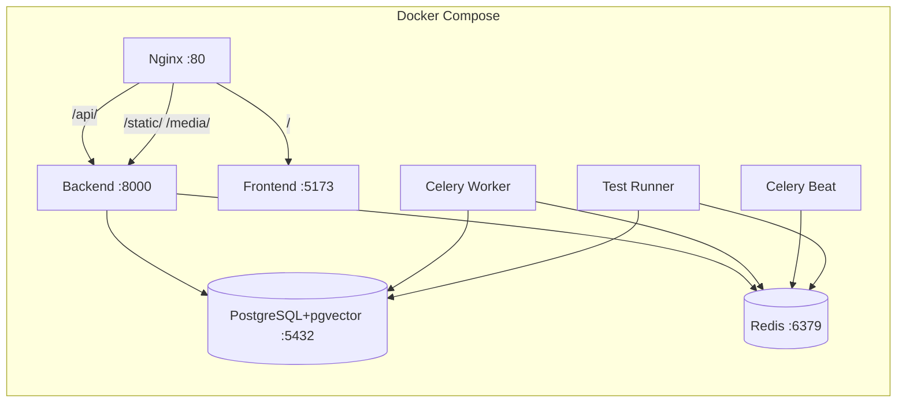

# E01 — Project Scaffolding & DevOps: Code Review Report

## Overview

This report analyzes the Epic E01 implementation covering:
- Docker Compose orchestration (PostgreSQL+pgvector, Redis, Django, Celery, Nginx, Frontend)
- Dockerfiles (backend, frontend, nginx)
- Nginx reverse proxy configuration
- Django settings, Celery configuration, URL routing
- Health check views
- CI pipeline (GitHub Actions)
- Environment configuration (.env.example)
- Test configuration (pytest.ini, conftest.py)

## Architecture Diagram



## Findings

### Critical Issues

#### 1. CI Only Runs `tests/`, Not All Test Paths
**File:** [`.github/workflows/ci.yml:108`](../.github/workflows/ci.yml:108)

```yaml
python -m pytest tests/ -v --cov=. --cov-report=xml
```

The CI runs `pytest tests/` which only covers `src/backend/tests/`. However, [`pytest.ini`](../src/backend/pytest.ini:3-7) specifies multiple test paths:

```ini
testpaths =
    conversations/tests
    documents/tests
    users/tests
    tests/
```

**Impact:** CI does not run tests from `conversations/tests/`, `documents/tests/`, or `users/tests/`. The green CI checkmark is misleading.

**Fix:** Change to `python -m pytest` (without path) to use pytest.ini's testpaths, or explicitly list all directories.

---

#### 2. Duplicate Health Check Views — Dead Code in `config/views.py`
**Files:** [`src/backend/config/views.py`](../src/backend/config/views.py:1) and [`src/backend/core/views.py`](../src/backend/core/views.py:1)

Two separate implementations of `HealthCheckView`, `ReadyCheckView`, `LiveCheckView`:

| Feature | `config/views.py` | `core/views.py` |
|---------|-------------------|-----------------|
| HealthCheckView | Checks DB + Redis + Celery, returns 200/503 | Returns static `{"status": "ok"}` |
| ReadyCheckView | Returns `{"status": "ready"}` | Returns `{"status": "ready"}` |
| LiveCheckView | Returns `{"status": "alive"}` | Returns `{"status": "alive"}` |

[`config/urls.py:23`](../src/backend/config/urls.py:23) imports from `core.views`, so `config/views.py` is **dead code**. The comprehensive health check logic is orphaned.

**Fix:** Delete `config/views.py` and merge its comprehensive health check logic into `core/views.py`.

---

### Medium Issues

#### 3. Celery Broker & Result Backend Both Read `REDIS_URL`
**File:** [`src/backend/config/settings.py:228-229`](../src/backend/config/settings.py:228)

```python
CELERY_BROKER_URL = env('REDIS_URL', default='redis://localhost:6379/0')
CELERY_RESULT_BACKEND = env('REDIS_URL', default='redis://localhost:6379/1')
```

Both read from the same `REDIS_URL` env var. If `REDIS_URL` is set to `redis://redis:6379/0` (as in docker-compose.yml), both broker and result backend point to the same Redis DB `/0`.

Additionally, `docker-compose.yml` defines `CELERY_BROKER_URL` and `CELERY_RESULT_BACKEND` env vars (lines 101-102), but `settings.py` ignores them in favor of `REDIS_URL`.

**Fix:** Read `CELERY_BROKER_URL` and `CELERY_RESULT_BACKEND` env vars separately, with `REDIS_URL` as fallback.

---

#### 4. CI `cache-dependency-path` Points to Non-Existent Lock File
**File:** [`.github/workflows/ci.yml:128`](../.github/workflows/ci.yml:128)

```yaml
cache-dependency-path: src/frontend/package-lock.json
```

The frontend Dockerfile explicitly removes `package-lock.json`. If it doesn't exist in the repo, the cache never hits.

**Fix:** Use `src/frontend/package.json` instead.

---

#### 5. CI Build Args Passed But Dockerfiles Don't Accept ARGs
**File:** [`.github/workflows/ci.yml:189-195`](../.github/workflows/ci.yml:189)

```yaml
docker build \
  --build-arg PIP_INDEX_URL=${{ env.PIP_INDEX_URL }} \
  --build-arg PIP_EXTRA_INDEX_URL=${{ env.PIP_EXTRA_INDEX_URL }} \
  .
```

The backend [`Dockerfile`](../docker/backend/Dockerfile) has no `ARG PIP_INDEX_URL` or `ARG PIP_EXTRA_INDEX_URL` declarations. Same for frontend Dockerfile with `NPM_CONFIG_REGISTRY`.

**Fix:** Add `ARG` declarations to both Dockerfiles and use them in the pip/npm config commands.

---

#### 6. Nginx Health Check `add_header` After `return`
**File:** [`docker/nginx/nginx.conf:88-92`](../docker/nginx/nginx.conf:88)

```nginx
location /health/ {
    access_log off;
    return 200 "healthy\n";
    add_header Content-Type text/plain;
}
```

`return` executes before `add_header`, so `Content-Type` is never set.

**Fix:** Move `add_header` before `return`.

---

### Low Issues

#### 7. `datetime.utcnow()` Deprecated
**Files:** [`config/views.py:26`](../src/backend/config/views.py:26), [`core/views.py:20`](../src/backend/core/views.py:20), and 4 more locations

`datetime.utcnow()` is deprecated in Python 3.12+. Replace with `datetime.now(timezone.utc)`.

---

#### 8. Frontend Dockerfile Wasted Registry Config Layer
**File:** [`docker/frontend/Dockerfile:8-20`](../docker/frontend/Dockerfile:8)

First RUN sets registry to `package-mirror.liara.ir`, second RUN overrides to `mirror2.chabokan.net`. First layer is wasted.

**Fix:** Consolidate into a single RUN with the final registry.

---

#### 9. `celery_worker` Unnecessary Dependency on `backend`
**File:** [`docker-compose.yml:130`](../docker-compose.yml:130)

```yaml
celery_worker:
    depends_on:
      - postgres
      - redis
      - backend
```

Worker only needs PostgreSQL and Redis, not the backend HTTP server.

**Fix:** Remove `backend` from `celery_worker.depends_on`.

---

#### 10. `celery_beat` Missing Environment Variables
**File:** [`docker-compose.yml:163-183`](../docker-compose.yml:163)

`celery_beat` is missing: `OPENAI_API_KEY`, `GOOGLE_API_KEY`, `CHAT_PROVIDER`, `EMBEDDING_PROVIDER`, `EMBEDDING_DIMENSION`, etc.

**Fix:** Sync environment variables between `celery_worker` and `celery_beat`.

---

#### 11. `conftest.py` Lacks Shared Test Fixtures
**File:** [`src/backend/conftest.py`](../src/backend/conftest.py:1)

Only sets `DJANGO_SETTINGS_MODULE`. No shared fixtures like `api_client`, `user`, `auth_headers`.

**Fix:** Add common fixtures used across test modules.

---

#### 12. Nginx `proxy_pass` Trailing Slash Inconsistency Undocumented
**File:** [`docker/nginx/nginx.conf:98,130`](../docker/nginx/nginx.conf:98)

`/api/` uses `proxy_pass http://backend/` (with trailing slash, strips `/api` prefix), while `/admin/` uses `proxy_pass http://backend` (no trailing slash, passes `/admin` through).

**Fix:** Add comments explaining the intentional difference.

---

## Refactoring Plan

### Priority 1 — Critical (Must Fix)

| # | Task | Files | Description |
|---|------|-------|-------------|
| 1.1 | Fix CI test command | `.github/workflows/ci.yml:108` | Change `pytest tests/` to `pytest` to use pytest.ini test paths |
| 1.2 | Merge health check views | `config/views.py`, `core/views.py`, `config/urls.py` | Delete `config/views.py`, merge comprehensive health check into `core/views.py` |

### Priority 2 — Medium (Should Fix)

| # | Task | Files | Description |
|---|------|-------|-------------|
| 2.1 | Fix Celery Redis DB separation | `config/settings.py:228-229` | Read `CELERY_BROKER_URL` and `CELERY_RESULT_BACKEND` env vars separately |
| 2.2 | Fix CI cache key | `.github/workflows/ci.yml:128` | Use `package.json` instead of `package-lock.json` |
| 2.3 | Add ARG declarations to Dockerfiles | `docker/backend/Dockerfile`, `docker/frontend/Dockerfile` | Add `ARG` for mirror URLs and use them in config commands |
| 2.4 | Fix Nginx health check header | `docker/nginx/nginx.conf:88-92` | Move `add_header` before `return` |

### Priority 3 — Low (Nice to Have)

| # | Task | Files | Description |
|---|------|-------|-------------|
| 3.1 | Replace `datetime.utcnow()` | `config/views.py`, `core/views.py` | Use `datetime.now(timezone.utc)` in all 6 locations |
| 3.2 | Consolidate frontend Dockerfile | `docker/frontend/Dockerfile:8-20` | Single RUN for registry config |
| 3.3 | Remove backend dependency from worker | `docker-compose.yml:130` | Only depend on postgres and redis |
| 3.4 | Sync celery_beat env vars | `docker-compose.yml:163-183` | Add missing env vars to celery_beat |
| 3.5 | Add shared test fixtures | `conftest.py` | Add api_client, user, auth_headers fixtures |
| 3.6 | Document Nginx trailing slash | `docker/nginx/nginx.conf:98,130` | Add comments explaining proxy_pass behavior |
