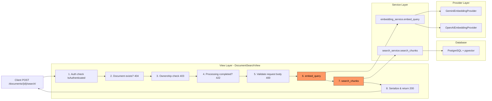

# E06 Semantic Search & Retrieval — Code Review & Refactoring Plan

## Epic Scope

| Code | Title | Description |
|------|-------|-------------|
| E06 | Semantic Search & Retrieval | Vector similarity search endpoint, relevance scoring, top-k retrieval, metadata filtering |

## Files Reviewed

| File | Role |
|------|------|
| [`src/backend/documents/services/search_service.py`](../src/backend/documents/services/search_service.py) | Core search logic — pgvector cosine similarity |
| [`src/backend/documents/views.py`](../src/backend/documents/views.py) (lines 613–703) | `DocumentSearchView` — HTTP endpoint |
| [`src/backend/documents/serializers.py`](../src/backend/documents/serializers.py) (lines 195–283) | `SearchRequestSerializer`, `SearchResultSerializer`, `SearchResponseSerializer` |
| [`src/backend/documents/services/embedding_service.py`](../src/backend/documents/services/embedding_service.py) | `embed_query()` — query vectorization |
| [`src/backend/providers/gemini_embedding.py`](../src/backend/providers/gemini_embedding.py) | Gemini `embed_query()` — raises on failure |
| [`src/backend/providers/openai_embedding.py`](../src/backend/providers/openai_embedding.py) | OpenAI `embed_query()` — raises on failure |
| [`src/backend/conversations/rag_service.py`](../src/backend/conversations/rag_service.py) | Consumer of `search_chunks()` |
| [`src/backend/documents/tests/test_search_service.py`](../src/backend/documents/tests/test_search_service.py) | Unit tests for `search_chunks()` |
| [`src/backend/documents/tests/test_search_integration.py`](../src/backend/documents/tests/test_search_integration.py) | Integration test for full pipeline |
| [`src/backend/documents/tests/test_views.py`](../src/backend/documents/tests/test_views.py) (lines 910–1057) | View tests for `DocumentSearchView` |
| [`src/backend/documents/urls.py`](../src/backend/documents/urls.py) | URL routing |

---

## 1. Overall Assessment

**The code is well-structured, clean, and follows the project's established patterns.** The separation of concerns is good:

- **View layer** (`DocumentSearchView`) handles HTTP concerns (auth, ownership, status checks)
- **Service layer** (`search_chunks`) is pure business logic with no HTTP dependency
- **Provider layer** (`GeminiEmbeddingProvider`/`OpenAIEmbeddingProvider`) abstracts external API calls

Test coverage is **excellent** — 5 unit tests for `search_chunks`, 7 view tests for `DocumentSearchView`, and 1 integration test covering the full pipeline.

---

## 2. Detailed Findings

### 2.1. `search_chunks()` — Core Search Logic ✅

**File:** [`src/backend/documents/services/search_service.py`](../src/backend/documents/services/search_service.py)

**Strengths:**
- Clean, single-responsibility function
- Proper use of pgvector's `CosineDistance` annotation
- `_set_probes()` is well-encapsulated
- Results are properly typed (`list[dict[str, Any]]`)
- Logging is informative

**Issues Found:**

#### Issue #1: `_set_probes()` — Raw SQL without error handling ⚠️

```python
def _set_probes(probes: int | None = None) -> None:
    probes = probes if probes is not None else settings.VECTOR_SEARCH_PROBES
    with connection.cursor() as cursor:
        cursor.execute("SET ivfflat.probes = %s", [probes])
```

- **Risk:** If the database connection is broken or the `ivfflat` extension is not installed, this will raise an unhandled `OperationalError` or `ProgrammingError`.
- **Severity:** Low. This is a session-level setting and would only fail if the DB is misconfigured. However, the exception would bubble up uncaught to the view, resulting in a 500 error with no useful message.
- **Recommendation:** Wrap in a try/except and log a warning, falling back gracefully. The ivfflat index probe is a performance optimization, not a correctness requirement.

#### Issue #2: `search_chunks()` — No input validation for `query_vector` ⚠️

```python
def search_chunks(
    document_id: str,
    query_vector: list[float],
    top_k: int = 10,
    min_score: float = 0.0,
) -> list[dict[str, Any]]:
```

- **Risk:** If `query_vector` has the wrong dimension (e.g., 1536 instead of 768), pgvector will raise a `DataError` with an unhelpful message.
- **Severity:** Medium. This would only happen if the embedding provider returns a different dimension than expected, which would be a configuration error. But the error would be a 500 with no clear message.
- **Recommendation:** Add a dimension check against `settings.EMBEDDING_DIMENSION` with a clear error message.

#### Issue #3: `search_chunks()` — No `document_id` existence check ⚠️

- The function assumes the document exists (the view layer checks this). This is fine for the current architecture, but it's worth noting as a design consideration if `search_chunks` is ever called from outside the view layer (e.g., from `rag_service.py`).

### 2.2. `DocumentSearchView` — View Layer ✅

**File:** [`src/backend/documents/views.py`](../src/backend/documents/views.py) (lines 613–703)

**Strengths:**
- Clear step-by-step flow with numbered comments
- Proper error handling for all expected cases (404, 403, 422, 400, 500)
- Uses serializers for both request validation and response formatting
- Ownership check before processing status check (correct order)

**Issues Found:**

#### Issue #4: `EmbeddingError` catch is too narrow ⚠️

```python
try:
    query_vector = embed_query(query)
except EmbeddingError:
    logger.exception(...)
    return Response(
        {"error": "embedding_failed", "message": "Failed to generate query embedding."},
        status=status.HTTP_500_INTERNAL_SERVER_ERROR,
    )
```

- **Problem:** `embed_query()` in the embedding service layer catches no exceptions — it lets provider exceptions propagate. The providers raise `requests.exceptions.RequestException` (Gemini) or generic `Exception` (OpenAI), **not** `EmbeddingError`.
- **Consequence:** If the Gemini/OpenAI API call fails, the exception will **not** be caught by this handler. It will propagate up to DRF's exception handler, resulting in a generic 500 response with `{"detail": "..."}` instead of the structured `{"error": "embedding_failed", "message": "..."}` format.
- **Severity:** **High.** This is a real bug — the error response format is inconsistent with the documented API contract.
- **Root Cause:** `EmbeddingError` is defined in `embedding_service.py` but `embed_query()` in that same file does **not** raise it. The providers raise their own exceptions.

**Fix:** Either:
1. Wrap the `provider.embed_query(text)` call in `embedding_service.embed_query()` with a try/except that raises `EmbeddingError`, OR
2. Change the view to catch `Exception` instead of `EmbeddingError`

Option 1 is preferred (defense in depth at the service layer).

#### Issue #5: `embed_query()` in `embedding_service.py` has incomplete error handling ⚠️

```python
def embed_query(text: str) -> list[float]:
    if not text or not text.strip():
        raise ValueError("text must be non-empty")
    provider = get_embedding_provider()
    return provider.embed_query(text)
```

- **Problem:** The docstring says it raises `Exception`, but the calling code (`DocumentSearchView`) only catches `EmbeddingError`. This mismatch is the root cause of Issue #4.
- **Recommendation:** Wrap the provider call in a try/except that catches all exceptions and re-raises as `EmbeddingError`.

### 2.3. Serializers ✅

**File:** [`src/backend/documents/serializers.py`](../src/backend/documents/serializers.py) (lines 195–283)

**Strengths:**
- `SearchRequestSerializer` has proper validation (max_length, min/max values, defaults)
- `SearchResultSerializer` mirrors the dict returned by `search_chunks()` exactly
- `SearchResponseSerializer` wraps results with metadata
- All fields have `help_text` for documentation

**Issues Found:** None. These are clean and well-designed.

### 2.4. Test Coverage ✅

**Files:**
- [`src/backend/documents/tests/test_search_service.py`](../src/backend/documents/tests/test_search_service.py) — 6 tests
- [`src/backend/documents/tests/test_search_integration.py`](../src/backend/documents/tests/test_search_integration.py) — 1 test
- [`src/backend/documents/tests/test_views.py`](../src/backend/documents/tests/test_views.py) (lines 910–1057) — 7 tests

**Strengths:**
- Tests cover all error paths: 401, 404, 403, 422, 400
- Happy path tested with mocked `embed_query` and `search_chunks`
- Integration test runs against real pgvector
- `search_chunks` unit tests verify ordering, filtering, empty results, and probe setting

**Missing Tests:**
- No test for the `EmbeddingError` → 500 path (because of Issue #4, this path is actually unreachable)
- No test for `_set_probes()` failure (DB connection error)
- No test for `search_chunks` with wrong-dimension query vector

### 2.5. `rag_service.py` — Consumer of `search_chunks()` ✅

**File:** [`src/backend/conversations/rag_service.py`](../src/backend/conversations/rag_service.py)

- Wraps `embed_query()` and `search_chunks()` in try/except blocks that raise `RAGServiceException`
- This is correct and provides proper error isolation
- No issues here

---

## 3. Summary of Issues

| # | File | Severity | Description |
|---|------|----------|-------------|
| 1 | `search_service.py:41` | Low | `_set_probes()` raw SQL has no error handling |
| 2 | `search_service.py:45` | Medium | `search_chunks()` doesn't validate `query_vector` dimension |
| 3 | `embedding_service.py:72` | **High** | `embed_query()` doesn't wrap provider exceptions in `EmbeddingError` |
| 4 | `views.py:674` | **High** | `DocumentSearchView` catches `EmbeddingError` but it's never raised (consequence of #3) |
| 5 | `test_views.py` | Low | No test for the embedding failure → 500 path |

---

## 4. Refactoring Plan

### Priority 1: Fix the `EmbeddingError` Bug (Issues #3, #4)

**File:** [`src/backend/documents/services/embedding_service.py`](../src/backend/documents/services/embedding_service.py)

Wrap the provider call in `embed_query()` with a try/except:

```python
def embed_query(text: str) -> list[float]:
    if not text or not text.strip():
        raise ValueError("text must be non-empty")
    provider = get_embedding_provider()
    try:
        return provider.embed_query(text)
    except Exception as e:
        logger.exception("embed_query failed for text: %s...", text[:50])
        raise EmbeddingError(f"Failed to embed query: {e}") from e
```

This ensures:
- `DocumentSearchView`'s `except EmbeddingError` handler actually works
- `rag_service.py`'s `except Exception` in `run_rag_query()` still catches it (since `EmbeddingError` inherits from `Exception`)
- Consistent error response format

### Priority 2: Add `_set_probes()` Error Handling (Issue #1)

**File:** [`src/backend/documents/services/search_service.py`](../src/backend/documents/services/search_service.py)

```python
def _set_probes(probes: int | None = None) -> None:
    probes = probes if probes is not None else settings.VECTOR_SEARCH_PROBES
    try:
        with connection.cursor() as cursor:
            cursor.execute("SET ivfflat.probes = %s", [probes])
    except Exception as e:
        logger.warning("Failed to set ivfflat.probes=%d: %s", probes, e)
```

### Priority 3: Add `query_vector` Dimension Validation (Issue #2)

**File:** [`src/backend/documents/services/search_service.py`](../src/backend/documents/services/search_service.py)

```python
from django.conf import settings

def search_chunks(...):
    _set_probes()
    
    # Validate query vector dimension
    expected_dim = settings.EMBEDDING_DIMENSION
    if len(query_vector) != expected_dim:
        raise ValueError(
            f"query_vector dimension {len(query_vector)} does not match "
            f"expected dimension {expected_dim}"
        )
    
    # ... rest of function
```

Note: This would change the function's exception contract. The view layer would need to catch `ValueError` and return a 500. Alternatively, log a warning and let pgvector raise its own error (which would be caught by DRF's exception handler).

### Priority 4: Add Missing Test (Issue #5)

**File:** [`src/backend/documents/tests/test_views.py`](../src/backend/documents/tests/test_views.py)

Add a test that verifies the 500 response when `embed_query` raises an exception:

```python
@patch("documents.views.embed_query")
def test_search_embedding_failure_returns_500(self, mock_embed_query):
    """When embed_query raises EmbeddingError, the view should return 500."""
    from documents.services.embedding_service import EmbeddingError
    mock_embed_query.side_effect = EmbeddingError("API failure")
    
    response = self.client.post(
        self.url, {"query": "test"}, format="json", **_auth_header(self.user)
    )
    self.assertEqual(response.status_code, status.HTTP_500_INTERNAL_SERVER_ERROR)
    self.assertEqual(response.data["error"], "embedding_failed")
```

---

## 5. Architecture Diagram



**Red-highlighted boxes** indicate the areas where issues were found.

---

## 6. Conclusion

The E06 Semantic Search & Retrieval implementation is **well-architected and thoroughly tested**. The main issue is a **real bug** in the error handling chain: `DocumentSearchView` catches `EmbeddingError` but `embed_query()` never raises it, meaning embedding failures result in generic 500 errors instead of structured responses.

The other issues are minor improvements (error handling for edge cases, missing tests) that would make the code more robust.

**Total refactoring effort:** ~30 minutes for all 4 items.
