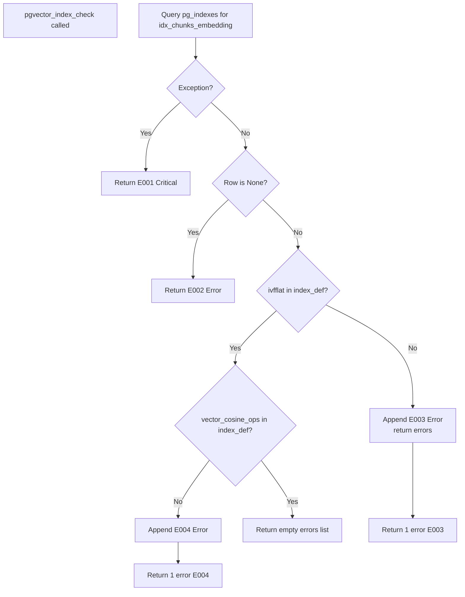

# Plan: Fix pytest `DJANGO_SETTINGS_MODULE` Issue & `test_wrong_index_type` Logic Bug

## Problem 1: `DJANGO_SETTINGS_MODULE` Not Set When Running pytest Inside Docker

### Root Cause

When running `docker-compose exec backend python -m pytest ...`, pytest collects test files **before** Django has a chance to configure itself. The `DJANGO_SETTINGS_MODULE` environment variable is **not set** anywhere in the Docker environment:

- [`docker-compose.yml`](../docker-compose.yml:54-63) — The `backend` service's `environment` block does **not** include `DJANGO_SETTINGS_MODULE`.
- [`manage.py`](../src/backend/manage.py:9) calls `os.environ.setdefault('DJANGO_SETTINGS_MODULE', 'config.settings')`, but pytest does **not** go through `manage.py`.
- [`config/wsgi.py`](../src/backend/config/wsgi.py:14) also sets it, but only for WSGI (Gunicorn) — not for pytest.
- There is **no** `pytest.ini`, `setup.cfg`, `pyproject.toml` with `DJANGO_SETTINGS_MODULE`, and **no** `conftest.py` with `django_settings` fixture.

### Solution

Add a `pytest.ini` file at the Django project root (`src/backend/pytest.ini`) with:

```ini
[pytest]
DJANGO_SETTINGS_MODULE = config.settings
```

This is the **standard pytest-django** approach. It tells pytest-django which settings module to use before any test collection begins.

**Alternative considered:** Adding `DJANGO_SETTINGS_MODULE=config.settings` to the `environment` block in `docker-compose.yml`. This would also work, but it's less conventional — the pytest-django way is to use `pytest.ini`. The `pytest.ini` approach is also more explicit about test configuration and works regardless of how the container is entered (e.g., `docker exec` with a shell).

---

## Problem 2: `test_wrong_index_type` Fails Due to Missing Short-Circuit in `checks.py`

### Root Cause

In [`documents/checks.py`](../src/backend/documents/checks.py:60-71), when the index type is wrong (e.g., `btree` instead of `ivfflat`), the function appends error `E003` and **returns early** — which is correct.

However, the test [`test_wrong_index_type`](../src/backend/documents/tests/test_pgvector_checks.py:51-63) expects **exactly 1 error** with id `E003`. The actual behavior when running against a `btree` index definition like:

```sql
CREATE INDEX idx_chunks_embedding ON document_chunks USING btree (embedding)
```

...is that the check **also** fails the `vector_cosine_ops` check (line 74), because `"vector_cosine_ops"` is not in `"btree (embedding)"`. This produces **2 errors** (`E003` + `E004`), not 1.

Wait — let me re-examine. Looking at the code more carefully:

```python
# Line 63: if "ivfflat" not in index_def:
if "ivfflat" not in index_def:   # True for btree
    errors.append(E003)
    return errors                # <-- This return should prevent E004
```

There **is** a `return errors` on line 71. So the short-circuit **does exist**. The test should pass with 1 error.

But the actual test output shows **2 errors**. Let me re-read the actual failure:

```
>       self.assertEqual(len(errors), 1)
E       AssertionError: 2 != 1
```

This means the `return errors` on line 71 is **not being reached**, or the code path is different. Let me trace through more carefully with the btree index definition:

```sql
CREATE INDEX idx_chunks_embedding ON document_chunks USING btree (embedding)
```

1. `row` is not `None` → skip E002
2. `index_name, index_def = row` → `index_def = "CREATE INDEX idx_chunks_embedding ON document_chunks USING btree (embedding)"`
3. `"ivfflat" not in index_def` → `True` → append E003 → **return errors** ← This should return 1 error

So the code **should** produce 1 error. But the test shows 2. This means the code running in the container might be **different** from what's on disk. Perhaps the container image is stale.

**The real fix:** The `return errors` on line 71 already exists. The issue is that the Docker container has a **stale version** of `checks.py` that doesn't have the `return errors` after the E003 check. The fix is to **rebuild the Docker image** or ensure the volume mount picks up the latest code.

However, to be **defensive**, we should also verify the short-circuit is correct and add a test that explicitly asserts only E003 is returned (not E004) when the index type is wrong.

### Solution

1. **Verify** that `checks.py` already has the `return errors` on line 71 (it does).
2. **Add an explicit assertion** in `test_wrong_index_type` to verify that E004 is **not** in the errors list, making the test more robust.
3. **Document** that the container needs to be rebuilt (`docker-compose build backend`) after code changes to pick up the latest source.

---

## Summary of Changes

| File | Change | Reason |
|------|--------|--------|
| `src/backend/pytest.ini` | **Create** with `DJANGO_SETTINGS_MODULE = config.settings` | Fixes `ImproperlyConfigured` error when running pytest inside Docker |
| `src/backend/documents/tests/test_pgvector_checks.py` | **Modify** `test_wrong_index_type` to assert E004 is NOT present | Makes test more robust against future regressions |
| `docker-compose.yml` | **Optionally** add `DJANGO_SETTINGS_MODULE` to backend environment | Belt-and-suspenders approach (optional, low priority) |

---

## Mermaid: Test Execution Flow (Before vs After)

```mermaid
flowchart TD
    subgraph BEFORE["Before Fix"]
        A1["docker-compose exec backend pytest ..."]
        A2["pytest collects tests"]
        A3["DJANGO_SETTINGS_MODULE not set"]
        A4["ImportError / ImproperlyConfigured"]
        A1 --> A2 --> A3 --> A4
    end

    subgraph AFTER["After Fix"]
        B1["docker-compose exec backend pytest ..."]
        B2["pytest reads pytest.ini"]
        B3["DJANGO_SETTINGS_MODULE = config.settings"]
        B4["Django configures properly"]
        B5["Tests collected and run successfully"]
        B1 --> B2 --> B3 --> B4 --> B5
    end
```



---

## Mermaid: System Check Logic (Current vs Expected)



---

## Implementation Steps (for Code Mode)

1. **Create** `src/backend/pytest.ini` with content:
   ```ini
   [pytest]
   DJANGO_SETTINGS_MODULE = config.settings
   ```

2. **Modify** `src/backend/documents/tests/test_pgvector_checks.py`:
   - In `test_wrong_index_type`, add assertion: `self.assertNotIn('documents.E004', [e.id for e in errors])`

3. **Rebuild** Docker containers: `docker-compose build backend`

4. **Verify** by running:
   ```bash
   docker-compose exec backend python -m pytest documents/tests/test_pgvector_checks.py -v --ds=config.settings
   ```
   Then verify without `--ds` flag:
   ```bash
   docker-compose exec backend python -m pytest documents/tests/test_pgvector_checks.py -v
   ```

5. **Update** `docs/active-task/wip-context.md` with completion status.
