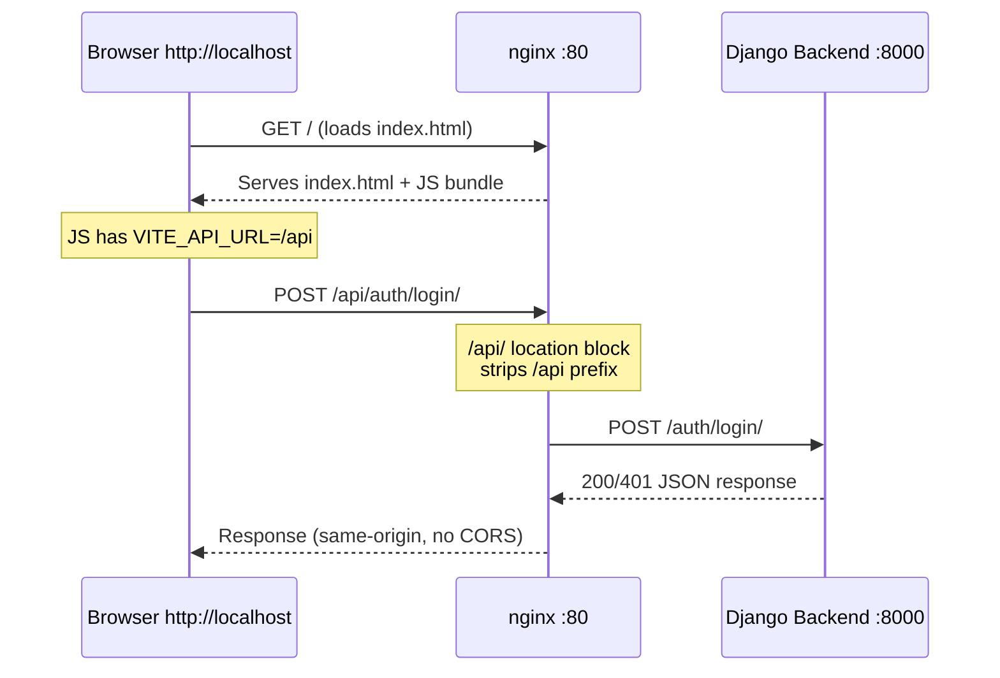

# Login Connection Error — Implementation Plan

## Root Cause

The production frontend build (served by nginx at `http://localhost`) has `VITE_API_URL=http://localhost:8000` hardcoded in the JS bundle. This causes **cross-origin** requests when accessed via nginx (origin `http://localhost` → target `http://localhost:8000`), and the CORS preflight fails.

### Why the Dockerfile is the root cause

[`docker/frontend/Dockerfile`](../docker/frontend/Dockerfile:20):
```dockerfile
FROM dev AS builder
RUN npm run build
```

The `builder` stage inherits from `dev`, which copies the entire `src/frontend/` directory — including `.env.development`. When `npm run build` runs, Vite reads `.env.development` (since it exists in the working directory) and uses `VITE_API_URL=http://localhost:8000` instead of the production value `VITE_API_URL=/api`.

### Why it should be `/api`

[`.env.production`](../src/frontend/.env.production:2):
```
VITE_API_URL=/api
```

With `VITE_API_URL=/api`:
- Frontend requests go to `http://localhost/api/auth/login/`
- nginx's [`/api/` location block](../docker/nginx/nginx.conf:97) proxies to `http://backend/` (stripping the `/api` prefix)
- This is a **same-origin** request (both from `http://localhost`), avoiding CORS entirely

---

## Architecture Diagram — Request Flow After Fix



---

## Implementation Steps

### Step 1: Fix the Frontend Dockerfile

**File:** [`docker/frontend/Dockerfile`](../docker/frontend/Dockerfile)

**Problem:** The `builder` stage inherits from `dev`, which copies `.env.development`.

**Fix:** Refactor the `builder` stage to:
1. Start from a clean `node:20-alpine` image (not from `dev`)
2. Install production dependencies only (`npm ci --omit=dev` or `npm install --production`)
3. Explicitly set `VITE_API_URL=/api` via build arg / env var
4. Copy `.env.production` explicitly instead of relying on the full source copy

New structure:
```dockerfile
# ============================================================
# Stage 1: Dev — For development server (npm run dev)
# ============================================================
FROM docker.arvancloud.ir/library/node:20-alpine AS dev
# ... (unchanged)

# ============================================================
# Stage 2: Dependencies — Install production deps only
# ============================================================
FROM docker.arvancloud.ir/library/node:20-alpine AS deps

WORKDIR /app
COPY src/frontend/package*.json ./
RUN npm install --no-audit --no-fund --legacy-peer-deps

# ============================================================
# Stage 3: Build — Compile frontend assets for production
# ============================================================
FROM deps AS builder

COPY src/frontend/ .

# Explicitly set production API URL — overrides any .env file
ARG VITE_API_URL=/api
ENV VITE_API_URL=/api

RUN npm run build

# ============================================================
# Stage 4: Production — Serve with Nginx
# ============================================================
FROM nginx:alpine
# ... (unchanged, but COPY --from=builder /app/dist /usr/share/nginx/html)
```

**Key changes:**
- `builder` no longer inherits from `dev` — it inherits from a new `deps` stage that only has `node_modules`
- `VITE_API_URL=/api` is set as an explicit build arg and env var — this takes priority over `.env` files in Vite
- The production nginx stage now has `COPY --from=builder /app/dist /usr/share/nginx/html` baked into the image

### Step 2: Update docker-compose.yml for nginx service

**File:** [`docker-compose.yml`](../docker-compose.yml)

**Problem:** The nginx service currently builds from `./docker/nginx` context with its own Dockerfile, and mounts `./src/frontend/dist` as a volume. This means:
1. The nginx Dockerfile doesn't have access to the frontend builder stage
2. The dist on the host is what gets served, not the image's built-in dist

**Fix:** Change the nginx service to build from the project root context (like the frontend service does), so it can use the multi-stage build from the frontend Dockerfile:

```yaml
  nginx:
    build:
      context: .
      dockerfile: ./docker/frontend/Dockerfile
      target: production  # or whatever the final stage is named
    container_name: docuchat_nginx
    restart: unless-stopped
    depends_on:
      backend:
        condition: service_healthy
    ports:
      - "80:80"
      - "443:443"
    volumes:
      - ./docker/nginx/nginx.conf:/etc/nginx/nginx.conf
      - ./docker/nginx/ssl:/etc/nginx/ssl
      - backend_static:/static:ro
      - backend_media:/media:ro
    networks:
      - docuchat_network
```

**Alternative (simpler):** Keep the nginx service as-is, but add a separate build step to produce the dist on the host:

```yaml
  # Add a one-off build service
  frontend-build:
    build:
      context: .
      dockerfile: ./docker/frontend/Dockerfile
      target: builder
    container_name: docuchat_frontend_build
    profiles:
      - build  # Only runs with --profile build
    volumes:
      - ./src/frontend/dist:/app/dist
```

Then run: `docker-compose --profile build run frontend-build`

### Step 3: Rebuild and deploy

```bash
# Option A: Using the multi-stage build approach
docker-compose build frontend
docker-compose run --rm frontend npm run build
docker-compose restart nginx

# Option B: Using the dedicated builder service
docker-compose --profile build run frontend-build
docker-compose restart nginx

# Option C: Manual build with correct env
cd src/frontend
VITE_API_URL=/api npm run build
cd ../..
docker-compose restart nginx
```

### Step 4: Verify

1. Open browser to `http://localhost`
2. Try to log in with invalid credentials
3. Expected: Shows "Invalid email or password" (request reaches backend)
4. Check browser DevTools → Network tab → verify request goes to `/api/auth/login/`

---

## Files to Modify

| File | Change |
|------|--------|
| [`docker/frontend/Dockerfile`](../docker/frontend/Dockerfile) | Refactor builder stage: separate from dev, explicit `VITE_API_URL=/api` |
| [`docker-compose.yml`](../docker-compose.yml) | Either update nginx build or add frontend-build service |
| [`docs/active-task/wip-context.md`](../docs/active-task/wip-context.md) | Update with fix details |

---

## Rollback Plan

If the fix causes issues:

1. **Restore original Dockerfile**: `git checkout docker/frontend/Dockerfile`
2. **Restore docker-compose.yml**: `git checkout docker-compose.yml`
3. **Rebuild and restart**: `docker-compose up -d --build`
