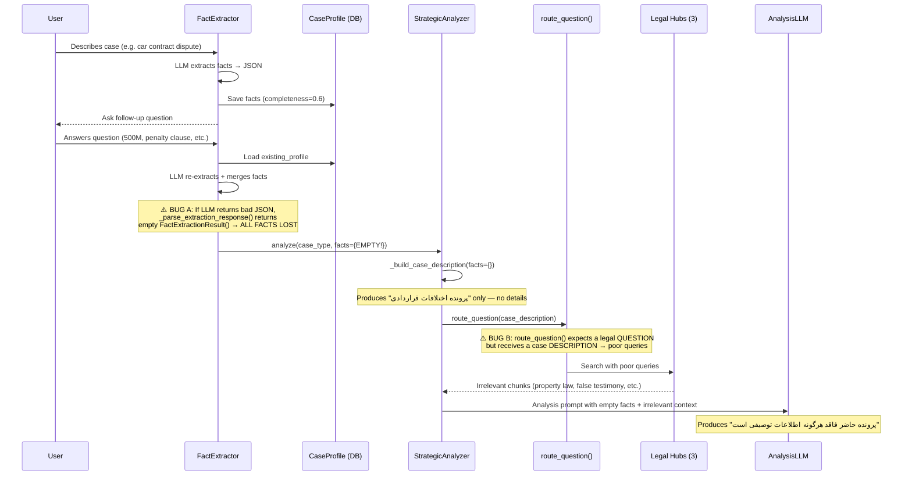

# Phase 3: Context Loss & Search Quality Fix Plan

> **Objective:** Fix the critical fact-loss bug between Phase 1 (interview) and Phase 2 (legal research) in the Interactive Strategist pipeline, and improve legal search relevance — without breaking Phase 2 (Global RAG).

---

## ✅ Previously Applied Fixes (Already in Code)

The following fixes from earlier plans are already applied and working:

| Fix | Status | File |
|-----|--------|------|
| `_ANALYSIS_MAX_TOKENS = 8192` | ✅ Applied | [`strategist_service.py:67`](../src/backend/conversations/strategist_service.py:67) |
| Truncated JSON fence handling (`(?:```\|$)` regex) | ✅ Applied | [`strategist_service.py:1042`](../src/backend/conversations/strategist_service.py:1042) |
| Multi-strategy JSON parsing pipeline | ✅ Applied | [`strategist_service.py:1159`](../src/backend/conversations/strategist_service.py:1159) |
| `_build_case_description` → fluent Persian | ✅ Applied | [`strategist_service.py:858`](../src/backend/conversations/strategist_service.py:858) |
| `_filter_relevant_chunks` by keywords | ✅ Applied | [`strategist_service.py:776`](../src/backend/conversations/strategist_service.py:776) |
| Analysis prompt context relevance check | ✅ Applied | [`strategist_service.py:984`](../src/backend/conversations/strategist_service.py:984) |
| `update_or_create` in `_save_strategic_report` | ✅ Applied | [`strategist_service.py:1808`](../src/backend/conversations/strategist_service.py:1808) |

**Despite all these fixes, the core bugs remain.** See below.

---

## 🔍 Root Cause Analysis

### Data Flow Diagram (Current — Broken)



---

### Bug A (CRITICAL — Fact Loss): `_parse_extraction_response` silently drops facts on JSON parse failure

**Location:** [`strategist_service.py:372-441`](../src/backend/conversations/strategist_service.py:372)

**The Problem:**

In [`FactExtractor.extract()`](../src/backend/conversations/strategist_service.py:289), there are TWO error handling paths:

1. **LLM call exception** (line 355-370): caught by `except Exception` → **preserves** `existing_profile` facts correctly:
   ```python
   except Exception as e:
       return FactExtractionResult(
           facts=existing_profile or {},  # ✅ preserved
           ...
       )
   ```

2. **JSON parse failure** (line 396-407): caught internally → **drops** all facts:
   ```python
   except json.JSONDecodeError:
       return FactExtractionResult()  # ❌ facts={}
   ```

**Why this happens:** When the user answers a follow-up question, the conversation history grows. The LLM receives a long prompt (existing facts JSON + history + new message). Sometimes the LLM response is truncated or malformed. The JSON parsing fails, and `_parse_extraction_response` silently returns an empty `FactExtractionResult()`.

**Impact:** All gold facts (500M amount, penalty clause, contract type, parties) accumulated from the interview phase are wiped out. The downstream `StrategicAnalyzer.analyze()` receives `facts={}`.

**Fix:** Make `_parse_extraction_response` raise a `ValueError` on parse failure instead of returning an empty result. The `except Exception` handler in `extract()` already preserves `existing_profile`.

---

### Bug B (CRITICAL — Poor Search): `route_question()` is the wrong tool for case-based search

**Location:** [`strategist_service.py:632`](../src/backend/conversations/strategist_service.py:632)

**The Problem:**

[`StrategicAnalyzer.analyze()`](../src/backend/conversations/strategist_service.py:600) calls [`route_question(case_description)`](../src/backend/conversations/question_router.py:173). This function is designed for Phase 2 (Global RAG) where users ask specific legal questions like *"مجازات کلاهبرداری طبق قانون چقدر است؟"*

The router's [`SYSTEM_PROMPT`](../src/backend/conversations/question_router.py:70) begins:
```
"You are a Persian legal question router. Analyse a user's legal question..."
```

When given a **case description** (e.g., *"پرونده اختلافات قراردادی | طرفین دعوا: خریدار: X و فروشنده: Y | خواسته: الزام به تنظیم سند خودرو | مبلغ: ۵۰۰,۰۰۰,۰۰۰ تومان | شرط جریمه: روزانه ۵۰۰,۰۰۰ تومان"*), the router:

1. Tries to treat it as a question → generates poor FTS/vector queries
2. The queries don't match legal document embeddings → irrelevant search results
3. Falls back to `_all_hubs_fallback()` in many cases → uses raw description as search query

**Example of poor results from the user's test:**
- Article 180 of Civil Procedure Code (mediation procedure) — irrelevant
- Law on Mandatory Registration of Immovable Property 1403 — irrelevant (cars are movable property)
- Unified precedents from 1352, 1360, 1370 — outdated and irrelevant

**Fix:** Create a dedicated `_research_case()` method that generates search queries optimized for case FACT PATTERNS, not questions. Search ALL hubs directly with the case facts, bypassing the question router.

---

### Bug C (Moderate — Weak Prompt): Analysis prompt doesn't enforce fact priority over legal context

**Location:** [`strategist_service.py:969-1007`](../src/backend/conversations/strategist_service.py:969)

**The Problem:**

The current analysis prompt (`_build_analysis_prompt`) instructs the LLM:
> *"If the retrieved legal context is not relevant to the case, ignore it"*

But this is buried in the prompt and not emphasized as a priority rule. When the legal context IS present (even if irrelevant), the LLM tends to use it because:
1. The system prompt says *"Analyse the case facts against the applicable laws and judicial precedents provided in the context"*
2. The LLM assumes the context was retrieved deliberately and tries to incorporate it

**Impact:** Even when facts are correctly passed, if the legal context is wrong, the LLM force-fits the analysis to the irrelevant laws.

**Fix:** Restructure the analysis prompt with explicit priority:
1. **Primary:** Case facts (these define the case)
2. **Secondary:** Retrieved legal context (use only if relevant)
3. **Fallback:** General legal knowledge (use when context is irrelevant)

---

### Bug D (Moderate — Empty Context): No guidance when all chunks are filtered out

**Location:** [`strategist_service.py:991-997`](../src/backend/conversations/strategist_service.py:991)

**The Problem:**

When `_filter_relevant_chunks` removes all chunks (because nothing is relevant to the case type), the prompt says:
> *"No specific legal context was retrieved. Base your analysis on general legal principles and the facts provided."*

This is OK but doesn't tell the LLM HOW to handle the absence of citations. The LLM may still hallucinate laws or produce an analysis without specific article references.

**Fix:** Add explicit guidance: *"Since no relevant legal documents were found, clearly state this in your analysis. Base your reasoning on general principles of Iranian law without citing specific article numbers unless you are certain."*

---

## 🛠️ Fix Plan

### Fix A: Prevent fact loss on JSON parse failure

**File:** [`src/backend/conversations/strategist_service.py`](../src/backend/conversations/strategist_service.py)

**Change:** [`_parse_extraction_response()`](../src/backend/conversations/strategist_service.py:372) — raise `ValueError` instead of silently returning empty result.

**Current code (lines 396-407):**
```python
try:
    data = json.loads(cleaned)
except json.JSONDecodeError:
    # Try non-strict parsing
    try:
        data = json.loads(cleaned, strict=False)
    except json.JSONDecodeError:
        logger.warning(
            "_parse_extraction_response: Invalid JSON from LLM, "
            "raw=%.200s",
            raw_content,
        )
        return FactExtractionResult()  # ❌ facts={}
```

**Fixed code:**
```python
try:
    data = json.loads(cleaned)
except json.JSONDecodeError:
    # Try non-strict parsing
    try:
        data = json.loads(cleaned, strict=False)
    except json.JSONDecodeError:
        logger.warning(
            "_parse_extraction_response: Invalid JSON from LLM, "
            "raw=%.200s",
            raw_content,
        )
        raise ValueError("Failed to parse LLM extraction response")  # ✅ preserves existing_profile
```

**Why this works:** The caller [`extract()`](../src/backend/conversations/strategist_service.py:289) wraps the LLM call + parsing in a `try/except Exception` block (line 355) that already preserves `existing_profile` facts:
```python
except Exception as e:
    return FactExtractionResult(
        facts=existing_profile or {},  # ✅ preserved
        ...
    )
```

**Risk:** None. This error path was already returning empty data; now it returns the PREVIOUSLY KNOWN data instead. Only affects strategist flow.

---

### Fix B: Create dedicated `_research_case()` method

**File:** [`src/backend/conversations/strategist_service.py`](../src/backend/conversations/strategist_service.py)

**Change:** Replace `route_question()` call inside [`StrategicAnalyzer.analyze()`](../src/backend/conversations/strategist_service.py:600) with a new `_research_case()` method that directly searches all hubs using case-fact-optimized queries.

**New method to add:**
```python
def _research_case(
    self,
    case_type: str,
    facts: dict[str, Any],
    case_description: str,
    top_k_per_hub: int = _STRATEGY_TOP_K_PER_HUB,
) -> dict[str, dict[str, Any]]:
    """Research a legal case across all 3 hubs.
    
    Unlike route_question() which is designed for legal QUESTIONS,
    this method generates search queries optimized for case FACT PATTERNS.
    It searches ALL hubs directly without LLM-based routing.
    
    Args:
        case_type: The case type identifier.
        facts: The structured facts dict.
        case_description: The fluent Persian case description.
        top_k_per_hub: Number of chunks per hub.
    
    Returns:
        hub_results dict from multi_hub_search().
    """
    # Generate FTS keywords from case facts (optimized for legal document search)
    fts_keywords = self._build_fts_keywords(case_type, facts)
    
    # Build a RouterResult that searches all hubs with case-optimized queries
    from conversations.question_router import RouterResult, SubQuery
    
    router_result = RouterResult(
        sub_queries={
            "legislation": SubQuery(
                fts_query=fts_keywords,
                vector_query=case_description,
            ),
            "judicial_precedent": SubQuery(
                fts_query=fts_keywords,
                vector_query=case_description,
            ),
            "advisory_opinion": SubQuery(
                fts_query=fts_keywords,
                vector_query=case_description,
            ),
        },
        hypothetical_answer=case_description,
        reasoning="Case-based research: searching all hubs with facts-derived keywords.",
    )
    
    # Search all hubs
    return multi_hub_search(
        router_result=router_result,
        top_k_per_hub=top_k_per_hub,
    )
```

**New helper method:**
```python
def _build_fts_keywords(
    self,
    case_type: str,
    facts: dict[str, Any],
) -> str:
    """Build FTS keywords optimized for legal document search.
    
    Generates Persian keyword combinations that match legal document
    content, rather than natural language questions.
    
    Args:
        case_type: The case type identifier.
        facts: The structured facts dict.
    
    Returns:
        Space-separated Persian keywords for FTS search.
    """
    keywords: list[str] = []
    
    # Map case_type to base legal keywords
    case_type_keywords = {
        "contract_dispute": "قرارداد عقد تعهد التزام شرط فسخ",
        "family_law": "طلاق مهریه نفقه حضانت ازدواج نکاح",
        "criminal": "جرم مجازات کیفر حبس شکایت مجرم",
        "civil": "مسئولیت مدنی خسارت ضمان الزام",
        "labour": "کارگر کارفرما قرارداد کار حقوق بیمه",
        "inheritance": "ارث وصیت وارث ترکه سهم",
        "property": "ملک زمین سند ثبت مالکیت",
        "other": "قانون حق دعوی دادگاه",
    }
    keywords.append(case_type_keywords.get(case_type, "قانون"))
    
    # Add specific terms from facts (Word-based truncation to prevent Unicode breaking)
    claims = facts.get("claims", "")
    if claims:
        # Take first 20 words — prevents mid-word truncation that would break FTS
        claims_words = " ".join(claims.split()[:20])
        keywords.append(claims_words)
    
    evidence = facts.get("evidence", "")
    if evidence:
        evidence_words = " ".join(evidence.split()[:15])
        keywords.append(evidence_words)
    
    parties = facts.get("parties", {})
    if isinstance(parties, dict):
        for role in parties:
            if role in ("موجر", "مستاجر", "خریدار", "فروشنده", "مالک", "مستأجر"):
                keywords.append(role)
    
    return " ".join(keywords)
```

**Change in `analyze()` (line 631):**
```python
# OLD (broken):
router_result = route_question(case_description)
active_hubs = [
    hub for hub, sq in router_result.sub_queries.items()
    if sq.fts_query or sq.vector_query
]

# NEW (fixed):
hub_results = self._research_case(
    case_type=case_type,
    facts=facts,
    case_description=case_description,
)
```

**Remove the old fallback code** (lines 648-670) that used `RouterResult` with `case_description` for all hubs — the new `_research_case()` handles this properly.

**Why this works:**
1. Doesn't use `route_question()` → Phase 2's question router is untouched ✅
2. Uses the case description as vector_query for embedding similarity ✅
3. Generates specific FTS keywords from case facts ✅
4. Searches ALL hubs (all are potentially relevant for case research) ✅
5. No LLM routing call needed → fewer failure points, faster ✅

---

### Fix C: Strengthen analysis prompt with context priority

**File:** [`src/backend/conversations/strategist_service.py`](../src/backend/conversations/strategist_service.py)

**Change:** [`_build_analysis_prompt()`](../src/backend/conversations/strategist_service.py:951) — restructure to enforce fact-first priority.

**Current "Context Relevance Check" (lines 984-988):**
```python
"**IMPORTANT — Context Relevance Check:**\n"
"If the retrieved legal context is not relevant to the case, "
"ignore it and base your analysis on general legal principles. "
"Do NOT cite laws or precedents that are not relevant to the "
"case facts.\n",
```

**Replace with stronger instructions:**
```python
"**CRITICAL — Analysis Priority Rules:**\n"
"1. PRIMARY source: The CASE FACTS above. These define the legal situation.\n"
"2. SECONDARY source: The retrieved legal context below. Use ONLY if clearly "
"relevant to the case type and facts.\n"
"3. If the legal context is NOT relevant to the case (e.g., discusses different "
"laws, different subject matter, or different legal questions), COMPLETELY IGNORE "
"it. Do NOT mention irrelevant laws or precedents.\n"
"4. If NO relevant legal context is available, base your analysis on general "
"principles of Iranian law. Be honest: state that specific laws/precedents "
"were not found in the knowledge base.\n"
"5. Never fabricate or force-fit laws, article numbers, or precedents. "
"Accuracy is more important than appearing comprehensive.\n",
```

Also update the `STRATEGIC_ANALYSIS_SYSTEM_PROMPT` (line 223) to add the priority rule at the top:
```python
"IMPORTANT: The case facts are your PRIMARY source. "
"Retrieved legal context is secondary reference material. "
"Base your analysis primarily on the case facts.\n\n"
```

---

### Fix D: Improve empty-context handling

**File:** [`src/backend/conversations/strategist_service.py`](../src/backend/conversations/strategist_service.py)

**Change:** The empty context section (lines 991-997):

**Current:**
```python
"No specific legal context was retrieved from the knowledge "
"base. Base your analysis on general legal principles and "
"the facts provided.",
```

**Improved:**
```python
"No specific legal context was retrieved from the knowledge "
"base. Base your analysis ENTIRELY on the case facts and your "
"knowledge of general Iranian legal principles.\n\n"
"Note: Since no supporting legal documents were found, clearly "
"indicate this in your analysis. Do NOT cite specific article "
"numbers, law names, or precedent numbers unless you are "
"absolutely certain of their applicability to this case.",
```

---

## 📋 Execution Order

| Step | Fix | Description | File(s) | Risk |
|------|-----|-------------|---------|------|
| 1 | **Fix A** | Prevent fact loss on JSON parse failure | [`strategist_service.py:396-407`](../src/backend/conversations/strategist_service.py:396) | 🔴 **Low** — only changes error handling path |
| 2 | **Fix B** | Create `_research_case()` method | [`strategist_service.py`](../src/backend/conversations/strategist_service.py) (new methods + modify `analyze()`) | 🟡 **Medium** — new code path, doesn't touch Phase 2 files |
| 3 | **Fix C** | Strengthen analysis prompt | [`strategist_service.py:984-988`](../src/backend/conversations/strategist_service.py:984) + line 223 | 🟢 **Low** — prompt change only |
| 4 | **Fix D** | Improve empty-context handling | [`strategist_service.py:991-997`](../src/backend/conversations/strategist_service.py:991) | 🟢 **Low** — prompt change only |
| 5 | **Test** | Write/update tests | New test file or existing | 🟢 **Low** — tests only |

---

## ✅ Verification Criteria

After implementing all fixes, verify:

1. **Fact preservation test:**
   - Call `FactExtractor.extract()` with a message and `existing_profile` containing facts
   - Make the LLM return malformed JSON
   - Verify the returned `FactExtractionResult.facts` still contains the `existing_profile` data

2. **Search relevance test:**
   - Build a car contract dispute case (الزام به تنظیم سند خودرو)
   - Call `_research_case()` → verify returned chunks relate to contract law, vehicle sales, penalties
   - Verify NO chunks about immovable property registration or civil procedure mediation

3. **End-to-end strategist test:**
   - Full flow: describe case → answer follow-up → receive analysis
   - Verify the final report contains the specific case facts (amount, contract type, penalty clause)
   - Verify the analysis references relevant laws (not irrelevant ones)

4. **Phase 2 regression test:**
   - Send a legal question in `global_rag` mode
   - Verify the answer is still generated correctly
   - Verify `route_question()` still works for its intended purpose

---

## 📁 Files to Modify

| File | Changes |
|------|---------|
| [`src/backend/conversations/strategist_service.py`](../src/backend/conversations/strategist_service.py) | Fix A (line 401-407), Fix B (new methods + modify analyze()), Fix C (lines 984-988 + 223), Fix D (lines 991-997) |
| [`docs/active-task/wip-context.md`](../docs/active-task/wip-context.md) | Update after implementation |

## 🚫 Files NOT Modified

| File | Reason |
|------|--------|
| [`src/backend/conversations/question_router.py`](../src/backend/conversations/question_router.py) | Phase 2 code — untouched to prevent regression |
| [`src/backend/conversations/global_rag_service.py`](../src/backend/conversations/global_rag_service.py) | Phase 2 code — untouched to prevent regression |
| [`src/backend/conversations/models.py`](../src/backend/conversations/models.py) | No schema changes needed |
| [`src/backend/conversations/views.py`](../src/backend/conversations/views.py) | View layer is fine — issue is in service layer |
| [`src/backend/conversations/serializers.py`](../src/backend/conversations/serializers.py) | No API changes needed |

---

## 🧠 Why This Plan Won't Break Phase 2

1. **All changes are in `strategist_service.py` only** — no Phase 2 files are touched.
2. **`route_question()` is no longer called by the strategist** — the new `_research_case()` method bypasses it entirely, so any changes to the strategist won't affect Phase 2's usage of `route_question()`.
3. **`multi_hub_search()` and `build_global_context()` are reused** — the core search infrastructure is shared, only the query generation changes.
4. **`_parse_extraction_response()` is only used by `FactExtractor`** — which is exclusively in the strategist pipeline. Global RAG uses a completely different parsing path.
5. **The strengthened analysis prompts only affect strategist reports** — Global RAG uses different system prompts (`build_global_system_prompt()`, `build_synthesis_system_prompt()`).
