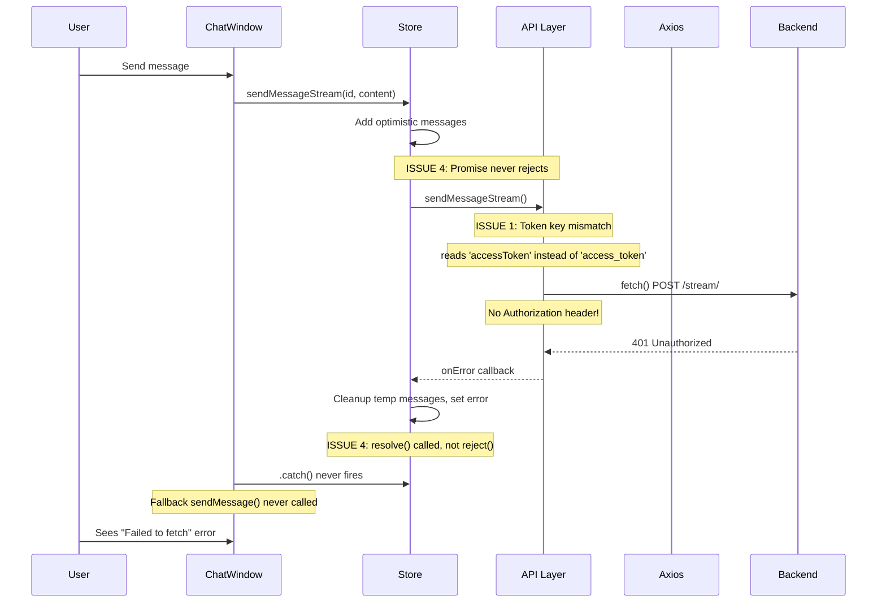
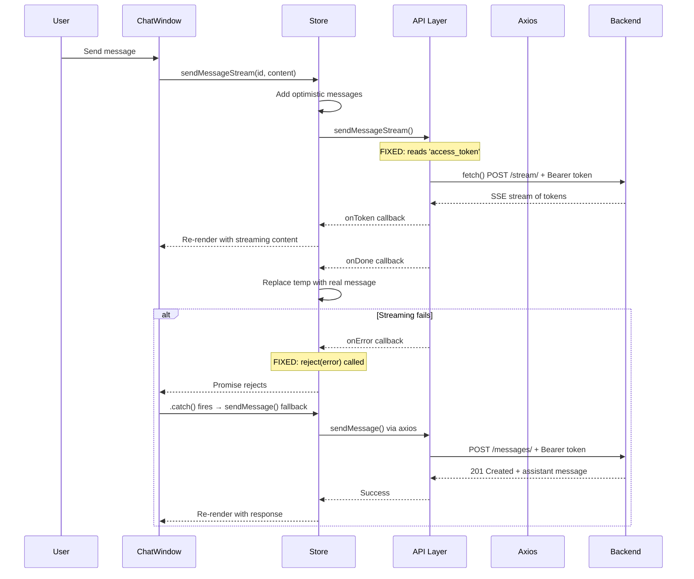

# Deep Refactor Plan: Chat System (Task 7 + Issues)

## Root Cause Analysis

After thorough codebase investigation, I've identified **7 distinct issues** that need to be resolved. Below is each issue with its root cause, impact, and solution.

---

## Issue 1: "Failed to fetch" Error When Sending Messages

### Root Cause
The problem is a **token key mismatch** between the frontend's [`axios.ts`](src/frontend/src/api/axios.ts) interceptor and the [`sendMessageStream`](src/frontend/src/api/conversations.ts:229) function.

- **axios interceptor** (line 20): reads `localStorage.getItem('access_token')` (snake_case)
- **sendMessageStream** (line 229): reads `localStorage.getItem('accessToken')` (camelCase)
- **authStore** ([`authStore.ts`](src/frontend/src/stores/authStore.ts:33-34)): stores tokens as `access_token` and `refresh_token` (snake_case)

So when `sendMessageStream` tries to send a message, it looks for `accessToken` which doesn't exist → no `Authorization` header → backend returns 401 → the raw `fetch()` call (not axios) doesn't have the 401 interceptor → the error surfaces as "Failed to fetch".

### Impact
- **Streaming messages always fail** with "Failed to fetch"
- The fallback to `sendMessage` (non-streaming) in [`ChatWindow.tsx`](src/frontend/src/components/chat/ChatWindow.tsx:154-156) also fails because `sendMessageStream` rejects first, then `sendMessage` is called but the store's `isSendingMessage` is already `true` from the first attempt

### Solution
Fix the token key in [`sendMessageStream`](src/frontend/src/api/conversations.ts:229):
```typescript
// CHANGE THIS:
const token = localStorage.getItem('accessToken');
// TO THIS:
const token = localStorage.getItem('access_token');
```

---

## Issue 2: Rename Conversation Not Working (Backend)

### Root Cause
The [`ConversationDetailView.patch()`](src/backend/conversations/views.py:228-258) method validates that `title` is not empty, but the [`ConversationListSerializer`](src/backend/conversations/serializers.py:62-118) has `title` defined as `required=False, allow_blank=True`. When the PATCH response returns the serialized conversation, the serializer's `title` field allows blank values, but the view rejects them. This is **inconsistent but not the main bug**.

The **real problem** is that the frontend's [`renameConversation`](src/frontend/src/api/conversations.ts:160-173) calls `apiClient.patch()` which goes through the axios interceptor. If the token refresh interceptor fires (Issue 1's token mismatch), the PATCH request also fails with 401.

Additionally, looking at the backend more carefully: the [`ConversationListSerializer`](src/backend/conversations/serializers.py:89-94) defines `title` as a **serializer field** (not a model field), and it's `required=False, allow_blank=True`. But the view's `patch()` method does its own validation. The serializer is only used for **output** in the PATCH response, not for input validation. This is fine.

### Impact
- Rename appears to do nothing (silent failure)
- User sees the rename UI but the title doesn't persist

### Solution
1. Fix the token key (Issue 1) — this is the primary blocker
2. Add proper error handling in the store's [`renameConversation`](src/frontend/src/stores/conversationStore.ts:252-268) to show toast on failure
3. Add a `renameConversation` test to the store test suite

---

## Issue 3: Missing `renameConversation` and `sendMessageStream` Mocks in Store Tests

### Root Cause
The [`conversationStore.test.ts`](src/frontend/tests/stores/conversationStore.test.ts) mocks the API module at line 2-8 but **does not mock** `renameConversation` or `sendMessageStream`. These functions were added later (in the refactor) but the tests were never updated.

### Impact
- Tests for `renameConversation` and `sendMessageStream` don't exist
- If someone runs the tests, the mock doesn't include these functions, which could cause test failures

### Solution
Update the mock in [`conversationStore.test.ts`](src/frontend/tests/stores/conversationStore.test.ts) to include:
```typescript
vi.mock('@/api/conversations', () => ({
  listConversations: vi.fn(),
  createConversation: vi.fn(),
  getConversation: vi.fn(),
  sendMessage: vi.fn(),
  sendMessageStream: vi.fn(),
  deleteConversation: vi.fn(),
  renameConversation: vi.fn(),
}));
```

---

## Issue 4: `sendMessageStream` Fallback Logic is Broken

### Root Cause
In [`ChatWindow.tsx`](src/frontend/src/components/chat/ChatWindow.tsx:150-158), the `handleSend` function tries `sendMessageStream` first, and if it rejects, falls back to `sendMessage`. However:

1. `sendMessageStream` in the store ([`conversationStore.ts`](src/frontend/src/stores/conversationStore.ts:151-250)) is a `Promise<void>` that **always resolves** (never rejects) — errors are handled internally via the `onError` callback which calls `resolve()`.
2. So the `.catch()` in `handleSend` **never fires**.
3. When streaming fails, the error is set in the store's `error` state, but the fallback `sendMessage` is never called.

### Impact
- If streaming fails, the message is lost — no fallback to non-streaming
- User sees an error but the message they typed is gone (optimistic message was removed)

### Solution
Restructure the store's `sendMessageStream` to **reject the promise on error** instead of resolving, so the fallback in `ChatWindow` can work:

```typescript
// In conversationStore.ts sendMessageStream:
// Change onError callback from:
onError: (error: Error) => {
  // ... cleanup ...
  resolve();  // <-- This prevents fallback from working
}
// To:
onError: (error: Error) => {
  // ... cleanup ...
  reject(error);  // <-- This allows ChatWindow's .catch() to fire
}
```

And update `ChatWindow.tsx` to handle this properly.

---

## Issue 5: No Loading/Error Feedback for Conversation Operations

### Root Cause
The [`ConversationSidebar.tsx`](src/frontend/src/components/chat/ConversationSidebar.tsx) component calls `createConversation`, `deleteConversation`, and `renameConversation` but **never shows loading states or error feedback** to the user. The store sets `error` state, but the sidebar doesn't display it.

### Impact
- User clicks "New Chat" → nothing visible happens while the API call is in flight
- User tries to rename → if it fails, the rename UI just closes silently
- User tries to delete → if it fails, the confirmation just closes silently

### Solution
1. Add loading state for `createConversation` in the store (e.g., `isCreatingConversation`)
2. Show a toast notification when conversation operations fail
3. Disable the "New Chat" button while a creation is in progress

---

## Issue 6: `ConversationSidebar` Width Hardcoded at `w-72` Inside Parent

### Root Cause
The [`ConversationSidebar`](src/frontend/src/components/chat/ConversationSidebar.tsx:305) component has `className="w-72 h-full bg-background flex flex-col"` — the width is hardcoded. Meanwhile, the parent [`ChatPage.tsx`](src/frontend/src/pages/ChatPage.tsx:99-109) wraps it in a `div` with `w-72` as well.

This means the sidebar has **two competing width constraints**. When the parent collapses to `w-0`, the child still thinks it's `w-72`, which can cause layout issues.

### Impact
- Potential layout flickering when collapsing/expanding sidebar
- The sidebar content doesn't properly hide when collapsed to `w-0`

### Solution
Remove the hardcoded `w-72` from [`ConversationSidebar.tsx`](src/frontend/src/components/chat/ConversationSidebar.tsx:305) and let the parent control the width:

```typescript
// Change from:
<div className="w-72 h-full bg-background flex flex-col">
// To:
<div className="h-full bg-background flex flex-col">
```

---

## Issue 7: Missing `PATCH` Method in Frontend API Tests for `renameConversation`

### Root Cause
The [`conversations.test.ts`](src/frontend/tests/api/conversations.test.ts) mocks `apiClient` with only `post`, `get`, and `delete` methods (lines 4-14). The `renameConversation` function uses `apiClient.patch()`, which is **not mocked**.

### Impact
- If tests for `renameConversation` are added, they will fail because `mockPatch` is not defined
- The mock is incomplete

### Solution
Add `patch` to the mock:
```typescript
const mockPost = vi.fn();
const mockGet = vi.fn();
const mockPatch = vi.fn();
const mockDelete = vi.fn();

vi.mock('@/api/axios', () => ({
  apiClient: {
    post: mockPost,
    get: mockGet,
    patch: mockPatch,
    delete: mockDelete,
  },
}));
```

---

## Architecture Diagram: Current Data Flow with Issues



---

## Architecture Diagram: Fixed Data Flow



---

## Implementation Plan

### Phase 1: Critical Bug Fixes (Backend + Frontend)

| # | File | Change | Priority |
|---|------|--------|----------|
| 1 | [`src/frontend/src/api/conversations.ts`](src/frontend/src/api/conversations.ts:229) | Fix token key: `accessToken` → `access_token` | 🔴 Critical |
| 2 | [`src/frontend/src/stores/conversationStore.ts`](src/frontend/src/stores/conversationStore.ts:232-246) | Change `sendMessageStream` onError to `reject(error)` instead of `resolve()` | 🔴 Critical |
| 3 | [`src/frontend/src/components/chat/ChatWindow.tsx`](src/frontend/src/components/chat/ChatWindow.tsx:150-167) | Update `handleSend` and `handleRetry` to properly handle the rejected promise and call fallback | 🔴 Critical |

### Phase 2: Test Coverage Updates

| # | File | Change | Priority |
|---|------|--------|----------|
| 4 | [`src/frontend/tests/api/conversations.test.ts`](src/frontend/tests/api/conversations.test.ts:4-14) | Add `mockPatch` to axios mock, add `renameConversation` and `sendMessageStream` tests | 🟡 High |
| 5 | [`src/frontend/tests/stores/conversationStore.test.ts`](src/frontend/tests/stores/conversationStore.test.ts:2-8) | Add `renameConversation` and `sendMessageStream` to API mock | 🟡 High |

### Phase 3: UX Improvements

| # | File | Change | Priority |
|---|------|--------|----------|
| 6 | [`src/frontend/src/components/chat/ConversationSidebar.tsx`](src/frontend/src/components/chat/ConversationSidebar.tsx:305) | Remove hardcoded `w-72` from component (let parent control width) | 🟢 Medium |
| 7 | [`src/frontend/src/stores/conversationStore.ts`](src/frontend/src/stores/conversationStore.ts) | Add `isCreatingConversation` state for loading feedback | 🟢 Medium |
| 8 | [`src/frontend/src/components/chat/ConversationSidebar.tsx`](src/frontend/src/components/chat/ConversationSidebar.tsx) | Add toast notifications for create/delete/rename failures | 🟢 Medium |

### Phase 4: Documentation Updates

| # | File | Change | Priority |
|---|------|--------|----------|
| 9 | [`docs/active-task/wip-context.md`](docs/active-task/wip-context.md) | Update with refactor completion status | 🟢 Low |
| 10 | [`docs/references/api-registry.md`](docs/references/api-registry.md) | Add PATCH /conversations/{id}/ endpoint documentation if missing | 🟢 Low |

---

## Detailed Implementation Steps for Code Mode

### Step 1: Fix Token Key in `sendMessageStream`

**File:** [`src/frontend/src/api/conversations.ts`](src/frontend/src/api/conversations.ts)

Change line 229:
```typescript
// FROM:
const token = localStorage.getItem('accessToken');
// TO:
const token = localStorage.getItem('access_token');
```

### Step 2: Fix `sendMessageStream` Promise Resolution

**File:** [`src/frontend/src/stores/conversationStore.ts`](src/frontend/src/stores/conversationStore.ts)

Change the `sendMessageStream` method to return a promise that **rejects on error**:

1. Change `return new Promise<void>((resolve) => {` to `return new Promise<void>((resolve, reject) => {`
2. Change the `onError` callback from `resolve()` to `reject(error)`

### Step 3: Fix `ChatWindow` Fallback Logic

**File:** [`src/frontend/src/components/chat/ChatWindow.tsx`](src/frontend/src/components/chat/ChatWindow.tsx)

Update `handleSend` and `handleRetry` to properly handle the rejected promise:

```typescript
const handleSend = useCallback(
  async (content: string) => {
    lastAttemptedContent.current = content;
    try {
      await sendMessageStream(conversationId, content);
    } catch {
      // Streaming failed, fall back to non-streaming
      await sendMessage(conversationId, content);
    }
  },
  [conversationId, sendMessageStream, sendMessage],
);
```

### Step 4: Update API Tests

**File:** [`src/frontend/tests/api/conversations.test.ts`](src/frontend/tests/api/conversations.test.ts)

1. Add `mockPatch` to the mock setup
2. Add `patch` to the `apiClient` mock object
3. Add test cases for `renameConversation` (success, 400 empty title, 403, 404)
4. Add test cases for `sendMessageStream` (basic structure)

### Step 5: Update Store Tests

**File:** [`src/frontend/tests/stores/conversationStore.test.ts`](src/frontend/tests/stores/conversationStore.test.ts)

1. Add `renameConversation` and `sendMessageStream` to the mock
2. Add test cases for `renameConversation` (success updates state, failure sets error)
3. Add test cases for `sendMessageStream` (streaming content updates, done replaces temp, error cleans up)

### Step 6: Fix Sidebar Width

**File:** [`src/frontend/src/components/chat/ConversationSidebar.tsx`](src/frontend/src/components/chat/ConversationSidebar.tsx)

Change line 305:
```typescript
// FROM:
<div className="w-72 h-full bg-background flex flex-col">
// TO:
<div className="h-full bg-background flex flex-col">
```

### Step 7: Add Loading State for Create Conversation

**File:** [`src/frontend/src/stores/conversationStore.ts`](src/frontend/src/stores/conversationStore.ts)

1. Add `isCreatingConversation: boolean` to the state interface and initial state
2. Set `isCreatingConversation: true` at the start of `createConversation`
3. Set `isCreatingConversation: false` after success or failure

**File:** [`src/frontend/src/components/chat/ConversationSidebar.tsx`](src/frontend/src/components/chat/ConversationSidebar.tsx)

1. Read `isCreatingConversation` from the store
2. Disable the "New Chat" button and show a spinner when `isCreatingConversation` is true

### Step 8: Add Toast Notifications

**File:** [`src/frontend/src/components/chat/ConversationSidebar.tsx`](src/frontend/src/components/chat/ConversationSidebar.tsx)

1. Import `toast` from `@/hooks/use-toast`
2. In `handleNewChat` catch: show error toast
3. In `handleConfirmDelete` catch: show error toast
4. In `handleRenameConfirm` catch: show error toast

---

## Verification Checklist

After implementation, verify:

1. ✅ Send a message → streaming works (tokens appear one by one)
2. ✅ If streaming fails → falls back to non-streaming (message still sent)
3. ✅ Rename a conversation → title persists after page refresh
4. ✅ Rename with empty title → shows validation error
5. ✅ Delete a conversation → removed from list
6. ✅ New Chat button shows loading state during creation
7. ✅ Error toast appears when create/delete/rename fails
8. ✅ Sidebar collapse/expand works smoothly
9. ✅ All existing tests pass (`docker-compose exec frontend npx vitest run`)
10. ✅ New tests pass
