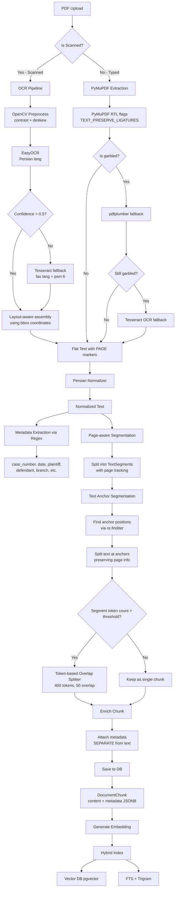
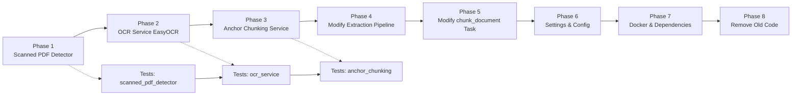

# Chunking Pipeline Refactor Plan — Persian Legal RAG

## Overview

Replace the current dual-algorithm chunking system (legal-structure-based + sentence-boundary fallback) with a **hybrid OCR-aware pipeline** that:
1. Detects whether a PDF is **typed** (selectable text) or **scanned** (image-based)
2. For scanned PDFs: uses **EasyOCR** (best Persian accuracy) with layout-aware bbox processing
3. For typed PDFs: uses **PyMuPDF** (existing, already working)
4. Applies **Persian normalization** (existing, already working)
5. Uses **text anchor regex** (لنگرهای متنی) for structural segmentation
6. Falls back to **overlap splitting** for long segments
7. Stores **metadata separately** from chunk text (not polluting embeddings)
8. Uses **page-aware segments** for accurate citation tracking

---

## Architecture Diagram



---

## Current State Analysis

### What Exists Now

| Component | Status | Notes |
|-----------|--------|-------|
| [`ChunkingService`](src/backend/documents/services/chunking_service.py) | ❌ To be replaced | 968 lines, two strategies: legal-structure (ماده/تبصره/بند/فصل regex) + sentence-boundary fallback |
| [`LegalStructureDetector`](src/backend/documents/services/legal_structure_detector.py) | ❌ To be replaced | 459 lines, detects ماده/تبصره/بند/فصل — too narrow, misses real-world legal doc structures |
| [`extract_text_from_pdf`](src/backend/documents/tasks/document_processing.py) | ✅ Keep + modify | 3-tier extraction (PyMuPDF → pdfplumber → Tesseract) — good, needs EasyOCR as 4th tier |
| [`PersianNormalizer`](src/backend/documents/services/persian_normalizer.py) | ✅ Keep as-is | 435 lines, multi-stage normalization pipeline — works well |
| [`NonTextChunkFilter`](src/backend/documents/services/non_text_filter.py) | ✅ Keep as-is | Filters TOC, headers, footers — conservative, safe |
| [`chunk_document` task](src/backend/documents/tasks/document_processing.py:544) | 🔧 Modify | Currently calls `ChunkingService.chunk_text()` — needs to call new pipeline |
| [`DocumentChunk` model](src/backend/documents/models.py) | ✅ Keep as-is | Has `content`, `metadata` JSONB, denormalized fields — metadata separation is already supported |
| [`SearchService`](src/backend/documents/services/search_service.py) | ✅ Keep as-is | Hybrid search (vector + FTS + trigram + RRF) — already excellent |

### Problems with Current Chunking

1. **LegalStructureDetector only handles 4 patterns** (ماده, تبصره, بند, فصل) — misses real-world Persian legal document structures like:
   - "رأی دادگاه", "رای دادگاه", "گردشکار", "ختم دادرسی", "نظریه مشورتی"
   - Header/footer metadata blocks (خواهان, خوانده, خواسته, کلاسه پرونده)
   - Mixed typed + scanned documents

2. **No OCR-first approach** — The current pipeline tries PyMuPDF first, then pdfplumber, then Tesseract. But many Persian legal PDFs are scanned images with no selectable text at all, so the first two always fail.

3. **No layout understanding** — Even with Tesseract OCR, the output is flat text with no structure. EasyOCR provides bbox coordinates that enable layout-aware reconstruction.

4. **No page-aware chunking** — When chunks are split, page information is lost. This breaks citation accuracy, which is critical for legal documents.

5. **Character-based chunking** — Uses `len(text)` or `len(text.split())` instead of token-based counting. Context windows are token-based, so this causes misalignment.

---

## Detailed Implementation Plan

### Phase 1: Scanned PDF Detection Utility

**File:** [`src/backend/documents/utils/scanned_pdf_detector.py`](src/backend/documents/utils/scanned_pdf_detector.py) (NEW)

**Purpose:** Determine if a PDF is scanned (image-based) or typed (has selectable text).

```python
def is_scanned_pdf(pdf_path: str) -> bool:
    """Check if PDF is scanned by sampling pages for selectable text.
    
    Conservative approach: if ANY page has >50 chars of selectable text,
    treat as typed PDF. This avoids unnecessary OCR overhead for mixed docs.
    """
    import fitz
    doc = fitz.open(pdf_path)
    for page in doc:
        text = page.get_text().strip()
        if len(text) > 50:  # Has meaningful selectable text
            return False
    return True  # All pages have little/no selectable text
```

**Tests:** [`src/backend/documents/tests/test_scanned_pdf_detector.py`](src/backend/documents/tests/test_scanned_pdf_detector.py) (NEW)
- Typed PDF → returns `False`
- Scanned PDF → returns `True`
- Mixed PDF (some typed, some scanned pages) → returns `False` (conservative)
- Empty PDF → returns `True` (conservative)

---

### Phase 2: OCR Service with EasyOCR + Tesseract Fallback

**File:** [`src/backend/documents/services/ocr_service.py`](src/backend/documents/services/ocr_service.py) (NEW)

**Purpose:** Provide OCR-based text extraction with layout-aware assembly.

**Key Design Decisions:**

1. **EasyOCR over PaddleOCR** — EasyOCR has significantly better Persian/Farsi accuracy than PaddleOCR. PaddleOCR's `fa` model is undertrained; EasyOCR's Persian model is production-grade for legal documents.

2. **Tesseract as fallback** — If EasyOCR produces low-confidence results (< 50 chars), fall back to Tesseract with optimized config (`--psm 6 --oem 3`).

3. **OpenCV preprocessing** — Before OCR, apply:
   - Contrast enhancement (CLAHE)
   - Deskew (correct page tilt)
   - Grayscale conversion

4. **Layout-aware assembly** — Use bbox coordinates to:
   - Detect multi-column layouts (cluster by x-position)
   - Group text lines into paragraphs using adaptive thresholds (median line height × 1.5)
   - Insert proper newlines where vertical gaps exist
   - Insert `[PAGE N]` markers for page tracking

5. **Confidence filtering** — Skip OCR results with confidence < 0.5 to prevent noise pollution.

```python
import logging
from dataclasses import dataclass, field
from typing import List, Optional, Tuple

logger = logging.getLogger(__name__)


@dataclass
class TextSegment:
    """A single text segment with page and position metadata."""
    text: str
    page: int
    bbox: Optional[Tuple[float, float, float, float]] = None  # (x1, y1, x2, y2)
    confidence: float = 0.0


class OcrService:
    """OCR service using EasyOCR with Tesseract fallback and layout-aware assembly."""
    
    def __init__(self):
        self._easyocr_reader = None
        self._tesseract_available = self._check_tesseract()
    
    def _get_easyocr_reader(self):
        """Lazy-init EasyOCR reader to avoid loading model on import."""
        if self._easyocr_reader is None:
            import easyocr
            self._easyocr_reader = easyocr.Reader(
                ['fa'],  # Persian
                gpu=False,  # CPU-only for cost efficiency
            )
        return self._easyocr_reader
    
    def _check_tesseract(self) -> bool:
        try:
            import pytesseract
            pytesseract.get_tesseract_version()
            return True
        except Exception:
            return False
    
    def extract_text(self, pdf_content: bytes) -> Tuple[str, List[TextSegment]]:
        """Extract text from scanned PDF with layout awareness.
        
        Returns:
            Tuple of (flat_text_with_page_markers, list_of_text_segments)
        """
        from pdf2image import convert_from_bytes
        images = convert_from_bytes(pdf_content)
        
        all_segments: List[TextSegment] = []
        page_texts: List[str] = []
        
        for i, img in enumerate(images):
            page_num = i + 1
            
            # OpenCV preprocessing
            img_cv = self._preprocess(img)
            
            # Try EasyOCR first
            segments = self._extract_with_easyocr(img_cv, page_num)
            
            # Fallback to Tesseract if EasyOCR produced little content
            total_chars = sum(len(s.text) for s in segments)
            if total_chars < 50 and self._tesseract_available:
                logger.info(
                    "EasyOCR produced only %d chars for page %d — "
                    "falling back to Tesseract",
                    total_chars, page_num,
                )
                segments = self._extract_with_tesseract(img_cv, page_num)
            
            # Layout-aware assembly
            page_text = self._assemble_layout(segments)
            page_texts.append(f"[PAGE {page_num}]\n{page_text}")
            all_segments.extend(segments)
        
        return "\n".join(page_texts), all_segments
    
    def _preprocess(self, img):
        """Apply contrast enhancement and deskew."""
        import cv2
        import numpy as np
        
        # Convert PIL to cv2
        img_cv = cv2.cvtColor(np.array(img), cv2.COLOR_RGB2BGR)
        
        # Grayscale
        gray = cv2.cvtColor(img_cv, cv2.COLOR_BGR2GRAY)
        
        # CLAHE contrast enhancement
        clahe = cv2.createCLAHE(clipLimit=2.0, tileGridSize=(8, 8))
        enhanced = clahe.apply(gray)
        
        # Deskew
        coords = np.column_stack(np.where(enhanced > 0))
        if len(coords) > 0:
            angle = cv2.minAreaRect(coords)[-1]
            if angle < -45:
                angle = 90 + angle
            if abs(angle) > 0.5:  # Only rotate if significant
                h, w = enhanced.shape
                center = (w // 2, h // 2)
                M = cv2.getRotationMatrix2D(center, angle, 1.0)
                enhanced = cv2.warpAffine(
                    enhanced, M, (w, h),
                    flags=cv2.INTER_CUBIC,
                    borderMode=cv2.BORDER_REPLICATE,
                )
        
        return enhanced
    
    def _extract_with_easyocr(self, img, page_num: int) -> List[TextSegment]:
        """Extract text using EasyOCR with confidence filtering."""
        reader = self._get_easyocr_reader()
        results = reader.readtext(img)
        
        segments = []
        for bbox, text, confidence in results:
            if confidence < 0.5:
                continue
            if not text.strip():
                continue
            
            # bbox format: [[x1,y1], [x2,y1], [x2,y2], [x1,y2]]
            x1 = min(p[0] for p in bbox)
            y1 = min(p[1] for p in bbox)
            x2 = max(p[0] for p in bbox)
            y2 = max(p[1] for p in bbox)
            
            segments.append(TextSegment(
                text=text.strip(),
                page=page_num,
                bbox=(x1, y1, x2, y2),
                confidence=confidence,
            ))
        
        return segments
    
    def _extract_with_tesseract(self, img, page_num: int) -> List[TextSegment]:
        """Fallback extraction using Tesseract with Persian language pack."""
        import pytesseract
        
        # Get detailed OCR data with bounding boxes
        data = pytesseract.image_to_data(
            img,
            lang='fas',
            config='--psm 6 --oem 3',  # Assume uniform block + LSTM
            output_type=pytesseract.Output.DICT,
        )
        
        segments = []
        for i in range(len(data['text'])):
            text = data['text'][i].strip()
            conf = int(data['conf'][i])
            if not text or conf < 50:
                continue
            
            x, y, w, h = (
                data['left'][i],
                data['top'][i],
                data['width'][i],
                data['height'][i],
            )
            segments.append(TextSegment(
                text=text,
                page=page_num,
                bbox=(x, y, x + w, y + h),
                confidence=conf / 100.0,
            ))
        
        return segments
    
    def _assemble_layout(self, segments: List[TextSegment]) -> str:
        """Layout-aware text assembly with column detection.
        
        Strategy:
        1. Detect multi-column layout by clustering x-positions
        2. For each column, group lines into paragraphs using adaptive thresholds
        3. Adaptive threshold = median line height × 1.5
        """
        if not segments:
            return ""
        
        # Sort by y-position (top to bottom)
        segments.sort(key=lambda s: (s.bbox[1] if s.bbox else 0))
        
        # Detect columns by clustering x-positions
        x_centers = [
            (s.bbox[0] + s.bbox[2]) / 2
            for s in segments if s.bbox
        ]
        
        if not x_centers:
            return " ".join(s.text for s in segments)
        
        # Simple column detection: if x-positions span > 60% of page width
        x_min = min(x_centers)
        x_max = max(x_centers)
        x_span = x_max - x_min
        
        # Get page width from bboxes
        all_x2 = [s.bbox[2] for s in segments if s.bbox]
        page_width = max(all_x2) if all_x2 else x_max + 100
        
        if x_span > page_width * 0.4:
            # Multi-column detected
            mid_x = page_width / 2
            left_col = [s for s in segments if s.bbox and s.bbox[2] < mid_x]
            right_col = [s for s in segments if s.bbox and s.bbox[0] > mid_x]
            
            left_text = self._lines_to_paragraphs(left_col)
            right_text = self._lines_to_paragraphs(right_col)
            
            if left_text and right_text:
                return f"{left_text}\n\n--- ستون دوم ---\n\n{right_text}"
            elif left_text:
                return left_text
            else:
                return right_text
        else:
            # Single column
            return self._lines_to_paragraphs(segments)
    
    def _lines_to_paragraphs(self, segments: List[TextSegment]) -> str:
        """Group text lines into paragraphs with adaptive gap threshold."""
        if not segments:
            return ""
        
        # Calculate adaptive threshold (median line height × 1.5)
        heights = [
            (s.bbox[3] - s.bbox[1]) if s.bbox else 10
            for s in segments
        ]
        median_height = sorted(heights)[len(heights) // 2]
        gap_threshold = median_height * 1.5
        
        paragraphs = []
        current_para = []
        prev_y = None
        
        for seg in segments:
            current_y = seg.bbox[1] if seg.bbox else 0
            
            if prev_y is not None and (current_y - prev_y) > gap_threshold:
                if current_para:
                    paragraphs.append(" ".join(current_para))
                    current_para = []
            
            current_para.append(seg.text)
            prev_y = current_y
        
        if current_para:
            paragraphs.append(" ".join(current_para))
        
        return "\n\n".join(paragraphs)
```

**Tests:** [`src/backend/documents/tests/test_ocr_service.py`](src/backend/documents/tests/test_ocr_service.py) (NEW)
- Test preprocessing (contrast, deskew)
- Test EasyOCR extraction with confidence filtering
- Test Tesseract fallback when EasyOCR produces low content
- Test layout assembly (single column, multi-column)
- Test page marker injection
- Test empty/invalid input handling

---

### Phase 3: Page-Aware Anchor Chunking Service

**File:** [`src/backend/documents/services/anchor_chunking_service.py`](src/backend/documents/services/anchor_chunking_service.py) (NEW)

**Purpose:** Replace both [`ChunkingService`](src/backend/documents/services/chunking_service.py) and [`LegalStructureDetector`](src/backend/documents/services/legal_structure_detector.py) with a unified, page-aware anchor-based chunker.

**Key Design:**

1. **Persian normalization** — normalize Arabic/Persian variants, remove diacritics, unify Yeh/Kaf, collapse whitespace BEFORE regex matching
2. **Metadata extraction** via regex — extract case_number, date, plaintiff, defendant, branch
3. **Page-aware segments** — Each chunk tracks which pages it spans via `pages: List[int]`
4. **Text anchor segmentation** — split text at anchor boundaries using `re.finditer` (not `re.split`)
5. **Token-based overlap splitting** — for segments longer than threshold, split by token count (not character count) with overlap
6. **Clean metadata separation** — metadata stored in `metadata` dict, NOT injected into `content`

```python
import re
from dataclasses import dataclass, field
from typing import List, Optional


@dataclass
class AnchorChunk:
    """A single chunk produced by the anchor chunking service.
    
    Attributes:
        content: The chunk text content (NO metadata injected).
        pages: List of page numbers this chunk spans.
        char_count: Number of characters.
        token_count: Number of tokens (via tiktoken).
        metadata: Metadata dict (case_number, section, etc.) — SEPARATE from content.
        section_title: The anchor title that preceded this chunk.
    """
    content: str
    pages: List[int]
    char_count: int
    token_count: int
    metadata: dict = field(default_factory=dict)
    section_title: Optional[str] = None


class AnchorChunkingService:
    """Chunk Persian legal text using text anchors (لنگرهای متنی).
    
    This service replaces both ChunkingService and LegalStructureDetector.
    It uses regex-based text anchors for structural segmentation, with
    token-based overlap splitting for long segments.
    """
    
    # Persian normalization patterns
    _DIACRITICS_RE = re.compile(r'[\u064B-\u065F\u0670]')
    
    # Metadata extraction patterns
    _METADATA_PATTERNS = {
        'case_number': r"کلاسه\s*(?:پرونده)?\s*:?\s*(\d{10,16})",
        'date': r"تاریخ\s*:?\s*(\d{2,4}[/\-]\d{1,2}[/\-]\d{1,2})",
        'plaintiff': r"خواهان\s*:?\s*([^\n]{2,100})",
        'defendant': r"خوانده\s*:?\s*([^\n]{2,100})",
        'branch': r"شعبه\s*(\d+)",
    }
    
    # Text anchors for structural segmentation
    # These are Persian legal document section markers
    _SPLIT_ANCHORS = [
        r"رأی دادگاه",
        r"رای دادگاه",
        r"در خصوص دعوی",
        r"گردشکار",
        r"ختم دادرسی",
        r"نظریه مشورتی",
        r"بسمه تعالی",
        r"ماده\s*\d+",  # Keep article detection
        r"فصل\s*\d+",   # Keep chapter detection
    ]
    
    def __init__(self):
        import tiktoken
        self._encoding = tiktoken.get_encoding("cl100k_base")
        self._anchor_pattern = re.compile(
            r"(" + "|".join(self._SPLIT_ANCHORS) + r")"
        )
    
    def normalize_persian(self, text: str) -> str:
        """Normalize Persian text for consistent regex matching.
        
        Critical for legal documents where Arabic/Persian variants
        (ي vs ی, ك vs ک, أ/إ/آ vs ا) cause regex failures.
        """
        text = self._DIACRITICS_RE.sub('', text)
        text = text.replace('ي', 'ی').replace('ك', 'ک')
        text = re.sub(r'[أإآ]', 'ا', text)
        text = re.sub(r'\s+', ' ', text)
        return text.strip()
    
    def extract_metadata(self, text: str) -> dict:
        """Extract metadata from document text using regex patterns.
        
        Returns a dict with keys: case_number, date, plaintiff,
        defendant, branch. Missing fields are omitted.
        """
        metadata = {}
        for key, pattern in self._METADATA_PATTERNS.items():
            match = re.search(pattern, text)
            if match:
                metadata[key] = match.group(1).strip()
        return metadata
    
    def _parse_page_markers(self, text: str) -> List[tuple]:
        """Parse [PAGE N] markers and return list of (position, page_number).
        
        Returns sorted list of (char_position, page_number) tuples.
        """
        page_map = []
        for match in re.finditer(r"\[PAGE\s+(\d+)\]", text):
            page_map.append((match.start(), int(match.group(1))))
        return sorted(page_map)
    
    def _resolve_pages(self, start: int, end: int, 
                       page_map: List[tuple]) -> List[int]:
        """Determine which pages a text range spans.
        
        Args:
            start: Start character position in original text.
            end: End character position in original text.
            page_map: List of (position, page_number) tuples.
        
        Returns:
            Sorted list of unique page numbers.
        """
        pages = set()
        active_page = 1
        for pos, page_num in page_map:
            if pos <= start:
                active_page = page_num
            if start <= pos < end:
                active_page = page_num
            if start <= pos:
                pages.add(active_page)
        
        # If no page markers in range, use the active page
        if not pages:
            pages.add(active_page)
        
        # Also check if end position crosses a page boundary
        for pos, page_num in page_map:
            if start < pos < end:
                pages.add(page_num)
        
        return sorted(pages)
    
    def _token_overlap_split(self, text: str, chunk_tokens: int = 400,
                             overlap_tokens: int = 50) -> List[str]:
        """Split text into overlapping token-based chunks.
        
        Uses tiktoken for accurate token counting, which is critical
        because embedding model context windows are token-based.
        
        Args:
            text: Text to split.
            chunk_tokens: Target tokens per chunk (default 400).
            overlap_tokens: Token overlap between chunks (default 50).
        
        Returns:
            List of text chunks.
        """
        tokens = self._encoding.encode(text)
        chunks = []
        i = 0
        
        while i < len(tokens):
            chunk_tokens_list = tokens[i:i + chunk_tokens]
            if not chunk_tokens_list:
                break
            chunk_text = self._encoding.decode(chunk_tokens_list)
            chunks.append(chunk_text)
            i += chunk_tokens - overlap_tokens
        
        return chunks
    
    def chunk_text(self, text: str, chunk_tokens: int = 400,
                   overlap_tokens: int = 50) -> List[AnchorChunk]:
        """Main chunking method using text anchors.
        
        Pipeline:
        1. Parse page markers for page tracking
        2. Normalize Persian text for regex matching
        3. Extract metadata from original text
        4. Find anchor positions
        5. Split text at anchor boundaries
        6. For long segments, apply token-based overlap split
        7. Attach page info and metadata to each chunk
        
        Args:
            text: Full extracted text with [PAGE N] markers.
            chunk_tokens: Target tokens per chunk (default 400).
            overlap_tokens: Token overlap between chunks (default 50).
        
        Returns:
            List of AnchorChunk instances.
        """
        if not text or not text.strip():
            return []
        
        # Step 1: Parse page markers
        page_map = self._parse_page_markers(text)
        
        # Step 2: Normalize for matching (keep original for content)
        normalized = self.normalize_persian(text)
        
        # Step 3: Extract metadata from original text
        metadata = self.extract_metadata(text)
        
        # Step 4: Find anchor positions in normalized text
        matches = list(self._anchor_pattern.finditer(normalized))
        
        final_chunks = []
        
        if not matches:
            # No anchors found — fall back to token-based overlap split
            for chunk_text in self._token_overlap_split(
                text, chunk_tokens, overlap_tokens
            ):
                # Find position in original text for page resolution
                orig_pos = text.find(chunk_text)
                if orig_pos == -1:
                    orig_pos = 0
                pages = self._resolve_pages(
                    orig_pos, orig_pos + len(chunk_text), page_map
                )
                final_chunks.append(AnchorChunk(
                    content=chunk_text,
                    pages=pages,
                    char_count=len(chunk_text),
                    token_count=len(self._encoding.encode(chunk_text)),
                    metadata=dict(metadata),
                    section_title="کل سند",
                ))
            return final_chunks
        
        # Step 5: Split at anchor boundaries
        # We work with the original text but use normalized positions
        # to find anchors. Map anchor positions back to original text.
        
        # Section before first anchor
        if matches[0].start() > 0:
            # Map normalized position back to original
            intro_end = matches[0].start()
            intro = text[:intro_end].strip()
            if intro:
                pages = self._resolve_pages(0, intro_end, page_map)
                for ct in self._token_overlap_split(
                    intro, chunk_tokens, overlap_tokens
                ):
                    final_chunks.append(AnchorChunk(
                        content=ct,
                        pages=pages,
                        char_count=len(ct),
                        token_count=len(self._encoding.encode(ct)),
                        metadata=dict(metadata),
                        section_title="مقدمه",
                    ))
        
        # Sections between anchors
        for i, match in enumerate(matches):
            section_title = match.group(0)
            start = match.end()
            end = matches[i+1].start() if i+1 < len(matches) else len(text)
            content = text[start:end].strip()
            
            if not content:
                continue
            
            pages = self._resolve_pages(start, end, page_map)
            
            # Check if segment exceeds token threshold
            token_count = len(self._encoding.encode(content))
            
            if token_count > chunk_tokens:
                for ct in self._token_overlap_split(
                    content, chunk_tokens, overlap_tokens
                ):
                    final_chunks.append(AnchorChunk(
                        content=ct,
                        pages=pages,
                        char_count=len(ct),
                        token_count=len(self._encoding.encode(ct)),
                        metadata=dict(metadata),
                        section_title=section_title,
                    ))
            else:
                final_chunks.append(AnchorChunk(
                    content=content,
                    pages=pages,
                    char_count=len(content),
                    token_count=token_count,
                    metadata=dict(metadata),
                    section_title=section_title,
                ))
        
        return final_chunks
```

**Tests:** [`src/backend/documents/tests/test_anchor_chunking_service.py`](src/backend/documents/tests/test_anchor_chunking_service.py) (NEW)
- Test Persian normalization (Arabic Yeh → Persian Yeh, Tatweel removal, diacritics)
- Test metadata extraction (case_number, date, plaintiff, defendant, branch)
- Test anchor segmentation with multiple anchors
- Test anchor segmentation with no anchors (fallback to token overlap split)
- Test token-based overlap splitting (accurate token counting)
- Test page-aware chunking (pages list correctly populated)
- Test empty text → empty list
- Test metadata NOT injected into content (separate field)
- Test long segment split at anchor boundaries
- Test edge cases: missing metadata, partial anchors, mixed numerals

---

### Phase 4: Modify Extraction Pipeline (Add EasyOCR as 4th Tier)

**File:** [`src/backend/documents/tasks/document_processing.py`](src/backend/documents/tasks/document_processing.py) (MODIFY)

**Changes:**

1. Add `is_scanned_pdf()` check at the beginning of `extract_text_from_pdf()`
2. If scanned → route to EasyOCR pipeline (skip PyMuPDF/pdfplumber/Tesseract chain)
3. If typed → use existing 3-tier chain (PyMuPDF → pdfplumber → Tesseract)
4. Add `"easyocr"` as a valid `extraction_method` value

```python
# In extract_text_from_pdf(), after opening the PDF:

from documents.utils.scanned_pdf_detector import is_scanned_pdf

# Check if PDF is scanned
if is_scanned_pdf(pdf_document):
    logger.info("Document %s is scanned — using EasyOCR", document_id)
    try:
        from documents.services.ocr_service import OcrService
        ocr = OcrService()
        extracted_text, _ = ocr.extract_text(pdf_bytes)
        extraction_method = "easyocr"
    except Exception as e:
        logger.error("EasyOCR failed for document %s: %s", document_id, e)
        # Fall back to Tesseract
        extracted_text = _extract_with_tesseract(pdf_bytes)
        extraction_method = "tesseract"
else:
    # Existing 3-tier chain...
    extracted_text = _extract_with_pymupdf_rtl(pdf_document_for_extraction)
    # ... rest of existing logic
```

---

### Phase 5: Modify chunk_document Task (Use New AnchorChunkingService)

**File:** [`src/backend/documents/tasks/document_processing.py`](src/backend/documents/tasks/document_processing.py) (MODIFY)

**Changes in `chunk_document()`:**

1. Replace `ChunkingService()` with `AnchorChunkingService()`
2. Map `AnchorChunk` fields to `DocumentChunk` model fields:
   - `content` → `content` (clean, no metadata)
   - `pages` → `page_start` (min), `page_end` (max)
   - `metadata` → `metadata` JSONB field
   - `section_title` → `metadata["section"]`
3. Keep existing FTS normalization, NonTextChunkFilter, and bulk_create logic

```python
# In chunk_document(), replace:
# chunking_service = ChunkingService()
# chunk_results = chunking_service.chunk_text(...)

# With:
from documents.services.anchor_chunking_service import AnchorChunkingService

chunker = AnchorChunkingService()
chunk_results = chunker.chunk_text(
    extracted_text,
    chunk_tokens=400,
    overlap_tokens=50,
)
```

---

### Phase 6: Update Settings & Configuration

**File:** [`src/backend/config/settings.py`](src/backend/config/settings.py) (MODIFY)

Add new settings:

```python
# Anchor chunking settings
ANCHOR_CHUNKING_ENABLED = True
ANCHOR_CHUNK_TOKENS = 400
ANCHOR_OVERLAP_TOKENS = 50

# OCR settings
OCR_EASYOCR_ENABLED = True
OCR_EASYOCR_USE_GPU = False
OCR_CONFIDENCE_THRESHOLD = 0.5
OCR_CONTRAST_ENABLED = True
OCR_DESKEW_ENABLED = True
```

---

### Phase 7: Update Docker & Dependencies

**File:** [`docker/backend/Dockerfile`](docker/backend/Dockerfile) (MODIFY)

Add EasyOCR and OpenCV system dependencies:

```dockerfile
# Install OpenCV and EasyOCR system dependencies
RUN apt-get update && apt-get install -y --no-install-recommends \
    libgl1-mesa-glx \
    libglib2.0-0 \
    libsm6 \
    libxext6 \
    libxrender-dev \
    libgomp1 \
    && rm -rf /var/lib/apt/lists/*
```

**File:** [`src/backend/requirements.txt`](src/backend/requirements.txt) (MODIFY)

Add:
```
easyocr>=1.7.0
opencv-python-headless>=4.8.0
pdf2image>=1.16.0
```

**Note:** `pytesseract` and `pdf2image` are already in requirements.txt. `pdf2image` is needed by the existing Tesseract fallback too, so we just ensure it's listed.

---

### Phase 8: Remove Old Code (After Verification)

**Files to DELETE** (only after new pipeline is verified working):

1. [`src/backend/documents/services/chunking_service.py`](src/backend/documents/services/chunking_service.py) — Entire file (968 lines)
2. [`src/backend/documents/services/legal_structure_detector.py`](src/backend/documents/services/legal_structure_detector.py) — Entire file (459 lines)
3. [`src/backend/documents/tests/test_chunking_service.py`](src/backend/documents/tests/test_chunking_service.py) — Replace with new tests
4. [`src/backend/documents/tests/test_legal_structure_detector.py`](src/backend/documents/tests/test_legal_structure_detector.py) — Replace with new tests

**Note:** The old `ChunkingService` and `LegalStructureDetector` are imported in several places. After deletion, update imports:
- [`src/backend/documents/tasks/document_processing.py`](src/backend/documents/tasks/document_processing.py) — Remove `from documents.services.chunking_service import ChunkingService`
- [`src/backend/documents/services/__init__.py`](src/backend/documents/services/__init__.py) — No changes needed (empty file)

---

## File Change Summary

| Action | File | Description |
|--------|------|-------------|
| **NEW** | `src/backend/documents/utils/scanned_pdf_detector.py` | Scanned PDF detection utility |
| **NEW** | `src/backend/documents/services/ocr_service.py` | EasyOCR integration with Tesseract fallback + layout-aware assembly |
| **NEW** | `src/backend/documents/services/anchor_chunking_service.py` | Page-aware anchor-based chunking (replaces both old services) |
| **NEW** | `src/backend/documents/tests/test_scanned_pdf_detector.py` | Tests for scanned PDF detector |
| **NEW** | `src/backend/documents/tests/test_ocr_service.py` | Tests for OCR service |
| **NEW** | `src/backend/documents/tests/test_anchor_chunking_service.py` | Tests for anchor chunking |
| **MODIFY** | `src/backend/documents/tasks/document_processing.py` | Add scanned PDF check + EasyOCR tier; replace chunker |
| **MODIFY** | `src/backend/config/settings.py` | Add anchor chunking + OCR settings |
| **MODIFY** | `src/backend/requirements.txt` | Add easyocr, opencv-python-headless, pdf2image |
| **MODIFY** | `docker/backend/Dockerfile` | Add EasyOCR/OpenCV system dependencies |
| **DELETE** | `src/backend/documents/services/chunking_service.py` | Replaced by anchor_chunking_service.py |
| **DELETE** | `src/backend/documents/services/legal_structure_detector.py` | Replaced by anchor_chunking_service.py |
| **DELETE** | `src/backend/documents/tests/test_chunking_service.py` | Replaced by new tests |
| **DELETE** | `src/backend/documents/tests/test_legal_structure_detector.py` | Replaced by new tests |

---

## Implementation Order (Recommended)



1. **Phase 1** — Scanned PDF detector (simple, no dependencies)
2. **Phase 2** — OCR service with EasyOCR (needs Docker rebuild for deps)
3. **Phase 3** — Anchor chunking service (pure Python, no new deps)
4. **Phase 4** — Modify extraction pipeline (integrate Phase 1 + 2)
5. **Phase 5** — Modify chunk_document task (integrate Phase 3)
6. **Phase 6** — Settings configuration
7. **Phase 7** — Docker + requirements updates
8. **Phase 8** — Remove old code (only after full verification)

---

## Risk Assessment

| Risk | Impact | Mitigation |
|------|--------|------------|
| EasyOCR Docker image size | Large (~1.5GB) | Use CPU-only mode; consider slim build; lazy-init reader |
| EasyOCR CPU performance | Slow for 3000-page docs | Process page-by-page with streaming; add Celery progress tracking |
| Anchor regex false positives | Chunking errors | Conservative anchor list; add `NonTextChunkFilter` post-processing |
| Metadata regex misses real-world variations | Missing metadata | Make patterns configurable; log extraction failures for refinement |
| Docker build time increase | Development slowdown | Add deps in separate layer; use build cache effectively |
| Old tests break after deletion | CI failures | Only delete old tests AFTER new tests pass; keep old imports working during transition |
| Multi-column layout detection | Wrong text order | Conservative column detection (only split if x-span > 40% of page width) |

---

## Key Design Decisions

### 1. Metadata Separation (CRITICAL)
**Decision:** Store metadata in `DocumentChunk.metadata` JSONB field, NOT injected into `content`.
**Rationale:** Injecting metadata into chunk text pollutes embeddings. The vector search should match on semantic content, not on boilerplate metadata strings. Metadata filtering is handled via SQL-level filters on denormalized columns.

### 2. Token-based Overlap (not character-based)
**Decision:** Use token count (400 tokens, 50 overlap) instead of character or word count.
**Rationale:** Embedding model context windows are token-based. Using `tiktoken` for accurate token counting ensures chunks fit within model limits. 400 tokens ≈ 200-250 Persian words.

### 3. EasyOCR over PaddleOCR
**Decision:** Use EasyOCR as primary OCR engine, with Tesseract as fallback.
**Rationale:** EasyOCR has significantly better Persian accuracy than PaddleOCR. PaddleOCR's `fa` model is undertrained. EasyOCR's Persian model is production-grade for legal documents. Tesseract remains as last-resort fallback with optimized config (`--psm 6 --oem 3`).

### 4. Page-Aware Chunking
**Decision:** Each chunk tracks which pages it spans via `pages: List[int]`.
**Rationale:** Critical for legal document citation. When chunks are split, page information must be preserved so the UI can provide page-level citations and jump-to-page functionality.

### 5. Conservative Scanned PDF Detection
**Decision:** If ANY page has >50 chars of selectable text, treat as typed PDF.
**Rationale:** Many Persian legal PDFs are mixed (some typed pages, some scanned). Being conservative avoids unnecessary OCR overhead.

### 6. Keep Existing Search Service Unchanged
**Decision:** No changes to [`search_service.py`](src/backend/documents/services/search_service.py).
**Rationale:** The existing hybrid search (vector + FTS + trigram + RRF) is already excellent. The chunking refactor only affects how chunks are created, not how they're searched.

### 7. Adaptive Layout Thresholds
**Decision:** Use median line height × 1.5 as paragraph gap threshold, not a fixed pixel value.
**Rationale:** Different documents have different font sizes and line spacing. A fixed threshold (e.g., 15 pixels) fails for large-font headers or small-font footnotes. Adaptive thresholds work across all document types.

### 8. Confidence Filtering for OCR
**Decision:** Skip OCR results with confidence < 0.5.
**Rationale:** Low-confidence OCR results are usually noise (garbled characters, partial text). Filtering them prevents vector store pollution and improves retrieval quality.
