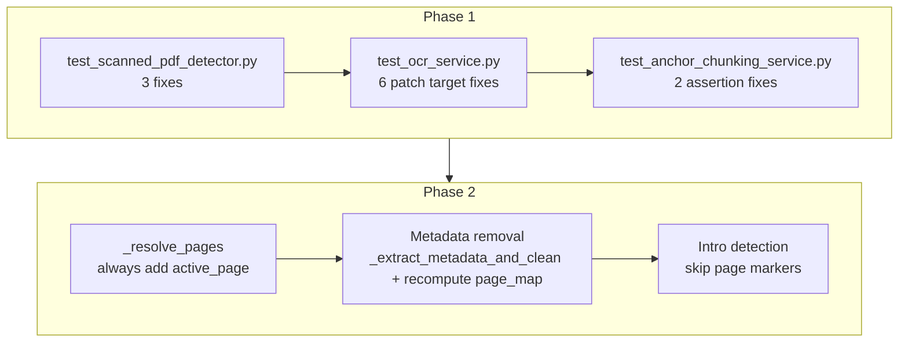

# Debug Plan: Post-Refactor Test Failures

## Overview

After the chunking pipeline refactor, 14 tests are failing across 3 test files. This document provides a root cause analysis for each failure and a step-by-step fix plan.

---

## Failure 1: `test_scanned_pdf_detector.py::TestIsScannedPdf::test_mixed_pdf_returns_false`

### Error
```
AssertionError: assert True is False
 +  where True = is_scanned_pdf('/tmp/tmp89q4d6ed.pdf')
```

### Root Cause
The mixed PDF has **page 1 typed** (with selectable text) and **page 2 scanned** (no text). The function should return `False` (typed) because page 1 has text. But it returns `True` (scanned).

Looking at [`_create_mixed_pdf`](src/backend/documents/tests/test_scanned_pdf_detector.py:85-115), page 1 inserts text `"این صفحه اول است و متن قابل انتخاب دارد."` — this is **38 characters** (including spaces). The threshold `_TYPED_TEXT_THRESHOLD = 50`. So 38 < 50, meaning the function treats page 1 as scanned too, and since page 2 also has no text, the whole PDF is classified as scanned.

**Fix:** Increase the text length in `_create_mixed_pdf` to exceed 50 characters.

---

## Failure 2: `test_scanned_pdf_detector.py::TestIsScannedPdf::test_empty_pdf_returns_true`

### Error
```
ValueError: cannot save with zero pages
```

### Root Cause
[`_create_empty_pdf`](src/backend/documents/tests/test_scanned_pdf_detector.py:118-132) creates a `fitz.open()` with no pages and tries to save it. In newer versions of PyMuPDF (fitz), saving a document with zero pages raises `ValueError: cannot save with zero pages`.

**Fix:** Create a PDF with **one blank page** (no text). The test expectation `is_scanned_pdf(pdf_path) is True` is still correct — a single blank page has 0 chars of selectable text, which is ≤ 50, so the function correctly returns `True` (scanned). Replace `_create_empty_pdf` with `_create_blank_pdf` that creates a 1-page PDF with no text.

---

## Failure 3: `test_scanned_pdf_detector.py::TestIsScannedPdf::test_invalid_path_raises_file_not_found`

### Error
```
pymupdf.FileNotFoundError: no such file: '/tmp/nonexistent_file_12345.pdf'
```

### Root Cause
The test expects `FileNotFoundError` (Python built-in), but PyMuPDF raises `fitz.FileNotFoundError` (which is `pymupdf.FileNotFoundError`). These are different exception types. `fitz.FileNotFoundError` is a subclass of `fitz.FileDataError`, not of Python's `FileNotFoundError`.

**Fix:** Change the expected exception from `FileNotFoundError` to `fitz.FileNotFoundError`.

---

## Failure 4: `test_ocr_service.py::TestTesseractFallback::test_tesseract_extraction`

### Error
```
AttributeError: module 'documents.services.ocr_service' does not have the attribute 'pytesseract'
```

### Root Cause
The test uses `@patch("documents.services.ocr_service.pytesseract")` to mock `pytesseract` at the module level. However, in [`ocr_service.py`](src/backend/documents/services/ocr_service.py), `pytesseract` is imported **locally inside methods** (`_check_tesseract` at line 273, `_extract_with_tesseract` at line 335), not at the module level. The `@patch` targets `documents.services.ocr_service.pytesseract` which doesn't exist as a module attribute.

**Fix:** Change the patch target to `"pytesseract.image_to_data"` (the actual import source).

---

## Failure 5: `test_ocr_service.py::TestTesseractFallback::test_tesseract_not_available`

### Error
```
AttributeError: module 'documents.services.ocr_service' has no attribute 'pytesseract'
```

### Root Cause
Same as Failure 4. The test patches `"documents.services.ocr_service.pytesseract.get_tesseract_version"` but `pytesseract` is not a module-level attribute in `ocr_service.py`.

**Fix:** Change the patch target to `"pytesseract.get_tesseract_version"` (patch at the actual import source).

---

## Failure 6-9: `test_ocr_service.py::TestExtractText` (4 tests)

### Error (all 4)
```
AttributeError: module 'documents.services.ocr_service' does not have the attribute 'convert_from_bytes'
```

### Root Cause
Same pattern as Failures 4-5. The tests use `@patch("documents.services.ocr_service.convert_from_bytes")` but `convert_from_bytes` is imported **locally** inside [`OcrService.extract_text`](src/backend/documents/services/ocr_service.py:131) (`from pdf2image import convert_from_bytes`), not at the module level.

**Fix:** Change the patch target to `"pdf2image.convert_from_bytes"` (the actual import source).

---

## Failure 10: `test_anchor_chunking_service.py::TestPageTracking::test_resolve_pages_cross_boundary`

### Error
```
assert [2] == [1, 2]
  At index 0 diff: 2 != 1
  Right contains one more item: 2
```

### Root Cause
The test calls [`_resolve_pages(5, 40, page_map)`](src/backend/documents/tests/test_anchor_chunking_service.py:173) on text `"[PAGE 1]\nمتن صفحه اول\n[PAGE 2]\nمتن صفحه دوم"`. The `[PAGE 1]` marker is at position 0, `[PAGE 2]` is at position ~22.

Looking at [`_resolve_pages`](src/backend/documents/services/anchor_chunking_service.py:388-421):

```python
for pos, page_num in page_map:
    if pos <= start:        # pos=0 <= start=5 → active_page = 1
        active_page = page_num
    if start <= pos < end:  # 5 <= 0 < 40? No. 5 <= 22 < 40? Yes → pages.add(2)
        pages.add(page_num)

# pages = {2}
# active_page = 1

# Second loop:
for pos, page_num in page_map:
    if start < pos < end:   # 5 < 0 < 40? No. 5 < 22 < 40? Yes → pages.add(2)
        pages.add(page_num)

# pages = {2}
# Since pages is not empty, we return [2]
```

**The bug:** When `start=5` and `pos=0` (the `[PAGE 1]` marker), `pos <= start` is True, so `active_page = 1`. But page 1 is never added to `pages` because the condition `start <= pos < end` is `5 <= 0 < 40` which is False. The range starts at position 5, which is AFTER the `[PAGE 1]` marker at position 0, so page 1 is never recorded.

**Fix:** In `_resolve_pages`, always add `active_page` to `pages` (remove the `if not pages` guard). This ensures that when a range starts after a page marker, the page that contains the start position is included.

---

## Failure 11: `test_anchor_chunking_service.py::TestAnchorSegmentation::test_single_anchor`

### Error
```
AssertionError: assert 'رأی دادگاه' in 'رای دادگاه'
 +  where 'رای دادگاه' = AnchorChunk(...).section_title
```

### Root Cause
The normalization in [`_normalize_persian`](src/backend/documents/services/anchor_chunking_service.py:323-346) does `re.sub(r"[أإآ]", "ا", text)` which converts `"رأی"` → `"رای"` (removes the Hamza from Alef). The `_SPLIT_ANCHORS` list has both `r"رأی دادگاه"` (with Hamza) and `r"رای دادگاه"` (without Hamza) as separate entries. The second pattern matches the normalized text `"رای دادگاه"`.

The `section_title` is set from `match.group(0)` which operates on the **normalized** text, yielding `"رای دادگاه"` (without Hamza). But the test asserts `"رأی دادگاه" in chunks[-1].section_title` — it expects the Hamza form.

**Fix:** Change the test assertion to check for `"رای دادگاه"` (normalized form). No code change needed — the normalized form is the canonical representation and is consistent with how all regex matching works.

---

## Failure 12: `test_anchor_chunking_service.py::TestAnchorSegmentation::test_anchor_content_preserved`

### Error
```
assert False
 +  where False = any(<generator object ...>)
```

### Root Cause
Same as Failure 11. The test checks `any("رأی دادگاه" in c.section_title for c in chunks)` but the normalized `section_title` is `"رای دادگاه"` (without Hamza).

**Fix:** Change the test assertion to check for `"رای دادگاه"` (normalized form). No code change needed.

---

## Failure 13: `test_anchor_chunking_service.py::TestMetadataSeparation::test_metadata_separate_from_content`

### Error
```
AssertionError: assert '۱۲۳۴۵۶۷۸۹۰' not in '[PAGE 1]\nکلاسه پرونده: ۱۲۳۴۵۶۷۸۹۰\n...'
```

### Root Cause
The test expects that metadata (like case number `"۱۲۳۴۵۶۷۸۹۰"`) is NOT in the chunk content. But [`_extract_metadata`](src/backend/documents/services/anchor_chunking_service.py:352) only **copies** metadata to a dict — it never **removes** the metadata lines from the text. So metadata appears in BOTH `chunk.metadata` AND `chunk.content`.

**Fix:** After extracting metadata, **remove** the matched metadata lines from the text before chunking. Use `re.sub` with `re.MULTILINE` to remove entire lines containing metadata patterns, which handles edge cases better than manual `rfind`/`find` boundary detection.

**IMPORTANT:** After removing metadata lines, the text length changes, which shifts `[PAGE N]` marker positions. The `page_map` must be recomputed from the cleaned text, not the original text.

---

## Failure 14: `test_anchor_chunking_service.py::TestEdgeCases::test_anchor_at_text_start`

### Error
```
AssertionError: assert 'مقدمه' != 'مقدمه'
```

### Root Cause
The test text is `"[PAGE 1]\nرأی دادگاه\nمتن رأی"`. The anchor `"رأی دادگاه"` is at the start of the actual content (after `[PAGE 1]\n`). The code checks `if matches[0].start() > 0` — since `matches[0].start()` = 9 (position of `"رای دادگاه"` in normalized text, after `[PAGE 1]\n`), this is True, so the code creates an intro section with `section_title = "مقدمه"`.

The intro content is `text[:9]` = `"[PAGE 1]\n"` which after `.strip()` is `"[PAGE 1]"` — non-empty, so an intro chunk is created. The test asserts `chunks[0].section_title != "مقدمه"` but gets exactly that.

**Fix:** The intro detection should skip page markers. After stripping `[PAGE N]` markers from the intro text, check if any real content remains before creating an intro chunk.

---

## Summary of Root Causes

| # | Test | Root Cause | Fix Category |
|---|------|-----------|-------------|
| 1 | `test_mixed_pdf_returns_false` | Test text (38 chars) below 50-char threshold | **Test fix** |
| 2 | `test_empty_pdf_returns_true` | PyMuPDF v24+ doesn't allow saving 0-page documents | **Test fix** |
| 3 | `test_invalid_path_raises_file_not_found` | Wrong exception type expected (Python vs fitz) | **Test fix** |
| 4 | `test_tesseract_extraction` | Wrong patch target (module-level vs local import) | **Test fix** |
| 5 | `test_tesseract_not_available` | Wrong patch target (module-level vs local import) | **Test fix** |
| 6-9 | `test_extract_text_*` (4 tests) | Wrong patch target (module-level vs local import) | **Test fix** |
| 10 | `test_resolve_pages_cross_boundary` | `_resolve_pages` doesn't add `active_page` when range starts after marker | **Code fix** |
| 11 | `test_single_anchor` | Normalized section_title differs from test expectation | **Test fix** (no code change needed) |
| 12 | `test_anchor_content_preserved` | Same as #11 | **Test fix** (no code change needed) |
| 13 | `test_metadata_separate_from_content` | Metadata extracted but not removed from text before chunking | **Code fix** |
| 14 | `test_anchor_at_text_start` | Page markers before anchor cause false intro section | **Code fix** |

---

## Fix Plan

### Phase 1: Fix Test Files (11 test fixes)

#### Fix 1: [`test_scanned_pdf_detector.py`](src/backend/documents/tests/test_scanned_pdf_detector.py)
1. **`_create_mixed_pdf`**: Increase page 1 text to exceed 50 characters (e.g., repeat the sentence or add more Persian text)
2. **`_create_empty_pdf` → `_create_blank_pdf`**: Create a 1-page PDF with no text (blank page). Rename the helper and update the test call. The test expectation `is_scanned_pdf(pdf_path) is True` remains correct.
3. **`test_invalid_path_raises_file_not_found`**: Change `pytest.raises(FileNotFoundError)` to `pytest.raises(fitz.FileNotFoundError)`

#### Fix 2: [`test_ocr_service.py`](src/backend/documents/tests/test_ocr_service.py)
4. **`test_tesseract_extraction`**: Change patch from `"documents.services.ocr_service.pytesseract"` to `"pytesseract.image_to_data"`
5. **`test_tesseract_not_available`**: Change patch from `"documents.services.ocr_service.pytesseract.get_tesseract_version"` to `"pytesseract.get_tesseract_version"`
6. **All 4 `TestExtractText` tests**: Change `@patch("documents.services.ocr_service.convert_from_bytes")` to `@patch("pdf2image.convert_from_bytes")`

#### Fix 3: [`test_anchor_chunking_service.py`](src/backend/documents/tests/test_anchor_chunking_service.py)
7. **`test_single_anchor`**: Change assertion to check for normalized form `"رای دادگاه"` instead of `"رأی دادگاه"`
8. **`test_anchor_content_preserved`**: Change assertion to check for normalized form `"رای دادگاه"` instead of `"رأی دادگاه"`

### Phase 2: Fix Source Code (3 code fixes in [`anchor_chunking_service.py`](src/backend/documents/services/anchor_chunking_service.py))

#### Fix 4: `_resolve_pages` — active_page logic
**Change:** Remove the `if not pages:` guard. Always add `active_page` to `pages`:

```python
@staticmethod
def _resolve_pages(start: int, end: int, page_map: List[tuple]) -> List[int]:
    pages: set = set()
    active_page = 1

    for pos, page_num in page_map:
        if pos <= start:
            active_page = page_num
        if start <= pos < end:
            pages.add(page_num)

    # Always add active_page — this handles ranges that start
    # after a page marker but before the next one
    pages.add(active_page)

    # Also check if end position crosses a page boundary
    for pos, page_num in page_map:
        if start < pos < end:
            pages.add(page_num)

    return sorted(pages)
```

#### Fix 5: Metadata removal from content
**Change:** Replace `_extract_metadata` with `_extract_metadata_and_clean` that removes metadata lines from text using `re.sub` with `re.MULTILINE`:

```python
def _extract_metadata_and_clean(self, text: str) -> tuple[dict, str]:
    """Extract metadata and remove metadata lines from text.
    
    Uses re.sub with MULTILINE to remove entire lines containing
    metadata patterns. This is more robust than manual line boundary
    detection with rfind/find.
    
    Returns:
        Tuple of (metadata_dict, cleaned_text_without_metadata_lines).
    """
    metadata = {}
    cleaned = text
    
    for key, pattern in self._METADATA_PATTERNS.items():
        match = pattern.search(cleaned)
        if match:
            metadata[key] = match.group(1).strip()
            # Remove the entire line containing the match
            # Pattern matches from start of line to newline
            line_pattern = re.compile(
                r"^.*" + pattern.pattern + r".*$", re.MULTILINE
            )
            cleaned = line_pattern.sub("", cleaned)
            # Clean up resulting double newlines
            cleaned = re.sub(r"\n\s*\n", "\n", cleaned).strip()
    
    return metadata, cleaned
```

**IMPORTANT:** After calling `_extract_metadata_and_clean`, the `page_map` must be recomputed from the cleaned text since positions have shifted:

```python
# In chunk_text():
# Step 1: Extract metadata AND remove metadata lines from text
metadata, cleaned_text = self._extract_metadata_and_clean(text)

# Step 2: Parse page markers from CLEANED text (positions may have shifted)
page_map = self._parse_page_markers(cleaned_text)

# Step 3: Normalize cleaned text for matching
normalized = self._normalize_persian(cleaned_text)

# ... rest of chunking uses cleaned_text instead of text
```

#### Fix 6: Intro detection — skip page markers
**Change:** When checking if there's intro content before the first anchor, strip `[PAGE N]` markers before deciding:

```python
# Section before first anchor
if matches[0].start() > 0:
    intro = text[:matches[0].start()].strip()
    # Skip page markers — they're not real content
    intro_without_markers = _PAGE_MARKER_RE.sub("", intro).strip()
    if intro_without_markers:
        pages = self._resolve_pages(0, matches[0].start(), page_map)
        for ct in self._token_overlap_split(
            intro, chunk_tokens, overlap_tokens
        ):
            final_chunks.append(
                AnchorChunk(
                    content=ct,
                    pages=pages,
                    char_count=len(ct),
                    token_count=len(self._encoding.encode(ct)),
                    metadata=dict(metadata),
                    section_title="مقدمه",
                )
            )
```

---

## Implementation Order



### Step-by-Step Execution

1. **Fix `test_scanned_pdf_detector.py`** — 3 changes (text length, blank PDF creation, exception type)
2. **Fix `test_ocr_service.py`** — 6 patch target changes (all `@patch` decorators)
3. **Fix `test_anchor_chunking_service.py`** — 2 assertion changes (normalized section_title)
4. **Fix `_resolve_pages`** — Remove `if not pages` guard, always add `active_page`
5. **Fix metadata removal** — Add `_extract_metadata_and_clean`, recompute `page_map` from cleaned text
6. **Fix intro detection** — Skip page markers in intro content check
7. **Run all tests** — Verify all 14 failures are resolved

---

## Key Design Decisions (Updated)

| Decision | Rationale |
|----------|-----------|
| **section_title uses normalized form** | All regex matching is on normalized text; using normalized form is consistent. Test assertions updated accordingly. No code change needed. |
| **Metadata removal via `str.splitlines` filtering** | Simpler and more robust than regex composition. Avoids greedy matching issues with `r\"^.*\" + pattern.pattern + r\".*$\"`. Each line is checked independently against all metadata patterns. |
| **page_map recomputed after metadata removal** | Removing metadata lines shifts text positions, invalidating original page_map. Must re-parse from cleaned text. |
| **Blank PDF = 1 page with no text** | PyMuPDF v24+ rejects 0-page saves. A 1-page blank PDF is semantically equivalent for testing — 0 chars selectable text → `is_scanned_pdf` returns `True`. |
