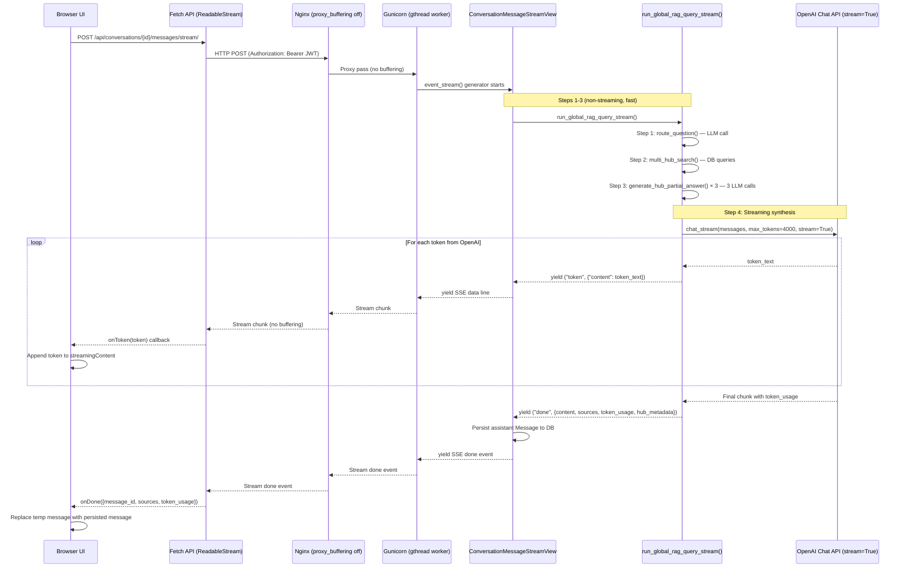

# Debug Plan: Fix Answer Truncation & Streaming Issues in Global RAG

## Problem Summary

The user reported two critical bugs when using Global RAG at the Legal Research UI:

1. **Answer truncation**: The response was cut off mid-sentence at "صرفاً ع" — the synthesis step ran out of `max_tokens`.
2. **Streaming not working**: The response appears all at once after ~2 minutes of waiting, instead of streaming token-by-token.

---

## Bug 1: Answer Truncation — Root Cause & Fix

### Root Cause

The synthesis step in [`synthesize_answers()`](src/backend/conversations/global_rag_service.py:518) uses:
```python
max_tokens=settings.CHAT_MAX_TOKENS * 2,  # 2000 tokens
```

The user's response was **12,336 tokens** total. The synthesis LLM must merge 3 partial answers (legislation, judicial precedent, advisory opinions) with conflict detection into a comprehensive Persian legal answer. 2000 completion tokens is insufficient — the model gets cut off mid-sentence.

### Fix

Increase `max_tokens` for the synthesis step from 2000 to **4000** (or `CHAT_MAX_TOKENS * 4`).

**Files to modify:**
- [`src/backend/conversations/global_rag_service.py`](src/backend/conversations/global_rag_service.py) — Line 591: Change `settings.CHAT_MAX_TOKENS * 2` to `settings.CHAT_MAX_TOKENS * 4`
- [`src/backend/conversations/global_rag_service.py`](src/backend/conversations/global_rag_service.py) — Line 1045: Same change in the streaming variant

**Alternative (preferred):** Add a dedicated `SYNTHESIS_MAX_TOKENS` setting in [`src/backend/config/settings.py`](src/backend/config/settings.py) so it can be tuned independently:
```python
SYNTHESIS_MAX_TOKENS = env.int("SYNTHESIS_MAX_TOKENS", default=4000)
```

Then reference it in both `synthesize_answers()` and `run_global_rag_query_stream()`.

---

## Bug 2: Streaming Not Working — Root Cause Analysis

### Deployment Topology

```
Browser ──► Nginx (port 80) ──► Gunicorn (port 8000, 3 workers)
                ▲
                │
          Frontend Dev Server (port 5173, Vite)
```

The frontend's [`sendMessageStream()`](src/frontend/src/api/conversations.ts:258) constructs the URL as:
```typescript
`${import.meta.env.VITE_API_URL || 'http://localhost:8000/api/'}conversations/${conversationId}/messages/stream/`
```

In **development** (`.env.development`): `VITE_API_URL=http://localhost:8000/api` — goes **directly to Django/Gunicorn**, bypassing Nginx.
In **production** (`.env.production`): `VITE_API_URL=/api` — goes through Nginx.

### Potential Causes (in priority order)

#### Cause A: Gunicorn Buffering (MOST LIKELY)

Gunicorn with 3 workers and the default sync worker class **does not support streaming responses properly**. The `StreamingHttpResponse` generator runs in a sync worker, and Gunicorn may buffer the entire response before sending it to the client.

**Evidence:**
- [`entrypoint.sh:33-38`](docker/backend/entrypoint.sh:33) shows Gunicorn is started with `--workers 3` using the default sync worker.
- The sync worker class in Gunicorn does not support true streaming — it collects the entire response body before sending.

**Fix options:**
1. **Switch to `gevent` worker class** — Gunicorn with `--worker-class gevent` can handle streaming properly. Requires `gevent` in requirements.
2. **Use `uvicorn` workers** — `--worker-class uvicorn.workers.UvicornWorker` with ASGI. Requires `uvicorn` and `asgiref`.
3. **Use `gthread` worker class** — `--worker-class gthread --threads 4` — Gunicorn's threaded worker can handle streaming better than sync.
4. **Add `--keep-alive` and disable response buffering** — Gunicorn flags like `--enable-stdio-inheritance` and ensuring `PYTHONUNBUFFERED=1` (already set).

**Recommended fix:** Switch to `gthread` worker class with threads, which is the simplest change with minimal dependency impact:
```bash
exec gunicorn config.wsgi:application \
    --bind 0.0.0.0:8000 \
    --worker-class gthread \
    --threads 4 \
    --workers 3 \
    --timeout 120 \
    --max-requests 1000 \
    --max-requests-jitter 100
```

#### Cause B: Nginx Buffering (Production / Nginx path)

Even if the frontend goes through Nginx, the Nginx config at [`docker/nginx/nginx.conf:97-129`](docker/nginx/nginx.conf:97) does **not** explicitly disable `proxy_buffering` for the `/api/` location.

While the view sets `X-Accel-Buffering: no` header (line 602 of views.py), Nginx's default `proxy_buffering on` may still buffer small chunks.

**Fix:** Add to the `/api/` location block in [`docker/nginx/nginx.conf`](docker/nginx/nginx.conf):
```nginx
proxy_buffering off;
proxy_cache off;
```

#### Cause C: Gzip Compression of SSE Stream

Nginx has `gzip on` and `gzip_types` includes `application/json`. SSE responses are `text/event-stream`, which is NOT in the list. However, if any middleware or proxy compresses the stream, it breaks SSE.

**Check:** Ensure no middleware is compressing `text/event-stream`.

#### Cause D: Frontend Fetch API Buffer Behavior

The frontend uses the Fetch API with `ReadableStream` at [`conversations.ts:293`](src/frontend/src/api/conversations.ts:293). The `getReader()` method should work for streaming, but there could be issues with:
- The `buffer` accumulation logic (line 305-307) — splitting on `\n` and re-buffering
- The `decoder.decode(value, { stream: true })` — this is correct for UTF-8 streaming

This is **unlikely** to be the primary cause since the same code works for local_rag streaming.

---

## Debug Plan — Step by Step

### Step 1: Fix Answer Truncation (Quick Fix)

**Action:** Increase synthesis `max_tokens` from 2000 to 4000.

**Files:**
1. [`src/backend/conversations/global_rag_service.py`](src/backend/conversations/global_rag_service.py) — Line 591: `max_tokens=settings.CHAT_MAX_TOKENS * 4`
2. [`src/backend/conversations/global_rag_service.py`](src/backend/conversations/global_rag_service.py) — Line 1045: Same change in streaming variant

**Verification:** Send a complex Persian legal query and verify the full response is no longer truncated.

### Step 2: Fix Gunicorn Streaming (Primary Fix for Streaming)

**Action:** Change Gunicorn worker class from sync to `gthread` to support streaming responses.

**Files:**
1. [`docker/backend/entrypoint.sh`](docker/backend/entrypoint.sh) — Add `--worker-class gthread --threads 4` to Gunicorn command
2. [`src/backend/requirements.txt`](src/backend/requirements.txt) — No new dependencies needed (gthread is built-in)

**Verification:** After rebuilding containers (`docker-compose up --build -d`), send a Global RAG query via the streaming endpoint and verify tokens arrive incrementally.

### Step 3: Fix Nginx Buffering (Defense in Depth)

**Action:** Disable proxy buffering for the `/api/` location to ensure SSE streams are not buffered by Nginx.

**Files:**
1. [`docker/nginx/nginx.conf`](docker/nginx/nginx.conf) — Add `proxy_buffering off; proxy_cache off;` to the `/api/` location block

**Verification:** After rebuilding Nginx, verify streaming still works through the Nginx path.

### Step 4: Add `SYNTHESIS_MAX_TOKENS` Setting (Clean Architecture)

**Action:** Add a dedicated environment variable for synthesis max_tokens so it can be tuned independently of `CHAT_MAX_TOKENS`.

**Files:**
1. [`src/backend/config/settings.py`](src/backend/config/settings.py) — Add `SYNTHESIS_MAX_TOKENS = env.int("SYNTHESIS_MAX_TOKENS", default=4000)`
2. [`src/backend/conversations/global_rag_service.py`](src/backend/conversations/global_rag_service.py) — Replace `settings.CHAT_MAX_TOKENS * 4` with `settings.SYNTHESIS_MAX_TOKENS` in both `synthesize_answers()` and `run_global_rag_query_stream()`

### Step 5: Run Tests

**Action:** Run existing backend tests to ensure no regressions.

```bash
docker-compose exec backend pytest
```

### Step 6: Manual Verification

**Action:** Test the full flow end-to-end.

1. Create a Global RAG conversation
2. Send a complex Persian legal query (e.g., "مسئولیت کیفری شخص حقوقی در قانون مجازات اسلامی چگونه است و آیا رویه قضایی خاصی در این مورد وجود دارد؟")
3. Verify:
   - Tokens arrive incrementally in the UI (not all at once)
   - Response is complete (not truncated)
   - Sources and hub_metadata are correctly returned

---

## Files to Modify (Summary)

| # | File | Change | Priority |
|---|------|--------|----------|
| 1 | [`src/backend/conversations/global_rag_service.py`](src/backend/conversations/global_rag_service.py) (line 591) | `max_tokens=settings.CHAT_MAX_TOKENS * 4` | **HIGH** — Fixes truncation |
| 2 | [`src/backend/conversations/global_rag_service.py`](src/backend/conversations/global_rag_service.py) (line 1045) | Same change in streaming variant | **HIGH** — Fixes truncation |
| 3 | [`docker/backend/entrypoint.sh`](docker/backend/entrypoint.sh) (line 33) | Add `--worker-class gthread --threads 4` | **HIGH** — Fixes streaming |
| 4 | [`docker/nginx/nginx.conf`](docker/nginx/nginx.conf) (line 97) | Add `proxy_buffering off; proxy_cache off;` | **MEDIUM** — Defense in depth |
| 5 | [`src/backend/config/settings.py`](src/backend/config/settings.py) | Add `SYNTHESIS_MAX_TOKENS` setting | **LOW** — Clean architecture |

---

## Architecture Diagram: Streaming Data Flow (After Fix)



---

## Rollback Plan

If any change causes issues:

1. **Gunicorn change**: Revert `entrypoint.sh` to original sync worker config
2. **Nginx change**: Remove `proxy_buffering off` from nginx.conf
3. **max_tokens change**: Revert to `CHAT_MAX_TOKENS * 2` or original `CHAT_MAX_TOKENS`
4. **SYNTHESIS_MAX_TOKENS**: Remove the setting and revert to inline multiplication

All changes are isolated and independently revertible.
