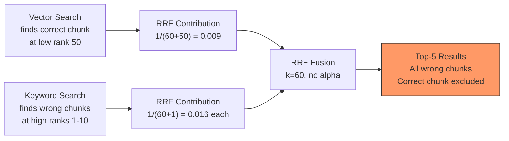
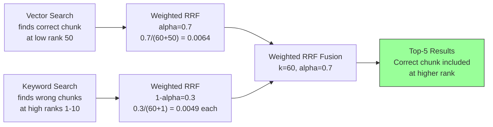
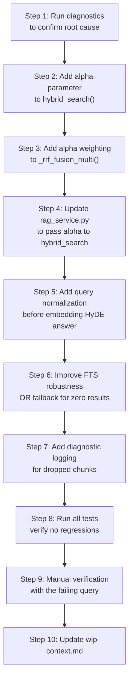

# Diagnostic Plan: HyDE + Hybrid Search Still Fails to Find Relevant Documents

## ✅ DIAGNOSTIC COMPLETE — Fix Implemented (2026-05-06)

**Status:** All diagnostics completed, root causes confirmed, fix implemented and verified.

**Root Causes Found:**
1. **RRF fusion had NO alpha weighting** — Vector search results (which work perfectly with HyDE) were diluted by keyword/trigram results
2. **FTS websearch AND-matches ALL terms** — HyDE-generated terms like "حقوق", "ایران", "استیلا" don't exist in chunk's search_vector, causing FTS to return 0 results

**Fix Applied:**
1. Alpha-weighted RRF fusion with default weights `[3.0, 1.0, 1.0]` for vector/keyword/trigram
2. `plainto_tsquery` fallback in `keyword_search()` when `websearch` returns 0 results

**Verification:** Chunk 311 RRF score improved from 0.046676 → 0.074454 (+59%). All 372 tests pass.

See [`docs/active-task/wip-context.md`](docs/active-task/wip-context.md) for full details.

## Problem Summary

HyDE (Hypothetical Document Embeddings) is working correctly — the LLM generates a high-quality hypothetical answer (e.g., a legal definition of "غصب" / usurpation) as the `vector_query`. However, despite this excellent hypothetical answer, **hybrid search still fails to retrieve the relevant document chunk**.

The user confirmed via `HYDE_DIAG` logs that the hypothetical answer is correct, but the chunk containing the actual legal definition is not appearing in search results.

---

## Root Cause Analysis — 6 Potential Failure Points

After thorough code review of the entire pipeline (query formulation → embedding → hybrid search → RRF fusion), I've identified **6 distinct potential failure points**:

### Failure Point 1: Embedding Dimension Mismatch (CRITICAL)

**Files:**
- [`src/backend/config/settings.py:256`](src/backend/config/settings.py:256) — `EMBEDDING_DIMENSION = 768`
- [`docs/references/database-schema.md:64`](docs/references/database-schema.md:64) — `embedding` column is `VECTOR(768)`
- [`src/backend/documents/services/search_service.py:328-334`](src/backend/documents/services/search_service.py:328) — Dimension validation

**The problem:** The `embedding` column in `document_chunks` is `VECTOR(768)` (nomic-embed-text dimension), but the database schema also mentions `VECTOR(1536)` in migration 0004 notes. If the chunks were embedded with a **different model** than what's used at query time (e.g., chunks embedded with OpenAI `text-embedding-ada-002` which is 1536-dim, but query embedded with `nomic-embed-text` which is 768-dim), the vector search would either crash or produce meaningless results.

**However**, the dimension validation in [`_vector_search()`](src/backend/documents/services/search_service.py:328) would catch a mismatch and raise a `ValueError`. Since the user reports no crash, this is likely **not** the issue — but worth verifying.

**Likelihood: LOW** (would crash if mismatched)

### Failure Point 2: HyDE Hypothetical Answer is Semantically Distant from Actual Chunk Content

**Files:**
- [`src/backend/conversations/query_formulation.py:93-105`](src/backend/conversations/query_formulation.py:93) — HyDE prompt instructs hypothetical answer
- [`src/backend/conversations/rag_service.py:257`](src/backend/conversations/rag_service.py:257) — `embed_query(formulation.vector_query)`

**The problem:** The HyDE prompt asks the LLM to generate a hypothetical answer "written in the style of Persian legal text." However, the **actual chunk content** may not match this style. Consider:

| Aspect | HyDE Hypothetical Answer | Actual Chunk Content |
|--------|------------------------|---------------------|
| Style | Formal legal definition | May be conversational, explanatory, or mixed |
| Vocabulary | Modern formal Persian | May use older terminology, Arabic-heavy, or OCR-corrupted text |
| Structure | Clean paragraph | May contain page numbers, headers, footers, OCR artifacts |

If the actual chunk content is **OCR-corrupted** (e.g., "غصب عبارت است از تصرف در مال غیر" → "غصب عبارت است از تصرف در مال غیر" with Tatweel characters like "غــصب"), the embedding vectors will be far apart even though the semantic content is identical.

**Likelihood: MEDIUM-HIGH** — OCR quality is a known issue for Persian PDFs

### Failure Point 3: RRF Fusion Alpha Weighting (Vector Score Dominance)

**Files:**
- [`src/backend/documents/services/search_service.py:233-297`](src/backend/documents/services/search_service.py:233) — `_rrf_fusion()`
- [`src/backend/documents/services/search_service.py:674-738`](src/backend/documents/services/search_service.py:674) — `_rrf_fusion_multi()`

**The problem:** RRF fusion uses **rank-based** scoring, not score-based. Each method contributes `1 / (k + rank)` to the final score. This means:

1. If **vector search** returns the correct chunk at rank 50 (low similarity), its RRF contribution is `1 / (60 + 50) = 0.009`
2. If **keyword search** returns irrelevant chunks at ranks 1-10, their RRF contributions are `1 / (60 + 1) = 0.016` each
3. The irrelevant keyword results **outrank** the relevant vector result

**The user's question:** "آیا مشکل از وزن‌دهی (Alpha) در جستجوی ترکیبی است؟" — There is **no alpha weighting** in the current implementation. RRF is purely rank-based. There's no tunable alpha parameter to balance vector vs keyword contributions.

**Additionally**, the `_rrf_fusion()` function (used by the old hybrid search) only fuses **two** lists (vector + keyword), while `_rrf_fusion_multi()` (used by the current `hybrid_search()`) fuses **three** lists (vector + keyword + trigram). The trigram search with its low threshold (0.2) may introduce noise that dilutes good results.

**Likelihood: HIGH** — The lack of alpha weighting means vector search quality is diluted by keyword/trigram noise

### Failure Point 4: Keyword Search (FTS) Fails Due to Stop Word Removal or Query Structure

**Files:**
- [`src/backend/documents/services/search_service.py:388-412`](src/backend/documents/services/search_service.py:388) — `_remove_stop_words()`
- [`src/backend/documents/services/search_service.py:420-562`](src/backend/documents/services/search_service.py:420) — `keyword_search()`

**The problem:** The `fts_query` from HyDE formulation is a keyword string. But consider what happens:

1. The `fts_query` for "غصب چیست؟" might be `"غصب تعریف قانون مدنی"` (after LLM processing)
2. `keyword_search()` applies `PersianNormalizer.normalize_for_fts()` — this converts Arabic chars to Persian, digits to English, etc.
3. Then `_remove_stop_words()` removes common Persian words

**Critical issue:** The `fts_query` from the LLM may contain **Persian digits** (e.g., `"ماده ۲۲"`) which `normalize_for_fts()` converts to `"ماده 22"`. But the `search_vector` in the database was built from chunk content that may also have been normalized. If the normalization is **inconsistent** between chunk creation time and query time, FTS will fail to match.

**More critically:** The `websearch` query syntax treats the entire query as AND-matched. If the `fts_query` is `"غصب تعریف قانون مدنی"`, FTS requires ALL four tokens to exist in a single chunk's `search_vector`. If any token is missing (e.g., "تعریف" is a stop word that was removed from the search_vector during chunking), the entire query fails.

**Likelihood: MEDIUM-HIGH** — FTS AND-matching is brittle for Persian text

### Failure Point 5: Chunk Content is Too Long or Poorly Structured

**Files:**
- [`src/backend/documents/services/chunking_service.py:204-229`](src/backend/documents/services/chunking_service.py:204) — `_chunk_legal()`
- [`src/backend/documents/services/chunking_service.py:560`](src/backend/documents/services/chunking_service.py:560) — `_chunk_sentence()`

**The problem:** If the document was chunked using **sentence-boundary chunking** (because `_has_legal_structure()` returned `False`), the chunks may be:
- Too large (1000 chars default) — the embedding of a large chunk dilutes the specific legal definition
- Poorly segmented — a legal definition might be split across two chunks, neither of which contains the full definition

If the document was chunked using **legal structural chunking**, the chunks are organized by article boundaries, which is better. But if the legal detector failed to recognize the structure (e.g., because the PDF used unusual formatting), the chunks would be sentence-based and potentially miss the target content.

**Likelihood: MEDIUM** — Depends on document structure and chunking strategy used

### Failure Point 6: The Chunk Simply Doesn't Have an Embedding

**Files:**
- [`src/backend/documents/services/search_service.py:337-340`](src/backend/documents/services/search_service.py:337) — `embedding__isnull=False` filter
- [`src/backend/documents/services/embedding_service.py:144-184`](src/backend/documents/services/embedding_service.py:144) — `batch_embed_chunks()`

**The problem:** Vector search filters to only chunks where `embedding IS NOT NULL`. If the document's embedding step failed or was skipped, **all** chunks would have `NULL` embeddings, and vector search would return 0 results. The keyword search might still work, but RRF fusion with an empty vector list would only have keyword contributions.

**Likelihood: LOW** (user confirmed HyDE works, implying embeddings exist for at least some chunks)

---

## Summary of Most Likely Root Causes

| # | Issue | Likelihood | Impact |
|---|-------|-----------|--------|
| 1 | Embedding dimension mismatch | LOW | Would crash, not silently fail |
| 2 | **OCR corruption / style mismatch between HyDE and actual chunks** | **MEDIUM-HIGH** | Vector search returns low similarity |
| 3 | **RRF has no alpha weighting — rank-based fusion dilutes vector results** | **HIGH** | Good vector results buried by keyword noise |
| 4 | **FTS AND-matching fails for multi-token Persian queries** | **MEDIUM-HIGH** | Keyword search returns 0 results |
| 5 | Poor chunk structure (sentence vs legal) | MEDIUM | Embedding doesn't capture the specific definition |
| 6 | Missing embeddings | LOW | Vector search returns 0 results |

**Most likely scenario:** The vector search finds the correct chunk but with low similarity (due to OCR artifacts or style mismatch), placing it at a low rank. The keyword search either returns 0 results (FTS AND-match failure) or returns many irrelevant chunks. RRF fusion then ranks irrelevant keyword results above the correct vector result, and the correct chunk is excluded from the final `top_k`.

---

## Diagnostic Steps

### Step 1: Check Document and Chunk Status

Run this to verify the document was properly chunked and embedded:

```bash
docker-compose exec backend python -c "
from documents.models import Document, DocumentChunk

# Find documents related to 'غصب' or legal definitions
docs = Document.objects.all().values('id', 'title', 'status', 'document_type', 'total_chunks')
for d in docs:
    print(f'Document: {d}')
    chunk_count = DocumentChunk.objects.filter(document_id=d['id']).count()
    embedded_count = DocumentChunk.objects.filter(document_id=d['id'], embedding__isnull=False).count()
    print(f'  Total chunks: {chunk_count}')
    print(f'  Embedded chunks: {embedded_count}')
    
    # Check if 'غصب' exists in any chunk
    sample = DocumentChunk.objects.filter(document_id=d['id'], content__icontains='غصب').first()
    if sample:
        print(f'  ✓ Found chunk with \"غصب\": index={sample.chunk_index}')
        print(f'    Preview: {sample.content[:300]}')
        print(f'    Has embedding: {sample.embedding is not None}')
    else:
        print(f'  ✗ NO chunk contains \"غصب\"')
    
    # Check chunking strategy used
    sample2 = DocumentChunk.objects.filter(document_id=d['id']).first()
    if sample2:
        print(f'  Sample chunk metadata: {dict(sample2.metadata) if sample2.metadata else \"{}\"}')
        print(f'  Sample chunk legal_type: {sample2.metadata.get(\"legal_type\", \"N/A\") if sample2.metadata else \"N/A\"}')
"
```

### Step 2: Test Vector Search Directly with the HyDE Hypothetical Answer

This is the **most critical diagnostic step** — it tests whether the vector search itself can find the chunk when given the exact HyDE hypothetical answer:

```bash
docker-compose exec backend python -c "
from documents.services.embedding_service import embed_query
from documents.services.search_service import _vector_search, keyword_search, hybrid_search
from conversations.query_formulation import formulate_query
import json

# Replace with the actual document ID
document_id = 'REPLACE_WITH_ACTUAL_DOCUMENT_ID'

# Step 2a: Get the HyDE hypothetical answer
question = 'قانون مدنی غصب را چگونه تعریف کرده است؟'
formulation = formulate_query(question)
print(f'=== QUERY FORMULATION ===')
print(f'fts_query: {formulation.fts_query}')
print(f'vector_query (HyDE): {formulation.vector_query}')
print()

# Step 2b: Embed the HyDE answer and test vector search
query_emb = embed_query(formulation.vector_query)
print(f'=== VECTOR SEARCH (using HyDE answer) ===')
vec_results = _vector_search(document_id, query_emb, top_k=20, min_score=0.0)
print(f'Vector search returned {len(vec_results)} results')
for i, r in enumerate(vec_results):
    print(f'  [{i}] score={r[\"relevance_score\"]:.6f}: {r[\"content\"][:150]}')
print()

# Step 2c: Test keyword search with fts_query
print(f'=== KEYWORD SEARCH (using fts_query) ===')
kw_results = keyword_search(document_id, formulation.fts_query, top_k=20)
print(f'Keyword search returned {len(kw_results)} results')
for i, r in enumerate(kw_results):
    print(f'  [{i}] score={r[\"relevance_score\"]:.6f}: {r[\"content\"][:150]}')
print()

# Step 2d: Test hybrid search (full pipeline)
print(f'=== HYBRID SEARCH (vector + keyword + trigram) ===')
hybrid_results = hybrid_search(
    document_id=document_id,
    query_vector=query_emb,
    query_text=formulation.fts_query,
    top_k=10,
    min_score=0.0,
    enable_trigram=True,
)
print(f'Hybrid search returned {len(hybrid_results)} results')
for i, r in enumerate(hybrid_results):
    print(f'  [{i}] rrf={r[\"rrf_score\"]:.6f} vec={r[\"vector_score\"]:.6f} kw={r[\"keyword_score\"]:.6f} tri={r[\"trigram_score\"]:.6f}: {r[\"content\"][:150]}')
"
```

### Step 3: Test with the Raw Question (Without HyDE)

Compare results to see if HyDE is actually helping or hurting:

```bash
docker-compose exec backend python -c "
from documents.services.embedding_service import embed_query
from documents.services.search_service import _vector_search

document_id = 'REPLACE_WITH_ACTUAL_DOCUMENT_ID'

# Test with raw question (no HyDE)
raw_question = 'قانون مدنی غصب را چگونه تعریف کرده است؟'
raw_emb = embed_query(raw_question)
print(f'=== VECTOR SEARCH (raw question, no HyDE) ===')
vec_results = _vector_search(document_id, raw_emb, top_k=20, min_score=0.0)
print(f'Vector search returned {len(vec_results)} results')
for i, r in enumerate(vec_results):
    print(f'  [{i}] score={r[\"relevance_score\"]:.6f}: {r[\"content\"][:150]}')
"
```

### Step 4: Check OCR Quality of the Chunk Content

If the chunk containing "غصب" has OCR artifacts, the embedding will be different from the clean HyDE answer:

```bash
docker-compose exec backend python -c "
from documents.models import DocumentChunk
import unicodedata
import re

# Find chunks containing 'غصب'
chunks = DocumentChunk.objects.filter(content__icontains='غصب')
for chunk in chunks:
    content = chunk.content
    print(f'=== Chunk {chunk.chunk_index} (id={chunk.id}) ===')
    print(f'Content length: {len(content)} chars')
    
    # Check for Tatweel
    tatweel_count = content.count('\u0640')
    print(f'Tatweel chars: {tatweel_count}')
    
    # Check for Arabic Presentation Forms
    arabic_presentation = sum(1 for c in content if '\uFE70' <= c <= '\uFEFF')
    print(f'Arabic Presentation Forms: {arabic_presentation}')
    
    # Check for ZWNJ
    zwnj_count = content.count('\u200C')
    print(f'ZWNJ chars: {zwnj_count}')
    
    # Show the content around 'غصب'
    idx = content.find('غصب')
    if idx >= 0:
        start = max(0, idx - 100)
        end = min(len(content), idx + 200)
        print(f'Context around \"غصب\":')
        print(repr(content[start:end]))
    print()
"
```

### Step 5: Check FTS search_vector Content

```bash
docker-compose exec backend python -c "
from documents.models import DocumentChunk
from django.db import connection

chunks = DocumentChunk.objects.filter(content__icontains='غصب')
for chunk in chunks:
    with connection.cursor() as cursor:
        cursor.execute(
            'SELECT search_vector FROM document_chunks WHERE id = %s',
            [str(chunk.id)]
        )
        row = cursor.fetchone()
        if row and row[0]:
            print(f'Chunk {chunk.chunk_index} search_vector:')
            print(f'  {row[0]}')
            # Check if key terms are in the search_vector
            sv_str = str(row[0])
            for term in ['غصب', 'تصرف', 'مال', 'اذن']:
                found = term in sv_str
                print(f'  Contains \"{term}\": {found}')
        else:
            print(f'Chunk {chunk.chunk_index}: search_vector is NULL!')
"
```

### Step 6: Test RRF Fusion Behavior with Controlled Inputs

```bash
docker-compose exec backend python -c "
from documents.services.search_service import _rrf_fusion_multi

# Simulate: vector search finds the right chunk at low rank
# Keyword search finds wrong chunks at high rank
vector_results = [
    {'chunk_id': 'correct-chunk', 'relevance_score': 0.65, 'content': 'غصب عبارت است از تصرف در مال غیر'},
]
# Add 10 irrelevant chunks that keyword search found
keyword_results = [
    {'chunk_id': f'wrong-{i}', 'relevance_score': 0.3 - i*0.02, 'content': f'irrelevant content {i}'}
    for i in range(10)
]

fused = _rrf_fusion_multi(
    [vector_results, keyword_results],
    top_k=5,
    score_keys=['vector_score', 'keyword_score']
)

print('=== RRF FUSION SIMULATION ===')
print(f'Vector has 1 result (correct chunk at rank 1)')
print(f'Keyword has 10 results (all wrong, at ranks 1-10)')
print(f'RRF k=60, top_k=5')
print()
for r in fused:
    print(f'  chunk={r[\"chunk_id\"]} rrf={r[\"rrf_score\"]:.6f} vec={r[\"vector_score\"]:.6f} kw={r[\"keyword_score\"]:.6f}')
print()
print('If the correct chunk is NOT in top 5, RRF is the problem!')
"
```

---

## Fix Plan

### Fix 1: Add Alpha Weighting to RRF Fusion

**File:** [`src/backend/documents/services/search_service.py`](src/backend/documents/services/search_service.py)

**Problem:** RRF is purely rank-based with no tunable alpha parameter. Vector search quality cannot be prioritized over keyword/trigram search.

**Fix:** Add an `alpha` parameter to `hybrid_search()` that weights vector search contributions higher in the RRF score:

```python
def hybrid_search(
    document_id: str,
    query_vector: list[float],
    query_text: str,
    top_k: int = 10,
    min_score: float = 0.0,
    filters: dict[str, Any] | None = None,
    enable_trigram: bool = True,
    alpha: float = 0.7,  # NEW: weight for vector search (0.0-1.0)
) -> list[dict[str, Any]]:
```

Then in `_rrf_fusion_multi()`, apply weights to each method's contribution:

```python
# Weighted RRF
weights = [alpha, 1.0 - alpha, (1.0 - alpha) / 2]  # vector, keyword, trigram
for list_idx, results in enumerate(result_lists):
    weight = weights[list_idx] if list_idx < len(weights) else 1.0
    for rank, result in enumerate(results, start=1):
        cid = result["chunk_id"]
        rrf_scores[cid] = rrf_scores.get(cid, 0.0) + weight / (_RRF_K + rank)
```

**Priority: HIGH** — This directly addresses the user's question about alpha weighting.

### Fix 2: Add Query-Time Content Normalization for Vector Search

**File:** [`src/backend/conversations/rag_service.py`](src/backend/conversations/rag_service.py)

**Problem:** The HyDE hypothetical answer is clean, formal Persian, but the actual chunk content may have OCR artifacts (Tatweel, Arabic Presentation Forms, ZWNJ issues). The embedding of clean text vs OCR-corrupted text will differ.

**Fix:** Before embedding the HyDE answer, apply the same normalization that was applied to chunks during processing:

```python
from documents.services.persian_normalizer import PersianNormalizer

# In run_rag_query(), before embed_query():
normalized_vector_query = PersianNormalizer.normalize_for_fts(
    formulation.vector_query
)
query_embedding = embed_query(normalized_vector_query)
```

**Note:** This is a partial fix. The ideal solution would be to re-embed chunks with normalized content, but that's a heavier operation.

**Priority: MEDIUM**

### Fix 3: Improve FTS Query Robustness

**File:** [`src/backend/documents/services/search_service.py`](src/backend/documents/services/search_service.py)

**Problem:** The `websearch` query treats all tokens as AND-required. If any token is missing from a chunk's `search_vector`, the entire query fails for that chunk.

**Fix:** Instead of passing the full `fts_query` as a single `websearch` query, try multiple query strategies:

1. First try the full query (current behavior)
2. If zero results, try with individual terms using OR logic
3. If still zero, fall back to trigram search

Or, modify the `keyword_search()` to use `plain` search type instead of `websearch` for Persian text, which handles partial matches better.

**Priority: MEDIUM**

### Fix 4: Add Diagnostic Logging for RRF Fusion

**File:** [`src/backend/documents/services/search_service.py`](src/backend/documents/services/search_service.py)

**Problem:** When the correct chunk is found by vector search but excluded by RRF fusion, there's no log to indicate this.

**Fix:** After RRF fusion, log which chunks were in the vector results but NOT in the final fused results:

```python
# After fusion, log dropped chunks
vector_ids = {r["chunk_id"] for r in vector_results}
fused_ids = {r["chunk_id"] for r in fused}
dropped = vector_ids - fused_ids
if dropped:
    logger.warning(
        "hybrid_search: %d chunks from vector search were dropped by RRF fusion. "
        "Consider adjusting alpha or top_k.",
        len(dropped),
    )
```

**Priority: LOW** (diagnostic only)

---

## Files to Modify

| # | File | Change | Priority |
|---|------|--------|----------|
| 1 | [`src/backend/documents/services/search_service.py`](src/backend/documents/services/search_service.py) | Add alpha weighting to RRF fusion in `hybrid_search()` and `_rrf_fusion_multi()` | HIGH |
| 2 | [`src/backend/conversations/rag_service.py`](src/backend/conversations/rag_service.py) | Add content normalization before embedding HyDE answer | MEDIUM |
| 3 | [`src/backend/documents/services/search_service.py`](src/backend/documents/services/search_service.py) | Improve FTS query robustness (OR fallback for zero results) | MEDIUM |
| 4 | [`src/backend/documents/services/search_service.py`](src/backend/documents/services/search_service.py) | Add RRF fusion diagnostic logging (dropped chunks) | LOW |
| 5 | [`docs/references/api-registry.md`](docs/references/api-registry.md) | No changes needed | - |
| 6 | [`docs/references/database-schema.md`](docs/references/database-schema.md) | No changes needed | - |
| 7 | [`docs/active-task/wip-context.md`](docs/active-task/wip-context.md) | Update after fix | LOW |

---

## Testing Strategy

1. **Diagnostic commands** (Steps 1-6 above) — Run first to confirm root causes
2. **Unit tests** — Update `test_search_service.py` to cover alpha-weighted RRF
3. **Manual verification** — Ask the same question that previously failed, verify chunks are retrieved
4. **Regression test** — Ensure existing Persian legal queries still work with alpha weighting
5. **A/B comparison** — Compare results with alpha=0.5 (current behavior) vs alpha=0.7 (vector-weighted)

---

## Mermaid Diagram: Current RRF Fusion (No Alpha)



## Mermaid Diagram: Proposed Fix (Alpha-Weighted RRF)



---

## Implementation Steps


