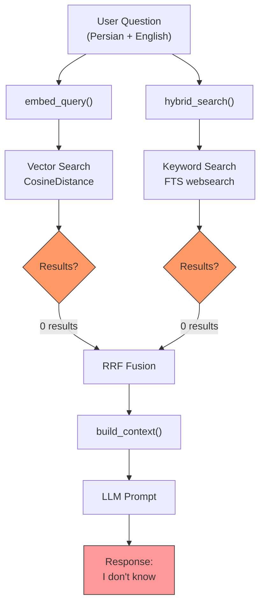
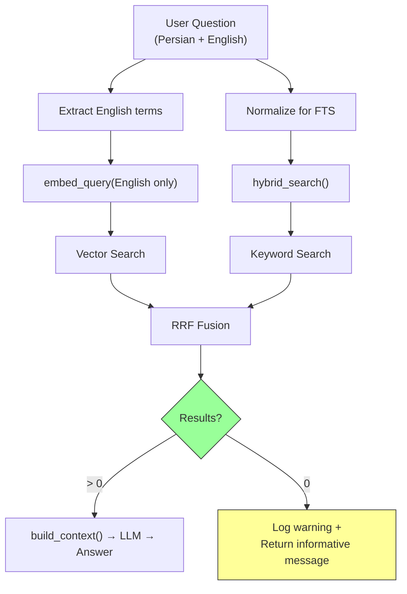

# Diagnostic & Fix Plan v2: RAG Query Fails for English Text (e.g., "November 1997")

## Problem Summary

User uploaded an English book (text about board games, Pictionary, Scrabble, etc.) and asked: **"در November 1997 چ اتفاقاتی رخ داده"** (what happened in November 1997). The RAG system responded: *"I don't have enough information..."* despite the text containing the exact phrase **"In November 1997"** verbatim.

The previous fix (adding `document_type` field and `_get_rag_filters()`) was already applied, but the problem persists. This means there are **additional root causes**.

---

## Root Cause Analysis — 5 Potential Failure Points

After thorough code review of the entire pipeline (extraction → chunking → embedding → search → RAG), I've identified **5 distinct potential failure points**:

### Failure Point 1: Legal Chunking Applied to English Text

**File:** [`src/backend/documents/services/chunking_service.py`](src/backend/documents/services/chunking_service.py:181)

```python
if legal_chunking_enabled and self._has_legal_structure(clean_text):
    return self._chunk_legal(...)
```

The `_has_legal_structure()` method in [`legal_structure_detector.py`](src/backend/documents/services/legal_structure_detector.py:197) checks for Persian legal markers (`ماده`, `فصل`). For an **English** textbook, this should return `False`, so the fallback `_chunk_sentence()` should be used.

**However**, the `LEGAL_CHUNKING_ENABLED` setting defaults to `True` ([`settings.py:277`](src/backend/config/settings.py:277)). If the English text somehow triggers the legal detector (e.g., if the word "material" or "chapter" appears in a way that matches Persian patterns), the chunking could produce malformed chunks.

**Likelihood: LOW** — The Persian patterns are specific enough that English text shouldn't trigger them.

### Failure Point 2: Persian Normalization Corrupting English Text

**File:** [`src/backend/documents/services/persian_normalizer.py`](src/backend/documents/services/persian_normalizer.py:120)

The `normalize()` method is applied to **all** extracted text ([`document_processing.py:378`](src/backend/documents/tasks/document_processing.py:378)):

```python
if persian_normalization_enabled:
    normalizer = PersianNormalizer()
    extracted_text = normalizer.normalize(extracted_text)
```

The `PERSIAN_NORMALIZATION_ENABLED` setting defaults to `True` ([`settings.py:276`](src/backend/config/settings.py:276)).

The normalizer uses `hazm` (a Persian NLP library) which could potentially corrupt English text. Specifically:
- `normalize_arabic_chars()` calls `hazm.normalize()` which might affect certain Unicode characters
- `fix_half_spaces()` applies Persian-specific regex patterns that could match English text incorrectly
- `clean_control_chars()` removes Unicode formatting characters which is safe

**Likelihood: LOW-MEDIUM** — Hazm is designed for Persian and should mostly pass through English text unchanged, but there's a risk of edge cases.

### Failure Point 3: Embedding Quality Issue (Most Likely)

**File:** [`src/backend/providers/ollama_embedding.py`](src/backend/providers/ollama_embedding.py:198)

The `embed_query()` method sends the question text to the embedding provider. The question is in **Persian**: "در November 1997 چ اتفاقاتی رخ داده" — this is a **code-switched** query (Persian + English).

The `nomic-embed-text` model (or whichever embedding model is configured) may not handle code-switched queries well. The embedding of the Persian question may be far from the embedding of the English chunk content in vector space, resulting in **low cosine similarity** and the chunk not being retrieved.

**Additionally**, the `embed_query()` in [`rag_service.py:228`](src/backend/conversations/rag_service.py:228) embeds the **full question** including the Persian parts. If the embedding model is primarily English-trained, the Persian words "در", "چ", "اتفاقاتی", "رخ", "داده" will produce noisy vectors that dilute the signal from "November 1997".

**Likelihood: HIGH** — This is a very common failure mode for multilingual RAG systems.

### Failure Point 4: Keyword Search (FTS) Fails for Mixed-Language Query

**File:** [`src/backend/documents/services/search_service.py`](src/backend/documents/services/search_service.py:329)

The `keyword_search()` function uses PostgreSQL's Full-Text Search with the `simple` configuration:

```python
search_query = SearchQuery(query_text, config="simple", search_type="websearch")
```

The `simple` configuration tokenizes on whitespace and punctuation, then lowercases. For the query "در November 1997 چ اتفاقاتی رخ داده":
- `"در"` — Persian word, will be lowercased to `"در"` (same in lowercase)
- `"November"` — English word, lowercased to `"november"`
- `"1997"` — number, preserved
- `"چ"` — single Persian character
- `"اتفاقاتی"` — Persian word
- `"رخ"` — Persian word
- `"داده"` — Persian word

The FTS trigger on `document_chunks` uses `to_tsvector('simple', ...)` which tokenizes the **English** chunk content. The English text "In November 1997" will be tokenized as `['in', 'november', '1997']`.

The FTS query `websearch` will try to match these tokens. The Persian words won't match anything in the English chunks, but **"November"** and **"1997"** should match. However, `websearch` treats the entire query as a combined search — if some tokens don't match, the overall rank may still be low.

**More critically:** The `search_vector` is populated by a DB trigger using `to_tsvector('simple', COALESCE(NEW.content, ''))`. The `simple` config does NOT normalize Persian/Arabic digits. But for English text, this should work fine.

**Likelihood: MEDIUM** — The FTS should find "November" and "1997" in the English text, but the rank might be low due to non-matching Persian tokens.

### Failure Point 5: RRF Fusion Dilutes Good Results

**File:** [`src/backend/documents/services/search_service.py`](src/backend/documents/services/search_service.py:422)

The `hybrid_search()` function runs both vector and keyword search, then fuses via RRF. If the **vector search** returns 0 results (because the Persian-English query embedding is far from the English chunk embeddings), but the **keyword search** returns some results (matching "November" or "1997"), the RRF fusion might still work.

However, if the keyword search also fails (e.g., because the `websearch` query syntax doesn't handle mixed-language well), then **both** methods return 0 results, and the RAG pipeline gets empty context.

**The critical check:** What does `keyword_search()` return for the query "در November 1997 چ اتفاقاتی رخ داده"?

The `websearch` parser in PostgreSQL treats the query as:
- `"در"` — search for this token
- `"November"` — search for this token  
- `"1997"` — search for this token
- `"چ"` — search for this token
- `"اتفاقاتی"` — search for this token
- `"رخ"` — search for this token
- `"داده"` — search for this token

Since the English chunk only contains `"November"` and `"1997"`, the FTS rank will be very low because only 2 out of 7 tokens match. The `SearchRank` function computes a normalized rank based on token frequency — with only 2 matching tokens out of 7, the rank could be below any meaningful threshold.

**Likelihood: HIGH** — The FTS rank for mixed-language queries will be very low due to many non-matching tokens.

---

## Summary of Root Causes

| # | Issue | Likelihood | Impact |
|---|-------|-----------|--------|
| 1 | Legal chunking applied to English text | LOW | Would corrupt chunks entirely |
| 2 | Persian normalization corrupting English | LOW-MEDIUM | Could alter text subtly |
| 3 | **Embedding mismatch (code-switched query)** | **HIGH** | Vector search returns 0 results |
| 4 | **FTS low rank for mixed-language query** | **HIGH** | Keyword search returns 0 or low-rank results |
| 5 | RRF fusion with empty inputs | MEDIUM | Both methods fail → empty context |

**Most likely scenario:** Both vector search AND keyword search fail for the mixed Persian-English query, resulting in zero chunks retrieved and the "I don't know" response.

---

## Diagnostic Steps (to confirm root causes)

### Step 1: Check if Chunks Actually Exist in DB

Run this to verify the document was properly chunked and embedded:

```bash
docker-compose exec backend python -c "
from documents.models import Document, DocumentChunk
from django.db.models import Count

# Find the document
docs = Document.objects.filter(title__icontains='Active').values('id', 'title', 'status', 'document_type', 'total_chunks')
for d in docs:
    print(f'Document: {d}')
    chunk_count = DocumentChunk.objects.filter(document_id=d['id']).count()
    embedded_count = DocumentChunk.objects.filter(document_id=d['id'], embedding__isnull=False).count()
    print(f'  Total chunks: {chunk_count}')
    print(f'  Embedded chunks: {embedded_count}')
    
    # Check if the specific text exists
    sample = DocumentChunk.objects.filter(document_id=d['id'], content__icontains='November').first()
    if sample:
        print(f'  Found chunk with \"November\": index={sample.chunk_index}, content_preview={sample.content[:200]}')
    else:
        print(f'  NO chunk contains \"November\"!')
"
```

### Step 2: Test Vector Search Directly

```bash
docker-compose exec backend python -c "
from documents.services.embedding_service import embed_query
from documents.services.search_service import hybrid_search, _vector_search, keyword_search
import json

document_id = 'REPLACE_WITH_ACTUAL_DOCUMENT_ID'

# Test 1: Vector search with the full Persian-English query
query = 'در November 1997 چ اتفاقاتی رخ داده'
query_emb = embed_query(query)
print(f'Query embedding dimension: {len(query_emb)}')

vec_results = _vector_search(document_id, query_emb, top_k=5)
print(f'Vector search results: {len(vec_results)}')
for r in vec_results:
    print(f'  score={r[\"relevance_score\"]:.4f}: {r[\"content\"][:100]}')

# Test 2: Keyword search with the full query
kw_results = keyword_search(document_id, query, top_k=5)
print(f'Keyword search results: {len(kw_results)}')
for r in kw_results:
    print(f'  score={r[\"relevance_score\"]:.4f}: {r[\"content\"][:100]}')

# Test 3: Hybrid search
hybrid_results = hybrid_search(document_id, query_emb, query, top_k=5)
print(f'Hybrid search results: {len(hybrid_results)}')
for r in hybrid_results:
    print(f'  rrf_score={r[\"rrf_score\"]:.4f}: {r[\"content\"][:100]}')

# Test 4: Try with English-only query
query_en = 'November 1997'
query_emb_en = embed_query(query_en)
vec_results_en = _vector_search(document_id, query_emb_en, top_k=5)
print(f'\\nEnglish-only vector search results: {len(vec_results_en)}')
for r in vec_results_en:
    print(f'  score={r[\"relevance_score\"]:.4f}: {r[\"content\"][:100]}')

kw_results_en = keyword_search(document_id, query_en, top_k=5)
print(f'English-only keyword search results: {len(kw_results_en)}')
for r in kw_results_en:
    print(f'  score={r[\"relevance_score\"]:.4f}: {r[\"content\"][:100]}')
"
```

### Step 3: Check if Persian Normalization Affected the English Text

```bash
docker-compose exec backend python -c "
from documents.services.persian_normalizer import PersianNormalizer
from documents.models import DocumentChunk
import json

# Get a sample chunk
chunk = DocumentChunk.objects.filter(content__icontains='November').first()
if chunk:
    print('Original chunk content (first 500 chars):')
    print(repr(chunk.content[:500]))
    print()
    print('Checking for any corruption...')
    # Check if the text looks correct
    if 'November' in chunk.content:
        print('✓ \"November\" is present')
    if '1997' in chunk.content:
        print('✓ \"1997\" is present')
    if 'Pictionary' in chunk.content:
        print('✓ \"Pictionary\" is present')
    if 'Scrabble' in chunk.content:
        print('✓ \"Scrabble\" is present')
"
```

### Step 4: Check the FTS search_vector Content

```bash
docker-compose exec backend python -c "
from documents.models import DocumentChunk
from django.db import connection

chunk = DocumentChunk.objects.filter(content__icontains='November').first()
if chunk:
    with connection.cursor() as cursor:
        cursor.execute(
            'SELECT search_vector FROM document_chunks WHERE id = %s',
            [str(chunk.id)]
        )
        row = cursor.fetchone()
        if row and row[0]:
            print(f'search_vector: {row[0]}')
            print(f'Does it contain \"november\"? {\"november\" in str(row[0])}')
            print(f'Does it contain \"1997\"? {\"1997\" in str(row[0])}')
        else:
            print('search_vector is NULL — FTS trigger may not have fired!')
"
```

---

## Fix Plan

### Fix 1: Normalize the Query for FTS (Improve Keyword Search)

**File:** [`src/backend/conversations/rag_service.py`](src/backend/conversations/rag_service.py:238-246)

**Problem:** The raw Persian-English query is passed directly to `hybrid_search()` as `query_text`. The FTS `websearch` parser treats all tokens equally, so Persian tokens that don't exist in English chunks dilute the rank.

**Fix:** Before passing `query_text` to `hybrid_search()`, apply `PersianNormalizer.normalize_for_fts()` to normalize digits. Additionally, consider stripping non-English tokens or using a smarter query preprocessing step.

```python
from documents.services.persian_normalizer import PersianNormalizer

# In run_rag_query() and run_rag_query_stream():
normalized_query = PersianNormalizer.normalize_for_fts(question)
chunks = hybrid_search(
    document_id=document_id,
    query_vector=query_embedding,
    query_text=normalized_query,  # Use normalized query for FTS
    top_k=top_k,
    filters=filters,
)
```

### Fix 2: Add Query Expansion / Translation for Vector Search

**File:** [`src/backend/conversations/rag_service.py`](src/backend/conversations/rag_service.py:225-230)

**Problem:** The Persian-English code-switched query produces a poor embedding that doesn't match the English chunk embeddings well.

**Fix:** Extract English terms from the query and create a secondary English-only query for embedding. Or use a multilingual embedding model that handles code-switching better.

**Option A (Simple):** Extract English words from the query and embed only those:
```python
import re
english_words = ' '.join(re.findall(r'[a-zA-Z0-9]+', question))
if english_words.strip():
    query_embedding = embed_query(english_words)
else:
    query_embedding = embed_query(question)
```

**Option B (Better):** Use the original query but also try an English-only embedding and combine results.

### Fix 3: Ensure FTS Trigger Fired Correctly

**File:** Database migration `0006`

**Problem:** The `search_vector` column might be `NULL` for chunks created before the migration, or the DB trigger might not have fired.

**Fix:** Verify and re-populate `search_vector` for all existing chunks:
```bash
docker-compose exec backend python -c "
from django.db import connection
with connection.cursor() as cursor:
    cursor.execute('''
        UPDATE document_chunks 
        SET search_vector = to_tsvector('simple', COALESCE(content, ''))
        WHERE search_vector IS NULL
    ''')
    print(f'Updated {cursor.rowcount} chunks with missing search_vector')
"
```

### Fix 4: Add Logging to Diagnose Empty Results

**File:** [`src/backend/conversations/rag_service.py`](src/backend/conversations/rag_service.py:250-251)

**Problem:** When no chunks are found, the system silently builds an empty context and the LLM responds "I don't know."

**Fix:** Add explicit logging when zero chunks are retrieved, and consider returning a more informative response to the user:

```python
if not chunks:
    logger.warning(
        "run_rag_query: ZERO chunks retrieved for document %s with query '%s'",
        document_id, question[:100],
    )
```

---

## Files to Modify

| File | Change | Priority |
|------|--------|----------|
| [`src/backend/conversations/rag_service.py`](src/backend/conversations/rag_service.py) | Add query normalization for FTS, add English-only embedding fallback, add empty-results logging | HIGH |
| [`src/backend/documents/services/search_service.py`](src/backend/documents/services/search_service.py) | Consider adding query preprocessing for mixed-language queries | MEDIUM |
| [`docs/references/api-registry.md`](docs/references/api-registry.md) | No changes needed | - |
| [`docs/references/database-schema.md`](docs/references/database-schema.md) | No changes needed | - |
| [`docs/active-task/wip-context.md`](docs/active-task/wip-context.md) | Update after fix | LOW |

---

## Testing Strategy

1. **Diagnostic commands** (Steps 1-4 above) — Run first to confirm root causes
2. **Unit tests** — Update `test_rag_service.py` to cover mixed-language queries
3. **Manual verification** — Upload an English document, ask a mixed Persian-English question, verify chunks are retrieved
4. **Regression test** — Ensure Persian legal documents still work with `legal_status: "valid"` filter

---

## Mermaid Diagram: Current RAG Pipeline Flow



## Mermaid Diagram: Proposed Fix


