# RAG Retrieval Diagnosis & Sprint Implementation Plan

## Overview

Based on analysis of the user's Q&A session with a Persian legal document, I've identified several root causes for retrieval failures. This document breaks down each observed failure, traces it to its root cause in the code, and provides actionable remediation steps.

**Sprint Scope:** This plan is scoped to **3 tasks only** for the current sprint/iteration. Caching, logging, and advanced chunking are explicitly deferred to future sprints.

---

## Observed Failures & Root Cause Analysis

### Failure 1: First-attempt "I don't know" for a question that was answerable

**Observed:** Question *"اگر کسی در حالت مستی یا بیهوشی معامله‌ای انجام دهد، وضعیت آن معامله چیست؟"* returned "I don't have enough information" on first attempt with 5 sources, but succeeded on second attempt with Source 5 (ماده ۱۹۵).

**Root Cause: FTS Persian Digit Mismatch (Critical)**

The DB trigger [`trg_chunk_search_vector`](src/backend/documents/migrations/0006_add_fts_and_metadata_fields.py:67) does:
```sql
NEW.search_vector := to_tsvector('simple', COALESCE(NEW.content, ''));
```

The `simple` configuration does **NOT** convert Persian digits (۰۱۲۳۴۵۶۷۸۹) to English digits (0123456789).

The migration comment says:
> "Number normalization (Persian/Arabic digits → English) is handled at the application layer by `PersianNormalizer.normalize_for_fts` before the content reaches the trigger."

**But this normalization is NEVER called before content is saved to the database!**

Looking at chunk creation in [`chunk_document()`](src/backend/documents/tasks/document_processing.py:501-516), chunks are created directly from `chunk.content` without any FTS normalization:
```python
DocumentChunk(
    document=document,
    chunk_index=i,
    content=chunk.content,  # <-- Raw Persian content, digits NOT normalized
    ...
)
```

The [`PersianNormalizer.normalize_for_fts()`](src/backend/documents/services/persian_normalizer.py:276) method exists but is **never called** during chunk creation. This means:
- Chunk content: `"ماده ۱۹۵"` → `search_vector` stores `to_tsvector('simple', 'ماده ۱۹۵')` → token `'۱۹۵'` (Persian digits)
- Query formulation produces `fts_query: "ماده 195"` (English digits per the system prompt instruction)
- FTS searches for `'195'` (English) → **NO MATCH** with `'۱۹۵'` (Persian)

**This explains why the first attempt failed and the second succeeded** — the first attempt may have used FTS (which failed due to digit mismatch), while the second attempt may have relied on vector search (which is semantic and less sensitive to digit encoding).

---

### Failure 2: Partial answer for "عقد لازم و عقد جایز"

**Observed:** The system found definition of "عقد لازم" (ماده ۱۸۵) but could NOT find "عقد جایز" definition.

**Root Cause: `top_k=5` Too Low for Multi-Concept Queries**

The RAG pipeline calls [`hybrid_search()`](src/backend/conversations/rag_service.py:250) with `top_k=5`. With RRF fusion, each method fetches `max(5*3, 60)=60` candidates, but only **5** are returned after fusion. If the "عقد جایز" chunk ranks lower than 5th position, it's excluded from the context entirely.

**Root Cause: Query Formulation Over-Optimization**

The formulation step may have converted the query to only search for "عقد لازم" keywords in FTS, missing "عقد جایز" entirely. The system prompt instructs the LLM to extract "core legal entities" — but the user asked for a **comparison** between two concepts. The formulation may have dropped one of them.

---

### Failure 3: Query Formulation System Prompt Contradiction

**Root Cause: The system prompt tells the LLM to convert Persian digits to English for FTS, but the FTS index stores Persian digits.**

In [`query_formulation.py`](src/backend/conversations/query_formulation.py:59-60):
> "Persian digits must be converted to English digits (e.g., \"۲۲\" → \"22\")"

This instruction is **correct in theory** but **wrong in practice** because the `search_vector` was built from raw Persian content without digit normalization. The formulation step is actively **making FTS worse** by converting digits to English, which then don't match the Persian-digit tokens in the index.

---

## Sprint Implementation Plan (3 Tasks Only)

### Task 1: Fix FTS Persian Digit Normalization (CRITICAL)

**Problem:** The `search_vector` trigger stores Persian digits as-is, but the query formulation converts them to English digits, causing FTS to always miss on digit-containing queries.

**Solution: Normalize content before saving to DB**

1. In [`chunk_document()`](src/backend/documents/tasks/document_processing.py:421), call `PersianNormalizer.normalize_for_fts()` on `chunk.content` **before** creating `DocumentChunk` instances. This ensures the stored content has English digits, so the trigger builds the correct `search_vector`.

2. Create a **new Django data migration** (`0009_normalize_chunk_digits.py`) that:
   - Iterates over all existing `DocumentChunk` rows
   - Calls `PersianNormalizer.normalize_for_fts()` on each chunk's `content`
   - Saves the normalized content, which triggers the `trg_chunk_search_vector` trigger to regenerate the `search_vector`

**Files to modify:**
- [`src/backend/documents/tasks/document_processing.py`](src/backend/documents/tasks/document_processing.py) — Add `normalize_for_fts()` call in `chunk_document()` before chunk creation
- New migration file — Backfill existing chunks

**Acceptance Criteria:**
- New chunks created after the fix have English digits in `search_vector`
- Existing chunks are backfilled via migration
- FTS queries with English digits match chunk content correctly

---

### Task 2: Increase `top_k` for RAG Queries (HIGH)

**Problem:** `top_k=5` is too low for documents where relevant information spans multiple articles or concepts.

**Solution:** Change the default `top_k` in [`run_rag_query()`](src/backend/conversations/rag_service.py:200) from `5` to `15`. This increases the context budget usage but ensures both sides of a comparison (e.g., "عقد لازم" vs "عقد جایز") are included.

**Files to modify:**
- [`src/backend/conversations/rag_service.py`](src/backend/conversations/rag_service.py) — Change default `top_k=5` to `top_k=15` in function signature and all call sites
- [`src/backend/conversations/rag_service.py`](src/backend/conversations/rag_service.py) — Update `run_rag_query_stream()` similarly

**Acceptance Criteria:**
- `top_k` default is changed to 15
- Both `run_rag_query()` and `run_rag_query_stream()` use the new default
- Multi-concept queries return chunks covering all mentioned concepts

---

### Task 3: Fix Query Formulation System Prompt (MEDIUM)

**Problem:** The system prompt over-optimizes for FTS by converting digits (which contradicts the actual FTS index state after Task 1 is fixed, the digit conversion instruction becomes correct — but the prompt still may drop entities in comparative queries).

**Solution:** Update the system prompt in [`query_formulation.py`](src/backend/conversations/query_formulation.py:53) to:

1. **Keep the digit conversion instruction** (it becomes correct after Task 1 normalizes chunk content)
2. **Add explicit instruction for comparative queries**: "If the user asks about multiple concepts (e.g., comparing two things), include ALL concepts in both `fts_query` and `vector_query`. Do NOT drop any entity."
3. **Add instruction to preserve numbers**: "Preserve all numbers exactly as they appear in the user query. Do not modify, drop, or simplify any numeric values."

**Files to modify:**
- [`src/backend/conversations/query_formulation.py`](src/backend/conversations/query_formulation.py) — Update `SYSTEM_PROMPT` string

**Acceptance Criteria:**
- Comparative queries include all entities in both `fts_query` and `vector_query`
- Numbers are preserved exactly as in the user query
- The prompt explicitly instructs the LLM not to drop any entity

---

## Summary of Changes Required

| # | File(s) | Change | Priority |
|---|---------|--------|----------|
| 1 | [`document_processing.py`](src/backend/documents/tasks/document_processing.py) | Call `normalize_for_fts()` on chunk content before saving | **CRITICAL** |
| 2 | New migration file | Backfill existing chunks with normalized content | **CRITICAL** |
| 3 | [`rag_service.py`](src/backend/conversations/rag_service.py) | Increase default `top_k` from 5 to 15 | High |
| 4 | [`query_formulation.py`](src/backend/conversations/query_formulation.py) | Update system prompt: preserve numbers + keep all entities in comparative queries | Medium |

---

## Architecture Diagram: Current vs Fixed FTS Pipeline

```mermaid
flowchart TD
    subgraph CURRENT["Current (Broken) FTS Pipeline"]
        A1["Chunk Content: 'ماده ۱۹۵'"] --> B1["DB Trigger: to_tsvector('simple', ...)"]
        B1 --> C1["search_vector stores token: '۱۹۵' Persian digits"]
        D1["User Query: 'ماده ۱۹۵'"] --> E1["Query Formulation converts digits"]
        E1 --> F1["fts_query: 'ماده 195' English digits"]
        F1 --> G1["FTS Search for '195'"]
        G1 --> H1["❌ NO MATCH with '۱۹۵'"]
    end

    subgraph FIXED["Fixed FTS Pipeline"]
        A2["Chunk Content: 'ماده ۱۹۵'"] --> B2["normalize_for_fts() converts digits"]
        B2 --> C2["Stored Content: 'ماده 195'"]
        C2 --> D2["DB Trigger: to_tsvector('simple', ...)"]
        D2 --> E2["search_vector stores token: '195' English digits"]
        F2["User Query: 'ماده ۱۹۵'"] --> G2["Query Formulation"]
        G2 --> H2["fts_query: 'ماده 195' English digits"]
        H2 --> I2["FTS Search for '195'"]
        I2 --> J2["✅ MATCH with '195'"]
    end
```



---

## Deferred to Future Sprints

The following items are explicitly **excluded** from this sprint:
- Query formulation caching (Redis/Django cache)
- RAG diagnostics logging
- Advanced chunking improvements
- Direct citation heuristic (skip formulation for "ماده N" queries)
- Any other optimizations not listed in the 3 tasks above
