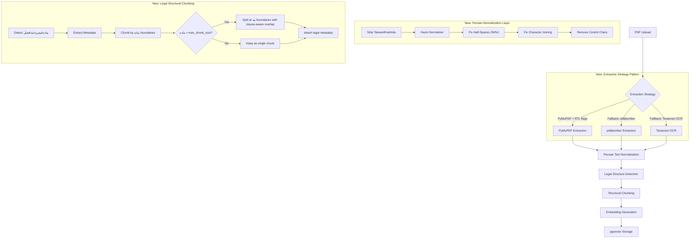
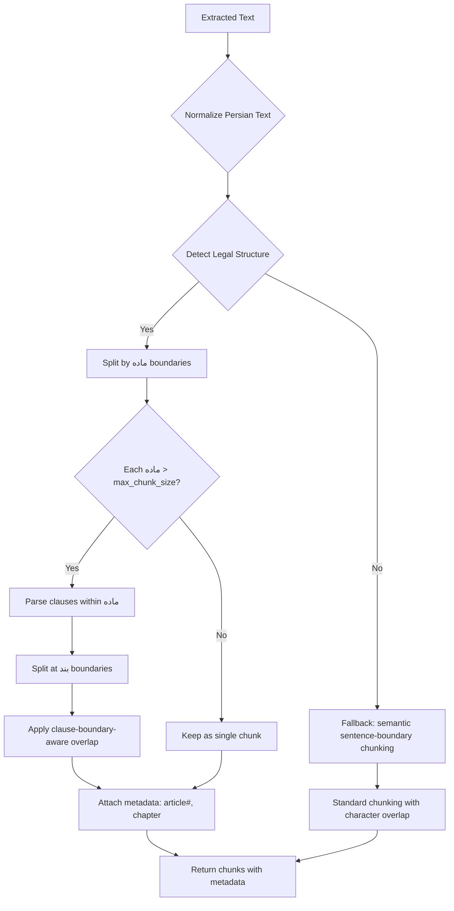

# Epic 4 Refactoring Plan: Persian Legal Text Optimization

## Overview

This plan refactors the document processing pipeline (Epic 4) to handle **Persian legal documents** — specifically PDFs from Iranian judiciary sources. The current pipeline uses generic English-centric approaches that fail on Persian text due to:

1. **Dirty extracted text** — PyMuPDF produces garbled Persian text with disconnected characters, reversed words, and missing half-spaces (نیم‌فاصله).
2. **Naive chunking** — Fixed-size character chunking splits legal articles (مواد), clauses (بندها), and notes (تبصره‌ها) mid-sentence, destroying semantic meaning.

---

## Architecture Overview



---

## Current State Analysis

### What exists now (already ✅ Done per user):

| Component | File | Status |
|-----------|------|--------|
| Text Extraction | [`src/backend/documents/tasks/document_processing.py`](../src/backend/documents/tasks/document_processing.py) — `extract_text_from_pdf` | Uses PyMuPDF `page.get_text()` **without RTL flags**, inserts `[PAGE N]` markers |
| Chunking | [`src/backend/documents/services/chunking_service.py`](../src/backend/documents/services/chunking_service.py) — `ChunkingService.chunk_text` | Fixed-size 1000-char chunks with 200-char overlap, sentence-boundary detection at `.` `!` `?` only |
| Embedding | [`src/backend/documents/tasks/embedding_tasks.py`](../src/backend/documents/tasks/embedding_tasks.py) — `embed_document` | Batch embedding via provider |
| Orchestration | [`src/backend/documents/services/processing_service.py`](../src/backend/documents/services/processing_service.py) — `process_document` | Celery chain: extract → chunk → embed |
| Error Handling | [`src/backend/documents/services/error_handler.py`](../src/backend/documents/services/error_handler.py) | PDF error classification, task failure handling |
| Models | [`src/backend/documents/models.py`](../src/backend/documents/models.py) | `Document`, `DocumentChunk` with pgvector |
| Settings | [`src/backend/config/settings.py`](../src/backend/config/settings.py) | No Persian/legal pipeline settings yet |

### Critical Gaps for Persian Legal Text:

1. **No Persian text normalization** — The extracted text from PyMuPDF for Persian PDFs often contains:
   - Broken character sequences (due to RTL rendering order in the PDF)
   - Missing or incorrect half-spaces (e.g., «می‌شود» becomes «مي شود»)
   - Zero-width non-joiners (ZWNJ) issues
   - Arabic/Persian character normalization (ي vs ی, ك vs ک)
   - **Tatweel/Kashida characters** (مـــاده instead of ماده) that break regex patterns

2. **No legal-structure-aware chunking** — The current `ChunkingService` splits at sentence boundaries (`.` `!` `?`), but Persian legal documents use:
   - **مواد (Articles)** — numbered sections (ماده ۱, ماده ۲)
   - **تبصره (Notes)** — sub-articles attached to a ماده
   - **بند (Clauses)** — sub-points within a ماده or تبصره
   - **فصل (Chapters)** — top-level groupings

3. **No metadata attachment** — Chunks don't carry legal context (law name, chapter, article number), so the LLM loses context during RAG retrieval.

---

## CRITICAL REFINEMENTS (User Feedback)

The following three refinements address gaps in the original plan, identified during review:

### Refinement 1: RTL-Aware Extraction with Fallback Architecture (Steps 2 & 5)

**Problem:** Hazm normalizes characters and half-spaces, but **cannot fix structural RTL reversal** caused by PyMuPDF. If PyMuPDF outputs «قانون» as «نوناق» (reversed), Hazm has no way to know the correct order.

**Solution — Three-layer extraction strategy:**

1. **Primary: PyMuPDF with RTL flags** — Use `page.get_text("text", flags=fitz.TEXT_PRESERVE_LIGATURES | fitz.TEXT_PRESERVE_WHITESPACE)` instead of bare `page.get_text()`. Also try `page.get_text("blocks")` which preserves spatial layout and may handle RTL better.

2. **Fallback 1: pdfplumber** — If PyMuPDF output has >30% non-Persian-char ratio (heuristic), re-extract with pdfplumber. pdfplumber preserves paragraph structure better for Persian PDFs.

3. **Fallback 2: Tesseract OCR** — If both PyMuPDF and pdfplumber produce garbled text (e.g., scanned PDFs), fall back to Tesseract OCR with Persian language pack (`fas`).

**Architecture:**

```python
# Extraction strategy pattern
class ExtractionStrategy(ABC):
    @abstractmethod
    def extract(self, pdf_path: str) -> str: ...

class PyMuPDFExtraction(ExtractionStrategy):
    def extract(self, pdf_path: str) -> str:
        doc = fitz.open(pdf_path)
        for page in doc:
            # Use RTL-aware flags
            text = page.get_text("text", flags=fitz.TEXT_PRESERVE_LIGATURES)
            # Alternative: page.get_text("blocks") for spatial layout
        ...

class PdfPlumberExtraction(ExtractionStrategy):
    def extract(self, pdf_path: str) -> str:
        # Better paragraph preservation for Persian
        ...

class TesseractExtraction(ExtractionStrategy):
    def extract(self, pdf_path: str) -> str:
        # OCR with Persian language pack
        ...
```

**Quality heuristic to decide fallback:**
```python
def _is_persian_text_garbled(text: str, threshold: float = 0.3) -> bool:
    """If >30% of Persian chars are isolated/reversed, flag as garbled."""
    persian_range = range(0x0600, 0x06FF + 1)  # Arabic block
    isolated_count = 0
    total_persian = 0
    for ch in text:
        if ord(ch) in persian_range:
            total_persian += 1
            # Check if surrounded by non-Persian (indicating reversal)
            # ... heuristic logic
    return total_persian > 0 and (isolated_count / total_persian) > threshold
```

**New dependency:** Add `pdfplumber` and `pytesseract` to requirements.

**Configuration:**
```python
EXTRACTION_BACKEND = env('EXTRACTION_BACKEND', default='pymupdf')  # pymupdf | pdfplumber | tesseract
EXTRACTION_AUTO_FALLBACK = env.bool('EXTRACTION_AUTO_FALLBACK', default=True)
EXTRACTION_GARBLED_THRESHOLD = env.float('EXTRACTION_GARBLED_THRESHOLD', default=0.3)
```

---

### Refinement 2: Tatweel Stripping and Flexible Regex (Step 3)

**Problem:** Persian legal text can have irregular spacing, ZWNJ, Tatweel/Kashida (مـــاده), and mixed numeral systems (English 1, Arabic ١, Persian ۱). Simple regex like `r'ماده\s*[۱۲۳۴۵۶۷۸۹۰]+'` fails on:
- `مـــاده ۱` (with Tatweel)
- `ماده1` (no space, English numeral)
- `ماده‌۱` (with ZWNJ)
- `ماده١` (Arabic numeral)

**Solution:**

1. **Strip Tatweel/Kashida FIRST** — Before any regex matching, remove all Tatweel characters (U+0640) from the text.

2. **Flexible regex patterns** that handle all spacing/number variants:

```python
import re

# Step 1: Strip Tatweel/Kashida (U+0640)
def _strip_tatweel(text: str) -> str:
    """Remove all Tatweel/Kashida characters from text."""
    return text.replace('\u0640', '')

# Step 2: Normalize whitespace around Persian text
def _normalize_legal_whitespace(text: str) -> str:
    """Collapse multiple spaces/ZWNJ into a single flexible pattern."""
    # Replace ZWNJ + optional spaces with a single space for matching
    text = re.sub(r'[\u200c\s]+', ' ', text)
    return text

# Step 3: Flexible regex patterns
# ZWNJ = \u200c, Tatweel already stripped
# Persian numerals: ۰۱۲۳۴۵۶۷۸۹
# Arabic numerals: ٠١٢٣٤٥٦٧٨٩
# English numerals: 0123456789
PERSIAN_NUM = r'[۰۱۲۳۴۵۶۷۸۹]'
ARABIC_NUM = r'[٠١٢٣٤٥٦٧٨٩]'
ENGLISH_NUM = r'[0-9]'
ANY_NUM = f'(?:{PERSIAN_NUM}|{ARABIC_NUM}|{ENGLISH_NUM})+'

# ماده (Article) — handles: ماده ۱, ماده1, ماده‌۱, ماده١
ARTICLE_PATTERN = re.compile(
    rf'ماده\s*{ANY_NUM}',
    re.UNICODE
)

# تبصره (Note) — handles: تبصره, تبصره ۱, تبصره1
NOTE_PATTERN = re.compile(
    rf'تبصره\s*{ANY_NUM}?',
    re.UNICODE
)

# بند (Clause) — handles: ۱-, ۱ -, 1-, الف, ب
CLAUSE_PATTERN = re.compile(
    rf'(?:{ANY_NUM}|[آابپتثجچحخدذرزژسشصضطظعغفقکگلمنوهی])\s*[\-\u200c]',
    re.UNICODE
)

# فصل (Chapter) — handles: فصل ۱, فصل اول, فصل1
CHAPTER_PATTERN = re.compile(
    rf'فصل\s*(?:{ANY_NUM}|[اولدومسومچهارمپنجمششمهفتمهشتمنهمدهم])',
    re.UNICODE
)
```

**Processing order in `LegalStructureDetector`:**
1. `_strip_tatweel(text)` — remove all Kashida
2. `_normalize_legal_whitespace(text)` — normalize spacing
3. Run regex patterns on cleaned text
4. Map detected positions back to original text for accurate chunk boundaries

---

### Refinement 3: Clause-Boundary-Aware Semantic Overlap (Step 4)

**Problem:** When a long ماده must be split at بند (clause) boundaries, the semantic connection between clauses can be lost. The overlap must:
- NOT break mid-clause (no partial clause starts)
- Include enough context from the previous clause to maintain semantic flow
- Be configurable (how many clauses to overlap)

**Solution:**

```python
@dataclass
class ClauseBoundary:
    clause_number: str
    start_pos: int
    end_pos: int
    content: str

def _split_long_article_with_overlap(
    article_content: str,
    clauses: list[ClauseBoundary],
    max_chunk_size: int,
    overlap_clauses: int = 1,  # How many clauses to overlap
) -> list[ChunkResult]:
    """
    Split a long article at clause boundaries with semantic overlap.
    
    Instead of character-based overlap (which can break mid-clause),
    we overlap entire clauses. The next chunk starts `overlap_clauses`
    clauses BEFORE the current chunk's end.
    
    Example with overlap_clauses=1:
    Chunk 1: [بند ۱][بند ۲][بند ۳]
    Chunk 2: [بند ۳][بند ۴][بند ۵]
                          ^^^^^
                          بند ۳ is the overlap — fully preserved, not truncated
    """
    chunks = []
    i = 0
    while i < len(clauses):
        chunk_clauses = []
        current_size = 0
        
        # Build chunk forward
        while i < len(clauses):
            clause = clauses[i]
            if current_size + len(clause.content) > max_chunk_size and chunk_clauses:
                break  # Don't exceed max_chunk_size if we already have content
            chunk_clauses.append(clause)
            current_size += len(clause.content)
            i += 1
        
        # Build chunk content
        chunk_content = "\n".join(c.content for c in chunk_clauses)
        
        chunks.append(ChunkResult(
            content=chunk_content,
            # ... metadata
        ))
        
        # Apply clause-aware overlap: rewind by `overlap_clauses` clauses
        # so the next chunk starts with the last N clauses of the current chunk
        if i < len(clauses) and overlap_clauses > 0:
            i -= overlap_clauses
            # Ensure we don't go backwards (infinite loop guard)
            if i < 0:
                i = 0
    
    return chunks
```

**Key design decisions:**
- Overlap is measured in **clauses**, not characters — guarantees no truncated clause starts
- Default `LEGAL_CHUNK_OVERLAP_CLAUSES = 1` (overlap one clause)
- The overlap clause is **fully preserved** in both chunks — no partial content
- If a single clause exceeds `max_chunk_size`, it becomes its own chunk (no further splitting)

**Configuration:**
```python
LEGAL_CHUNK_OVERLAP_CLAUSES = env.int('LEGAL_CHUNK_OVERLAP_CLAUSES', default=1)
```

---

## Refactoring Plan — Step by Step

### Step 1: Add Dependencies

**File:** [`src/backend/requirements.txt`](../src/backend/requirements.txt)

Add the following dependencies:
- `hazm>=0.10.0` — Persian NLP normalization
- `pdfplumber>=0.11.0` — Fallback PDF extraction with better Persian support
- `pytesseract>=0.3.10` — Tesseract OCR for scanned PDFs

- **Action:** Append these to `requirements.txt`
- **Why:** `hazm` provides Persian text normalization; `pdfplumber` provides fallback extraction; `pytesseract` provides OCR fallback for scanned documents.

---

### Step 2: Create Persian Text Normalization Service

**New File:** [`src/backend/documents/services/persian_normalizer.py`](../src/backend/documents/services/persian_normalizer.py)

Create a dedicated service for normalizing Persian text extracted from PDFs.

**Responsibilities:**
- Strip Tatweel/Kashida characters (U+0640) **before any regex or normalization**
- Use `hazm.Normalizer` to fix Persian character issues
- Normalize Arabic/Persian character variants (ي → ی, ك → ک, ة → ه, etc.)
- Fix half-space (ZWNJ) issues using `hazm` and custom regex
- Remove PDF-induced control characters and stray glyphs
- Handle common Persian legal text patterns

**⚠️ Limitation:** Hazm normalizes characters and half-spaces but **CANNOT fix structural RTL reversal** caused by PyMuPDF (e.g., «قانون» → «نوناق»). RTL reversal must be prevented at the extraction layer (Step 5) using PyMuPDF RTL flags or fallback extractors.

**Interface:**
```python
class PersianNormalizer:
    def normalize(self, text: str) -> str:
        """Full normalization pipeline for Persian legal text."""
    
    def strip_tatweel(self, text: str) -> str:
        """Remove all Tatweel/Kashida characters (U+0640)."""
    
    def normalize_arabic_chars(self, text: str) -> str:
        """Normalize Arabic/Persian character variants."""
    
    def fix_half_spaces(self, text: str) -> str:
        """Fix ZWNJ/half-space issues common in Persian."""
    
    def clean_control_chars(self, text: str) -> str:
        """Remove PDF-induced control characters."""
```

**Processing order (CRITICAL):**
1. `strip_tatweel()` — MUST be first, before any regex
2. `clean_control_chars()` — remove PDF artifacts
3. `normalize_arabic_chars()` — character normalization
4. `fix_half_spaces()` — ZWNJ fixes via hazm + custom regex
5. Final cleanup pass

**Tests:** [`src/backend/documents/tests/test_persian_normalizer.py`](../src/backend/documents/tests/test_persian_normalizer.py)

Test cases:
- Strip Tatweel from «مـــاده» → «ماده»
- Normalize Arabic ي to Persian ی
- Normalize Arabic ك to Persian ک
- Fix half-space in common Persian words (می‌شود, نمی‌تواند)
- Remove control characters from garbled PDF output
- Handle empty/None input gracefully
- **Verify Hazm does NOT fix RTL reversal** (document limitation)

---

### Step 3: Create Legal Structure Detector

**New File:** [`src/backend/documents/services/legal_structure_detector.py`](../src/backend/documents/services/legal_structure_detector.py)

Create a service that detects legal document structure using regex patterns.

**Responsibilities:**
- Detect Persian legal document structure patterns
- Parse articles (مواد), notes (تبصره), clauses (بند), chapters (فصل)
- Extract metadata (article number, chapter name, etc.)
- Return structured segments with metadata

**Processing pipeline (CRITICAL):**
1. `_strip_tatweel(text)` — remove Kashida first
2. `_normalize_legal_whitespace(text)` — normalize spacing/ZWNJ
3. Run regex patterns on cleaned text
4. Map detected positions back to original text

**Key Regex Patterns (Tatweel-aware, flexible spacing, mixed numerals):**
```python
PERSIAN_NUM = r'[۰۱۲۳۴۵۶۷۸۹]'
ARABIC_NUM = r'[٠١٢٣٤٥٦٧٨٩]'
ENGLISH_NUM = r'[0-9]'
ANY_NUM = f'(?:{PERSIAN_NUM}|{ARABIC_NUM}|{ENGLISH_NUM})+'

# ماده (Article) — handles: ماده ۱, ماده1, ماده‌۱, ماده١
ARTICLE_PATTERN = re.compile(rf'ماده\s*{ANY_NUM}', re.UNICODE)

# تبصره (Note) — handles: تبصره, تبصره ۱, تبصره1
NOTE_PATTERN = re.compile(rf'تبصره\s*{ANY_NUM}?', re.UNICODE)

# بند (Clause) — handles: ۱-, ۱ -, 1-, الف, ب
CLAUSE_PATTERN = re.compile(
    rf'(?:{ANY_NUM}|[آابپتثجچحخدذرزژسشصضطظعغفقکگلمنوهی])\s*[\-\u200c]',
    re.UNICODE
)

# فصل (Chapter) — handles: فصل ۱, فصل اول, فصل1
CHAPTER_PATTERN = re.compile(
    rf'فصل\s*(?:{ANY_NUM}|[اولدومسومچهارمپنجمششمهفتمهشتمنهمدهم])',
    re.UNICODE
)
```

**Data Classes:**
```python
@dataclass
class LegalSegment:
    segment_type: str  # 'chapter', 'article', 'note', 'clause', 'text'
    segment_number: str | None
    content: str
    metadata: dict
    start_pos: int
    end_pos: int
```

**Tests:** [`src/backend/documents/tests/test_legal_structure_detector.py`](../src/backend/documents/tests/test_legal_structure_detector.py)

Test cases:
- Detect ماده ۱ through ماده ۲۰ (with/without space, with ZWNJ)
- Detect ماده with Tatweel (مـــاده ۱)
- Detect ماده with English numerals (ماده1)
- Detect تبصره attached to a ماده
- Detect بندهای within a ماده (both numeric and alphabetic: الف, ب)
- Detect فصل headers (both numeric and word: فصل اول)
- Handle mixed Persian/Arabic/English numerals
- Handle documents with no legal structure (fallback to plain text)

---

### Step 4: Refactor Chunking Service for Legal Structural Chunking

**Modified File:** [`src/backend/documents/services/chunking_service.py`](../src/backend/documents/services/chunking_service.py)

Replace the current fixed-size chunking with a **structural chunking** strategy that:

1. First attempts to detect legal document structure via `LegalStructureDetector`
2. If legal structure is detected: chunk by ماده/تبصره/بند boundaries
3. If no legal structure: fall back to semantic sentence-boundary chunking
4. Attach metadata (law name, chapter, article number) to each chunk
5. Ensure each ماده stays intact as a single chunk (or split only at بند boundaries if too long)
6. **When splitting at بند boundaries, use clause-boundary-aware overlap** (not character-based)

**New `ChunkResult` metadata:**
```python
@dataclass
class ChunkResult:
    content: str
    page_start: int
    page_end: int
    char_count: int
    token_count: int
    metadata: dict = field(default_factory=dict)
    # New fields:
    legal_type: str | None = None       # 'article', 'note', 'clause', 'text'
    legal_number: str | None = None     # e.g., '۱', '۲'
    parent_article: str | None = None   # For notes/clauses: which article they belong to
```

**Chunking Strategy Decision Flow:**



**Clause-boundary-aware overlap logic (NEW):**
```python
def _split_long_article_with_overlap(
    article_content: str,
    clauses: list[ClauseBoundary],
    max_chunk_size: int,
    overlap_clauses: int = 1,
) -> list[ChunkResult]:
    """
    Split a long article at clause boundaries.
    
    Overlap is measured in CLAUSES, not characters.
    This guarantees no truncated clause starts in the overlap region.
    
    Example (overlap_clauses=1):
      Chunk 1: [بند ۱][بند ۲][بند ۳]
      Chunk 2: [بند ۳][بند ۴][بند ۵]
                ^^^^^^^
                بند ۳ is fully preserved in both chunks
    """
    chunks = []
    i = 0
    while i < len(clauses):
        chunk_clauses = []
        current_size = 0
        
        while i < len(clauses):
            clause = clauses[i]
            if current_size + len(clause.content) > max_chunk_size and chunk_clauses:
                break
            chunk_clauses.append(clause)
            current_size += len(clause.content)
            i += 1
        
        chunk_content = "\n".join(c.content for c in chunk_clauses)
        chunks.append(ChunkResult(content=chunk_content, ...))
        
        # Clause-aware overlap: rewind by overlap_clauses
        if i < len(clauses) and overlap_clauses > 0:
            i = max(0, i - overlap_clauses)
    
    return chunks
```

**Configuration (via Django settings):**
```python
LEGAL_CHUNKING_ENABLED = True       # Toggle legal structure detection
LEGAL_MAX_CHUNK_SIZE = 2000         # Max chars per legal chunk (for long articles)
LEGAL_CHUNK_OVERLAP_CLAUSES = 1     # Number of clauses to overlap when splitting
```

**Tests:** [`src/backend/documents/tests/test_chunking_service.py`](../src/backend/documents/tests/test_chunking_service.py)

Test cases:
- Legal document with 5 مواد → 5 chunks, each containing full ماده
- ماده with تبصره → single chunk with metadata
- ماده longer than max_chunk_size → split at بند boundaries with clause-aware overlap
- Verify overlap preserves full clauses (no truncated clause starts)
- Verify overlap_clauses=0 produces no overlap
- Non-legal Persian text → fallback to sentence-boundary chunking
- Empty text → empty list
- Verify metadata is correctly attached (article number, chapter)
- Verify page_start/page_end are preserved

---

### Step 5: Integrate Normalizer + RTL-Aware Extraction into Pipeline

**Modified File:** [`src/backend/documents/tasks/document_processing.py`](../src/backend/documents/tasks/document_processing.py)

This is the most critical step. The extraction pipeline needs three changes:

#### Change 1: RTL-Aware PyMuPDF Extraction

Replace bare `page.get_text()` with RTL-aware flags:

```python
# Current (broken for Persian):
page_text = page.get_text()

# New (RTL-aware):
page_text = page.get_text(
    "text",
    flags=fitz.TEXT_PRESERVE_LIGATURES | fitz.TEXT_PRESERVE_WHITESPACE
)
# Alternative: use "blocks" mode for spatial layout preservation
# blocks = page.get_text("blocks")
```

#### Change 2: Extraction Strategy Pattern with Auto-Fallback

```python
def extract_text_from_pdf(self, document_id: str) -> str:
    # ... existing setup code ...
    
    # Primary extraction with PyMuPDF + RTL flags
    extracted_text = self._extract_with_pymupdf_rtl(pdf_document)
    
    # Quality check: is the Persian text garbled?
    if settings.EXTRACTION_AUTO_FALLBACK and _is_persian_text_garbled(extracted_text):
        logger.warning("PyMuPDF output garbled for Persian text, trying pdfplumber...")
        extracted_text = self._extract_with_pdfplumber(pdf_content)
        
        if _is_persian_text_garbled(extracted_text):
            logger.warning("pdfplumber also garbled, falling back to Tesseract OCR...")
            extracted_text = self._extract_with_tesseract(pdf_content)
    
    # Apply Persian normalization
    normalizer = PersianNormalizer()
    extracted_text = normalizer.normalize(extracted_text)
    
    # ... rest of existing code ...
```

#### Change 3: Add Extraction Helper Methods

```python
def _extract_with_pymupdf_rtl(self, pdf_document) -> str:
    """Extract text using PyMuPDF with RTL-aware flags."""
    page_texts = []
    for page_num in range(pdf_document.page_count):
        page = pdf_document.load_page(page_num)
        text = page.get_text(
            "text",
            flags=fitz.TEXT_PRESERVE_LIGATURES | fitz.TEXT_PRESERVE_WHITESPACE
        )
        page_texts.append(f"[PAGE {page_num + 1}]\n{text}")
    return "\n".join(page_texts)

def _extract_with_pdfplumber(self, pdf_content: bytes) -> str:
    """Fallback extraction using pdfplumber (better Persian paragraph structure)."""
    import pdfplumber
    with pdfplumber.open(io.BytesIO(pdf_content)) as pdf:
        page_texts = []
        for i, page in enumerate(pdf.pages):
            text = page.extract_text() or ""
            page_texts.append(f"[PAGE {i + 1}]\n{text}")
    return "\n".join(page_texts)

def _extract_with_tesseract(self, pdf_content: bytes) -> str:
    """Fallback OCR extraction using Tesseract with Persian language pack."""
    import pytesseract
    from pdf2image import convert_from_bytes
    images = convert_from_bytes(pdf_content)
    page_texts = []
    for i, img in enumerate(images):
        text = pytesseract.image_to_string(img, lang='fas+ara')
        page_texts.append(f"[PAGE {i + 1}]\n{text}")
    return "\n".join(page_texts)
```

**Tests:** Update [`src/backend/documents/tests/test_tasks.py`](../src/backend/documents/tests/test_tasks.py)

- Add test: Persian PDF with garbled text → auto-fallback to pdfplumber
- Add test: PyMuPDF RTL flags produce better output than bare `get_text()`
- Add test: Normal PDF (English) → unchanged output (no regression)
- Add test: Scanned Persian PDF → Tesseract fallback
- Add test: Quality heuristic correctly identifies garbled Persian text

---

### Step 6: Update DocumentChunk Model for Legal Metadata

**Modified File:** [`src/backend/documents/models.py`](../src/backend/documents/models.py)

The `DocumentChunk.metadata` JSONField already exists and can store legal metadata. No schema migration needed. However, we should add a helper method.

**Add to `DocumentChunk`:**
```python
@property
def legal_context(self) -> str:
    """Return a human-readable legal context string for RAG."""
    meta = self.metadata or {}
    parts = []
    if meta.get('law_name'):
        parts.append(f"قانون: {meta['law_name']}")
    if meta.get('chapter'):
        parts.append(f"فصل: {meta['chapter']}")
    if meta.get('article_number'):
        parts.append(f"ماده: {meta['article_number']}")
    if meta.get('legal_type') == 'note' and meta.get('parent_article'):
        parts.append(f"تبصره ماده {meta['parent_article']}")
    return " | ".join(parts)
```

---

### Step 7: Update Search Service for Legal Context

**Modified File:** [`src/backend/documents/services/search_service.py`](../src/backend/documents/services/search_service.py)

Enhance the search results to include legal context in the response.

**Add to result dict:**
```python
{
    # ... existing fields ...
    "legal_context": chunk.legal_context,  # NEW
    "metadata": chunk.metadata,            # already exists
}
```

---

### Step 8: Update RAG Service to Use Legal Context

**Modified File:** [`src/backend/conversations/rag_service.py`](../src/backend/conversations/rag_service.py)

When building the RAG context prompt, include the `legal_context` from each chunk so the LLM understands which article/note/clause the content belongs to.

**Example context format:**
```
[ماده ۱ از قانون مجازات اسلامی]
متن ماده ...
---
[تبصره ماده ۱ از قانون مجازات اسلامی]
متن تبصره ...
```

---

### Step 9: Add Configuration Settings

**Modified File:** [`src/backend/config/settings.py`](../src/backend/config/settings.py)

Add new settings for the Persian legal pipeline (place after existing RAG settings):

```python
# Persian Legal Text Processing
PERSIAN_NORMALIZATION_ENABLED = env.bool('PERSIAN_NORMALIZATION_ENABLED', default=True)
LEGAL_CHUNKING_ENABLED = env.bool('LEGAL_CHUNKING_ENABLED', default=True)
LEGAL_MAX_CHUNK_SIZE = env.int('LEGAL_MAX_CHUNK_SIZE', default=2000)
LEGAL_CHUNK_OVERLAP_CLAUSES = env.int('LEGAL_CHUNK_OVERLAP_CLAUSES', default=1)

# Extraction Strategy
EXTRACTION_BACKEND = env('EXTRACTION_BACKEND', default='pymupdf')  # pymupdf | pdfplumber | tesseract
EXTRACTION_AUTO_FALLBACK = env.bool('EXTRACTION_AUTO_FALLBACK', default=True)
EXTRACTION_GARBLED_THRESHOLD = env.float('EXTRACTION_GARBLED_THRESHOLD', default=0.3)
```

Also add to `.env.example`:
```
# Persian Legal Text Processing
PERSIAN_NORMALIZATION_ENABLED=True
LEGAL_CHUNKING_ENABLED=True
LEGAL_MAX_CHUNK_SIZE=2000
LEGAL_CHUNK_OVERLAP_CLAUSES=1
EXTRACTION_BACKEND=pymupdf
EXTRACTION_AUTO_FALLBACK=True
EXTRACTION_GARBLED_THRESHOLD=0.3
```

---

### Step 10: Update Reference Documentation

**Files:**
- [`docs/references/database-schema.md`](../docs/references/database-schema.md) — No schema changes needed (metadata is JSONField)
- [`docs/references/api-registry.md`](../docs/references/api-registry.md) — Add `legal_context` to search response
- [`docs/active-task/wip-context.md`](../docs/active-task/wip-context.md) — Update with refactoring progress

---

## Test Strategy

| Component | Test File | Type |
|-----------|-----------|------|
| Persian Normalizer | [`src/backend/documents/tests/test_persian_normalizer.py`](../src/backend/documents/tests/test_persian_normalizer.py) | Unit |
| Legal Structure Detector | [`src/backend/documents/tests/test_legal_structure_detector.py`](../src/backend/documents/tests/test_legal_structure_detector.py) | Unit |
| Chunking Service (refactored) | [`src/backend/documents/tests/test_chunking_service.py`](../src/backend/documents/tests/test_chunking_service.py) | Unit |
| Extraction Task (updated) | [`src/backend/documents/tests/test_tasks.py`](../src/backend/documents/tests/test_tasks.py) | Integration |
| Search Service (updated) | [`src/backend/documents/tests/test_search_service.py`](../src/backend/documents/tests/test_search_service.py) | Integration |

---

## Execution Order


Each step includes its corresponding tests (TDD: write test first, then implement).

---

## Files Changed Summary

| File | Action |
|------|--------|
| `src/backend/requirements.txt` | Add `hazm>=0.10.0`, `pdfplumber>=0.11.0`, `pytesseract>=0.3.10` |
| `src/backend/documents/services/persian_normalizer.py` | **NEW** — Persian text normalization with Tatweel stripping |
| `src/backend/documents/services/legal_structure_detector.py` | **NEW** — Legal document structure parsing with flexible regex |
| `src/backend/documents/services/chunking_service.py` | **MODIFY** — Add structural chunking with clause-boundary-aware overlap |
| `src/backend/documents/tasks/document_processing.py` | **MODIFY** — RTL-aware extraction + auto-fallback + normalization |
| `src/backend/documents/models.py` | **MODIFY** — Add `legal_context` property |
| `src/backend/documents/services/search_service.py` | **MODIFY** — Include legal context in results |
| `src/backend/conversations/rag_service.py` | **MODIFY** — Use legal context in prompt |
| `src/backend/config/settings.py` | **MODIFY** — Add Persian legal pipeline + extraction strategy settings |
| `.env.example` | **MODIFY** — Add new env vars |
| `src/backend/documents/tests/test_persian_normalizer.py` | **NEW** — Normalizer tests |
| `src/backend/documents/tests/test_legal_structure_detector.py` | **NEW** — Structure detector tests |
| `src/backend/documents/tests/test_chunking_service.py` | **NEW** — Refactored chunking tests |
| `docs/references/database-schema.md` | **MODIFY** — Document metadata usage |
| `docs/references/api-registry.md` | **MODIFY** — Document legal_context field |
