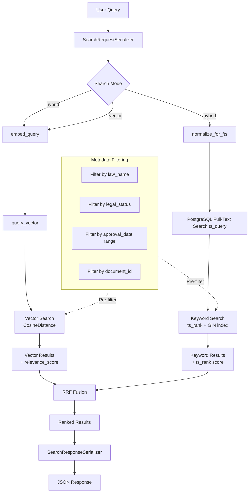
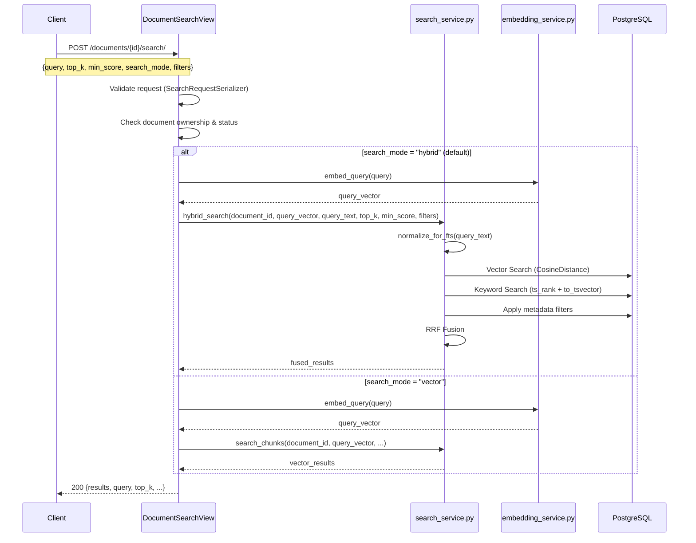

# Epic 6 Refactoring Plan: Hybrid Search + Metadata Filtering

## Overview

Current Epic 6 implements **vector-only semantic search** via pgvector's `CosineDistance`. For Persian legal texts, this is insufficient because:

1. **Vector search is weak on exact keyword/number matching** — queries like "ماده ۲۲ قانون ثبت" need exact keyword matching (BM25/Full-Text Search) to find specific articles.
2. **Obsolete/irrelevant laws must be filtered out** — metadata like `law_name`, `legal_status` (valid/obsolete), `approval_date` must be used as pre-filters before vector search.

This plan adds **Hybrid Search** (vector + keyword) with **Reciprocal Rank Fusion (RRF)** and **Metadata Filtering** to the existing search pipeline.

---

## Architecture Diagram



---

## Data Flow



---

## Step-by-Step Implementation Plan

### Step 1: Add Persian Number Normalization for FTS

**Files to modify:**
- `src/backend/documents/services/persian_normalizer.py` — Add `normalize_for_fts()` static method
- `src/backend/documents/services/search_service.py` — Import and use `normalize_for_fts()`

**Context (verified against codebase):**
- [`PersianNormalizer`](src/backend/documents/services/persian_normalizer.py:75) currently initializes Hazm with `persian_numbers=False` (line 82), meaning numbers are NOT normalized.
- The existing pipeline handles ZWNJ (half-spaces) via [`fix_half_spaces()`](src/backend/documents/services/persian_normalizer.py:179) and Arabic character normalization via [`normalize_arabic_chars()`](src/backend/documents/services/persian_normalizer.py:158).
- However, for PostgreSQL FTS to work correctly with Persian legal texts, we need **both** indexing-time and query-time normalization of numbers and ZWNJ.

**Why this matters for FTS:**
- Persian legal texts mix Persian numerals (۲۲, ۱۲) with English numerals (22, 12) inconsistently.
- PostgreSQL's `to_tsvector('simple', ...)` treats `"22"` and `"۲۲"` as completely different tokens.
- A user searching for "ماده 22" will NOT match chunks containing "ماده ۲۲" without normalization.
- ZWNJ issues: `می‌شود` vs `میشود` — FTS treats these as different tokens.

**Changes:**

Add a new static method to `PersianNormalizer`:

```python
# In persian_normalizer.py

# Persian/Arabic to English digit mapping
_PERSIAN_DIGITS = str.maketrans("٠١٢٣٤٥٦٧٨٩۰۱۲۳۴۵۶۷۸۹", "01234567890123456789")

@staticmethod
def normalize_for_fts(text: str) -> str:
    """Normalize Persian text specifically for Full-Text Search.
    
    This is a LIGHTER normalization than the full pipeline — it only
    normalizes elements that affect FTS token matching:
    
    1. Normalize Persian/Arabic digits to English (so "22" matches "۲۲")
    2. Normalize ZWNJ (half-spaces) to ensure consistent tokenization
       (so "می‌شود" matches "میشود" — both become "می شود" for FTS)
    
    NOTE: This does NOT strip Tatweel or normalize Arabic chars — those
    are already handled during extraction. This is for search-time use.
    
    Args:
        text: Raw query text or chunk content.
    
    Returns:
        Text normalized for FTS token matching.
    """
    # Normalize Persian/Arabic digits to English
    text = text.translate(_PERSIAN_DIGITS)
    
    # Normalize ZWNJ to space for FTS tokenization
    # PostgreSQL's 'simple' config doesn't understand ZWNJ as a word boundary
    text = text.replace("\u200C", " ")
    
    # Collapse multiple spaces
    text = re.sub(r" +", " ", text)
    
    return text.strip()
```

**Usage in search_service.py:**
- Call `normalize_for_fts(query_text)` before passing to `SearchQuery` in `keyword_search()`.
- The `search_vector` in the database is populated via a trigger that also applies `normalize_for_fts()` to `content` (see Step 2).

---

### Step 2: Database Migration — Add Full-Text Search Support with DB Trigger

**Files to modify:**
- `src/backend/documents/models.py` — Add `search_vector` field
- `src/backend/documents/migrations/0006_add_fts_search_vector.py` — **NEW** migration (includes trigger)
- `docs/references/database-schema.md` — Update schema docs

**Changes:**

1. Add a `SearchVectorField` to `DocumentChunk` model:

```python
from django.contrib.postgres.search import SearchVectorField
from django.contrib.postgres.indexes import GinIndex

class DocumentChunk(models.Model):
    # ... existing fields ...
    search_vector = SearchVectorField(null=True, blank=True)
    
    class Meta:
        # ... existing meta ...
        indexes = [
            # ... existing indexes ...
            GinIndex(fields=['search_vector'], name='idx_chunks_fts_gin'),
        ]
```

2. Create migration `0006_add_fts_search_vector.py` that:
   - Adds the `search_vector` column
   - Creates a GIN index on `search_vector`
   - **Creates a PostgreSQL trigger** to auto-update `search_vector` on INSERT/UPDATE of `content`:

```sql
-- Function to normalize Persian text for FTS
CREATE OR REPLACE FUNCTION normalize_for_fts_trigger(text)
RETURNS tsvector AS $$
DECLARE
    normalized text;
BEGIN
    -- Normalize Persian/Arabic digits to English
    normalized := translate($1, '٠١٢٣٤٥٦٧٨٩۰۱۲۳۴۵۶۷۸۹', '01234567890123456789');
    -- Normalize ZWNJ to space
    normalized := replace(normalized, E'\u200C', ' ');
    RETURN to_tsvector('simple', normalized);
END;
$$ LANGUAGE plpgsql IMMUTABLE;

-- Trigger function
CREATE OR REPLACE FUNCTION update_search_vector()
RETURNS trigger AS $$
BEGIN
    NEW.search_vector := normalize_for_fts_trigger(NEW.content);
    RETURN NEW;
END;
$$ LANGUAGE plpgsql;

-- Apply trigger
CREATE TRIGGER trg_update_search_vector
    BEFORE INSERT OR UPDATE OF content
    ON documents_documentchunk
    FOR EACH ROW
    EXECUTE FUNCTION update_search_vector();
```

**Why a DB trigger (not application code):**
- Guarantees `search_vector` is always in sync with `content`, even for bulk operations or direct SQL updates.
- Eliminates the risk of forgetting to call `update_search_vector()` in application code.
- The trigger is defined in the migration via `RunSQL`, so it's part of the deployment.

**Design Decision:** Use `'simple'` config (not `'persian'`) because:
- PostgreSQL's built-in Persian text search config is limited
- `'simple'` config treats each word as a token without stemming, which is better for exact legal term matching (ماده, قانون, etc.)
- We can add a custom Persian config later if needed

3. Add a management command to backfill `search_vector` for existing chunks:

```python
# documents/management/commands/backfill_search_vectors.py
class Command(BaseCommand):
    help = 'Backfill search_vector for all existing DocumentChunks'
    
    def handle(self, *args, **options):
        with connection.cursor() as cursor:
            cursor.execute("""
                UPDATE documents_documentchunk 
                SET content = content  -- Trigger will auto-update search_vector
                WHERE search_vector IS NULL
            """)
```

---

### Step 3: Update DocumentChunk Model — Add Metadata Fields for Legal Filtering

**Files to modify:**
- `src/backend/documents/models.py` — Add indexed metadata fields
- `src/backend/documents/migrations/0007_add_legal_metadata_fields.py` — **NEW** migration
- `src/backend/documents/services/chunking_service.py` — Populate new fields during chunk creation
- `docs/references/database-schema.md` — Update schema docs

**Changes:**

Add denormalized, indexed fields for common legal metadata filters. These are **copied from `metadata` JSONB** during chunking for efficient querying:

```python
class DocumentChunk(models.Model):
    # ... existing fields ...
    
    # Denormalized legal metadata for efficient filtering
    law_name = models.CharField(max_length=500, null=True, blank=True, db_index=True)
    legal_status = models.CharField(max_length=50, null=True, blank=True, db_index=True)
    approval_date = models.DateField(null=True, blank=True, db_index=True)
    legal_type = models.CharField(max_length=50, null=True, blank=True, db_index=True)
```

**Why denormalize?** JSONB filtering in PostgreSQL is possible but slower than indexed columns. For high-throughput search, indexed columns are essential.

**Update the chunking pipeline** to populate these fields when creating chunks (in [`chunking_service.py`](src/backend/documents/services/chunking_service.py:630) `_make_chunk()`):

```python
# In chunking_service.py _make_chunk() — around line 630
chunk.law_name = chunk_metadata.get("law_name")
chunk.legal_status = chunk_metadata.get("legal_status")  # "valid", "obsolete", "amended"
chunk.approval_date = chunk_metadata.get("approval_date")
chunk.legal_type = chunk_metadata.get("legal_type")  # "article", "note", "clause", "chapter"
```

---

### Step 4: Create Hybrid Search Service

**Files to modify:**
- `src/backend/documents/services/search_service.py` — Add `hybrid_search()`, `keyword_search()`, `_rrf_fusion()`, `_apply_metadata_filters()`, `_vector_search()`

**Changes:**

Add five new functions to `search_service.py`:

#### 4a. `keyword_search()` — PostgreSQL Full-Text Search

```python
def keyword_search(
    document_id: str,
    query_text: str,
    top_k: int = 10,
    filters: dict | None = None,
) -> list[dict[str, Any]]:
    """Search document chunks by keyword relevance using PostgreSQL FTS.
    
    Uses to_tsvector('simple', content) and plainto_tsquery('simple', query_text)
    to find chunks matching the query keywords. Results are ranked by ts_rank.
    
    IMPORTANT: query_text is normalized via normalize_for_fts() before FTS query,
    to handle Persian/Arabic digit variants and ZWNJ issues.
    
    Args:
        document_id: UUID of the document to search within.
        query_text: Raw query text (will be normalized and parsed into tsquery).
        top_k: Maximum number of results.
        filters: Optional metadata filters (law_name, legal_status, etc.).
    
    Returns:
        List of chunk dicts with 'keyword_score' key.
    """
    from django.contrib.postgres.search import SearchQuery, SearchRank, SearchVector
    
    # Normalize query text for FTS (Persian digits, ZWNJ)
    normalized_query = PersianNormalizer.normalize_for_fts(query_text)
    
    # Build the search vector and query
    vector = SearchVector('search_vector', config='simple')
    query = SearchQuery(normalized_query, config='simple')
    
    # Base queryset
    queryset = DocumentChunk.objects.filter(
        document_id=document_id,
        search_vector__isnull=False,
    )
    
    # Apply metadata filters
    if filters:
        queryset = _apply_metadata_filters(queryset, filters)
    
    # Annotate with search rank
    queryset = queryset.annotate(
        rank=SearchRank(vector, query)
    ).filter(rank__gte=0.01)  # Minimum relevance threshold
    
    # Order by rank descending
    queryset = queryset.order_by('-rank')[:top_k]
    
    # Build results
    results = []
    for chunk in queryset:
        results.append({
            "chunk_id": str(chunk.id),
            "chunk_index": chunk.chunk_index,
            "page_start": chunk.page_start,
            "page_end": chunk.page_end,
            "content": chunk.content,
            "keyword_score": float(chunk.rank),
            "token_count": chunk.token_count,
            "metadata": chunk.metadata,
            "legal_context": chunk.legal_context,
        })
    
    return results
```

#### 4b. `_apply_metadata_filters()` — Shared Filter Helper

```python
def _apply_metadata_filters(
    queryset: QuerySet,
    filters: dict[str, Any],
) -> QuerySet:
    """Apply metadata filters to a DocumentChunk queryset.
    
    Supported filters:
        - law_name: Exact match on law_name field.
        - legal_status: Exact match (valid, obsolete, amended).
        - legal_type: Exact match (article, note, clause, chapter).
        - approval_date_after: ISO date string (inclusive).
        - approval_date_before: ISO date string (inclusive).
        - chunk_ids: List of specific chunk UUIDs to restrict to.
    
    Args:
        queryset: Base DocumentChunk queryset.
        filters: Dict of filter key/value pairs.
    
    Returns:
        Filtered queryset.
    """
    if not filters:
        return queryset
    
    if "law_name" in filters:
        queryset = queryset.filter(law_name=filters["law_name"])
    
    if "legal_status" in filters:
        queryset = queryset.filter(legal_status=filters["legal_status"])
    
    if "legal_type" in filters:
        queryset = queryset.filter(legal_type=filters["legal_type"])
    
    if "approval_date_after" in filters:
        queryset = queryset.filter(
            approval_date__gte=filters["approval_date_after"]
        )
    
    if "approval_date_before" in filters:
        queryset = queryset.filter(
            approval_date__lte=filters["approval_date_before"]
        )
    
    if "chunk_ids" in filters:
        queryset = queryset.filter(id__in=filters["chunk_ids"])
    
    return queryset
```

#### 4c. `_rrf_fusion()` — Reciprocal Rank Fusion

```python
def _rrf_fusion(
    vector_results: list[dict[str, Any]],
    keyword_results: list[dict[str, Any]],
    top_k: int = 10,
    k: int = 60,
) -> list[dict[str, Any]]:
    """Fuse two ranked result lists using Reciprocal Rank Fusion (RRF).
    
    RRF formula: score(chunk) = Σ 1 / (k + rank(chunk))
    where rank is 1-based position in each result list.
    
    The constant k=60 is the standard RRF parameter that controls
    how much high-ranking items are favored.
    
    Args:
        vector_results: Results from vector search, ordered by relevance.
        keyword_results: Results from keyword search, ordered by keyword_score.
        top_k: Maximum number of fused results to return.
        k: RRF constant (default 60, standard value).
    
    Returns:
        Fused list of dicts ordered by RRF score descending.
        Each dict includes both 'relevance_score' and 'keyword_score'.
    """
    from collections import defaultdict
    
    rrf_scores: dict[str, dict] = {}
    
    # Process vector results (1-based rank = index + 1)
    for rank, chunk in enumerate(vector_results, start=1):
        chunk_id = chunk["chunk_id"]
        rrf_scores[chunk_id] = {
            **chunk,
            "rrf_score": 1.0 / (k + rank),
            "vector_rank": rank,
            "keyword_rank": None,
        }
    
    # Process keyword results, fusing scores
    for rank, chunk in enumerate(keyword_results, start=1):
        chunk_id = chunk["chunk_id"]
        if chunk_id in rrf_scores:
            rrf_scores[chunk_id]["rrf_score"] += 1.0 / (k + rank)
            rrf_scores[chunk_id]["keyword_rank"] = rank
            # Update keyword_score from keyword results
            rrf_scores[chunk_id]["keyword_score"] = chunk.get("keyword_score", 0.0)
        else:
            rrf_scores[chunk_id] = {
                **chunk,
                "rrf_score": 1.0 / (k + rank),
                "vector_rank": None,
                "keyword_rank": rank,
                "relevance_score": 0.0,  # No vector score
            }
    
    # Sort by RRF score descending and limit to top_k
    fused = sorted(
        rrf_scores.values(),
        key=lambda x: x["rrf_score"],
        reverse=True,
    )[:top_k]
    
    return fused
```

#### 4d. `hybrid_search()` — Main Orchestrator

```python
def hybrid_search(
    document_id: str,
    query_vector: list[float],
    query_text: str,
    top_k: int = 10,
    min_score: float = 0.0,
    filters: dict | None = None,
    rrf_k: int = 60,
) -> list[dict[str, Any]]:
    """Perform hybrid search combining vector similarity and keyword relevance.
    
    Pipeline:
    1. Run vector search (existing search_chunks logic)
    2. Run keyword search (PostgreSQL FTS)
    3. Apply metadata filters to both result sets
    4. Fuse results using Reciprocal Rank Fusion (RRF)
    
    RRF Depth: Each retrieval method fetches max(top_k * 3, 60) results
    to ensure sufficient overlap for meaningful RRF fusion. A minimum of
    60 results per method is required because RRF with k=60 needs enough
    candidates to produce stable rankings.
    
    Args:
        document_id: UUID of the document to search within.
        query_vector: 768-dim embedding vector for the query.
        query_text: Raw query text for keyword search.
        top_k: Maximum number of fused results.
        min_score: Minimum vector relevance score threshold.
        filters: Optional metadata filters dict.
        rrf_k: RRF constant (default 60).
    
    Returns:
        Fused list of chunk dicts ordered by RRF score descending.
    """
    _set_probes()
    
    # Validate query vector dimension
    expected_dim = settings.EMBEDDING_DIMENSION
    if len(query_vector) != expected_dim:
        raise ValueError(
            f"query_vector dimension {len(query_vector)} does not match "
            f"expected dimension {expected_dim}."
        )
    
    # Calculate retrieval depth for RRF
    # Need enough candidates from each method for meaningful fusion
    retrieval_depth = max(top_k * 3, 60)
    
    # Step 1: Vector search
    vector_results = _vector_search(
        document_id=document_id,
        query_vector=query_vector,
        top_k=retrieval_depth,
        min_score=min_score,
        filters=filters,
    )
    
    # Step 2: Keyword search
    keyword_results = keyword_search(
        document_id=document_id,
        query_text=query_text,
        top_k=retrieval_depth,
        filters=filters,
    )
    
    # Step 3: RRF Fusion
    fused = _rrf_fusion(
        vector_results=vector_results,
        keyword_results=keyword_results,
        top_k=top_k,
        k=rrf_k,
    )
    
    logger.info(
        "hybrid_search: document=%s top_k=%d retrieval_depth=%d vector=%d keyword=%d fused=%d",
        document_id,
        top_k,
        retrieval_depth,
        len(vector_results),
        len(keyword_results),
        len(fused),
    )
    
    return fused


def _vector_search(
    document_id: str,
    query_vector: list[float],
    top_k: int = 10,
    min_score: float = 0.0,
    filters: dict | None = None,
) -> list[dict[str, Any]]:
    """Internal vector search (extracted from existing search_chunks).
    
    Same logic as search_chunks but accepts metadata filters.
    """
    queryset = DocumentChunk.objects.filter(
        document_id=document_id,
        embedding__isnull=False,
    )
    
    # Apply metadata filters
    if filters:
        queryset = _apply_metadata_filters(queryset, filters)
    
    queryset = queryset.annotate(
        distance=CosineDistance("embedding", query_vector),
    )
    queryset = queryset.annotate(
        relevance_score=Value(1.0) - F("distance"),
    )
    queryset = queryset.filter(relevance_score__gte=min_score)
    queryset = queryset.order_by("distance")[:top_k]
    
    results = []
    for chunk in queryset:
        results.append({
            "chunk_id": str(chunk.id),
            "chunk_index": chunk.chunk_index,
            "page_start": chunk.page_start,
            "page_end": chunk.page_end,
            "content": chunk.content,
            "relevance_score": float(chunk.relevance_score),
            "token_count": chunk.token_count,
            "metadata": chunk.metadata,
            "legal_context": chunk.legal_context,
        })
    
    return results
```

---

### Step 5: Update SearchRequestSerializer — Add New Fields

**Files to modify:**
- `src/backend/documents/serializers.py` — Update `SearchRequestSerializer` and `SearchResultSerializer`

**Changes:**

```python
class SearchRequestSerializer(serializers.Serializer):
    query = serializers.CharField(
        required=True, max_length=1000,
        help_text="Natural language search query.",
    )
    top_k = serializers.IntegerField(
        required=False, default=10, min_value=1, max_value=50,
        help_text="Maximum number of search results to return (1–50).",
    )
    min_score = serializers.FloatField(
        required=False, default=0.0, min_value=0.0, max_value=1.0,
        help_text="Minimum relevance score threshold (0.0–1.0).",
    )
    search_mode = serializers.ChoiceField(
        required=False, default="hybrid",
        choices=["hybrid", "vector"],
        help_text="Search mode: 'hybrid' (vector + keyword + RRF) or 'vector' (cosine similarity only).",
    )
    filters = serializers.JSONField(
        required=False, default=None,
        help_text="Optional metadata filters. Supported keys: law_name, legal_status, "
                  "legal_type, approval_date_after, approval_date_before.",
    )


class SearchResultSerializer(serializers.Serializer):
    # ... existing fields ...
    keyword_score = serializers.FloatField(
        required=False, allow_null=True, default=None,
        help_text="Keyword search relevance score (ts_rank), null for vector-only results.",
    )
    rrf_score = serializers.FloatField(
        required=False, allow_null=True, default=None,
        help_text="Reciprocal Rank Fusion score, null for vector-only mode.",
    )
```

---

### Step 6: Update DocumentSearchView — Support Hybrid Mode

**Files to modify:**
- `src/backend/documents/views.py` — Update `DocumentSearchView.post()`

**Changes:**

```python
class DocumentSearchView(APIView):
    def post(self, request: Request, document_id: str) -> Response:
        # ... existing ownership & status checks ...
        
        # Validate request
        serializer = SearchRequestSerializer(data=request.data)
        serializer.is_valid(raise_exception=True)
        
        query: str = serializer.validated_data["query"]
        top_k: int = serializer.validated_data["top_k"]
        min_score: float = serializer.validated_data["min_score"]
        search_mode: str = serializer.validated_data.get("search_mode", "hybrid")
        filters: dict | None = serializer.validated_data.get("filters")
        
        # Embed the query
        try:
            query_vector = embed_query(query)
        except EmbeddingError:
            return Response(
                {"error": "embedding_failed", "message": "Failed to generate query embedding."},
                status=status.HTTP_500_INTERNAL_SERVER_ERROR,
            )
        
        # Route to appropriate search mode
        if search_mode == "hybrid":
            results = hybrid_search(
                document_id=str(document.id),
                query_vector=query_vector,
                query_text=query,
                top_k=top_k,
                min_score=min_score,
                filters=filters,
            )
        else:
            results = search_chunks(
                document_id=str(document.id),
                query_vector=query_vector,
                top_k=top_k,
                min_score=min_score,
            )
        
        # Serialize response
        response_data = {
            "results": results,
            "query": query,
            "top_k": top_k,
            "min_score": min_score,
            "search_mode": search_mode,
            "total_results": len(results),
        }
        # ... serialize and return ...
```

---

### Step 7: Update RAG Service — Use Hybrid Search with Default Filters

**Files to modify:**
- `src/backend/conversations/rag_service.py` — Update `run_rag_query()` and `run_rag_query_stream()`

**CRITICAL FIX:** The RAG service must default to `filters={"legal_status": "valid"}` to exclude obsolete/amended laws from RAG context. Using `filters=None` would retrieve chunks from all legal statuses, including obsolete laws that should not be used for answering questions.

```python
from documents.services.search_service import hybrid_search

# In run_rag_query() and run_rag_query_stream():
chunks = hybrid_search(
    document_id=document_id,
    query_vector=query_embedding,
    query_text=question,
    top_k=top_k,
    min_score=0.0,
    filters={"legal_status": "valid"},  # Only use valid laws for RAG
)
```

---

### Step 8: Update API Registry

**Files to modify:**
- `docs/references/api-registry.md` — Update search endpoint documentation

**Changes:**

Update the `POST /documents/{document_id}/search/` section to document:
- New `search_mode` field (hybrid/vector)
- New `filters` field with supported filter keys
- New response fields (`keyword_score`, `rrf_score`)

---

### Step 9: Update Database Schema Documentation

**Files to modify:**
- `docs/references/database-schema.md` — Add new columns and indexes

**Changes:**

Add documentation for:
- `search_vector` column (SearchVectorField) with GIN index
- `law_name`, `legal_status`, `approval_date`, `legal_type` columns with B-tree indexes
- Migration notes for 0006 and 0007
- PostgreSQL trigger `trg_update_search_vector` for auto-updating `search_vector`

---

### Step 10: Write Tests

**Files to create/modify:**
- `src/backend/documents/tests/test_search_service.py` — Add hybrid search tests
- `src/backend/documents/tests/test_views.py` — Add view tests for new fields
- `src/backend/documents/tests/test_search_integration.py` — Add hybrid integration test

**Test cases:**

1. **`test_hybrid_search_returns_fused_results`** — Verify RRF fusion combines vector + keyword results
2. **`test_hybrid_search_filters_by_law_name`** — Verify metadata filtering works
3. **`test_hybrid_search_filters_by_legal_status`** — Verify obsolete law exclusion
4. **`test_hybrid_search_filters_by_date_range`** — Verify date filtering
5. **`test_hybrid_search_fallback_to_vector`** — Verify `search_mode="vector"` works as before
6. **`test_rrf_fusion_empty_keyword_results`** — Edge case: no keyword matches
7. **`test_rrf_fusion_empty_vector_results`** — Edge case: no vector matches
8. **`test_rrf_fusion_identical_results`** — Both searches return same chunks
9. **`test_keyword_search_exact_article_match`** — Verify "ماده 22" finds exact match (tests Persian number normalization)
10. **`test_keyword_search_persian_number_normalization`** — Verify "ماده ۲۲" (Persian digits) matches "ماده 22" (English digits)
11. **`test_search_view_hybrid_mode`** — View-level test for hybrid mode
12. **`test_search_view_with_filters`** — View-level test with metadata filters
13. **`test_rag_service_uses_valid_law_filter`** — Verify RAG defaults to `{"legal_status": "valid"}`

---

## Files Changed Summary

| File | Action |
|------|--------|
| `src/backend/documents/services/persian_normalizer.py` | Modified (add `normalize_for_fts()` static method) |
| `src/backend/documents/models.py` | Modified (add `search_vector`, `law_name`, `legal_status`, `approval_date`, `legal_type` fields) |
| `src/backend/documents/migrations/0006_add_fts_search_vector.py` | **NEW** (includes DB trigger via RunSQL) |
| `src/backend/documents/migrations/0007_add_legal_metadata_fields.py` | **NEW** |
| `src/backend/documents/management/commands/backfill_search_vectors.py` | **NEW** |
| `src/backend/documents/services/search_service.py` | Modified (add `hybrid_search`, `keyword_search`, `_rrf_fusion`, `_apply_metadata_filters`, `_vector_search`) |
| `src/backend/documents/services/chunking_service.py` | Modified (populate new denormalized fields in `_make_chunk()`) |
| `src/backend/documents/serializers.py` | Modified (add `search_mode`, `filters`, `keyword_score`, `rrf_score` fields) |
| `src/backend/documents/views.py` | Modified (update `DocumentSearchView` for hybrid mode) |
| `src/backend/conversations/rag_service.py` | Modified (use `hybrid_search` with `filters={"legal_status": "valid"}`) |
| `src/backend/documents/tests/test_search_service.py` | Modified (add hybrid search tests) |
| `src/backend/documents/tests/test_views.py` | Modified (add hybrid view tests) |
| `src/backend/documents/tests/test_search_integration.py` | Modified (add hybrid integration test) |
| `docs/references/database-schema.md` | Modified (add new columns/indexes/trigger) |
| `docs/references/api-registry.md` | Modified (update search endpoint docs) |
| `docs/active-task/wip-context.md` | Modified (update WIP state) |

---

## Backward Compatibility

- The existing `search_chunks()` function is **preserved unchanged** — all existing callers continue to work.
- The `search_mode` parameter defaults to `"hybrid"` — existing API clients that don't send `search_mode` will get hybrid search automatically.
- The `SearchRequestSerializer` adds new optional fields — existing requests without `filters` or `search_mode` still validate.
- The RAG service switches to hybrid search with `filters={"legal_status": "valid"}`, which should improve retrieval quality for legal queries by excluding obsolete laws.

## Known Limitations

### Pagination of RRF-Fused Results
RRF fusion combines two ranked lists in-memory, which means the fused results **cannot be paginated at the database level**. The current implementation returns the top-K fused results. If pagination is needed in the future, it must be handled in-memory (e.g., by fetching more candidates from each retrieval method and paginating the fused list in application code). This is acceptable for the current use case where `top_k` is limited to 50 max.

### RRF Depth Requirement
Each retrieval method fetches `max(top_k * 3, 60)` results to ensure sufficient overlap for meaningful RRF fusion. This means for `top_k=10`, each method fetches 60 results (minimum), and for `top_k=20`, each fetches 60 results. This is a deliberate trade-off: more DB work per query, but significantly better fusion quality.

## Risks & Mitigations

| Risk | Mitigation |
|------|------------|
| FTS query performance on large chunk sets | GIN index on `search_vector` ensures O(log n) search |
| RRF may demote highly relevant vector results | Default `k=60` is standard; can be tuned via setting |
| Backfill of `search_vector` for existing chunks | Management command that triggers the DB trigger via content update |
| New indexed columns increase write overhead | Only 4 new columns; write volume is low (chunk creation) |
| Persian number normalization may miss edge cases | `normalize_for_fts()` covers all Persian/Arabic digit ranges; tested explicitly |
| DB trigger adds slight INSERT/UPDATE overhead | Trigger is IMMUTABLE and lightweight; negligible for chunk creation volume |
