# Refactor Plan: Fix Auth Login/Register "Internal Server Error"

## Problem Summary

After Docker infrastructure changes (multi-stage builds, image optimization), the frontend receives `{"error":"Internal server error"}` when attempting to login or register. This indicates a **500 error from the Django backend**, meaning the request reaches the backend but fails during processing.

## Root Cause Analysis

After thorough code review, I've identified **5 potential root causes** that could be triggering this error:

---

### 🔴 Root Cause #1: Missing `.env` File (HIGHEST PRIORITY)

**Evidence:**
- The `.env.example` file exists but no `.env` file was found in the project root
- The backend Dockerfile at [`docker/backend/Dockerfile`](docker/backend/Dockerfile) does **NOT** copy a `.env` file into the container
- The `docker-compose.yml` passes environment variables like `DJANGO_SECRET_KEY`, `DATABASE_URL`, `REDIS_URL` etc. via `${VAR_NAME}` syntax — these are read from the host's `.env` file
- In [`src/backend/config/settings.py`](src/backend/config/settings.py:47): `environ.Env.read_env(os.path.join(BASE_DIR, '.env'))` — Django also tries to read `.env` from inside the container

**Impact:** If no `.env` file exists in the project root, Docker Compose will pass **empty strings** for critical variables like `DJANGO_SECRET_KEY`, `DATABASE_URL`, etc. This causes:
- `SECRET_KEY` being empty → JWT token signing fails
- `DATABASE_URL` being empty → Database connection fails
- Any of these failures in the `try` block of `register_view`/`login_view` will be caught by the generic `except Exception` and return "Internal server error"

---

### 🔴 Root Cause #2: Database Migrations Not Applied

**Evidence:**
- The backend Dockerfile at [`docker/backend/Dockerfile`](docker/backend/Dockerfile) does **NOT** run `python manage.py migrate`
- The `command` in [`docker-compose.yml`](docker-compose.yml:111) is just `gunicorn config.wsgi:application --bind 0.0.0.0:8000 --workers 3`
- The `users` app has migrations: [`0001_initial.py`](src/backend/users/migrations/0001_initial.py) and [`0002_rename_password_hash_to_password.py`](src/backend/users/migrations/0002_rename_password_hash_to_password.py)

**Impact:** If the database volume was recreated (e.g., `docker-compose down -v`), tables don't exist. When `register_view` tries `User.objects.create_user(...)`, it fails with a `ProgrammingError` (table doesn't exist), caught by the generic `except Exception` → "Internal server error".

---

### 🔴 Root Cause #3: `SIMPLE_JWT['REFRESH_TOKEN_LIFETIME']` KeyError

**Evidence:**
- In [`src/backend/users/views.py`](src/backend/users/views.py:113): `refresh_lifetime = settings.SIMPLE_JWT['REFRESH_TOKEN_LIFETIME']`
- In [`src/backend/config/settings.py`](src/backend/config/settings.py:190-215): The `SIMPLE_JWT` dict uses key `'REFRESH_TOKEN_LIFETIME'` — this is correct
- BUT: The `SIMPLE_JWT` dict is a standard Python dict, not a `settings` attribute with defaults

**Impact:** If `SIMPLE_JWT` is somehow not loaded properly (unlikely but possible with env issues), this would raise a `KeyError`. However, this is less likely since the dict is hardcoded.

---

### 🔴 Root Cause #4: CORS / Nginx Routing Issue

**Evidence:**
- Frontend in dev mode runs on `http://localhost:5173` (Vite dev server)
- Frontend `.env.development` sets [`VITE_API_URL=http://localhost:8000/api`](src/frontend/.env.development:2)
- This means the frontend **bypasses Nginx** and calls the backend directly on port 8000
- The backend's [`CORS_ALLOWED_ORIGINS`](src/backend/config/settings.py:218-223) includes `http://localhost:5173` — so CORS should be fine
- BUT: The backend runs on `http://backend:8000` inside Docker, and the frontend accesses it via `http://localhost:8000` (port mapping in docker-compose)

**Impact:** If the backend container is not healthy or the port mapping is broken, the request never reaches Django. But the error message `{"error":"Internal server error"}` suggests it **does** reach Django (since it's a structured JSON response from the view's `except` block).

---

### 🔴 Root Cause #5: `rest_framework_simplejwt` Version Incompatibility

**Evidence:**
- [`requirements.txt`](src/backend/requirements.txt:8): `djangorestframework-simplejwt==5.3.1`
- The custom JWT utils in [`jwt_utils.py`](src/backend/users/jwt_utils.py) use `AccessToken` and `RefreshToken` from `rest_framework_simplejwt.tokens`
- The `SIMPLE_JWT` settings in [`settings.py`](src/backend/config/settings.py:190-215) include keys like `'ACCESS_TOKEN_LIFETIME'`, `'REFRESH_TOKEN_LIFETIME'`, etc.

**Impact:** If the installed version differs from what the code expects, token generation could fail. However, since it's pinned to `5.3.1`, this is unlikely unless the mirror serves a different version.

---

## Most Likely Culprits (Ordered by Probability)

| Priority | Root Cause | Probability | Why |
|----------|-----------|:-----------:|-----|
| **P1** | **Missing `.env` file** | **Very High** | No `.env` found, Docker Compose passes empty env vars |
| **P2** | **Migrations not applied** | **High** | Dockerfile doesn't run migrate; volume may be fresh |
| **P3** | **Backend can't connect to DB** | **Medium** | If `DATABASE_URL` is empty or wrong, connection fails |
| **P4** | **JWT signing fails** | **Medium** | If `DJANGO_SECRET_KEY` is empty, token signing crashes |
| **P5** | **CORS/Nginx routing** | **Low** | Error format matches Django's response, not Nginx |

---

## Refactor Plan — Actionable Steps

### Step 1: Create `.env` File from `.env.example`
- Copy `.env.example` to `.env`
- Generate a secure `DJANGO_SECRET_KEY`
- Set proper `DATABASE_URL` for Docker (using service name `postgres`)
- Set `DJANGO_DEBUG=True` for development
- Set `DJANGO_ALLOWED_HOSTS=localhost,127.0.0.1,backend,nginx`
- Set `DJANGO_CORS_ALLOWED_ORIGINS=http://localhost:5173,http://localhost:80`

### Step 2: Add Migration Step to Backend Docker Startup
- **Option A (Recommended):** Add a startup script that runs `migrate` before `gunicorn`
- **Option B:** Add an `entrypoint.sh` that runs migrations, then execs the CMD
- **Option C:** Manually run `docker-compose exec backend python manage.py migrate`

### Step 3: Verify Backend Container Logs
- Check `docker-compose logs backend` for actual error traceback
- This will confirm which exception is being raised

### Step 4: Test Authentication Flow End-to-End
- Test with `curl` directly against the backend: `curl -X POST http://localhost:8000/api/auth/register/ -H "Content-Type: application/json" -d '{"email":"test@test.com","password":"Test1234!","full_name":"Test"}'`
- Test with `curl` through Nginx: `curl -X POST http://localhost/api/auth/register/ ...`
- Test from the frontend UI

### Step 5: Fix Any Issues Found
- Based on the actual error from Step 3, apply targeted fixes
- Common fixes: missing env vars, migration issues, DB connection, JWT secret

---

## Mermaid Diagram — Request Flow

```mermaid
flowchart LR
    A[Browser] -->|http://localhost:5173| B[Vite Dev Server]
    B -->|POST /api/auth/login/| C[Nginx :80]
    B -->|POST http://localhost:8000/api/auth/login/| D[Gunicorn :8000]
    C -->|proxy_pass /api/ -> /| D
    D --> E[Django URL Router]
    E -->|/auth/login/| F[login_view]
    F --> G[LoginSerializer]
    G --> H[User.objects.get]
    H --> I[user.verify_password]
    I --> J[create_tokens_for_user]
    J --> K[RefreshToken.objects.create]
    K --> L[Response 200]

    style A fill:#f9f,stroke:#333
    style B fill:#bbf,stroke:#333
    style C fill:#bfb,stroke:#333
    style D fill:#fbb,stroke:#333
```



---

## Mermaid Diagram — Error Flow (Current Broken State)

```mermaid
flowchart TD
    A[Browser] -->|POST login/register| B[Frontend]
    B -->|API call| C[Backend]
    C --> D{Any Exception?}
    D -->|Yes| E[logger.exception]
    E --> F[Return 500\n{\"error\":\"Internal server error\"}]
    D -->|No| G[Success Response]

    subgraph Possible Exceptions
        H1[Missing .env vars\nDJANGO_SECRET_KEY empty]
        H2[Database not migrated\nTables don't exist]
        H3[DB connection failed\nDATABASE_URL wrong]
        H4[JWT signing failed\nNo signing key]
    end

    H1 --> D
    H2 --> D
    H3 --> D
    H4 --> D
```

---

## Verification Checklist

- [ ] `.env` file exists with all required variables
- [ ] `docker-compose config` shows correct env vars
- [ ] Backend migrations have been applied
- [ ] `docker-compose logs backend` shows no errors on startup
- [ ] `curl` test to `/api/auth/register/` returns 201
- [ ] `curl` test to `/api/auth/login/` returns 200
- [ ] Frontend login form works without errors
- [ ] Frontend register form works without errors
