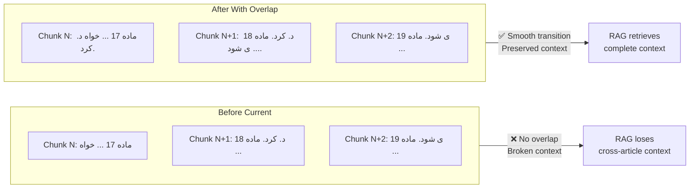
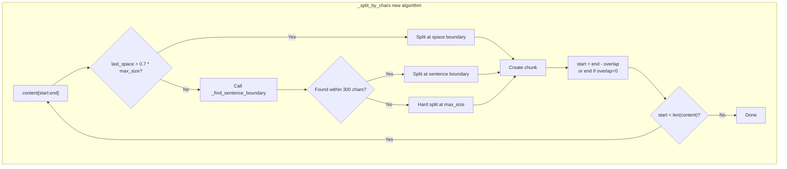

# Plan: Fix Missing Overlap Between Chunks in Persian Legal Document Chunking

## 1. Problem Statement

Chunks produced by the legal structural chunking pipeline have **no overlap between consecutive articles** (مواد). This is problematic for a RAG system on Persian legal texts because:

- A legal concept often spans across article boundaries (e.g., "ماده 17" ends mid-sentence and "ماده 18" continues).
- Without overlap, a user query that references a concept bridging two articles will get incomplete context.
- The chunks shown in the user's example confirm this: Chunk #20 ends with `خواه` and Chunk #21 starts with `د. کرد.` — clearly a word/sentence broken across chunks with zero overlap.

## 2. Root Cause Analysis

The chunking pipeline has **three separate code paths** that produce chunks, and **all three lack inter-chunk overlap** in certain scenarios:

### Path A: Legal Chunking — `_chunk_legal()` (lines 208–301)

**File:** [`src/backend/documents/services/chunking_service.py`](src/backend/documents/services/chunking_service.py:208)

The `_group_article_segments()` method groups segments by article boundaries. Each article group becomes **one chunk** (or multiple if it exceeds `max_chunk_size`). The overlap mechanism (`overlap_clauses`) **only applies within a single long article** that gets split at clause boundaries. Between different articles, there is **zero overlap**.

```python
# Line 253-286: Each article_group → one chunk, no overlap with next group
for article_segments in article_groups:
    article_content = "\n".join(s.content for s in article_segments if s.content)
    if len(article_content) <= max_chunk_size:
        chunk = self._make_chunk(content=article_content, ...)  # ← NO overlap
    else:
        clause_chunks = self._split_long_article(...)  # ← overlap only WITHIN this article
```

### Path B: Long Article Split — `_split_long_article()` (lines 359–455)

**File:** [`src/backend/documents/services/chunking_service.py`](src/backend/documents/services/chunking_service.py:359)

This method **does** implement clause-aware overlap correctly (lines 450–453), but only for chunks **within the same article**. The overlap is between sub-chunks of one article, not between different articles.

### Path C: Character-based Fallback — `_split_by_chars()` (lines 504–558)

**File:** [`src/backend/documents/services/chunking_service.py`](src/backend/documents/services/chunking_service.py:504)

This method has **zero overlap at all** — it simply does `start = end` (line 556) with no rewind mechanism. It also splits blindly at `max_chunk_size` without checking sentence boundaries, which can break mid-sentence. This is used when a long article has no detectable clause structure.

### Path D: Sentence-boundary Chunking — `_chunk_sentence()` (lines 564–628)

**File:** [`src/backend/documents/services/chunking_service.py`](src/backend/documents/services/chunking_service.py:564)

This method **does** implement character-based overlap (line 619: `next_cursor = split_at - overlap`) and uses `_find_split_point()` for sentence-boundary detection. However, it's only used as a fallback for non-legal documents. The legal chunking path never reaches this code.

## 3. Solution Design

### 3.1. Add Inter-Article Overlap in `_chunk_legal()`

**Target:** [`src/backend/documents/services/chunking_service.py`](src/backend/documents/services/chunking_service.py:208) — `_chunk_legal()` method

**Strategy:** After building each article chunk, append a configurable number of **trailing characters** from the **next article** to the current chunk. This creates a smooth transition between articles.

**New parameter:** `legal_overlap_chars: int = 150` — number of characters from the next article to append as overlap to the current chunk.

**Algorithm change in `_chunk_legal()`:**

```
for each article_group at index i:
    current_content = build article_content from group i
    
    # If there's a next article group, append overlap from it
    if i + 1 < len(article_groups):
        next_content = build article_content from group i+1
        overlap_text = next_content[:legal_overlap_chars]
        # Trim to last clean boundary (space or newline) to avoid mid-word break
        last_space = max(overlap_text.rfind(' '), overlap_text.rfind('\n'))
        if last_space > 0:
            overlap_text = overlap_text[:last_space]
        chunk_content = current_content + "\n" + overlap_text
    
    create chunk from chunk_content
```

**Important constraint:** The overlap text is **only used for the chunk content** — it should NOT affect the `legal_type`, `legal_number`, or `page_start`/`page_end` metadata. The chunk's primary identity remains the current article.

### 3.2. Rewrite `_split_by_chars()` with Sentence-Boundary Awareness and Overlap

**Target:** [`src/backend/documents/services/chunking_service.py`](src/backend/documents/services/chunking_service.py:504) — `_split_by_chars()` method

**Strategy:** Replace the naive character-split with a smart split that:
1. Tries to find a space/newline boundary near the target size (within 70% of max_size)
2. If no space is near, searches forward/backward for a sentence boundary (`.`, `؟`, `!`, `،`, `؛`)
3. Applies character-based overlap between consecutive sub-chunks

**New method signature:**
```python
def _split_by_chars(
    self,
    content: str,
    legal_type: Optional[str],
    legal_number: Optional[str],
    parent_article: Optional[str],
    metadata: dict,
    max_chunk_size: int,
    overlap: int = 0,
    text: str,
    clean_to_original: list[int],
    page_map: list[tuple[int, int]],
) -> List[ChunkResult]:
```

**New helper method:**
```python
def _find_sentence_boundary(
    self, text: str, start: int, preferred_end: int
) -> Optional[int]:
    """Find the nearest sentence boundary to preferred_end.
    
    Searches in a window [preferred_end-200, preferred_end+200].
    Returns the position after the sentence-ending character,
    or None if no boundary is found within range.
    """
    search_start = max(start, preferred_end - 200)
    search_end = min(len(text), preferred_end + 200)
    window = text[search_start:search_end]
    
    # Persian + standard sentence-ending characters
    sentence_markers = ['.', '!', '?', '؟', '،', '؛']
    positions = []
    
    for marker in sentence_markers:
        idx = window.find(marker)
        while idx != -1:
            positions.append(search_start + idx + 1)  # +1 to include the marker
            idx = window.find(marker, idx + 1)
    
    if not positions:
        return None
    
    # Find closest to preferred_end
    closest = min(positions, key=lambda x: abs(x - preferred_end))
    
    # Only accept if within 300 chars of preferred_end
    if abs(closest - preferred_end) < 300:
        return closest
    
    return None
```

**New algorithm for `_split_by_chars()`:**
```python
if len(content) <= max_chunk_size:
    return [self._make_chunk(...)]  # single chunk, no split needed

chunks = []
start = 0

while start < len(content):
    end = min(start + max_chunk_size, len(content))
    
    if end >= len(content):
        # Last chunk
        chunk_content = content[start:].strip()
        if chunk_content:
            chunk = self._make_chunk(content=chunk_content, ...)
            if chunk:
                chunks.append(chunk)
        break
    
    chunk = content[start:end]
    last_space = max(chunk.rfind(' '), chunk.rfind('\n'))
    
    if last_space > max_chunk_size * 0.7:
        # Good space boundary found within 70% of chunk
        end = start + last_space
    else:
        # No space near — search for sentence boundary
        sentence_end = self._find_sentence_boundary(content, start, end)
        if sentence_end:
            end = sentence_end
    
    chunk_content = content[start:end].strip()
    if chunk_content:
        chunk = self._make_chunk(content=chunk_content, ...)
        if chunk:
            chunks.append(chunk)
    
    # Advance cursor with overlap
    start = max(end - overlap, 0) if overlap > 0 else end

return chunks
```

### 3.3. Handle Orphan Text Segments and Chapter Transitions

**Target:** [`src/backend/documents/services/chunking_service.py`](src/backend/documents/services/chunking_service.py:303) — `_group_article_segments()` method

**Problem:** Text segments that appear between chapters (orphan text) or before the first article become their own groups with no overlap context.

**Solution:** When building the overlap for an article chunk, also include any **orphan text segments** that precede the next article. This ensures that transitional text (e.g., "فصل اول- در اقسام مختلفه شرکت ها") is included in the overlap.

### 3.4. Configuration Changes

**Target:** [`src/backend/documents/tasks/document_processing.py`](src/backend/documents/tasks/document_processing.py:604-609)

Add a new Django setting for the inter-article overlap character count:

```python
legal_overlap_chars = getattr(settings, "LEGAL_CHUNK_OVERLAP_CHARS", 150)
```

Pass this to `chunking_service.chunk_text()` as a new parameter.

## 4. Detailed Implementation Steps

### Step 1: Add `legal_overlap_chars` parameter to `chunk_text()`

**File:** [`src/backend/documents/services/chunking_service.py`](src/backend/documents/services/chunking_service.py:137)

Add parameter:
```python
def chunk_text(
    self,
    text: str,
    chunk_size: int = 1000,
    overlap: int = 200,
    legal_chunking_enabled: bool = True,
    legal_max_chunk_size: int = 2000,
    legal_overlap_clauses: int = 1,
    legal_overlap_chars: int = 150,  # NEW
) -> List[ChunkResult]:
```

Pass `legal_overlap_chars` to `_chunk_legal()`.

### Step 2: Modify `_chunk_legal()` to implement inter-article overlap

**File:** [`src/backend/documents/services/chunking_service.py`](src/backend/documents/services/chunking_service.py:208)

After the `article_groups` loop (line 253), add logic to:

1. For each article group at index `i`, check if there's a next group at index `i+1`.
2. Build the next group's content.
3. Extract the first `legal_overlap_chars` characters from the next group's content.
4. Trim to the last space/newline boundary to avoid mid-word breaks.
5. Append this overlap text to the current chunk's content.
6. **Do NOT** modify the chunk's metadata (legal_type, legal_number, page_start, page_end) based on overlap text.

**Pseudo-code:**
```python
for i, article_segments in enumerate(article_groups):
    article_content = "\n".join(s.content for s in article_segments if s.content)
    
    # --- NEW: Inter-article overlap ---
    if i + 1 < len(article_groups):
        next_segments = article_groups[i + 1]
        next_content = "\n".join(s.content for s in next_segments if s.content)
        if next_content:
            overlap_text = next_content[:legal_overlap_chars]
            last_space = max(
                overlap_text.rfind(" "),
                overlap_text.rfind("\n"),
            )
            if last_space > 0:
                overlap_text = overlap_text[:last_space]
            article_content = article_content + "\n" + overlap_text
    # --- END NEW ---
    
    # Rest of existing logic...
```

### Step 3: Rewrite `_split_by_chars()` with sentence-boundary awareness and overlap

**File:** [`src/backend/documents/services/chunking_service.py`](src/backend/documents/services/chunking_service.py:504)

Replace the entire method body with the new algorithm from Section 3.2 above.

### Step 4: Add `_find_sentence_boundary()` helper method

**File:** [`src/backend/documents/services/chunking_service.py`](src/backend/documents/services/chunking_service.py)

Add as a new static method on `ChunkingService`, placed near `_find_split_point()` (around line 784).

### Step 5: Update `_split_long_article()` to pass `overlap` to `_split_by_chars()`

**File:** [`src/backend/documents/services/chunking_service.py`](src/backend/documents/services/chunking_service.py:400-411)

When falling back to `_split_by_chars()` (no clauses found), pass the overlap parameter. The overlap value should be `legal_overlap_chars` (same as inter-article overlap) for consistency.

### Step 6: Update `chunk_document()` task to pass the new setting

**File:** [`src/backend/documents/tasks/document_processing.py`](src/backend/documents/tasks/document_processing.py:611-618)

```python
legal_overlap_chars = getattr(settings, "LEGAL_CHUNK_OVERLAP_CHARS", 150)

chunk_results = chunking_service.chunk_text(
    extracted_text,
    chunk_size=1000,
    overlap=300,
    legal_chunking_enabled=legal_chunking_enabled,
    legal_max_chunk_size=legal_max_chunk_size,
    legal_overlap_clauses=legal_overlap_clauses,
    legal_overlap_chars=legal_overlap_chars,  # NEW
)
```

### Step 7: Update tests

**File:** [`src/backend/documents/tests/test_chunking_service.py`](src/backend/documents/tests/test_chunking_service.py)

Add new test cases:

1. **`test_inter_article_overlap`** — Two consecutive articles; verify that chunk 1 contains trailing text from article 2.
2. **`test_inter_article_overlap_zero`** — With `legal_overlap_chars=0`, verify no overlap between articles.
3. **`test_split_by_chars_sentence_boundary`** — Long article without clause structure; verify split at sentence boundary, not mid-sentence.
4. **`test_split_by_chars_with_overlap`** — Long article without clause structure; verify overlap between sub-chunks.
5. **`test_inter_article_overlap_metadata_preserved`** — Verify that overlap text doesn't corrupt metadata (legal_type, legal_number).

## 5. Edge Cases to Handle

| Edge Case | How to Handle |
|-----------|---------------|
| **Last article in document** | No next article → no overlap appended. |
| **Single-article document** | No inter-article overlap needed. |
| **Overlap text exceeds next article** | Take `min(overlap_chars, len(next_content))`. |
| **Overlap breaks mid-word** | Trim to last space/newline boundary. |
| **Next article is very short** | Overlap may consume the entire next article. This is acceptable — the next chunk will still contain the full article. |
| **Chapter boundary between articles** | The chapter segment is part of the next article group (see `_group_article_segments`). Overlap will naturally include the chapter header. |
| **Orphan text before first article** | This becomes its own group. It won't have overlap from a previous article (there is none), but it will provide overlap TO the first article. |
| **Re-chunking existing documents** | The change only affects new chunking operations. Existing chunks remain unchanged. A re-embedding task may be needed if users want to update existing documents. |
| **`_find_sentence_boundary` finds no boundary** | Falls back to hard split at `max_chunk_size` — same behavior as current code. |
| **Sentence boundary is before `start`** | `_find_sentence_boundary` constrains `search_start = max(start, preferred_end - 200)`, so it won't go before the current position. |

## 6. Mermaid Diagram: Before vs After





## 7. Files to Modify

| File | Changes |
|------|---------|
| [`src/backend/documents/services/chunking_service.py`](src/backend/documents/services/chunking_service.py) | 1. Add `legal_overlap_chars` param to `chunk_text()`<br>2. Modify `_chunk_legal()` to append overlap from next article<br>3. Rewrite `_split_by_chars()` with sentence-boundary awareness + overlap<br>4. Add new `_find_sentence_boundary()` static method<br>5. Update `_split_long_article()` fallback call |
| [`src/backend/documents/tasks/document_processing.py`](src/backend/documents/tasks/document_processing.py) | 1. Read `LEGAL_CHUNK_OVERLAP_CHARS` from settings<br>2. Pass it to `chunking_service.chunk_text()` |
| [`src/backend/documents/tests/test_chunking_service.py`](src/backend/documents/tests/test_chunking_service.py) | Add 5 new test cases for inter-article overlap and sentence-boundary split |

## 8. Default Configuration Values

| Setting | Default | Description |
|---------|---------|-------------|
| `LEGAL_CHUNK_OVERLAP_CHARS` | `150` | Number of characters from the next article to append as overlap to the current chunk. 150 chars ≈ 30-40 Persian words, enough to provide context without bloating chunks. |
| `LEGAL_CHUNK_OVERLAP_CLAUSES` | `1` | (Existing) Number of clauses to overlap when splitting long articles. |
| `LEGAL_MAX_CHUNK_SIZE` | `2000` | (Existing) Max characters per legal chunk. |

## 9. Verification

After implementation, verify by:

1. **Unit tests** — Run `docker-compose exec backend pytest documents/tests/test_chunking_service.py -v`
2. **Manual inspection** — Upload a multi-article Persian legal PDF and inspect the chunks via the monitoring page or database.
3. **Regression** — Run full test suite: `docker-compose exec backend pytest`
