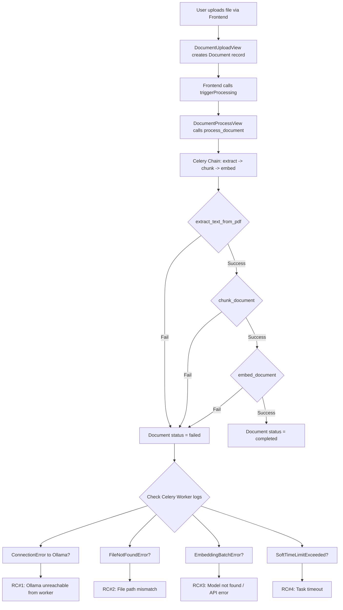

# Investigation Plan: Document Status Changes to "failed" After Upload

## Problem Statement

When a user uploads a file via the frontend, the document status changes to `"failed"` after a few seconds. The system uses **Ollama** with `nomic-embed-text` for embeddings and **DeepSeek API** for chat.

---

## Root Cause Analysis

After thorough code review, I have identified **multiple potential root causes** that could independently or collectively cause the failure. Below is a detailed breakdown.

---

### Root Cause #1 (MOST LIKELY): Ollama Connection Failure from Celery Worker

**Severity:** High | **Probability:** High

**Description:**
The Celery worker container (`docuchat_celery_worker`) runs the embedding task (`embed_document`). When it tries to call Ollama's API at `OLLAMA_BASE_URL`, the connection may fail.

**Evidence:**
- In [`docker-compose.yml:149`](docker-compose.yml:149), the default `OLLAMA_BASE_URL` is `http://host.docker.internal:11434`
- `host.docker.internal` is a Docker DNS name that resolves to the **host machine** from within Docker containers
- However, `host.docker.internal` is **only available on Docker Desktop (Windows/Mac)**. On Linux, it does not work unless explicitly configured with `--add-host`
- The Celery worker container runs in the `docuchat_network` bridge network, not on the host
- If Ollama is running on the host machine (Windows), the Celery worker inside the container may not be able to reach it

**What happens when it fails:**
In [`src/backend/providers/ollama_embedding.py:163-173`](src/backend/providers/ollama_embedding.py:163), `embed_batch()` raises an `EmbeddingBatchError` when a `ConnectionError` occurs. This is caught in [`src/backend/documents/tasks/embedding_tasks.py:129-153`](src/backend/documents/tasks/embedding_tasks.py:129), which sets:
- `processing_task.status = "failed"`
- `document.processing_status = "failed"`
- `document.status = "failed"`

**Check:** Is Ollama running on the host? Can the Celery worker reach `http://host.docker.internal:11434`?

---

### Root Cause #2: File Path Mismatch Between Backend and Celery Worker

**Severity:** High | **Probability:** Medium-High

**Description:**
The `LocalStorageBackend.save_file()` returns an **absolute path** (e.g., `/app/media/documents/uuid.pdf`). When the Celery worker tries to open this file via `storage.open(document.file_path)`, the file may not exist at that path inside the worker container.

**Evidence:**
- In [`src/backend/documents/storage/local.py:131`](src/backend/documents/storage/local.py:131), `save_file()` returns `str(destination)` which is an absolute path like `/app/media/documents/uuid.pdf`
- In [`src/backend/documents/tasks/document_processing.py:122`](src/backend/documents/tasks/document_processing.py:122), the extraction task calls `storage.open(document.file_path)` using this absolute path
- In [`docker-compose.yml:158-159`](docker-compose.yml:158), the Celery worker mounts `backend_media:/app/media` — but the **backend** container also mounts the same volume at `backend_media:/app/media` ([line 108](docker-compose.yml:108))
- If the file was saved by the backend container to `/app/media/documents/uuid.pdf`, it should be visible to the Celery worker via the shared volume — **BUT** only if the volume is properly shared

**Check:** Verify that `backend_media` volume is properly shared between `backend` and `celery_worker` containers. Check if the file actually exists at the expected path inside the worker.

---

### Root Cause #3: Ollama Model Not Pulled / Not Available

**Severity:** High | **Probability:** Medium

**Description:**
The embedding task calls Ollama's `/api/embed` endpoint with model `nomic-embed-text`. If this model has not been pulled in Ollama, the API returns an HTTP error.

**Evidence:**
- In [`src/backend/providers/ollama_embedding.py:46-54`](src/backend/providers/ollama_embedding.py:46), the `embed()` method sends a POST to `/api/embed` with `{"model": "nomic-embed-text", "input": text}`
- If the model doesn't exist, Ollama returns HTTP 404 or similar error
- The `HTTPError` handler at line 63-76 logs the error and returns `None`
- In `embed_batch()` at line 147-162, an `HTTPError` raises `EmbeddingBatchError`, which propagates to the task and marks the document as failed

**Check:** Run `ollama list` on the host to verify `nomic-embed-text` is pulled. If not, run `ollama pull nomic-embed-text`.

---

### Root Cause #4: Celery Task Timeout

**Severity:** Medium | **Probability:** Low-Medium

**Description:**
The Celery soft time limit is 25 minutes and hard limit is 30 minutes. For large documents with many chunks, embedding could take longer, causing a `SoftTimeLimitExceeded` exception.

**Evidence:**
- In [`src/backend/config/settings.py:235-236`](src/backend/config/settings.py:235): `CELERY_TASK_SOFT_TIME_LIMIT = 25 * 60` and `CELERY_TASK_TIME_LIMIT = 30 * 60`
- In [`src/backend/documents/services/error_handler.py:76-77`](src/backend/documents/services/error_handler.py:76): `SoftTimeLimitExceeded` is classified as `"Task timed out"`
- However, for small documents this is unlikely

---

### Root Cause #5: PDF Extraction Failure

**Severity:** Medium | **Probability:** Low-Medium

**Description:**
The PDF extraction task (`extract_text_from_pdf`) could fail if:
- The file is corrupted or not a valid PDF
- The file is password-protected
- PyMuPDF cannot read the file

**Evidence:**
- In [`src/backend/documents/tasks/document_processing.py:119-141`](src/backend/documents/tasks/document_processing.py:119), various exceptions are caught and `fail_processing_task()` is called
- The `error_handler.py` `classify_pdf_error()` function handles these cases

---

### Root Cause #6: Embedding Dimension Mismatch

**Severity:** Medium | **Probability:** Low

**Description:**
The `nomic-embed-text` model produces 768-dimensional embeddings. If the database schema or settings expect a different dimension, the `VectorField` constraint would fail.

**Evidence:**
- In [`src/backend/config/settings.py:256`](src/backend/config/settings.py:256): `EMBEDDING_DIMENSION = env('EMBEDDING_DIMENSION', default=768)`
- In [`src/backend/documents/models.py:91`](src/backend/documents/models.py:91): `embedding = VectorField(dimensions=768, ...)`
- The `nomic-embed-text` model produces 768-dimensional vectors by default, so this should match

---

## Diagnostic Steps (in priority order)

### Step 1: Check Celery Worker Logs
```bash
docker-compose logs celery_worker
```
Look for error messages related to:
- `ConnectionError` or `Connection refused` (Ollama connectivity)
- `EmbeddingBatchError` (embedding failure)
- `FileNotFoundError` (file path issue)
- `SoftTimeLimitExceeded` (timeout)

### Step 2: Check Backend Logs
```bash
docker-compose logs backend
```
Look for errors during upload or processing trigger.

### Step 3: Verify Ollama Connectivity from Celery Worker
```bash
docker-compose exec celery_worker python -c "import requests; r = requests.get('http://host.docker.internal:11434/api/tags', timeout=5); print(r.status_code, r.json())"
```
If this fails, the Celery worker cannot reach Ollama.

### Step 4: Verify Ollama Model Availability
```bash
# On the host (Windows):
curl http://localhost:11434/api/tags
# Or check via Ollama CLI:
ollama list
```
Ensure `nomic-embed-text` is in the list.

### Step 5: Check File Path Consistency
```bash
docker-compose exec celery_worker ls -la /app/media/documents/
docker-compose exec backend ls -la /app/media/documents/
```
Compare the file listings. If they differ, the volume sharing is broken.

### Step 6: Test Embedding Directly
```bash
docker-compose exec celery_worker python -c "
from documents.services.embedding_service import generate_embedding
result = generate_embedding('test text')
print('Embedding result:', result[:5] if result else 'None')
"
```

---

## Fix Options (once root cause is confirmed)

### Fix A: Ollama Connectivity (if RC#1)
**Option 1:** Change `OLLAMA_BASE_URL` in `.env` to use the host's IP address instead of `host.docker.internal`:
```
OLLAMA_BASE_URL=http://192.168.x.x:11434
```

**Option 2:** Run Ollama inside Docker as a service in `docker-compose.yml`:
```yaml
ollama:
  image: ollama/ollama
  container_name: docuchat_ollama
  volumes:
    - ollama_data:/root/.ollama
  ports:
    - "11434:11434"
```
Then set `OLLAMA_BASE_URL=http://ollama:11434`.

**Option 3:** Add `extra_hosts` to the Celery worker service:
```yaml
celery_worker:
  extra_hosts:
    - "host.docker.internal:host-gateway"
```

### Fix B: File Path Mismatch (if RC#2)
Ensure the `backend_media` volume is properly shared. The current config already mounts it on both services, but verify the paths match.

### Fix C: Missing Ollama Model (if RC#3)
Pull the model:
```bash
ollama pull nomic-embed-text
```

### Fix D: Add Ollama health check in Celery worker startup
Create a startup script that verifies Ollama connectivity before processing tasks.

---

## Summary of Investigation Flow



---

## Recommended Action Items

1. **Immediate:** Check Celery worker logs for the exact error message
2. **Immediate:** Verify Ollama is running and `nomic-embed-text` model is available
3. **Immediate:** Test Ollama connectivity from inside the Celery worker container
4. **Short-term:** Based on findings, apply the appropriate fix from the options above
5. **Short-term:** Add better error logging to capture the exact failure reason in the document's `error_message` / `processing_error` fields
6. **Medium-term:** Consider running Ollama as a Docker service for consistent networking
