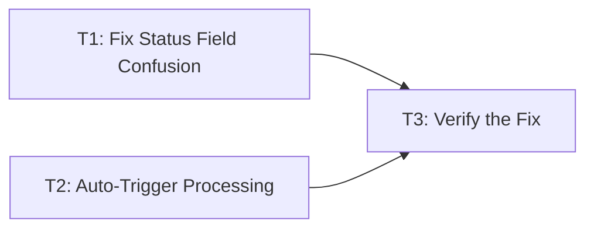

# Plan: Fix Documents Stuck in "Pending" State After Upload

## Problem Statement

When a user uploads a document via the frontend, the document remains in "pending" state indefinitely. The "Chat with Document" button never appears, and the user cannot interact with the document.

## Root Cause Analysis

The issue is a **status field mismatch** in [`src/frontend/src/pages/documents/DocumentDetailPage.tsx`](src/frontend/src/pages/documents/DocumentDetailPage.tsx:224).

### The `Document` Model Has Two Status Fields

| Field | Initial Value After Upload | Meaning |
|-------|---------------------------|---------|
| `status` | `'uploaded'` | Upload lifecycle status (source of truth for consumers) |
| `processing_status` | `'pending'` | Pipeline granular status (free-text, set by Celery tasks) |

### The Bug

In [`DocumentDetailPage.tsx`](src/frontend/src/pages/documents/DocumentDetailPage.tsx:224):

```typescript
const processingStatus = document.processing_status ?? document.status;
```

This uses `processing_status` (`'pending'`) as the primary value. Then this `processingStatus` is passed to [`ProcessingStatusPanel`](src/frontend/src/components/documents/ProcessingStatusPanel.tsx:70):

```typescript
const showStartProcessing = processingStatus === "uploaded";
```

Since `processingStatus` is `'pending'` (not `'uploaded'`), the **"Start Processing" button never renders**, even though the document has just been uploaded and needs processing to be triggered.

### The Complete Flow

```
Upload → Document created with status='uploaded', processing_status='pending'
         ↓
User navigates to DocumentDetailPage
         ↓
processingStatus = document.processing_status ?? document.status
                 = 'pending' ?? 'uploaded'
                 = 'pending'
         ↓
ProcessingStatusPanel renders (because processingStatus !== 'completed')
         ↓
showStartProcessing = (processingStatus === 'uploaded')  →  FALSE
         ↓
"Start Processing" button is HIDDEN
         ↓
User has no way to trigger processing → document stuck in 'pending' forever
```

## Solution

### Option A (Recommended): Fix the Status Logic in `DocumentDetailPage.tsx`

Change the logic to use `document.status` for determining which action buttons to show, while keeping `processing_status` for display purposes.

**Changes needed:**

1. **`src/frontend/src/pages/documents/DocumentDetailPage.tsx`** — Separate the two concepts:
   - Use `document.status` (upload lifecycle) to decide whether to show "Start Processing" / "Chat with Document" buttons
   - Use `document.processing_status` (pipeline status) for the `ProcessingStatusPanel` display

2. **`src/frontend/src/components/documents/ProcessingStatusPanel.tsx`** — Update the `showStartProcessing` check to use the document's `status` field (`'uploaded'`) instead of `processing_status` (`'pending'`).

### Option B: Auto-Trigger Processing After Upload

Modify the upload flow so that after a successful upload, the processing pipeline is automatically triggered without requiring a manual button click.

**Changes needed:**

1. **`src/frontend/src/pages/documents/UploadPage.tsx`** — After successful upload, call `triggerProcessing(documentId)` before navigating to the detail page.

2. **Backend** — Optionally, modify `DocumentUploadView` to automatically trigger the Celery processing chain after creating the document record.

### Recommended: Option A + Option B (Combined)

Both fixes should be applied for the best user experience:

1. **Fix the status field confusion** so the UI correctly shows the "Start Processing" button when needed.
2. **Auto-trigger processing after upload** so users don't need to manually click "Start Processing" at all.

---

## Task Breakdown

### TASK 1 — Fix Status Field Confusion in DocumentDetailPage

**Files to modify:**
- [`src/frontend/src/pages/documents/DocumentDetailPage.tsx`](src/frontend/src/pages/documents/DocumentDetailPage.tsx)
- [`src/frontend/src/components/documents/ProcessingStatusPanel.tsx`](src/frontend/src/components/documents/ProcessingStatusPanel.tsx)

**Changes:**

1. In [`DocumentDetailPage.tsx`](src/frontend/src/pages/documents/DocumentDetailPage.tsx:224):
   - Change `const processingStatus = document.processing_status ?? document.status;`
   - To: `const processingStatus = document.processing_status ?? 'pending';`
   - Keep `document.status` separately for button visibility logic

2. In [`ProcessingStatusPanel.tsx`](src/frontend/src/components/documents/ProcessingStatusPanel.tsx:70):
   - Add a new prop `documentStatus: string` to the component interface
   - Change `const showStartProcessing = processingStatus === "uploaded";`
   - To: `const showStartProcessing = documentStatus === "uploaded";`
   - Update the parent in `DocumentDetailPage.tsx` to pass `document.status` as `documentStatus`

3. In [`DocumentDetailPage.tsx`](src/frontend/src/pages/documents/DocumentDetailPage.tsx:294):
   - Change `{processingStatus === 'completed' && (` for the "Chat with Document" button
   - To: `{document.status === 'completed' && (` — use the authoritative `status` field

### TASK 2 — Auto-Trigger Processing After Upload

**Files to modify:**
- [`src/frontend/src/pages/documents/UploadPage.tsx`](src/frontend/src/pages/documents/UploadPage.tsx)

**Changes:**

1. In [`UploadPage.tsx`](src/frontend/src/pages/documents/UploadPage.tsx:44-50):
   - After successful upload (`onSuccess` callback), call `triggerProcessing(response.id)` 
   - Show a toast "Processing started" 
   - Then navigate to the document detail page

### TASK 3 — Verify the Fix

**Steps:**
1. Run `docker-compose up` to ensure all services are running (including Celery worker and Redis)
2. Upload a document via the frontend
3. Verify the document automatically starts processing (or the "Start Processing" button appears)
4. Wait for processing to complete
5. Verify the "Chat with Document" button appears
6. Verify chat functionality works

---

## Dependency Graph



## Files to Modify

| # | File | Change |
|---|------|--------|
| 1 | `src/frontend/src/pages/documents/DocumentDetailPage.tsx` | Fix `processingStatus` logic to use `document.status` for button visibility |
| 2 | `src/frontend/src/components/documents/ProcessingStatusPanel.tsx` | Add `documentStatus` prop, use it for `showStartProcessing` |
| 3 | `src/frontend/src/pages/documents/UploadPage.tsx` | Auto-trigger processing after successful upload |

## Acceptance Criteria

- [ ] After upload, document processing starts automatically (or "Start Processing" button is visible)
- [ ] "Chat with Document" button appears when `document.status === 'completed'`
- [ ] Processing status panel correctly shows per-task progress
- [ ] No regressions in document list or detail views
- [ ] All existing tests still pass
