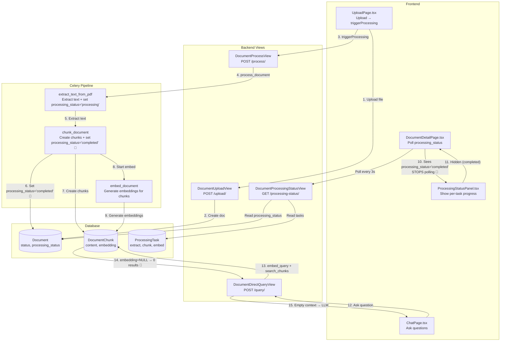
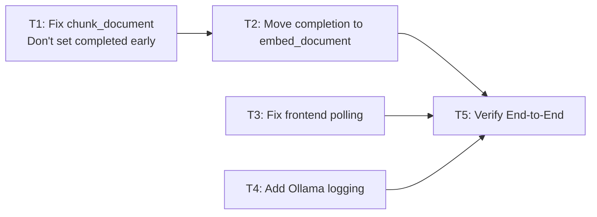

# Plan: Fix Embedding Progress Bar Stuck on Pending & Empty Context in Chat

## Problem Summary

The user reports **two related bugs**:

### Bug A — "Generate Embeddings" progress bar never updates (stays "pending")
After uploading a file and clicking "Generate Embeddings", the progress bar in [`ProcessingStatusPanel`](src/frontend/src/components/documents/ProcessingStatusPanel.tsx) stays at "pending" and never shows progress. However, if the user navigates away ("Back to Documents") and returns, the embedding is actually complete and the "Start Chat" button appears.

### Bug B — Chat returns "empty context" even though document appears complete
When the user starts a chat and asks a question, the LLM responds with:
> "Based on the provided context, there is no information about the text. The context is empty."

This means the RAG pipeline is finding **zero chunks** with embeddings, so [`build_context([])`](src/backend/conversations/rag_service.py:37) returns an empty string.

---

## Root Cause Analysis

### Bug A — Progress Bar Never Updates

The issue is in the **polling logic** in [`DocumentDetailPage.tsx`](src/frontend/src/pages/documents/DocumentDetailPage.tsx:82-85):

```typescript
const { statusData, isPolling } = useProcessingStatus(
  documentId,
  !isLoading && document !== null && document.processing_status !== "completed",
);
```

The polling is **enabled only when `document.processing_status !== "completed"`**.

Here's the flow:

1. User uploads a file → [`UploadPage.tsx`](src/frontend/src/pages/documents/UploadPage.tsx:54-55) calls `triggerProcessing(response.id)` → backend starts the Celery chain: `extract → chunk → embed`
2. User is navigated to [`DocumentDetailPage`](src/frontend/src/pages/documents/DocumentDetailPage.tsx)
3. The page fetches the document via `GET /documents/{id}/` → the document's `processing_status` is now `"processing"` (set by [`extract_text_from_pdf`](src/backend/documents/tasks/document_processing.py:115-117))
4. Polling starts because `processing_status !== "completed"` ✅
5. The Celery chain runs: `extract → chunk → embed`
6. When `chunk_document` completes, it sets `document.processing_status = "completed"` and `document.status = "completed"` at line 292-294 of [`document_processing.py`](src/backend/documents/tasks/document_processing.py:292-294)
7. **Then** the `embed_document` task runs as the third link in the chain
8. But at this point, `document.processing_status` is already `"completed"` (set by `chunk_document`)
9. The frontend's polling sees `processing_status === "completed"` and **stops polling**
10. The `ProcessingStatusPanel` is hidden because `processingStatus === "completed"` (line 47-49 of [`ProcessingStatusPanel.tsx`](src/frontend/src/components/documents/ProcessingStatusPanel.tsx:47-49))
11. The user sees nothing — the embed task is still running but the UI thinks everything is done

**The core issue**: [`chunk_document`](src/backend/documents/tasks/document_processing.py:292-294) prematurely sets `document.processing_status = "completed"` and `document.status = "completed"` **before** the `embed_document` task has finished. The `processing_status` field should only be set to `"completed"` after the **entire pipeline** (including embedding) is done.

### Bug B — Empty Context in Chat

This is a **direct consequence** of Bug A, combined with a **race condition**:

1. The user sees the "Start Chat" button (because `document.status === "completed"` was set prematurely by `chunk_document`)
2. The user clicks "Start Chat" and asks a question
3. The [`run_rag_query`](src/backend/conversations/rag_service.py:150) function calls `search_chunks` which filters with `embedding__isnull=False` (line 106 of [`search_service.py`](src/backend/documents/services/search_service.py:106))
4. If the `embed_document` task **hasn't finished yet** (still running in the background), the chunks have `embedding = NULL`
5. `search_chunks` returns 0 results → `build_context([])` returns empty string → LLM says "no information"

**But even if the user waits** and the embed task finishes, the problem is that:

- The `ProcessingStatusPanel` is **hidden** (because `processing_status === "completed"` from step 6 above)
- The user has **no visual feedback** that embedding is still running
- If they navigate away and come back, the page re-fetches the document, and by then the embed task may have finished — so it "works" but the UX is broken

**Additionally**, there's a deeper issue: the `embed_document` task in the Celery chain uses [`ollama nomic-embed-text`](src/backend/providers/ollama_embedding.py) for embeddings. If this model is not running or fails silently, the embeddings will never be generated, and the chunks will remain with `embedding = NULL` forever.

---

## Data Flow Diagram



---

## Detailed Bug Analysis

### Bug A: `chunk_document` Sets `processing_status = "completed"` Too Early

**File**: [`src/backend/documents/tasks/document_processing.py`](src/backend/documents/tasks/document_processing.py:292-294)

```python
# Line 292-294
document.total_chunks = len(chunks_to_create)
document.processing_status = "completed"  # 🐛 Too early! Embed hasn't run yet
document.status = "completed"              # 🐛 Too early! Embed hasn't run yet
document.save(update_fields=["total_chunks", "processing_status", "status"])
```

This is set **before** the `embed_document` task in the chain runs. The Celery chain is:
```
extract_text_from_pdf → chunk_document → embed_document
```

But `chunk_document` marks the entire pipeline as complete before `embed_document` even starts.

**Impact on frontend**:
- [`DocumentDetailPage.tsx`](src/frontend/src/pages/documents/DocumentDetailPage.tsx:82-85) stops polling because `processing_status === "completed"`
- [`ProcessingStatusPanel.tsx`](src/frontend/src/pages/documents/ProcessingStatusPanel.tsx:47-49) hides itself because `processingStatus === "completed"`
- The embed task's `ProcessingTask` record exists but the UI never shows its progress
- The "Chat with Document" button appears prematurely (before embeddings are ready)

### Bug B: Chat Returns Empty Context

**Root cause**: Same as Bug A — the document is marked as `completed` before embeddings exist.

**File**: [`src/backend/documents/services/search_service.py`](src/backend/documents/services/search_service.py:104-107)

```python
queryset = DocumentChunk.objects.filter(
    document_id=document_id,
    embedding__isnull=False,  # Only chunks WITH embeddings
)
```

If `embed_document` hasn't finished yet (or failed silently), all chunks have `embedding = NULL`, so `search_chunks` returns 0 results.

**File**: [`src/backend/conversations/rag_service.py`](src/backend/conversations/rag_service.py:37-78)

```python
def build_context(chunks: list[dict]) -> str:
    # If chunks is empty, returns ""
    return "\n\n".join(context_parts)
```

Empty context → LLM says "I don't have enough information."

### Additional Concern: Ollama Embedding Provider Reliability

**File**: [`src/backend/providers/ollama_embedding.py`](src/backend/providers/ollama_embedding.py)

The user is using `ollama nomic-embed-text` for embeddings. If:
- The Ollama service is not running
- The `nomic-embed-text` model is not pulled
- The API returns errors

The [`embed_document`](src/backend/documents/tasks/embedding_tasks.py:113-128) task will catch the exception and mark the `ProcessingTask` as `failed`, but the **document's `status` and `processing_status` will remain `"completed"`** (set by `chunk_document`). This means:
- The document appears "completed" in the UI
- But no embeddings exist
- Chat will always return empty context

---

## Solution

### Fix 1: Move `processing_status = "completed"` to the End of the Pipeline

**File**: [`src/backend/documents/tasks/document_processing.py`](src/backend/documents/tasks/document_processing.py:292-294)

**Change**: Remove the lines that set `document.processing_status = "completed"` and `document.status = "completed"` from `chunk_document`. Instead, move this responsibility to the **last task in the chain** (`embed_document`).

**New flow**:
- `extract_text_from_pdf`: Sets `processing_status = "processing"` and `status = "processing"` (already done ✅)
- `chunk_document`: Creates chunks, sets `total_chunks`, but does **NOT** set `processing_status` or `status` to `"completed"`
- `embed_document`: After all embeddings are generated, sets `document.processing_status = "completed"` and `document.status = "completed"`

**Changes needed in `embed_document`** ([`embedding_tasks.py`](src/backend/documents/tasks/embedding_tasks.py:29-128)):
- After marking the `ProcessingTask` as completed (line 99-102), also update the `Document`'s `processing_status` and `status` to `"completed"`
- On failure (line 125-128), also update the `Document`'s `processing_status` and `status` to `"failed"`

### Fix 2: Ensure Frontend Polling Continues During Embedding

**File**: [`src/frontend/src/pages/documents/DocumentDetailPage.tsx`](src/frontend/src/pages/documents/DocumentDetailPage.tsx:82-85)

**Change**: The polling should continue as long as there are **pending or running ProcessingTasks**, not just based on `document.processing_status`. 

However, since Fix 1 ensures `processing_status` is only set to `"completed"` after all tasks finish, the current polling logic should work correctly after Fix 1 is applied. But we should add a **fallback**: also poll if there are any `ProcessingTask` records with status `"pending"` or `"running"`.

**Better approach**: Change the polling condition to check if there are any non-terminal `ProcessingTask` records. The [`DocumentProcessingStatusView`](src/backend/documents/views.py:360-415) already returns the task list — we can use that.

### Fix 3: Add Error Handling for Embedding Failures in the UI

**File**: [`src/frontend/src/components/documents/ProcessingStatusPanel.tsx`](src/frontend/src/components/documents/ProcessingStatusPanel.tsx)

**Change**: Ensure the panel shows error messages from the embed task. Currently, if `processingStatus === "completed"` (set prematurely), the panel is hidden entirely. After Fix 1, the panel will remain visible during embedding, and if embedding fails, the error will be shown.

### Fix 4: Verify Ollama Embedding Provider is Working

**Check**: Ensure the `nomic-embed-text` model is available in Ollama and the Ollama service is running.

**Add logging**: Add more detailed logging in [`ollama_embedding.py`](src/backend/providers/ollama_embedding.py) to capture when the API fails, so it's easier to diagnose.

---

## Task Breakdown

### TASK 1 — Fix `chunk_document` to Not Set `processing_status = "completed"`

**File**: [`src/backend/documents/tasks/document_processing.py`](src/backend/documents/tasks/document_processing.py)

**Changes**:
1. Remove lines 292-294 that set `document.processing_status = "completed"` and `document.status = "completed"`
2. Keep `document.total_chunks = len(chunks_to_create)` and `document.save(update_fields=["total_chunks"])` — only save `total_chunks`
3. Keep the `chunk_task` ProcessingTask completion (lines 297-299) — this is fine

### TASK 2 — Move Pipeline Completion to `embed_document`

**File**: [`src/backend/documents/tasks/embedding_tasks.py`](src/backend/documents/tasks/embedding_tasks.py)

**Changes**:
1. After successful embedding (after line 102), add:
   ```python
   document.processing_status = "completed"
   document.status = "completed"
   document.save(update_fields=["processing_status", "status"])
   ```
2. On failure (in the except block, around line 128), add:
   ```python
   document.processing_status = "failed"
   document.status = "failed"
   document.save(update_fields=["processing_status", "status"])
   ```

### TASK 3 — Fix Frontend Polling Logic

**File**: [`src/frontend/src/pages/documents/DocumentDetailPage.tsx`](src/frontend/src/pages/documents/DocumentDetailPage.tsx)

**Changes**:
1. Change the polling condition from checking `document.processing_status !== "completed"` to also checking if there are any non-terminal `ProcessingTask` records
2. The simplest approach: keep polling while `statusData` has any task with status `"pending"` or `"running"`, OR while `document.processing_status` is `"processing"`

### TASK 4 — Add Logging to Ollama Embedding Provider

**File**: [`src/backend/providers/ollama_embedding.py`](src/backend/providers/ollama_embedding.py)

**Changes**:
1. Add more detailed error logging when the Ollama API call fails
2. Log the response status code and body for debugging

### TASK 5 — Verify the Fix End-to-End

**Steps**:
1. Run `docker-compose up` with all services (including Celery worker and Redis)
2. Upload a document via the frontend
3. Verify the processing pipeline runs: extract → chunk → embed
4. Verify the progress bar updates in real-time for all three steps
5. Verify the "Chat with Document" button appears **only after** embeddings are complete
6. Ask a question and verify the response contains actual content from the document
7. Test with a Persian PDF to ensure non-Latin text works

---

## Dependency Graph



## Files to Modify

| # | File | Change |
|---|------|--------|
| 1 | `src/backend/documents/tasks/document_processing.py` | Remove premature `processing_status = "completed"` and `status = "completed"` from `chunk_document` |
| 2 | `src/backend/documents/tasks/embedding_tasks.py` | Add `document.processing_status = "completed"` and `document.status = "completed"` after successful embedding; add failure handling |
| 3 | `src/frontend/src/pages/documents/DocumentDetailPage.tsx` | Improve polling logic to continue during embedding phase |
| 4 | `src/backend/providers/ollama_embedding.py` | Add better error logging for debugging |

## Acceptance Criteria

- [ ] After upload, the processing pipeline shows real-time progress for extract → chunk → embed
- [ ] The "Generate Embeddings" progress bar updates from pending → running → completed
- [ ] The "Chat with Document" button appears **only after** all embeddings are generated
- [ ] Chat responses contain actual content from the document (not "empty context")
- [ ] If embedding fails, the document is marked as `failed` with an error message
- [ ] All existing backend tests pass: `docker-compose exec backend pytest`
- [ ] All existing frontend tests pass: `docker-compose exec frontend npx vitest run`
