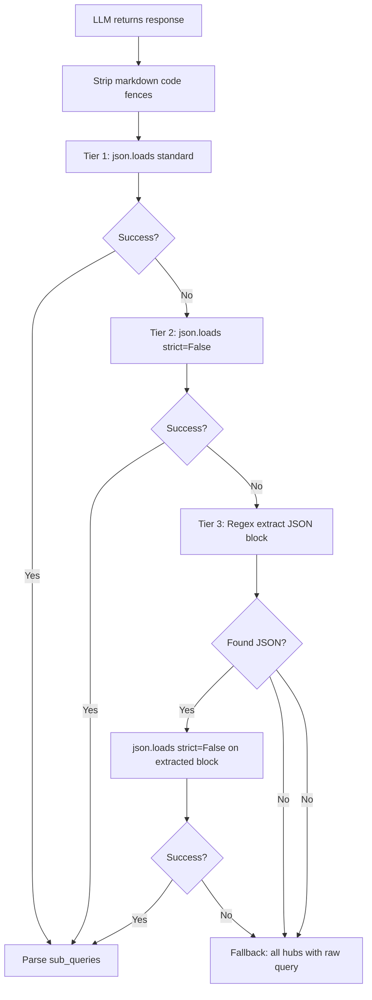

# Fix Plan: Question Router JSON Parsing & Hub Type Mapping

## Root Cause 1: Question Router JSON Parsing Failure

### Problem
The LLM (DeepSeek) returns valid JSON, but [`_parse_router_response()`](src/backend/conversations/question_router.py:315) fails with:
```
WARNING _parse_router_response: invalid JSON (Unterminated string starting at: line 6 column 23)
```

The error `"Unterminated string starting at: line 6 column 23"` indicates the LLM response contains a **literal newline character inside a JSON string value** (e.g., within the `vector_query` or `fts_query` field). Python's `json.loads()` by default does NOT allow unescaped newlines (`\n`) inside string values — it treats them as syntax errors.

The current code at line 342 does:
```python
data: dict[str, Any] = json.loads(cleaned)
```

This fails when Persian text in the LLM response contains unescaped newlines within string values.

### Fix Strategy

**Approach: Use `json.loads()` with `strict=False` + regex JSON extraction as fallback chain**

The fix should implement a **3-tier fallback chain** in `_parse_router_response()`:

1. **Tier 1 (Primary):** `json.loads(cleaned)` — standard parsing (works for clean JSON)
2. **Tier 2 (Newline-tolerant):** `json.loads(cleaned, strict=False)` — allows unescaped newlines in strings (this is the key fix for the Persian text issue)
3. **Tier 3 (Regex extraction):** Extract `{...}` block via regex, then try `json.loads()` with `strict=False` — catches cases where LLM wraps JSON in extra text

### Files to Modify

| File | Change |
|------|--------|
| [`src/backend/conversations/question_router.py`](src/backend/conversations/question_router.py) | Modify `_parse_router_response()` to add the 3-tier fallback chain |

### Detailed Implementation

In [`_parse_router_response()`](src/backend/conversations/question_router.py:315), after the markdown code fence stripping (lines 332-340), replace the single `json.loads()` call with:

```python
def _parse_json_with_fallback(cleaned: str) -> dict[str, Any] | None:
    """Attempt to parse JSON with progressive fallbacks."""
    # Tier 1: Standard json.loads
    try:
        return json.loads(cleaned)
    except json.JSONDecodeError:
        pass

    # Tier 2: strict=False (allows unescaped newlines in strings)
    try:
        return json.loads(cleaned, strict=False)
    except json.JSONDecodeError:
        pass

    # Tier 3: Regex extraction of JSON block
    import re
    json_match = re.search(r'\{.*\}', cleaned, re.DOTALL)
    if json_match:
        extracted = json_match.group(0)
        try:
            return json.loads(extracted, strict=False)
        except json.JSONDecodeError:
            pass

    return None
```

Then use it:
```python
data = _parse_json_with_fallback(cleaned)
if data is None:
    logger.warning(...)
    return RouterResult()
```

### Why This Works

- `strict=False` is the **key fix** — it tells Python's JSON decoder to allow control characters (including literal newlines `\n`, tabs `\t`) inside string values. This is safe because:
  - The LLM output is trusted (it's our own API call, not user input)
  - The `fts_query` and `vector_query` fields are already validated and truncated later
  - Persian text commonly contains newlines in legal document excerpts

- The regex extraction (Tier 3) handles edge cases where the LLM wraps JSON in additional explanatory text despite the system prompt requesting "ONLY valid JSON"

---

## Root Cause 2: All Documents Tagged as `advisory_opinion`

### Problem

ALL `reference_law` documents in the database have `hub_type = advisory_opinion`, even documents from the `legislation` and `judicial_precedent` folders. This means:

- When the pipeline searches the `legislation` hub, it finds only general laws (قانون مجازات اسلامي, قانون مدني) containing chunks about unrelated topics
- Military-specific laws (قانون مجازات جرایم نیروهای مسلح) were never tagged as `legislation`
- The `advisory_opinion` hub correctly contains military-related content, but the `legislation` hub is empty of relevant content

### Root Cause Analysis

The bug is in [`_process_document_group()`](src/backend/documents/management/commands/import_chunked_data.py:424) at line 441:

```python
raw_hub_type = metadata.get("hub_type", folder_hub_type)
hub_type = self._normalize_hub_type(raw_hub_type) or folder_hub_type
```

**The logic is:**
1. Try to get `hub_type` from the first chunk's `metadata` dict
2. If not found in metadata, fall back to `folder_hub_type` (derived from folder name)
3. Normalize the raw value via `HUB_TYPE_ALIASES`
4. If normalization returns `None` (unknown alias), fall back to `folder_hub_type`

**The bug:** The `HUB_TYPE_ALIASES` dict (line 116-122) only maps specific known values:
```python
HUB_TYPE_ALIASES: dict[str, str] = {
    "precedent": "judicial_precedent",
    "judicial_precedent": "judicial_precedent",
    "legislation": "legislation",
    "advisory_opinion": "advisory_opinion",
    "advisory": "advisory_opinion",
}
```

If the chunk's metadata contains `hub_type` with a value that is NOT in this map (e.g., `"legislation"` is there, but what if the source data uses a different key?), the normalization returns `None`, and the code falls back to `folder_hub_type`.

**BUT** — looking more carefully, the real issue is likely that **Format A (legislation) chunks have NO `hub_type` in their metadata at all**. The legislation files (`chunks_قانون_مجازات_اسلامی.json`, `chunks_قوانین_مهم.json`) are Format A (object with `chunks` array), and their individual chunks likely don't have `hub_type` in metadata. So `metadata.get("hub_type", folder_hub_type)` correctly falls back to `folder_hub_type` which is `"legislation"`.

**Wait** — the diagnostic says ALL documents are `advisory_opinion`. Let me re-examine.

Looking at the data injection table in [`database-schema.md`](docs/references/database-schema.md:487):
- `legislation`: 2 documents, 4,612 chunks
- `judicial_precedent`: 1,301 documents, 5,865 chunks
- `advisory_opinion`: 1,769 documents, 8,450 chunks

But the WIP context says ALL documents have `hub_type = advisory_opinion`. This is contradictory unless the import was run with incorrect folder mapping or the data was re-imported.

**The actual bug is likely in the `FOLDER_HUB_MAP` or in how Format B/C chunks handle hub_type.** Let me trace through:

For **Format B** (judicial_precedent — flat array), chunks have `metadata.hub_type = "precedent"`. The code at line 441:
- `raw_hub_type = "precedent"` (from metadata)
- `self._normalize_hub_type("precedent")` → `"judicial_precedent"` ✓

For **Format C** (advisory_opinion — flat array), chunks may or may not have `hub_type` in metadata. If they don't:
- `raw_hub_type = folder_hub_type` = `"advisory_opinion"` ✓

For **Format A** (legislation — object with chunks), the chunks likely have `hub_type` in metadata set to... what? If the source JSON files have `hub_type: "legislation"` in each chunk's metadata, then it works. But if they DON'T have it, the fallback to `folder_hub_type` should still work.

**The most likely scenario:** The import was run with the data directory structure where the folder names didn't match `FOLDER_HUB_MAP` exactly, OR the import was run multiple times and the second run skipped existing chunks (idempotency) but the first run had incorrect mapping.

**Regardless of the historical cause, the fix is:**

1. **Verify the current hub_type distribution** in the database
2. **Create a data migration script** to fix incorrect hub_type values
3. **Fix the import command** to be more robust

### Fix Strategy

**Approach: Create a management command to audit and fix hub_type values, plus add validation to the import command**

### Files to Modify

| File | Change |
|------|--------|
| [`src/backend/documents/management/commands/import_chunked_data.py`](src/backend/documents/management/commands/import_chunked_data.py) | Add validation logging to show what hub_type is being assigned per file |
| New file: `src/backend/documents/management/commands/fix_hub_types.py` | New management command to audit and fix hub_type values |

### Detailed Implementation

#### 1. New Management Command: `fix_hub_types`

Create [`src/backend/documents/management/commands/fix_hub_types.py`](src/backend/documents/management/commands/fix_hub_types.py) that:

**Step A — Audit Mode (`--audit`):**
- Count documents per hub_type
- List documents with their current hub_type and title
- Identify documents that are clearly mis-tagged (e.g., documents with "رأی" or "رای" in title but tagged as `advisory_opinion`)
- Show which documents should be in which hub based on their content/title

**Step B — Fix Mode (`--fix`):**
- For each document, determine the correct hub_type based on:
  - Document title keywords (e.g., "رأی", "رای وحدت رویه" → `judicial_precedent`)
  - Source file name (from metadata)
  - Content patterns
- Update `Document.hub_type` and `DocumentChunk.hub_type` for mis-tagged documents

**Step C — Re-embed affected chunks (optional `--reembed`):**
- After fixing hub_type, optionally regenerate embeddings for affected chunks (though hub_type is just a metadata field, embeddings don't need to change)

#### 2. Fix `import_chunked_data.py` — Add Validation Logging

In [`_process_document_group()`](src/backend/documents/management/commands/import_chunked_data.py:424), add logging to show:
- The `folder_hub_type` being used
- The `raw_hub_type` from metadata (if any)
- The final resolved `hub_type`
- A warning if the resolved hub_type differs from the folder's expected hub_type

This makes future imports self-documenting and catches mismatches early.

---

## Implementation Order

### Step 1: Fix JSON Parsing in `_parse_router_response()`

**Files:**
- [`src/backend/conversations/question_router.py`](src/backend/conversations/question_router.py)

**Changes:**
1. Add `_parse_json_with_fallback()` helper function with 3-tier fallback
2. Replace the single `json.loads()` call in `_parse_router_response()` with the fallback chain
3. Add appropriate logging at each fallback level

**Test:**
- Run the existing diagnostic script [`diag_step3_trace_router.py`](src/backend/scripts/diag_step3_trace_router.py) to verify the router now successfully parses LLM responses
- Check logs for successful parsing instead of the "invalid JSON" warning

### Step 2: Audit Current Hub Type Distribution

**New file:**
- [`src/backend/documents/management/commands/fix_hub_types.py`](src/backend/documents/management/commands/fix_hub_types.py)

**Actions:**
1. Run `docker-compose exec backend python manage.py fix_hub_types --audit`
2. Review the audit report to understand the current state
3. Determine which documents need hub_type correction

### Step 3: Fix Hub Type Values

**Actions:**
1. Run `docker-compose exec backend python manage.py fix_hub_types --fix`
2. Verify the fix by re-running the audit

### Step 4: Add Validation to Import Command

**Files:**
- [`src/backend/documents/management/commands/import_chunked_data.py`](src/backend/documents/management/commands/import_chunked_data.py)

**Changes:**
1. Add logging in `_process_document_group()` to show hub_type resolution
2. Add a warning when resolved hub_type differs from folder's expected hub_type

### Step 5: Verify End-to-End

**Actions:**
1. Run the full diagnostic suite again
2. Verify that:
   - Question router successfully parses LLM JSON responses
   - Per-hub specialized queries are generated (not raw query fallback)
   - FTS returns results for the reformulated queries
   - Each hub returns relevant chunks for military service queries
   - The `legislation` hub now contains military-specific laws

---

## Mermaid Diagram: JSON Parsing Fix Flow



## Mermaid Diagram: Hub Type Fix Flow

```mermaid
flowchart TD
    A[Run fix_hub_types --audit] --> B[Count docs per hub_type]
    B --> C[Identify mis-tagged docs by title/content]
    C --> D[Generate audit report]
    D --> E{User reviews report}
    E -->|Approve| F[Run fix_hub_types --fix]
    E -->|Reject| G[Adjust rules and re-audit]
    F --> H[Update Document.hub_type]
    H --> I[Update DocumentChunk.hub_type]
    I --> J[Verify with re-audit]
    J --> K[Run end-to-end diagnostic]
