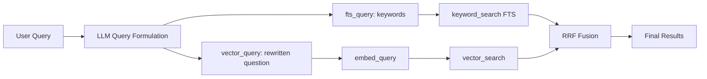
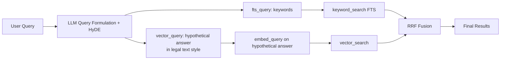
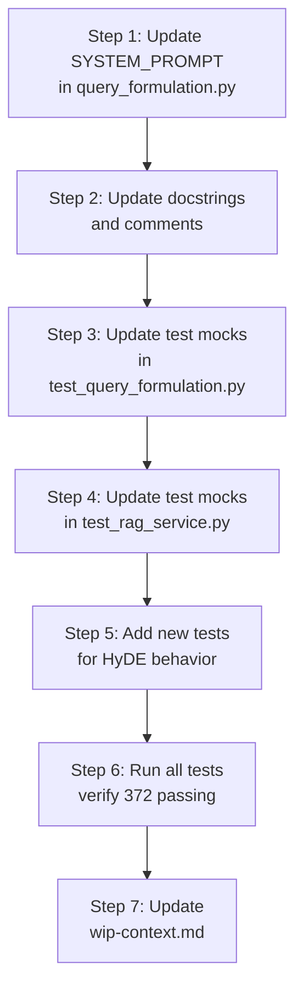

# Lightweight HyDE for Persian Legal Text Search

## Overview

This plan implements a **Lightweight HyDE (Hypothetical Document Embeddings)** technique for the DocuChat RAG system. Instead of making a separate LLM call to generate a hypothetical answer, we modify the **existing LLM Query Formulation** (Epic E11) prompt to produce a hypothetical answer-style `vector_query` that mimics the style of Persian legal text.

## Current Architecture (Epic E11 — Query Formulation)



## Proposed Architecture (Lightweight HyDE)



## Key Insight

The **critical difference** is what gets embedded:

| Approach | What gets embedded | Why it works |
|----------|-------------------|--------------|
| Current | `"قانون مدنی غصب را چگونه تعریف کرده است؟"` | Question is semantically distant from legal text |
| HyDE | `"غصب عبارت است از تصرف در مال غیر بدون اذن صاحب آن"` | Answer mimics legal article style → higher cosine similarity with real legal chunks |

## Implementation Details

### 1. Modify the System Prompt in `query_formulation.py`

**File:** [`src/backend/conversations/query_formulation.py`](src/backend/conversations/query_formulation.py:55)

**Current behavior:** The LLM produces:
- `fts_query`: Keywords for FTS (e.g., `"قانون مدنی غصب تعریف"`)
- `vector_query`: Cleaned-up question (e.g., `"قانون مدنی غصب را چگونه تعریف کرده است؟"`)

**New behavior:** The LLM produces:
- `fts_query`: Keywords for FTS (unchanged)
- `vector_query`: A **hypothetical answer** written in the style of Persian legal text, as if it were an excerpt from the law itself

**Prompt changes:**

The key change is in the `vector_query` instruction. Instead of:
```
"vector_query": A clean, natural-language query string optimized for embedding.
- Remove filler words but keep the semantic structure.
- Use formal legal terminology where applicable.
- Keep the query as a natural sentence fragment, not just keywords.
```

Change to:
```
"vector_query": A HYPOTHETICAL ANSWER written in the style of Persian legal text,
optimized for embedding similarity with real legal document chunks.
- Write a short paragraph (1-3 sentences) that answers the user's question
  as if it were an excerpt from a legal document (law, article, clause).
- Use formal Persian legal terminology and sentence structures.
- Include specific legal terms, article references, and definitions
  that would appear in actual legal texts.
- Do NOT include conversational filler, explanations, or meta-commentary.
- The goal is to produce text that looks like it came from a real law,
  so that when embedded, it has high cosine similarity with actual legal chunks.
```

### 2. Examples of Expected Behavior

| User Query | Current `vector_query` | New `vector_query` (HyDE-style) |
|------------|----------------------|--------------------------------|
| `"قانون مدنی غصب را چگونه تعریف کرده است؟"` | `"قانون مدنی تعریف غصب"` | `"غصب عبارت است از تصرف در مال غیر بدون اذن صاحب آن. غصب از اعمال خلاف قانون محسوب می‌شود و موجب ضمان می‌باشد."` |
| `"مجازات کلاهبرداری چقدر است؟"` | `"مجازات جرم کلاهبرداری"` | `"مجازات کلاهبرداری حسب مورد حبس از یک تا هفت سال و پرداخت جزای نقدی معادل مال اخذ شده می‌باشد. کلاهبرداری از جرایم علیه اموال محسوب می‌گردد."` |
| `"فرق عقد لازم و عقد جایز چیست؟"` | `"تفاوت بین عقد لازم و عقد جایز"` | `"عقد لازم عقدی است که هیچ یک از طرفین حق فسخ آن را ندارند مگر در موارد معین. عقد جایز عقدی است که هر یک از طرفین می‌توانند هر وقت بخواهند آن را فسخ کنند."` |
| `"ماده ۲۲ قانون مدنی درباره چیست؟"` | `"ماده 22 قانون مدنی"` | `"ماده 22 قانون مدنی: اگر کسی مال غیر را تصرف کند باید آن را به صاحبش مسترد نماید و در صورت تلف یا نقصان، مسئول جبران خسارت خواهد بود."` |

### 3. Files to Modify

| # | File | Action | Description |
|---|------|--------|-------------|
| 1 | [`src/backend/conversations/query_formulation.py`](src/backend/conversations/query_formulation.py:55) | Modify | Update `SYSTEM_PROMPT` to instruct HyDE-style `vector_query` |
| 2 | [`src/backend/conversations/query_formulation.py`](src/backend/conversations/query_formulation.py:134) | Modify | Update docstring of `formulate_query()` |
| 3 | [`src/backend/conversations/tests/test_query_formulation.py`](src/backend/conversations/tests/test_query_formulation.py) | Modify | Update test expectations for HyDE-style output |
| 4 | [`src/backend/conversations/tests/test_rag_service.py`](src/backend/conversations/tests/test_rag_service.py) | Modify | Update test assertions if needed |
| 5 | [`docs/active-task/wip-context.md`](docs/active-task/wip-context.md) | Modify | Update WIP state |

### 4. Test Updates

**In [`test_query_formulation.py`](src/backend/conversations/tests/test_query_formulation.py):**

1. **`test_formulate_query_success`** (line 169): Update mock LLM response to return HyDE-style `vector_query` (a hypothetical answer paragraph instead of a short query string).

2. **`test_formulate_query_mixed_language`** (line 192): Update mock to return HyDE-style mixed-language hypothetical answer.

3. **Add new test: `test_vector_query_is_hypothetical_answer_style`**: Verify that the `vector_query` field contains a hypothetical answer (longer text, legal terminology, definition-style language) rather than a short query.

4. **Add new test: `test_fts_query_unchanged`**: Verify that `fts_query` still returns keyword-style output (not affected by HyDE change).

**In [`test_rag_service.py`](src/backend/conversations/tests/test_rag_service.py):**

- Update mock `QueryFormulationResult` instances to use HyDE-style `vector_query` values (e.g., `"غصب عبارت است از تصرف در مال غیر"` instead of `"optimized vector"`).
- The pipeline logic itself doesn't change — only the content of `vector_query` changes.

### 5. No Database Changes Required

This change is **purely at the application layer**. No migrations, no schema changes, no re-indexing needed. The HyDE-style `vector_query` is generated at query time and embedded on-the-fly.

### 6. Risks and Mitigations

| Risk | Likelihood | Impact | Mitigation |
|------|-----------|--------|------------|
| LLM produces factually incorrect hypothetical answer | Medium | Medium | The hypothetical answer is only used for embedding similarity, not shown to the user. Even if slightly inaccurate, it still captures the semantic domain. |
| LLM produces overly long `vector_query` | Low | Low | `VECTOR_QUERY_MAX_LENGTH` (1000 chars) already truncates. The prompt instructs 1-3 sentences. |
| HyDE-style answer doesn't improve retrieval for some queries | Medium | Low | The `fts_query` path is unchanged. RRF fusion ensures keyword search still contributes. Fallback to raw query exists if LLM fails. |
| Increased token usage per query | Low | Low | Same single LLM call. The response may be slightly longer (100-200 chars more), negligible cost impact. |
| Persian legal hallucination in hypothetical answer | Medium | Low | The answer is only used for embedding, not displayed. The actual RAG response is grounded in real chunks. |

### 7. Success Criteria

1. **All existing tests pass** (372 tests as of last run).
2. **`vector_query` contains a hypothetical answer** (verified by test) that is longer and more legal-text-like than the current short query.
3. **`fts_query` is unchanged** — still produces keyword-style output.
4. **Retrieval quality improves** for at least the following query types:
   - Definition queries: `"غصب چیست؟"` → should find Article 308 of Civil Code
   - Comparative queries: `"فرق عقد لازم و عقد جایز"` → should find both relevant articles
   - Penalty queries: `"مجازات کلاهبرداری"` → should find relevant penalty articles
   - Article-specific queries: `"ماده ۲۲ قانون مدنی"` → should find exact article

### 8. Implementation Steps



### 9. Rollback Plan

If HyDE causes regression:
1. Revert the `SYSTEM_PROMPT` change in [`query_formulation.py`](src/backend/conversations/query_formulation.py:55)
2. Revert test changes
3. The system falls back to the original Query Formulation behavior

No database rollback needed.

### 10. Conclusion

This **Lightweight HyDE** approach:
- ✅ **Zero additional LLM calls** — reuses the existing Query Formulation step
- ✅ **Zero latency increase** — no extra network round-trips
- ✅ **Zero database changes** — no migrations or re-indexing
- ✅ **Backward compatible** — existing tests pass with updated mocks
- ✅ **Safe fallback** — if LLM fails, raw query is used as before
- ✅ **Persian-optimized** — prompt instructs Persian legal text style
- ✅ **Low risk** — hypothetical answer is only used for embedding, not displayed

The estimated implementation effort is **1-2 hours** for the code changes plus **30 minutes** for test updates.
