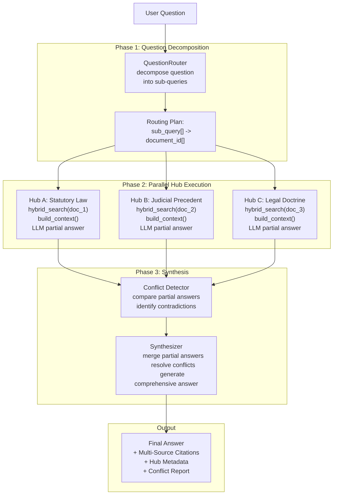

# Multi-Hub Reasoning for Persian Legal RAG System

## 1. What is Multi-Hub Reasoning?

**Multi-Hub Reasoning** (also called **Multi-Source Reasoning**, **Multi-Perspective Reasoning**, or **Mixture of Retrieval-Augmented Experts**) is an advanced RAG architecture where the system queries **multiple independent knowledge hubs** — each potentially using different retrieval strategies, data sources, or reasoning perspectives — and then synthesizes the results into a coherent, comprehensive answer.

In the context of a **Persian legal RAG system**, this means instead of a single retrieval-and-generate pipeline, the system:

1. **Decomposes** the lawyer's question into sub-queries targeting different legal knowledge domains
2. **Retrieves** from multiple specialized "hubs" (e.g., statutory law, judicial precedent, legal doctrine, procedural rules)
3. **Reasons independently** within each hub
4. **Synthesizes** the partial answers into a unified legal opinion

---

## 2. Current System Architecture (Baseline)

The current system implements a **single-hub RAG pipeline**:

```
User Question
    │
    ▼
┌──────────────────────────────┐
│  LLM Query Formulation       │  ← HyDE: generates hypothetical answer
│  (formulate_query)           │     + FTS keyword string
└──────────┬───────────────────┘
           │
           ▼
┌──────────────────────────────┐
│  embed_query(vector_query)   │  ← Embed the HyDE hypothetical answer
└──────────┬───────────────────┘
           │
           ▼
┌──────────────────────────────┐
│  hybrid_search()             │  ← Vector + FTS + Trigram with RRF fusion
│  ┌────────────────────────┐  │     Single document scope
│  │  _vector_search()      │  │
│  │  keyword_search()      │  │
│  │  trigram_search()      │  │
│  └─────────┬──────────────┘  │
└────────────┼─────────────────┘
             │
             ▼
┌──────────────────────────────┐
│  build_context(chunks)       │  ← Format chunks → context string
└──────────┬───────────────────┘
           │
           ▼
┌──────────────────────────────┐
│  Chat Provider (LLM)         │  ← Single generation pass
│  System + History + Context  │
└──────────┬───────────────────┘
           │
           ▼
      Final Answer + Citations
```

**Key characteristics:**
- Single document scope per conversation
- Single retrieval pass (hybrid: vector + FTS + trigram)
- Single LLM generation pass
- No decomposition of complex legal questions
- No multi-perspective reasoning

---

## 3. Multi-Hub Reasoning: Conceptual Architecture

### 3.1 Core Idea

The fundamental insight is that **legal reasoning is inherently multi-perspective**. A lawyer answering a complex question must consider:

1. **Statutory Law** (قوانین مصوب) — What does the written law say?
2. **Judicial Precedent** (رویه قضایی) — How have courts interpreted this?
3. **Legal Doctrine** (دکترین حقوقی) — What do legal scholars say?
4. **Procedural Rules** (قوانین شکلی) — What are the procedural requirements?
5. **Comparative Law** (حقوق تطبیقی) — How do other jurisdictions handle this?

Each of these represents a **knowledge hub** that may require:
- Different retrieval strategies
- Different data sources (potentially different documents or document types)
- Different reasoning approaches
- Different citation formats

### 3.2 High-Level Architecture

```
User Question
    │
    ▼
┌──────────────────────────────────────┐
│  Step 1: Question Decomposition      │
│  (LLM Router / Decomposer)           │
│                                      │
│  "What are the penalties for fraud   │
│   under Iranian law and what is the  │
│   judicial precedent?"               │
│                                      │
│  ┌─────────┬──────────┬──────────┐   │
│  │ Hub A:  │ Hub B:   │ Hub C:   │   │
│  │ Statutory│ Judicial │ Doctrine │   │
│  │ Law     │ Precedent│          │   │
│  └─────────┴──────────┴──────────┘   │
└──────────────────────────────────────┘
         │         │          │
         ▼         ▼          ▼
┌──────────────────────────────────────┐
│  Step 2: Parallel Hub Execution      │
│                                      │
│  ┌──────────┐ ┌──────────┐ ┌──────┐ │
│  │ Hub A    │ │ Hub B    │ │Hub C │ │
│  │ RAG Pipe │ │ RAG Pipe │ │RAG   │ │
│  │ (doc 1)  │ │ (doc 2)  │ │(doc3)│ │
│  └────┬─────┘ └────┬─────┘ └──┬───┘ │
│       │            │          │      │
│       ▼            ▼          ▼      │
│  Partial A    Partial B    Partial C │
└──────────────────────────────────────┘
         │         │          │
         └─────────┴──────────┘
                      │
                      ▼
┌──────────────────────────────────────┐
│  Step 3: Multi-Perspective Synthesis │
│  (LLM Synthesizer)                   │
│                                      │
│  "Based on the statutory law...      │
│   However, judicial precedent...     │
│   Legal scholars argue that...       │
│   Therefore, the comprehensive       │
│   answer is..."                      │
└──────────────────────────────────────┘
                      │
                      ▼
           Final Answer + Multi-Source Citations
```

---

## 4. Implementation Approaches

### Approach A: Document-Level Hub Routing (Simplest)

**Concept:** Each "hub" corresponds to a different document (or document type) in the system. The router selects which document(s) to query based on the question.

| Aspect | Detail |
|--------|--------|
| **Hub definition** | Each `reference_law` document = one hub |
| **Routing** | LLM classifies question → selects relevant documents |
| **Retrieval** | Existing `hybrid_search()` per document |
| **Synthesis** | LLM merges results from multiple documents |
| **Complexity** | Low — leverages existing infrastructure |

**Pros:**
- Minimal new code — reuses existing `hybrid_search()`, `build_context()`, `run_rag_query()`
- Natural fit for the existing `document_type: reference_law` system
- Easy to add new legal documents as new hubs
- Low latency overhead (parallel document queries)

**Cons:**
- Limited to existing document boundaries — can't split within a document
- No specialized retrieval strategies per hub
- Router accuracy depends on document metadata quality
- Doesn't handle nuanced multi-perspective reasoning well

---

### Approach B: Query Decomposition + Specialized Retrieval Strategies (Medium)

**Concept:** The question is decomposed into sub-queries, each optimized for a different retrieval strategy (vector, keyword, trigram, structured metadata query). Each "hub" uses a different strategy.

| Aspect | Detail |
|--------|--------|
| **Hub definition** | Each retrieval strategy = one hub |
| **Routing** | LLM decomposes question → assigns strategies |
| **Retrieval** | Different `search_mode` per hub (vector, keyword, trigram, hybrid) |
| **Synthesis** | LLM merges results with strategy-aware weighting |
| **Complexity** | Medium — extends existing search infrastructure |

**Pros:**
- Leverages existing multi-strategy search (`hybrid_search` with `search_mode`)
- Better recall — different strategies catch different aspects
- Relatively simple to implement as an extension of the current pipeline
- The existing `_rrf_fusion_multi` with weights can be repurposed

**Cons:**
- Still single-document scope
- Doesn't add true multi-perspective reasoning
- Strategy selection is heuristic, not learned
- May increase latency (multiple search passes)

---

### Approach C: Full Multi-Hub with Independent RAG Pipelines (Complex)

**Concept:** Each hub is a fully independent RAG pipeline with its own:
- Document collection (potentially different documents)
- Retrieval strategy (optimized for that hub's content)
- LLM reasoning pass (generates a partial answer)
- A central synthesizer merges all partial answers

| Aspect | Detail |
|--------|--------|
| **Hub definition** | Independent RAG pipeline with dedicated documents |
| **Routing** | LLM decomposes → routes to 1-N hubs |
| **Retrieval** | Per-hub optimized (e.g., Hub A: vector-heavy, Hub B: keyword-heavy) |
| **Reasoning** | Per-hub LLM generation (partial answer) |
| **Synthesis** | Central LLM merges partial answers with conflict resolution |
| **Complexity** | High — new architecture, new components |

**Pros:**
- Maximum reasoning quality — each hub can specialize
- True multi-perspective answers with conflict identification
- Extensible — add new hubs without modifying existing ones
- Each hub can have its own prompt, temperature, and model
- Can identify contradictions between sources (e.g., law vs. precedent)

**Cons:**
- High latency (N LLM calls + N search passes + synthesis call)
- High token cost (N partial answers + synthesis)
- Complex orchestration logic
- Need for conflict resolution strategy
- Harder to debug and maintain

---

### Approach D: Iterative / Conversational Multi-Hub (Most Sophisticated)

**Concept:** The system doesn't just run hubs in parallel — it runs them **iteratively**, where the output of one hub informs the input of the next. This mimics how a lawyer thinks: "Let me check the statute first, then see how courts interpreted it, then check if scholars agree."

| Aspect | Detail |
|--------|--------|
| **Hub definition** | Ordered chain of reasoning steps |
| **Routing** | Dynamic — next hub depends on previous hub's output |
| **Retrieval** | Per-hub, informed by previous results |
| **Reasoning** | Each step builds on previous reasoning |
| **Synthesis** | Final hub produces comprehensive answer |
| **Complexity** | Very high — requires state machine / workflow engine |

**Pros:**
- Most natural legal reasoning flow
- Can ask follow-up retrieval questions mid-pipeline
- Can identify and resolve contradictions iteratively
- Highest potential answer quality

**Cons:**
- Highest latency (sequential, not parallel)
- Complex state management
- Hard to implement correctly
- Risk of cascading errors
- Expensive in tokens

---

## 5. Comparison Matrix

| Criterion | A: Doc-Level Routing | B: Strategy Decomposition | C: Full Multi-Hub | D: Iterative |
|-----------|:---:|:---:|:---:|:---:|
| **Implementation complexity** | Low | Medium | High | Very High |
| **Answer quality improvement** | Low-Moderate | Moderate | High | Very High |
| **Latency impact** | Low (+1-2s) | Moderate (+2-5s) | High (+5-15s) | Very High (+10-30s) |
| **Token cost increase** | Low (1.5x) | Moderate (2x) | High (3-5x) | Very High (5-10x) |
| **Extensibility** | Moderate | Low | High | High |
| **Conflict detection** | None | None | Built-in | Built-in |
| **Debugging difficulty** | Low | Moderate | High | Very High |
| **User experience impact** | Minimal | Noticeable | Significant | Significant |
| **Reuses existing code** | 90% | 80% | 40% | 20% |

---

## 6. Recommended Approach: Hybrid (B + C Lite)

For the **DocuChat Persian Legal RAG** system, I recommend a **hybrid of Approaches B and C** — starting with a pragmatic, incremental implementation that delivers real value without excessive complexity.

### Phase 1: Query Decomposition + Multi-Document Routing (Approach A + B)

This phase adds the ability to route sub-queries to different documents with different strategies, while keeping a single generation pass.

### Phase 2: Independent Hub Reasoning (Approach C Lite)

This phase adds per-hub LLM reasoning passes, with a final synthesis step. Only for complex questions.

### Phase 3: Iterative Refinement (Optional)

This phase adds iterative refinement for the most complex cases, gated behind a confidence threshold.

---

## 7. Detailed Implementation Plan

### Phase 1: Multi-Document Query Decomposition & Routing

#### 7.1.1 New Component: `QuestionRouter`

**File:** `src/backend/conversations/question_router.py`

A new service that:
1. Takes the user's question
2. Uses an LLM call to decompose it into sub-queries
3. Maps each sub-query to one or more target documents
4. Returns a routing plan

**LLM Prompt Design:**
```
You are a Persian legal question router. Given a user's legal question and
a list of available legal reference documents, decompose the question into
sub-queries and route each to the most relevant document(s).

Available documents:
- {doc_id}: {title} — {description}

Output JSON:
{
  "sub_queries": [
    {
      "query": "Persian sub-query text",
      "target_document_ids": ["uuid1", "uuid2"],
      "reasoning": "Why this document is relevant"
    }
  ],
  "requires_synthesis": true/false
}
```

#### 7.1.2 New Component: `MultiHubRAGService`

**File:** `src/backend/conversations/multi_hub_rag_service.py`

Orchestrates the multi-hub pipeline:

```python
def run_multi_hub_rag_query(
    question: str,
    document_id: str,  # Primary document (user's uploaded doc)
    conversation_history: list[dict] | None = None,
    top_k: int = 15,
) -> dict:
    # Step 1: Route the question
    routing_plan = route_question(question, primary_document_id=document_id)
    
    # Step 2: Execute RAG for each hub in parallel
    hub_results = []
    for sub_query in routing_plan.sub_queries:
        for target_doc_id in sub_query.target_document_ids:
            result = run_single_hub_rag(
                question=sub_query.query,
                document_id=target_doc_id,
                conversation_history=None,  # Fresh context per hub
                top_k=top_k,
            )
            hub_results.append({
                "document_id": target_doc_id,
                "sub_query": sub_query.query,
                "chunks": result["raw_chunks"],
                "context": result["context"],
            })
    
    # Step 3: Build multi-source context
    combined_context = build_multi_hub_context(hub_results)
    
    # Step 4: Generate answer with multi-source awareness
    return generate_multi_hub_answer(
        question=question,
        context=combined_context,
        conversation_history=conversation_history,
    )
```

#### 7.1.3 New Component: `MultiSourceContextBuilder`

**File:** `src/backend/conversations/context_builder.py`

Builds a structured context that labels each source by document:

```
[Document: قانون مجازات اسلامی | Source 1 | Pages 12-14]
ماده ۱ - قانون مجازات اسلامی...

[Document: قانون آیین دادرسی کیفری | Source 2 | Pages 5-6]
ماده ۲ - ...
```

#### 7.1.4 Modified: `System Prompt`

Update the system prompt to handle multi-document context:

```
You are a helpful legal assistant answering questions about Persian legal
documents. The context below may contain excerpts from MULTIPLE legal
documents. Each excerpt is labeled with its source document name.

Answer the user's question based on ALL provided context. When citing,
include both the document name and source number:
  [قانون مجازات اسلامی, Source 1]
  [قانون آیین دادرسی کیفری, Source 2]

If different documents provide conflicting information, note the conflict
and explain which source takes precedence based on legal hierarchy.
```

#### 7.1.5 Modified: `Citation Extraction`

Update [`extract_citations()`](src/backend/conversations/rag_service.py:127) to include `document_id` and `document_title` in each citation.

#### 7.1.6 API Changes

**New endpoint:** `POST /conversations/{conversation_id}/multi-query`

Or extend the existing `POST /conversations/{conversation_id}/messages/` with an optional `mode` parameter:
- `mode: "single"` — Current behavior (default)
- `mode: "multi_hub"` — Multi-hub reasoning

**Response changes:**
```json
{
  "id": "uuid",
  "role": "assistant",
  "content": "Comprehensive answer...",
  "sources": [
    {
      "chunk_id": "uuid",
      "document_id": "uuid",
      "document_title": "قانون مجازات اسلامی",
      "page_start": 12,
      "page_end": 14,
      "content_preview": "...",
      "relevance_score": 0.92
    }
  ],
  "hub_metadata": {
    "mode": "multi_hub",
    "sub_queries": [
      {"query": "...", "target_document": "..."},
      {"query": "...", "target_document": "..."}
    ],
    "documents_consulted": ["uuid1", "uuid2"]
  },
  "token_usage": {...}
}
```

#### 7.1.7 Database Changes

**New model: `HubQuery`** (optional, for audit/logging)

| Column | Type | Description |
|--------|------|-------------|
| id | UUID | PK |
| message_id | UUID | FK → messages.id |
| sub_query | TEXT | The decomposed sub-query |
| target_document_id | UUID | FK → documents.id |
| chunks_retrieved | INTEGER | Number of chunks found |
| retrieval_latency_ms | INTEGER | Time for retrieval |
| created_at | TIMESTAMP | |

---

### Phase 2: Independent Hub Reasoning (Per-Hub LLM Pass)

#### 7.2.1 Per-Hub Generation

Instead of just retrieving chunks per hub, each hub generates a **partial answer**:

```python
def run_hub_with_reasoning(
    question: str,
    document_id: str,
    hub_type: str,  # "statutory", "precedent", "doctrine"
) -> dict:
    # 1. Retrieve chunks (existing hybrid_search)
    chunks = hybrid_search(...)
    
    # 2. Build hub-specific prompt
    prompt = build_hub_prompt(question, chunks, hub_type)
    
    # 3. Generate partial answer
    partial = chat_provider.chat(messages=prompt)
    
    return {
        "document_id": document_id,
        "hub_type": hub_type,
        "partial_answer": partial["content"],
        "chunks": chunks,
        "confidence": extract_confidence(partial["content"]),
    }
```

#### 7.2.2 Hub-Specific Prompts

Each hub type gets a specialized prompt:

- **Statutory Law Hub:** "Answer based ONLY on the exact text of the law. Cite specific article numbers."
- **Judicial Precedent Hub:** "Answer based on judicial interpretations. Note if there are conflicting precedents."
- **Legal Doctrine Hub:** "Answer based on legal scholarship. Note areas of scholarly disagreement."

#### 7.2.3 Synthesis Engine

```python
def synthesize_answers(
    question: str,
    hub_results: list[dict],
    conversation_history: list[dict] | None = None,
) -> dict:
    """
    Takes partial answers from multiple hubs and synthesizes
    a comprehensive legal opinion.
    """
    synthesis_prompt = build_synthesis_prompt(question, hub_results)
    final_answer = chat_provider.chat(messages=synthesis_prompt)
    return final_answer
```

#### 7.2.4 Conflict Detection

Add a conflict detection step in the synthesizer:

```python
def detect_conflicts(hub_results: list[dict]) -> list[dict]:
    """
    Compare partial answers from different hubs and identify
    contradictions or tensions.
    """
    conflicts = []
    for i, result_a in enumerate(hub_results):
        for result_b in hub_results[i+1:]:
            if answers_conflict(result_a["partial_answer"], result_b["partial_answer"]):
                conflicts.append({
                    "between": [result_a["hub_type"], result_b["hub_type"]],
                    "description": "These sources provide conflicting information...",
                    "resolution_guidance": "In Iranian legal hierarchy, statutory law takes precedence...",
                })
    return conflicts
```

---

### Phase 3: Iterative Refinement (Optional)

#### 7.3.1 Confidence-Based Gating

After Phase 2 synthesis, evaluate confidence:
- If confidence > threshold → return answer
- If confidence < threshold → trigger iterative refinement

#### 7.3.2 Iterative Loop

```python
def iterative_refine(
    question: str,
    initial_answer: dict,
    max_iterations: int = 2,
) -> dict:
    current_answer = initial_answer
    for i in range(max_iterations):
        # Identify knowledge gaps
        gaps = identify_gaps(current_answer)
        if not gaps:
            break
        
        # Generate targeted sub-queries for each gap
        for gap in gaps:
            sub_query = generate_gap_query(question, current_answer, gap)
            additional_info = retrieve_and_reason(sub_query)
            current_answer = refine_answer(current_answer, additional_info)
    
    return current_answer
```

---

## 8. Mermaid Architecture Diagram



---

## 9. Pros and Cons Summary

### Pros of Multi-Hub Reasoning for Persian Legal RAG

| # | Pro | Impact |
|---|-----|--------|
| 1 | **Comprehensive answers** — Lawyers get analysis from multiple legal perspectives, not just one document | High |
| 2 | **Conflict identification** — System can flag contradictions between laws, precedents, and doctrines | High |
| 3 | **Legal hierarchy awareness** — Can apply principles like "lex specialis derogat legi generali" (law special over general) | Medium |
| 4 | **Extensible architecture** — New legal document types can be added as new hubs without modifying existing code | High |
| 5 | **Better citation quality** — Each source is clearly attributed to its document, improving trust | Medium |
| 6 | **Handles complex queries** — Questions that span multiple legal domains (e.g., "What are the criminal and civil implications of fraud?") | High |
| 7 | **Incremental deployment** — Phase 1 can be delivered quickly, with Phases 2-3 added later | High |

### Cons and Risks

| # | Con | Mitigation |
|---|-----|------------|
| 1 | **Increased latency** — Multiple search + LLM calls | Parallel execution, streaming UI, caching |
| 2 | **Higher token cost** — N search passes + N partial answers + synthesis | Use cheaper models for routing/synthesis, limit hubs to 2-3 |
| 3 | **Orchestration complexity** — State management across hubs | Use a simple coordinator pattern, avoid workflow engines |
| 4 | **Router accuracy** — LLM may mis-route sub-queries | Fallback to single-hub mode, log routing decisions for improvement |
| 5 | **Conflicting answers** — May confuse users if not handled well | Always explain conflicts with legal hierarchy guidance |
| 6 | **Testing complexity** — More components = more test cases | Start with integration tests for the full pipeline |
| 7 | **User expectation management** — Users may expect multi-hub for simple questions | Only activate multi-hub for complex questions (classifier gating) |

---

## 10. File Changes Summary

### New Files

| File | Purpose |
|------|---------|
| [`src/backend/conversations/question_router.py`](src/backend/conversations/question_router.py) | LLM-based question decomposition and document routing |
| [`src/backend/conversations/multi_hub_rag_service.py`](src/backend/conversations/multi_hub_rag_service.py) | Orchestrator for the multi-hub pipeline |
| [`src/backend/conversations/context_builder.py`](src/backend/conversations/context_builder.py) | Multi-source context formatting |
| [`src/backend/conversations/hub_prompts.py`](src/backend/conversations/hub_prompts.py) | Hub-specific system prompts (statutory, precedent, doctrine) |
| [`src/backend/conversations/synthesis_service.py`](src/backend/conversations/synthesis_service.py) | Multi-perspective answer synthesis with conflict detection |
| [`src/backend/conversations/models.py`](src/backend/conversations/models.py) | Add `HubQuery` model (optional audit trail) |
| [`src/backend/conversations/serializers.py`](src/backend/conversations/serializers.py) | Add multi-hub response serializers |
| [`src/backend/conversations/urls.py`](src/backend/conversations/urls.py) | Add multi-hub endpoint routes |
| [`src/backend/conversations/views.py`](src/backend/conversations/views.py) | Add multi-hub view classes |
| [`src/backend/tests/conversations/test_multi_hub_rag.py`](src/backend/tests/conversations/test_multi_hub_rag.py) | Tests for multi-hub pipeline |
| [`src/backend/tests/conversations/test_question_router.py`](src/backend/tests/conversations/test_question_router.py) | Tests for question router |
| [`src/backend/tests/conversations/test_synthesis_service.py`](src/backend/tests/conversations/test_synthesis_service.py) | Tests for synthesis engine |

### Modified Files

| File | Change |
|------|--------|
| [`src/backend/conversations/rag_service.py`](src/backend/conversations/rag_service.py) | Add `run_multi_hub_rag_query()` and `run_multi_hub_rag_query_stream()` |
| [`src/backend/conversations/views.py`](src/backend/conversations/views.py) | Add `mode` parameter to message endpoint |
| [`src/backend/config/settings.py`](src/backend/config/settings.py) | Add `MULTI_HUB_ENABLED`, `MULTI_HUB_MAX_HUBS`, `MULTI_HUB_SYNTHESIS_MODEL` settings |
| [`docs/references/api-registry.md`](docs/references/api-registry.md) | Document new multi-hub endpoints |
| [`docs/references/database-schema.md`](docs/references/database-schema.md) | Document `HubQuery` model if added |

---

## 11. Settings Configuration

```python
# Multi-Hub Reasoning Configuration
MULTI_HUB_ENABLED = env.bool("MULTI_HUB_ENABLED", default=True)
MULTI_HUB_MAX_HUBS = env.int("MULTI_HUB_MAX_HUBS", default=3)
MULTI_HUB_SYNTHESIS_ENABLED = env.bool("MULTI_HUB_SYNTHESIS_ENABLED", default=True)
MULTI_HUB_CONFLICT_DETECTION = env.bool("MULTI_HUB_CONFLICT_DETECTION", default=True)
MULTI_HUB_AUTO_MODE = env.bool("MULTI_HUB_AUTO_MODE", default=True)
# When AUTO_MODE is True, the system automatically decides single vs multi-hub
# based on question complexity. When False, user must explicitly request multi-hub.
```

---

## 12. Testing Strategy

| Test Type | Scope | Tools |
|-----------|-------|-------|
| Unit: Question Router | LLM response parsing, fallback behavior | Pytest, mock LLM |
| Unit: Context Builder | Multi-source formatting, token budgeting | Pytest |
| Unit: Synthesis Service | Conflict detection, answer merging | Pytest, mock LLM |
| Integration: Full Pipeline | End-to-end multi-hub flow | Pytest, real LLM (cassette) |
| Integration: API | New endpoint behavior | Django TestClient |
| Integration: Fallback | Single-hub fallback when router fails | Pytest, mock router |

---

## 13. Rollout Strategy

1. **Phase 1 (Week 1-2):** Question decomposition + multi-document routing
   - Single generation pass, multiple retrieval passes
   - User-visible: better answers for cross-document questions
   - Risk: Low

2. **Phase 2 (Week 3-4):** Per-hub reasoning + synthesis
   - Multiple generation passes + final synthesis
   - User-visible: richer, more nuanced answers with conflict awareness
   - Risk: Medium (latency, cost)

3. **Phase 3 (Week 5-6):** Iterative refinement + confidence gating
   - Only for complex questions below confidence threshold
   - User-visible: highest quality for hardest questions
   - Risk: Medium-High

4. **UI Indicator (Week 2):** Show which hubs were consulted
   - Add a "Sources consulted" expandable section in the chat UI
   - Show per-document contribution
   - Risk: Low
