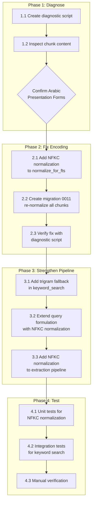

# Persian Keyword Search Fix — Root Cause Analysis & Implementation Plan

## Executive Summary

The user reports that Persian keyword search in the RAG system is failing to find obvious matches. Queries like `"تفاوت بین عقد جایز و عقد لازم چیست؟"` return zero results despite the terms existing in the document. Even Ctrl+F in the PDF viewer fails to find `"لازم"`. This indicates a **fundamental character encoding / normalization issue** in the stored chunk content, not just a search query problem.

---

## Root Cause Analysis

### The Full Pipeline (What SHOULD Happen)

```
User Query ("عقد لازم چیه")
    │
    ▼
1. query_formulation.py → LLM generates fts_query="عقد لازم"
    │
    ▼
2. keyword_search() in search_service.py:
   a. normalize_for_fts() → Arabic→Persian chars, digits→English, ZWNJ→space
      → "عقد لازم" (no change needed — no digits, no Arabic chars)
   b. _remove_stop_words() → "عقد لازم" (no stop words)
   c. SearchQuery("عقد لازم", config="simple", search_type="websearch")
      → PostgreSQL FTS: requires BOTH "عقد" AND "لازم" in search_vector
    │
    ▼
3. DB Trigger: to_tsvector('simple', content) → generates search_vector
   → e.g., "'عقد' 'لازم'" if content contains "عقد لازم"
```

### What's Actually Happening (The Bug)

The critical issue is in **step 3**: the DB trigger `trg_chunk_search_vector` calls `to_tsvector('simple', COALESCE(NEW.content, ''))`. The `simple` configuration tokenizes on whitespace and punctuation, then lowercases. For Persian text, this means:

- `"عقد"` → token `"عقد"` ✓
- `"لازم"` → token `"لازم"` ✓
- `"جایز"` → token `"جایز"` ✓

**So FTS should work for simple Persian words... unless the stored content has different characters than what the user types.**

### The Real Problem: Unicode Character Variants

The user said: **"من pdf متن را هم که باز میکنم و کلمه ی 'لازم' را سرچ میکنم هیچ نتیجه ای نداره"** — Even Ctrl+F in the PDF can't find `"لازم"`.

This is the smoking gun. If Ctrl+F in the PDF itself can't find the word, the issue is at the **PDF extraction / character encoding level**, not the search layer.

#### Cause A: Arabic Presentation Forms-B (U+FE70–U+FEFF) — PRIMARY SUSPECT

PDFs use **positional glyph variants** of Arabic/Persian letters (initial form, medial form, final form, isolated form) for proper script shaping. When PyMuPDF extracts text, it often preserves these **presentation forms** instead of converting them to standard Unicode codepoints.

For example, `"لازم"` might be stored as:
- `ل` (U+FEDF — Lam initial form) instead of standard `ل` (U+0644)
- `ا` (U+FE8D — Alef isolated form) instead of standard `ا` (U+0627)
- `ز` (U+FEB1 — Zain isolated form) instead of standard `ز` (U+0632)
- `م` (U+FEE1 — Meem initial form) instead of standard `م` (U+0645)

When you type `"لازم"` using standard Unicode (U+0644 U+0627 U+0632 U+0645), neither Ctrl+F nor PostgreSQL FTS can match because the bytes are completely different — even though they **look identical** on screen.

#### Cause B: Ligature "لا" (Lam-Alef)

The ligature `"لا"` (Lam + Alef) has its own Unicode codepoint (U+FEFB for isolated form, U+FEFC for final form). This is a single character that represents two letters. If the PDF uses this ligature, searching for `"لا"` as two separate characters (U+0644 U+0627) will fail.

#### Cause C: Why Current Code Doesn't Catch This

[`normalize_for_fts()`](src/backend/documents/services/persian_normalizer.py:286) only handles:
1. Arabic Yeh (U+064A) → Persian Yeh (U+06CC)
2. Arabic Kaf (U+0643) → Persian Kaf (U+06A9)
3. Persian/Arabic digits → English digits
4. ZWNJ → space

**It does NOT handle Arabic Presentation Forms-B (U+FE70–U+FEFF)** or the Lam-Alef ligature (U+FEFB/U+FEFC).

#### Cause D: The `_remove_stop_words()` Function Splits on Whitespace Only

In [`search_service.py`](src/backend/documents/services/search_service.py:410):
```python
tokens = query.split()
```

This splits on whitespace. But Persian text may contain ZWNJ (half-space) characters that look like spaces but aren't. If the query contains `"عقد\u200cلازم"` (with ZWNJ), `split()` would treat it as one token `"عقد\u200cلازم"`, which wouldn't match the FTS tokens `"عقد"` and `"لازم"`.

However, `normalize_for_fts()` converts ZWNJ to space BEFORE `_remove_stop_words()` is called, so this should be handled. But only if the ZWNJ is actually U+200C and not some other zero-width character.

---

## Solution Plan

### Phase 1: Diagnose the Exact Character Encoding Issue

Before implementing fixes, we need to know exactly which characters are in the stored content.

**Task 1.1: Create a diagnostic script to inspect chunk content**

Write a script that:
1. Connects to the database (via Django ORM or direct SQL)
2. Fetches a few chunks from the document being queried
3. For each chunk, prints:
   - The raw Unicode codepoints (hex) for each character in key words
   - Whether the content contains Arabic Presentation Forms-B (U+FE70–U+FEFF)
   - The `search_vector` value (tsvector debug output)
4. Tests whether `to_tsvector('simple', content)` matches the expected query tokens

**Task 1.2: Check the actual search_vector content**

Run a raw SQL query to see what tokens are actually in the search_vector:
```sql
SELECT id, chunk_index, 
       left(content, 200) as content_preview,
       search_vector,
       ts_debug('simple', content)
FROM document_chunks 
WHERE document_id = '<actual-document-uuid>'
LIMIT 5;
```

### Phase 2: Fix the Character Encoding Issue

**Task 2.1: Use `unicodedata.normalize('NFKC', text)` in `normalize_for_fts()`**

Python's built-in [`unicodedata.normalize('NFKC', text)`](https://docs.python.org/3/library/unicodedata.html#unicodedata.normalize) is the correct tool for this job. **NFKC normalization** (Compatibility Composition) does exactly what we need:

1. **Decomposes** compatibility characters (like Arabic Presentation Forms) into their standard equivalents
2. **Composes** them back into the standard NFC form

For example:
- `ل` (U+FEDF — Lam initial form) → NFKC → `ل` (U+0644 — standard Lam) ✓
- `لا` (U+FEFB — Lam-Alef ligature) → NFKC → `لا` (U+0644 U+0627 — two standard chars) ✓
- `ا` (U+FE8D — Alef isolated form) → NFKC → `ا` (U+0627 — standard Alef) ✓

**This handles ALL Arabic Presentation Forms-B automatically** without needing a manual mapping table. It also handles the Lam-Alef ligature, which is a common PDF artifact.

**Where to add it:** In [`normalize_for_fts()`](src/backend/documents/services/persian_normalizer.py:286), as the **first step** before the existing character/digit normalization:

```python
@staticmethod
def normalize_for_fts(text: str) -> str:
    if not text:
        return ""
    
    # Step 0: NFKC normalization — converts Arabic Presentation Forms
    # (positional glyph variants used by PDFs) to standard Unicode codepoints.
    # Also decomposes ligatures like "لا" (U+FEFB) into "لا" (U+0644 U+0627).
    text = unicodedata.normalize('NFKC', text)
    
    # Step 1: Convert Arabic glyph variants to Persian equivalents
    text = text.translate(_ARABIC_TO_PERSIAN)
    
    # Step 2: Convert Persian/Arabic digits to English digits
    text = text.translate(_PERSIAN_DIGITS)
    
    # Step 3: Replace ZWNJ with space for proper FTS tokenization
    text = text.replace(_ZWNJ_CHAR, " ")
    
    return text
```

**Why NFKC and not NFKD or NFC?**
- **NFC** (Canonical Composition) does NOT handle presentation forms — it only composes pre-composed characters
- **NFKD** (Compatibility Decomposition) decomposes presentation forms but leaves them decomposed (multi-codepoint), which can cause issues
- **NFKC** (Compatibility Composition) first decomposes (like NFKD) then recomposes (like NFC), giving us the standard single-codepoint form

**Also use Hazm for additional normalization:** The existing `normalize_arabic_chars()` method (which uses Hazm) already handles:
- Arabic Yeh → Persian Yeh
- Arabic Kaf → Persian Kaf
- Arabic Teh Marbuta (ة) → Heh (ه)
- Various Arabic diacritics removal

**Task 2.2: Re-normalize all existing chunk content**

After extending `normalize_for_fts()`, create a data migration (migration 0011) that:
1. Re-normalizes all existing chunk content using the updated `normalize_for_fts()`
2. Saves each chunk (which triggers the DB trigger to regenerate `search_vector`)
3. Processes in batches of 500 (same pattern as migration 0009)

**Task 2.3: Verify the fix**

1. Run the diagnostic script again to confirm presentation forms are gone
2. Test keyword search for the failing queries
3. Run all existing tests to ensure no regressions

### Phase 3: Strengthen the Search Pipeline with pg_trgm Fallback

**The `pg_trgm` extension is already implemented** in the codebase:
- Migration 0010 installed `pg_trgm` and created a GIN index on `content`
- [`trigram_search()`](src/backend/documents/services/search_service.py:533) is fully implemented
- [`hybrid_search()`](src/backend/documents/services/search_service.py:698) already integrates trigram search as a third retrieval method

**Task 3.1: Add trigram fallback in `keyword_search()` when FTS returns zero results**

The current `keyword_search()` returns empty results when FTS fails. We should add a fallback that calls `trigram_search()` when FTS returns zero results:

```python
def keyword_search(
    document_id: str,
    query_text: str,
    top_k: int = 10,
    filters: dict[str, Any] | None = None,
    enable_trigram_fallback: bool = True,
) -> list[dict[str, Any]]:
    # ... existing FTS logic ...
    
    # If FTS returned zero results and trigram fallback is enabled
    if not results and enable_trigram_fallback:
        logger.info(
            "keyword_search: FTS returned zero results for '%s', "
            "falling back to trigram search",
            query_text,
        )
        results = trigram_search(
            document_id=document_id,
            query_text=query_text,
            top_k=top_k,
            min_similarity=0.1,  # Lower threshold for fallback
            filters=filters,
        )
    
    return results
```

**Why pg_trgm is better than ILIKE for Persian text:**
- **ILIKE** does substring matching (`%query%`), which can match partial words incorrectly and is slow without a proper index
- **pg_trgm** with GIN index is:
  - **Faster**: Uses the GIN trigram index for efficient lookups
  - **More robust**: Handles OCR errors, spelling variations, and character encoding issues at the trigram level
  - **Already implemented**: Migration 0010 + `trigram_search()` function exist
  - **Already indexed**: The GIN index on `content` using `gin_trgm_ops` is in place

**Task 3.2: Extend query formulation normalization**

In [`query_formulation.py`](src/backend/conversations/query_formulation.py:160), the current normalization only handles Arabic Yeh and Kaf. Extend it to also apply `unicodedata.normalize('NFKC', ...)` to the user query (defense in depth).

**Task 3.3: Add NFKC normalization to the extraction pipeline**

Add `unicodedata.normalize('NFKC', text)` to the extraction pipeline in [`document_processing.py`](src/backend/documents/tasks/document_processing.py) to ensure all extracted text uses standard Unicode codepoints before chunking.

### Phase 4: Testing & Verification

**Task 4.1: Add tests for NFKC normalization of Arabic Presentation Forms**

Add test cases to [`test_persian_normalizer.py`](src/backend/documents/tests/test_persian_normalizer.py) that verify:
- Arabic Presentation Forms-B are converted to standard Persian letters via NFKC
- Lam-Alef ligature (U+FEFB) is decomposed to standard Lam + Alef (U+0644 U+0627)
- The conversion is idempotent
- Edge cases: mixed presentation forms and standard forms

**Task 4.2: Add integration tests for keyword search with presentation forms**

Add test cases to [`test_search_service.py`](src/backend/documents/tests/test_search_service.py) that:
1. Create chunks with Arabic Presentation Forms in content
2. Verify that keyword search with standard Persian characters still matches
3. Verify that trigram fallback works when FTS returns zero results

**Task 4.3: Manual verification**

After deployment, the user should:
1. Re-upload the problematic PDF document (or re-run migration 0011 on existing chunks)
2. Test the same queries that previously failed
3. Verify that Ctrl+F in the PDF viewer can now find the words

---

## Implementation Order



---

## Files to Modify

| # | File | Action | Description |
|---|------|--------|-------------|
| 1 | [`src/backend/documents/services/persian_normalizer.py`](src/backend/documents/services/persian_normalizer.py) | Modify | Add `unicodedata.normalize('NFKC', text)` as first step in `normalize_for_fts()` |
| 2 | [`src/backend/documents/migrations/0011_normalize_presentation_forms.py`](src/backend/documents/migrations/) | **NEW** | Re-normalize all chunk content with updated `normalize_for_fts()` |
| 3 | [`src/backend/documents/services/search_service.py`](src/backend/documents/services/search_service.py) | Modify | Add `trigram_search()` fallback in `keyword_search()` when FTS returns zero results |
| 4 | [`src/backend/conversations/query_formulation.py`](src/backend/conversations/query_formulation.py) | Modify | Add `unicodedata.normalize('NFKC', ...)` to user query normalization |
| 5 | [`src/backend/documents/tasks/document_processing.py`](src/backend/documents/tasks/document_processing.py) | Modify | Add NFKC normalization to extraction pipeline |
| 6 | [`src/backend/documents/tests/test_persian_normalizer.py`](src/backend/documents/tests/test_persian_normalizer.py) | Modify | Add tests for NFKC normalization of Arabic Presentation Forms |
| 7 | [`src/backend/documents/tests/test_search_service.py`](src/backend/documents/tests/test_search_service.py) | Modify | Add integration tests for keyword search with presentation forms + trigram fallback |
| 8 | [`docs/references/database-schema.md`](docs/references/database-schema.md) | Modify | Document migration 0011 |
| 9 | [`docs/active-task/wip-context.md`](docs/active-task/wip-context.md) | Modify | Update after implementation |

---

## Technical Details

### How NFKC Normalization Works for Arabic/Persian

Python's `unicodedata.normalize('NFKC', text)` performs two steps:

1. **Compatibility Decomposition (NFKD)**: Breaks down compatibility characters into their standard equivalents:
   - `ل` (U+FEDF — Lam initial form) → `ل` (U+0644)
   - `لا` (U+FEFB — Lam-Alef ligature) → `ل` (U+0644) + `ا` (U+0627)
   - `ﷲ` (U+FDF2 — Allah ligature) → `ا` + `ل` + `ل` + `ه`
   - All ~70 Arabic Presentation Forms-B → standard forms

2. **Canonical Composition (NFC)**: Re-composes decomposed characters where possible:
   - `آ` (Alef + Madda) → `آ` (U+0622) single codepoint
   - `ة` (Heh + combining mark) → `ة` (U+0629) single codepoint

The result is text where all characters are in their **standard, single-codepoint form** — exactly what PostgreSQL's `simple` FTS config expects.

### NFKC + Hazm = Complete Coverage

| Issue | Handled By |
|-------|-----------|
| Arabic Presentation Forms (positional glyphs) | `unicodedata.normalize('NFKC', ...)` |
| Lam-Alef ligature (U+FEFB/U+FEFC) | `unicodedata.normalize('NFKC', ...)` |
| Allah ligature (U+FDF2) | `unicodedata.normalize('NFKC', ...)` |
| Arabic Yeh → Persian Yeh | Hazm (already in `normalize_arabic_chars()`) |
| Arabic Kaf → Persian Kaf | Hazm (already in `normalize_arabic_chars()`) |
| Arabic Teh Marbuta → Heh | Hazm (already in `normalize_arabic_chars()`) |
| Arabic diacritics removal | Hazm (already in `normalize_arabic_chars()`) |
| Persian digits → English digits | `normalize_for_fts()` (already implemented) |
| ZWNJ → space | `normalize_for_fts()` (already implemented) |

### Trigram Fallback Flow

```python
def keyword_search(..., enable_trigram_fallback=True):
    # 1. Normalize query (NFKC + chars + digits + ZWNJ)
    query_text = PersianNormalizer.normalize_for_fts(query_text)
    
    # 2. Remove stop words
    query_text = _remove_stop_words(query_text)
    
    # 3. Try FTS first
    search_query = SearchQuery(query_text, config="simple", search_type="websearch")
    # ... FTS query ...
    
    # 4. If FTS returns zero results, fall back to trigram
    if not results and enable_trigram_fallback:
        results = trigram_search(
            document_id=document_id,
            query_text=query_text,
            top_k=top_k,
            min_similarity=0.1,  # Lower threshold for fallback
            filters=filters,
        )
    
    return results
```

### Migration 0011 Design

```python
class Migration(migrations.Migration):
    dependencies = [
        ('documents', '0010_add_pg_trgm'),
    ]
    
    operations = [
        migrations.RunPython(
            code=normalize_chunk_content,
            reverse_code=migrations.RunPython.noop,
        ),
    ]

def normalize_chunk_content(apps, schema_editor):
    DocumentChunk = apps.get_model("documents", "DocumentChunk")
    import unicodedata
    
    total = DocumentChunk.objects.count()
    batch_size = 500
    processed = 0
    
    while processed < total:
        chunks = list(
            DocumentChunk.objects.all()[processed : processed + batch_size]
        )
        for chunk in chunks:
            # Apply NFKC normalization + existing FTS normalization
            normalized = unicodedata.normalize('NFKC', chunk.content)
            # Also apply the existing normalize_for_fts steps
            from documents.services.persian_normalizer import PersianNormalizer
            normalized = PersianNormalizer.normalize_for_fts(normalized)
            
            if normalized != chunk.content:
                chunk.content = normalized
                chunk.save(update_fields=["content"])
        processed += len(chunks)
```

---

## Risk Assessment

| Risk | Likelihood | Impact | Mitigation |
|------|-----------|--------|------------|
| Arabic Presentation Forms are NOT the issue | Low | Medium | Diagnostic script in Phase 1 will confirm before any changes |
| NFKC normalization changes display of Persian text unexpectedly | Low | Medium | NFKC is a standard Unicode algorithm; only affects compatibility characters, not standard text |
| Migration 0011 takes too long on large datasets | Medium | Low | Process in batches of 500 (same pattern as migration 0009) |
| Trigram fallback returns too many irrelevant results | Medium | Low | Only used when FTS returns zero results; use higher `min_similarity` threshold (0.2) |
| Existing tests fail after changes | Low | High | Run full test suite before and after changes |

---

## Success Criteria

1. ✅ Query `"تفاوت بین عقد جایز و عقد لازم چیست؟"` returns relevant chunks containing both "عقد جایز" and "عقد لازم"
2. ✅ Query `"عقد لازم چیه"` returns chunks containing "عقد لازم"
3. ✅ Query `"عقد جایز چیه"` returns chunks containing "عقد جایز"
4. ✅ Query `"در متن در چه مواردی از عقد جایز گفته شده"` returns all chunks mentioning "عقد جایز"
5. ✅ Ctrl+F in the PDF viewer can find "لازم" and "جایز"
6. ✅ All existing tests pass
7. ✅ No regressions in vector search or hybrid search
