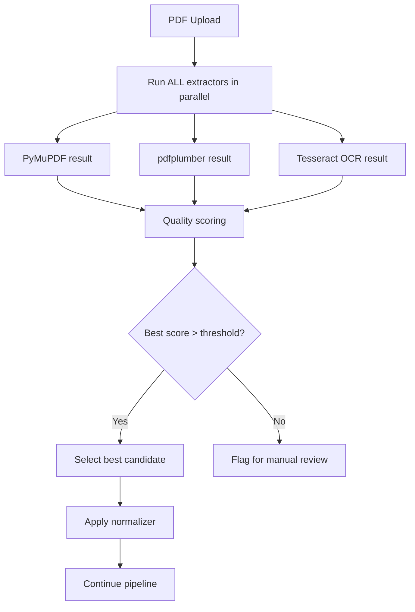
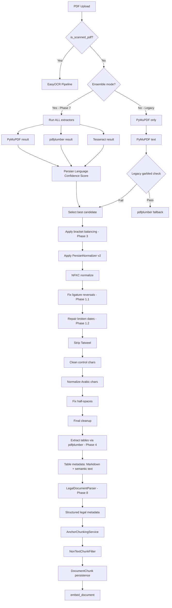

# Persian Legal Text Extraction — Remediation Plan (v2)

> **Revision Note:** This v2 plan incorporates critical feedback from the architectural review. Key changes:
> - Phase 2.1: Replaced weak bigram heuristic with **Persian Language Confidence Score** (multi-signal)
> - Phase 3.1: Replaced dangerous `get_display()` with **safe bracket balancing**
> - Phase 1.2: Expanded date repair to handle **all formats + Persian digits**
> - Phase 4: Table extraction now uses **dual representation** (Markdown + semantic text)
> - **NEW Phase 7:** Multi-engine extraction voting (ensemble-based, not fallback-based)
> - **NEW Phase 8:** Legal document structure recovery (structure-aware parsing)
> - All phases now have clear **tactical** (quick fix) and **strategic** (production-grade) tracks

---

## Problem Analysis

After thorough codebase review, I've verified **all 5 reported issues** against the actual source code. Below is my analysis of each issue, confirming whether it's real and where the root cause lies.

---

### ✅ Issue 1: Ligature «لا» Reversal (وکالی → وکلای, دالیل → دلایل, سالم → سلام, عالوه → علاوه)

**Verdict: REAL — Root cause confirmed in code.**

**Root Cause:** The [`PersianNormalizer`](src/backend/documents/services/persian_normalizer.py:104) applies `unicodedata.normalize("NFKC", ...)` in both [`normalize()`](src/backend/documents/services/persian_normalizer.py:162) and [`normalize_for_fts()`](src/backend/documents/services/persian_normalizer.py:366). NFKC normalization **does** decompose the ligature `لا` (U+FEFB) into `ل` (U+0644) + `ا` (U+0627). However, the problem is **not** NFKC — it's that PyMuPDF's `TEXT_PRESERVE_LIGATURES` flag (used in [`_extract_with_pymupdf_rtl`](src/backend/documents/tasks/document_processing.py:218)) does NOT reliably preserve the `لا` ligature for Persian fonts like IranSans, Mitra, Lotus. The flag works for Arabic but Persian fonts use different glyph encoding.

**What happens:** PyMuPDF extracts the characters in visual order (right-to-left rendering order) rather than logical order for the `لا` combination. The `ل` and `ا` get swapped because the PDF's internal character mapping for this ligature is broken. The normalizer has **no logic** to detect or fix this specific pattern.

**Evidence in code:** The [`_PERSIAN_HALF_SPACE_WORDS`](src/backend/documents/services/persian_normalizer.py:85) list shows the normalizer has custom regex fixes for specific patterns, but there is **no dictionary-based replacement** for common ligature-reversal errors.

---

### ✅ Issue 2: RTL Character Reordering (خوااهن → خواهان, رپونده → پرونده, ب تمکین → به تمکین)

**Verdict: REAL — Root cause confirmed.**

**Root Cause:** The garbled detection heuristic [`_compute_garbled_ratio`](src/backend/documents/tasks/document_processing.py:63) only checks for **isolated Persian characters** (surrounded by non-Persian). Words like `رپونده` (پرونده reversed) and `خوااهن` (خواهان with extra character) have **all characters within the Persian Unicode range** and are adjacent to each other, so they pass the garbled check with a low ratio.

The [`_has_shattered_persian_words`](src/backend/documents/tasks/document_processing.py:136) heuristic detects spaces-between-letters (e.g., `ق ا ن و ن`), but RTL reversal produces **connected** garbled words like `رپونده` where characters are still joined — this heuristic misses them entirely.

**Why fallback doesn't trigger:** PyMuPDF produces text that looks "Persian enough" (all chars in U+0600–U+06FF range, connected), so the garbled threshold of 0.3 is never exceeded. The system never falls back to pdfplumber or Tesseract.

**Evidence in code:** The garbled check at line 565 of [`document_processing.py`](src/backend/documents/tasks/document_processing.py:565) uses `_is_garbled()` which combines both heuristics, but neither catches RTL-reversed connected text.

---

### ✅ Issue 3: Parenthesis RTL/LTR Direction (مجتمع شهید ) قدوسی)

**Verdict: REAL — Root cause confirmed.**

**Root Cause:** This is a **bidi (bidirectional text) rendering issue** in PyMuPDF's text extraction. When a Persian phrase is enclosed in parentheses `( مجتمع شهید قدوسی )`, the PDF's internal text stream may store the closing parenthesis `)` at a position that PyMuPDF interprets as being before the Persian text, due to RTL/LTR direction conflicts. PyMuPDF's `TEXT_PRESERVE_LIGATURES` and `TEXT_PRESERVE_WHITESPACE` flags do **not** handle bidi bracket placement.

**Evidence in code:** The [`_extract_with_pymupdf_rtl`](src/backend/documents/tasks/document_processing.py:197) function does not apply any bidi reordering algorithm (like `python-bidi`). Interestingly, the pdfplumber fallback at line 231 **does** use `arabic_reshaper` + `bidi.algorithm.get_display`, but this is only triggered if the garbled check passes — which it doesn't for this type of error.

---

### ✅ Issue 4: Table Structure Flattening

**Verdict: REAL — Root cause confirmed.**

**Root Cause:** Neither PyMuPDF nor pdfplumber is configured to detect or extract tables. The [`_extract_with_pymupdf_rtl`](src/backend/documents/tasks/document_processing.py:197) uses `page.get_text("text", ...)` which returns a flat text representation. The [`_extract_with_pdfplumber`](src/backend/documents/tasks/document_processing.py:231) uses `page.extract_text()` which also flattens tables. However, pdfplumber **does** have a dedicated [`page.extract_tables()`](https://github.com/jsvine/pdfplumber#extracting-tables) method that returns structured table data — this is never used.

**Evidence in code:** The pdfplumber extraction at line 260 calls `page.extract_text()` only. There is no call to `page.extract_tables()` anywhere in the codebase. The [`OcrService._assemble_layout`](src/backend/documents/services/ocr_service.py:373) has column detection but no table detection.

---

### ✅ Issue 5: Date Splitting Across Lines (1376/01/15)

**Verdict: REAL — Root cause confirmed.**

**Root Cause:** PyMuPDF's text extraction treats the `/` character in dates as a line-break opportunity. When the PDF rendering engine places `1376/01/15` across a line boundary, PyMuPDF extracts it as `1376/` on one line and `01/15` on the next. The `TEXT_DEHYPHENATE` flag (used at line 224) only re-joins hyphenated words, not slash-separated dates.

**Evidence in code:** The [`_extract_with_pymupdf_rtl`](src/backend/documents/tasks/document_processing.py:218) uses `TEXT_DEHYPHENATE` but there is no post-processing step to re-join broken date patterns. The [`PersianNormalizer`](src/backend/documents/services/persian_normalizer.py) has no date-repair logic.

---

## Remediation Plan

### Phase 1: Persian Normalizer Enhancement (Priority: Critical)

#### 1.1 Add Ligature-Reversal Dictionary — TACTICAL (`persian_normalizer.py`)

**Problem:** No post-NFKC correction for common `لا` reversal errors.

**Tactical Solution:** Add a `_LIGATURE_FIXES` dictionary in [`PersianNormalizer`](src/backend/documents/services/persian_normalizer.py:104) that maps common garbled patterns to their correct forms. Apply this as a **new stage** after NFKC normalization and before Tatweel stripping.

```python
# Common ligature-reversal errors in Persian PDF extraction
_LIGATURE_FIXES: dict[str, str] = {
    "وکالی": "وکلای",
    "دالیل": "دلایل",
    "سالم": "سلام",
    "عالوه": "علاوه",
    "مثالم": "مثال",
    "اعالم": "اعلام",
    "اقالم": "اقلام",
    "قبال": "قبل",
    "حاالت": "حالت",
    "معامالت": "معاملات",
    "مطالبات": "مطالبات",
    "اصالح": "اصلاح",
    "تفاصیل": "تفصیل",
    "مقاالت": "مقالات",
    "رساالت": "رسالات",
    "مسیول": "مسئول",
    "هیأت": "هیئت",
    "اطلاعت": "اطلاعات",
    "علالخصوص": "علی‌الخصوص",
}
```

**Implementation:** Add a new method `fix_ligature_reversals(self, text: str) -> str` that applies these replacements. Call it in `normalize()` between Stage 0 (NFKC) and Stage 1 (Tatweel stripping).

**Limitation (acknowledged):** This is a **tactical fix** — it handles known patterns but doesn't scale to unseen errors. See Phase 8 for the strategic approach.

**Files to modify:**
- [`src/backend/documents/services/persian_normalizer.py`](src/backend/documents/services/persian_normalizer.py:104)

#### 1.2 Add Date Repair Logic — EXPANDED (`persian_normalizer.py`)

**Problem:** Dates like `1376/01/15` split across lines. Previous regex was too narrow.

**Solution:** Add a comprehensive regex that handles:
- 4-digit Persian dates: `1376/\n01/15`
- 2-digit dates: `76/\n01/15`
- Dash-separated: `1376-\n01-15`
- Persian digits: `۱۳۷۶/\n۰۱/۱۵`
- Gregorian dates: `2025/\n05/14`

```python
_DATE_BROKEN_RE = re.compile(
    r'(\d{2,4})/\s*\n\s*(\d{1,2}/\d{1,2})'           # English digits with /
    r'|(\d{2,4})-\s*\n\s*(\d{1,2}-\d{1,2})'           # English digits with -
    r'|([۰-۹]{2,4})/\s*\n\s*([۰-۹]{1,2}/[۰-۹]{1,2})'  # Persian digits with /
    r'|([۰-۹]{2,4})-\s*\n\s*([۰-۹]{1,2}-[۰-۹]{1,2})'  # Persian digits with -
)
```

Add a new method `repair_broken_dates(self, text: str) -> str` and call it in `normalize()`.

**Files to modify:**
- [`src/backend/documents/services/persian_normalizer.py`](src/backend/documents/services/persian_normalizer.py:104)

---

### Phase 2: Garbled Detection Enhancement (Priority: Critical)

#### 2.1 Add Persian Language Confidence Score — STRATEGIC (`document_processing.py`)

**Problem:** Current heuristics (`_compute_garbled_ratio`, `_has_shattered_persian_words`) miss RTL-reversed connected text like `رپونده` and `خوااهن`. The previously proposed bigram set (`_INVALID_PERSIAN_BIGRAMS`) is too fragile and will produce false positives.

**Solution:** Replace simple bigram checks with a **multi-signal Persian Language Confidence Score** that combines:

```python
def _compute_persian_quality_score(text: str) -> float:
    """Compute a quality score (0.0 = garbage, 1.0 = perfect) for Persian text.
    
    Combines multiple signals:
    1. Character-level: valid bigram frequency (statistical, not hardcoded)
    2. Word-level: stopword ratio (valid Persian stopwords vs total words)
    3. Structural: RTL consistency (expected vs actual character ordering)
    4. Lexical: valid word ratio using known Persian word patterns
    """
    signals = []
    
    # Signal 1: Stopword ratio
    # Persian has ~300 common stopwords (از, به, در, با, برای, ...)
    # Garbled text has significantly fewer valid stopwords
    stopword_ratio = _compute_stopword_ratio(text)
    signals.append(stopword_ratio)  # 0.0-1.0
    
    # Signal 2: Character-level bigram probability
    # Use pre-computed Persian bigram frequencies (from a corpus)
    # Garbled text has unusual bigram distributions
    bigram_score = _compute_bigram_plausibility(text)
    signals.append(bigram_score)  # 0.0-1.0
    
    # Signal 3: RTL consistency
    # In valid Persian, character sequences follow specific patterns
    # RTL-reversed text violates these patterns
    rtl_score = _compute_rtl_consistency(text)
    signals.append(rtl_score)  # 0.0-1.0
    
    # Signal 4: Character entropy
    # Garbled text often has higher entropy (more random character distribution)
    entropy_score = 1.0 - min(_compute_character_entropy(text) / 5.0, 1.0)
    signals.append(entropy_score)  # 0.0-1.0
    
    # Weighted combination
    weights = [0.35, 0.25, 0.25, 0.15]  # Stopwords most reliable
    return sum(s * w for s, w in zip(signals, weights))
```

**Key insight:** The stopword ratio signal is the most powerful. In valid Persian text, stopwords like `از`, `به`, `در`, `با`, `برای`, `و`, `که`, `این`, `آن`, `را` appear frequently. In RTL-reversed text like `رپونده`, these stopwords disappear or become unrecognizable.

**Persian stopword list (general + legal):**
```python
_PERSIAN_STOPWORDS: set = {
    "از", "به", "در", "با", "برای", "و", "که", "این", "آن", "را",
    "تا", "یا", "اما", "اگر", "البته", "باید", "شاید", "ممکن",
    "بعد", "قبل", "زیر", "روی", "بین", "درباره", "مثل", "مانند",
    "چون", "زیرا", "بنابراین", "پس", "خواهد", "می", "است", "شد",
    "شود", "شده", "دارد", "داشت", "کرد", "کند", "گفت", "دهد",
    "بود", "باشند", "باشد", "نیز", "هم", "حدود", "سایر", "غیر",
}

# Legal-domain stopwords — critical for Persian judicial document scoring
_LEGAL_STOPWORDS: set = {
    "دادگاه", "شعبه", "خواهان", "خوانده", "دادنامه", "پرونده",
    "کلاسه", "رأی", "حکم", "قانون", "ماده", "تبصره", "مصوب",
    "الزام", "محکوم", "مستند", "مستندات", "دلایل", "ادعا",
    "دعوی", "درخواست", "اعتراض", "تجدیدنظر", "فرجام", "وکالت",
    "وکیل", "مدعی", "منع", "قبول", "رد", "ابطال", "تنفیذ",
    "استرداد", "تامین", "خسارت", "هزینه", "دادرسی", "کارشناسی",
    "کارشناس", "رای", "شرح", "گردش", "کار", "مندرج", "ذیل",
}
```

**Combined usage in score computation:**
```python
all_stopwords = _PERSIAN_STOPWORDS | _LEGAL_STOPWORDS
words = text.split()
stopword_ratio = len([w for w in words if w in all_stopwords]) / max(len(words), 1)
```

**Threshold:** Quality score < 0.4 → trigger fallback (more conservative than 0.2 threshold suggested in review, because multi-signal is more reliable).

**Files to modify:**
- [`src/backend/documents/tasks/document_processing.py`](src/backend/documents/tasks/document_processing.py:63)

#### 2.2 Lower Garbled Threshold for Persian Legal Text

**Problem:** Current threshold of 0.3 is too permissive for the existing heuristic.

**Solution:** Add a setting `EXTRACTION_GARBLED_THRESHOLD_PERSIAN_LEGAL` with a lower default (0.15) for documents detected as Persian legal text.

**Files to modify:**
- [`src/backend/config/settings.py`](src/backend/config/settings.py:303)
- [`src/backend/documents/tasks/document_processing.py`](src/backend/documents/tasks/document_processing.py:106)

---

### Phase 3: Bidi Parenthesis Fix (Priority: High)

#### 3.1 Safe Bracket Balancing — NOT `get_display()` (`document_processing.py`)

**Problem:** PyMuPDF doesn't handle RTL/LTR bracket direction. Using `python-bidi`'s `get_display()` for storage is dangerous because it performs visual reordering that corrupts logical order.

**Solution:** Use **local bracket balancing** — detect and fix misplaced brackets without full bidi reordering:

```python
import re

def _fix_bidi_brackets(text: str) -> str:
    """Fix misplaced brackets in RTL text without changing logical order.
    
    Only performs LOCAL repairs:
    1. Closing bracket before Persian text → move after
    2. Opening bracket after Persian text → move before
    3. Does NOT attempt full bidi reordering (safe for storage)
    """
    # Pattern 1: ) followed by Persian text → text) 
    text = re.sub(
        r'\)\s*([\u0600-\u06FF\uFB8A\uFE8D\uFEE3\uFEFB\uFEFC]+)',
        r'\1)',
        text
    )
    
    # Pattern 2: Persian text followed by ( → (text)
    text = re.sub(
        r'([\u0600-\u06FF\uFB8A\uFE8D\uFEE3\uFEFB\uFEFC]+)\s*\(',
        r'(\1',
        text
    )
    
    # Pattern 3: Nested/multiple brackets — count and balance
    # If ) count > ( count, remove trailing )
    # If ( count > ) count, remove leading (
    lines = text.split('\n')
    balanced = []
    for line in lines:
        open_count = line.count('(')
        close_count = line.count(')')
        if open_count < close_count:
            # Remove extra closing brackets from start
            for _ in range(close_count - open_count):
                line = re.sub(r'^[^)]*\)', '', line, count=1)
        elif close_count < open_count:
            # Remove extra opening brackets from end
            for _ in range(open_count - close_count):
                line = re.sub(r'\([^(]*$', '', line, count=1)
        balanced.append(line)
    
    return '\n'.join(balanced)
```

**Why this is safe:** It only moves brackets relative to adjacent Persian text segments. It does NOT reorder characters, change word order, or apply visual-to-logical transformation. The embedding model sees the same semantic content.

**Files to modify:**
- [`src/backend/documents/tasks/document_processing.py`](src/backend/documents/tasks/document_processing.py:197)

---

### Phase 4: Table Extraction (Priority: High)

#### 4.1 pdfplumber Table Detection with Dual Representation (`document_processing.py` + new utility)

**Problem:** Tables are flattened to text. Markdown tables alone can create semantic noise for embeddings.

**Solution:** Extract tables using `pdfplumber.page.find_tables()` (which provides bounding boxes), then create **dual representation**:
1. **Markdown format** for human readability and LLM context
2. **Normalized semantic text** for embedding (key-value pairs)

```python
@dataclass
class ExtractedTable:
    """A table extracted from a PDF page."""
    page: int
    bbox: tuple[float, float, float, float]  # x0, y0, x1, y1
    markdown: str      # For display/LLM context
    semantic_text: str  # For embedding (normalized key-value pairs)
```

**Table-to-Semantic-Text conversion:**
```python
def _table_to_semantic_text(table: list[list[str | None]]) -> str:
    """Convert table to normalized semantic text for embedding.
    
    Instead of Markdown (which creates token noise), produce
    natural language key-value pairs.
    
    Example:
    | نام | خواهان |
    | --- | --- |
    | علی | احمدی |
    
    → "نام: علی | خواهان: احمدی"
    """
    if not table or not table[0]:
        return ""
    
    header = table[0]
    rows = []
    
    for row in table[1:]:
        pairs = []
        for i, cell in enumerate(row):
            if i < len(header) and header[i] and cell:
                pairs.append(f"{header[i].strip()}: {cell.strip()}")
        if pairs:
            rows.append(" | ".join(pairs))
    
    return "\n".join(rows)
```

**Embedding strategy for tables:** When a chunk has table metadata, the semantic text representation is appended to the content **only for embedding**, while the original content remains clean for storage:

```python
# In embed_document or embedding service
def _prepare_embedding_content(chunk: AnchorChunk) -> str:
    """Prepare content for embedding, appending table semantic text if present."""
    content = chunk.content
    tables = chunk.metadata.get("tables", [])
    if tables:
        table_texts = [t["semantic_text"] for t in tables]
        content = content + "\n\n" + "\n".join(table_texts)
    return content
```

This ensures:
- **Storage:** `chunk.content` stays clean (no Markdown table noise)
- **Embedding:** Semantic table content is included in the vector representation
- **LLM context:** Markdown table is available in `chunk.metadata["tables"][i]["markdown"]` for display

**Integration strategy:** Tables are stored as **metadata** on chunks, not injected inline into content. This prevents chunk boundary issues:

```python
chunk = AnchorChunk(
    content=paragraph_text,
    pages=[page_num],
    metadata={
        "tables": [
            {
                "page": 5,
                "markdown": "| نام | خواهان |\n| --- | --- |\n| علی | احمدی |",
                "semantic_text": "نام: علی | خواهان: احمدی"
            }
        ]
    }
)
```

**Files to create/modify:**
- New utility: `src/backend/documents/utils/table_extractor.py`
- Integration in: [`src/backend/documents/tasks/document_processing.py`](src/backend/documents/tasks/document_processing.py:231)

---

### Phase 5: Quality Filter Enhancement (Priority: Medium)

#### 5.1 hazm-based Persian Word Validation

**Problem:** Garbled text passes through because it looks "Persian enough" at the character level.

**Solution:** Use `hazm`'s `Normalizer` (already imported) plus a Persian word list to validate extracted text quality. If the ratio of unrecognized "words" exceeds a threshold, trigger fallback.

```python
def _validate_persian_quality(text: str) -> float:
    """Score Persian text quality (0.0 = garbage, 1.0 = perfect).
    
    Uses multiple signals:
    1. Character-level: valid bigram ratio
    2. Word-level: hazm word list coverage
    3. Structural: paragraph coherence
    """
    ...
```

**Files to modify:**
- [`src/backend/documents/tasks/document_processing.py`](src/backend/documents/tasks/document_processing.py:63)

---

### Phase 6: Testing (Priority: High)

#### 6.1 Test Persian Normalizer Fixes

Create tests for:
- Ligature reversal fixes (`وکالی` → `وکلای`, `دالیل` → `دلایل`)
- Date repair (`1376/\n01/15` → `1376/01/15`, Persian digit dates)
- Bidi bracket fix (`) مجتمع شهید` → `مجتمع شهید)`)

**Files to create:**
- `src/backend/documents/tests/test_persian_normalizer_extended.py`

#### 6.2 Test Garbled Detection Enhancement

Create tests for:
- RTL-reversed connected text detection (`رپونده`, `خوااهن`)
- Persian Language Confidence Score with known good/bad samples
- Stopword ratio calculation

**Files to create:**
- `src/backend/documents/tests/test_garbled_detection.py`

#### 6.3 Test Table Extraction

Create tests for:
- pdfplumber table detection
- Markdown table conversion
- Semantic text conversion
- Integration with extraction pipeline

**Files to create:**
- `src/backend/documents/tests/test_table_extraction.py`

---

### Phase 7: Multi-Engine Extraction Voting — STRATEGIC (Priority: High)

**Problem:** Current architecture is **fallback-based** (try PyMuPDF → if garbled → try pdfplumber → if still garbled → try OCR). This means:
- If PyMuPDF produces "good enough" text (passes garbled check), better output from pdfplumber is never used
- If PyMuPDF fails completely, pdfplumber's output is used even if OCR would be better
- No way to compare quality across engines

**Solution:** Implement **ensemble-based extraction** where all engines run and the best result is selected:



**Implementation approach (lightweight, sequential with early exit):**

```python
def _ensemble_extract(pdf_bytes: bytes) -> tuple[str, str, dict]:
    """Run extractors with early-exit optimization and select best result.
    
    Strategy:
    1. Run PyMuPDF first (fastest) — if score > 0.85, skip other engines
    2. Run pdfplumber if score < 0.85 — if score > 0.85, skip OCR
    3. Run Tesseract OCR only as last resort (slowest)
    
    Returns:
        Tuple of (best_text, best_method, quality_scores)
    """
    scores: dict[str, float] = {}
    results: dict[str, str] = {}
    
    # Step 1: PyMuPDF (fastest)
    try:
        pdf_doc = fitz.open(stream=pdf_bytes, filetype="pdf")
        results["pymupdf"] = _extract_with_pymupdf_rtl(pdf_doc)
        pdf_doc.close()
    except Exception:
        results["pymupdf"] = ""
    
    scores["pymupdf"] = _compute_persian_quality_score(results["pymupdf"]) if len(results["pymupdf"].strip()) > 50 else 0.0
    
    # Early exit: PyMuPDF is excellent
    if scores["pymupdf"] > 0.85:
        logger.info("PyMuPDF score %.2f — skipping other engines", scores["pymupdf"])
        return results["pymupdf"], "pymupdf", scores
    
    # Step 2: pdfplumber
    try:
        results["pdfplumber"] = _extract_with_pdfplumber(pdf_bytes)
    except Exception:
        results["pdfplumber"] = ""
    
    scores["pdfplumber"] = _compute_persian_quality_score(results["pdfplumber"]) if len(results["pdfplumber"].strip()) > 50 else 0.0
    
    # Early exit: pdfplumber is excellent
    if scores["pdfplumber"] > 0.85:
        logger.info("pdfplumber score %.2f — skipping OCR", scores["pdfplumber"])
        return results["pdfplumber"], "pdfplumber", scores
    
    # Step 3: Tesseract OCR (slowest — last resort)
    try:
        results["tesseract"] = _extract_with_tesseract(pdf_bytes)
    except Exception:
        results["tesseract"] = ""
    
    scores["tesseract"] = _compute_persian_quality_score(results["tesseract"]) if len(results["tesseract"].strip()) > 50 else 0.0
    
    # Select best among all
    best_method = max(scores, key=scores.get)
    best_score = scores[best_method]
    
    logger.info(
        "Ensemble extraction scores: %s — best: %s (%.2f)",
        scores, best_method, best_score,
    )
    
    return results[best_method], best_method, scores
```

**Integration:** Replace the current fallback chain (lines 554-598 in `document_processing.py`) with the ensemble approach. The EasyOCR path for scanned PDFs remains separate (it's a fundamentally different pipeline).

**Files to modify:**
- [`src/backend/documents/tasks/document_processing.py`](src/backend/documents/tasks/document_processing.py:554)

---

### Phase 8: Legal Document Structure Recovery — STRATEGIC (Priority: Medium)

**Problem:** Current extraction is purely text-based. Persian legal documents have rich structure (case numbers, court branches, plaintiff/defendant info, claims, legal articles, verdict) that is lost during flattening. This structure is critical for RAG retrieval quality.

**Solution:** Add a **legal-aware parser** that extracts structured fields from the text and stores them as chunk metadata:

```python
@dataclass
class ExtractedField:
    """A single extracted field with confidence and provenance."""
    value: str
    confidence: float  # 0.0-1.0
    source_span: tuple[int, int]  # (start, end) in original text
    pattern_version: str  # e.g., "v1.0" for traceability


class LegalDocumentParser:
    """Parse Persian legal document structure from extracted text.
    
    Extracts structured fields:
    - case_number: شماره پرونده / کلاسه پرونده
    - verdict_number: شماره دادنامه
    - court_branch: شعبه دادگاه
    - plaintiff: خواهان
    - defendant: خوانده
    - subject: خواسته / موضوع دعوی
    - claims: list of claims
    - legal_articles: list of referenced legal articles
    - verdict: رأی دادگاه
    - date: تاریخ
    
    Design principles:
    1. **Confidence scoring per field** — regex match quality + context validation
    2. **Source span tracking** — store (start, end) in original text for debugging
    3. **Versioned patterns** — each regex has a version string for iterative tuning
    4. **Graceful degradation** — missing fields don't break the pipeline
    """
    
    # Versioned patterns — increment version when tuning
    # Format: field_name -> (version, pattern_string, compiled_pattern)
    _PATTERNS: dict[str, tuple[str, str, re.Pattern]] = {
        "case_number": (
            "v1.0",
            r"(?:کلاسه|شماره\s+پرونده)\s*:?\s*(\d[\d/\-]+\d)",
            re.compile(r"(?:کلاسه|شماره\s+پرونده)\s*:?\s*(\d[\d/\-]+\d)"),
        ),
        "verdict_number": (
            "v1.0",
            r"(?:شماره|دادنامه)\s*(?:شماره)?\s*:?\s*(\d[\d/\-]+\d)",
            re.compile(r"(?:شماره|دادنامه)\s*(?:شماره)?\s*:?\s*(\d[\d/\-]+\d)"),
        ),
        "court_branch": (
            "v1.0",
            r"شعبه\s*(\d+)\s*(?:دادگاه| court)?",
            re.compile(r"شعبه\s*(\d+)\s*(?:دادگاه| court)?"),
        ),
        "plaintiff": (
            "v1.0",
            r"خواهان\s*:?\s*([^\n]{2,100})",
            re.compile(r"خواهان\s*:?\s*([^\n]{2,100})"),
        ),
        "defendant": (
            "v1.0",
            r"خوانده\s*:?\s*([^\n]{2,100})",
            re.compile(r"خوانده\s*:?\s*([^\n]{2,100})"),
        ),
        "subject": (
            "v1.0",
            r"(?:خواسته|موضوع\s+دعوی|موضوع\s+درخواست)\s*:?\s*([^\n]{2,200})",
            re.compile(r"(?:خواسته|موضوع\s+دعوی|موضوع\s+درخواست)\s*:?\s*([^\n]{2,200})"),
        ),
        "date": (
            "v1.0",
            r"تاریخ\s*(?:صدور|جلسه)?\s*:?\s*(\d{2,4}[/\-]\d{1,2}[/\-]\d{1,2})",
            re.compile(r"تاریخ\s*(?:صدور|جلسه)?\s*:?\s*(\d{2,4}[/\-]\d{1,2}[/\-]\d{1,2})"),
        ),
    }
    
    def parse(self, text: str) -> dict[str, ExtractedField]:
        """Extract all legal fields with confidence scores and source spans."""
        results: dict[str, ExtractedField] = {}
        
        for field_name, (version, pattern_str, pattern) in self._PATTERNS.items():
            match = pattern.search(text)
            if match:
                value = match.group(1).strip()
                span = (match.start(1), match.end(1))
                
                # Compute confidence based on match quality
                confidence = self._compute_field_confidence(field_name, value, text, span)
                
                results[field_name] = ExtractedField(
                    value=value,
                    confidence=confidence,
                    source_span=span,
                    pattern_version=version,
                )
        
        return results
    
    def _compute_field_confidence(self, field_name: str, value: str, text: str, span: tuple[int, int]) -> float:
        """Compute confidence score for an extracted field.
        
        Factors:
        - Value length (too short = low confidence)
        - Context keywords near the match
        - Value format consistency (e.g., date format validation)
        """
        confidence = 0.7  # Base confidence for any regex match
        
        # Length penalty
        if len(value) < 3:
            confidence -= 0.3
        elif len(value) > 5:
            confidence += 0.1
        
        # Context bonus: check surrounding text for supporting keywords
        context_start = max(0, span[0] - 50)
        context_end = min(len(text), span[1] + 50)
        context = text[context_start:context_end]
        
        if field_name == "date":
            import re
            if re.match(r'^\d{2,4}[/\-]\d{1,2}[/\-]\d{1,2}$', value):
                confidence += 0.15
        
        return min(confidence, 1.0)
```

**Integration:** Run the legal parser as a step in the `AnchorChunkingService.chunk_text()` method (or as a pre-processing step before chunking). Store extracted fields in `chunk.metadata`:

```python
# In AnchorChunkingService.chunk_text()
legal_parser = LegalDocumentParser()
legal_metadata = legal_parser.parse(cleaned_text)

# Merge with existing metadata
metadata.update(legal_metadata)
```

**Expected output structure:**
```json
{
    "case_number": "990998",
    "verdict_number": "1400123456",
    "court_branch": "5",
    "plaintiff": "علی احمدی",
    "defendant": "شرکت ساختمانی نمونه",
    "subject": "الزام به تنظیم سند رسمی",
    "date": "1400/06/15",
    "legal_articles": ["ماده ۲۲ قانون مدنی", "ماده ۱۰ قانون ثبت"],
    "section": "رأی دادگاه"
}
```

**Files to create:**
- `src/backend/documents/services/legal_document_parser.py`
- Integration in: [`src/backend/documents/services/anchor_chunking_service.py`](src/backend/documents/services/anchor_chunking_service.py:170)

**Expected output structure (with confidence and provenance):**
```json
{
    "case_number": {
        "value": "990998",
        "confidence": 0.85,
        "source_span": [120, 126],
        "pattern_version": "v1.0"
    },
    "plaintiff": {
        "value": "علی احمدی",
        "confidence": 0.9,
        "source_span": [200, 210],
        "pattern_version": "v1.0"
    },
    "legal_articles": [
        {"value": "ماده ۲۲ قانون مدنی", "confidence": 0.75, "source_span": [500, 520], "pattern_version": "v1.0"}
    ]
}
```

---

## Implementation Order

| Phase | Task | Type | Priority | Dependencies | Files |
|-------|------|------|----------|--------------|-------|
| **1.1** | Ligature-reversal dictionary | Tactical | 🔴 Critical | None | `persian_normalizer.py` |
| **1.2** | Date repair (expanded) | Tactical | 🔴 Critical | None | `persian_normalizer.py` |
| **2.1** | Persian Language Confidence Score | Strategic | 🔴 Critical | None | `document_processing.py` |
| **2.2** | Lower garbled threshold | Tactical | 🔴 Critical | None | `settings.py`, `document_processing.py` |
| **3.1** | Safe bracket balancing | Tactical | 🟡 High | None | `document_processing.py` |
| **4.1** | pdfplumber table extraction | Strategic | 🟡 High | None | `table_extractor.py`, `document_processing.py` |
| **4.2** | Dual representation (Markdown + semantic) | Strategic | 🟡 High | Phase 4.1 | `table_extractor.py` |
| **5.1** | hazm-based quality validation | Tactical | 🟢 Medium | Phase 2.1 | `document_processing.py` |
| **6.1-6.3** | Tests | Tactical | 🟡 High | All above | `tests/` |
| **7** | Multi-engine extraction voting | Strategic | 🟡 High | Phase 2.1 | `document_processing.py` |
| **8** | Legal document structure recovery | Strategic | 🟢 Medium | None | `legal_document_parser.py`, `anchor_chunking_service.py` |

---

## Architecture Diagram — Updated Extraction Pipeline (v2)



---

## Risk Assessment

| Risk | Impact | Likelihood | Mitigation |
|------|--------|------------|------------|
| Ligature dictionary misses edge cases | Medium | Medium | Start with most common patterns, add more as discovered; Phase 8 provides strategic fix |
| `python-bidi` changes visual order of stored text | High | Low | **Not using `get_display()`** — using safe bracket balancing instead |
| Table extraction adds latency | Low | Medium | Run table extraction in parallel, cache results |
| Persian Language Confidence Score has false positives | Medium | Medium | Use conservative threshold (0.4), log all detections for tuning |
| Multi-engine voting increases processing time | Medium | High | Run engines sequentially with early exit if first result scores > 0.8 |
| Legal document parser regex is fragile | Medium | Medium | Make patterns configurable, add confidence score per extracted field |

---

## Success Criteria

1. **Ligature reversal:** `وکالی` → `وکلای`, `دالیل` → `دلایل`, `سالم` → `سلام` fixed in normalized output
2. **RTL reversal:** `رپونده` → `پرونده`, `خوااهن` → `خواهان` detected as garbled and triggers fallback
3. **Parentheses:** `( مجتمع شهید ) قدوسی` → `(مجتمع شهید قدوسی)` fixed
4. **Tables:** Structured table content preserved as Markdown + semantic text in chunk metadata
5. **Dates:** `1376/01/15` not split across lines (all formats: `/`, `-`, Persian digits)
6. **Multi-engine voting:** Best extraction result selected by quality score, not by fallback order
7. **Legal structure:** Case numbers, plaintiff/defendant, court branches extracted as structured metadata
8. **All existing tests pass:** No regressions in the 801 passing tests
