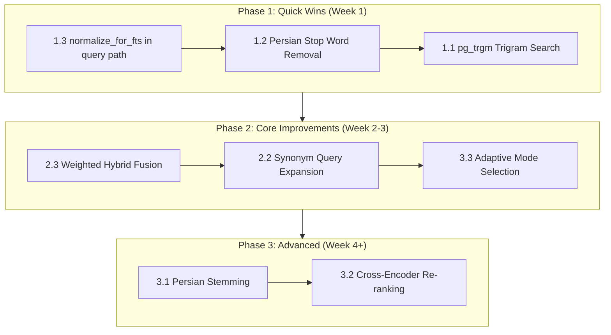

# Persian Legal Text Search Optimization — Comprehensive Analysis

## Current State Overview

The project already has a **hybrid search** system combining:
1. **Vector search** (pgvector `CosineDistance` on 768-dim embeddings)
2. **Keyword search** (PostgreSQL FTS with `simple` config + `websearch` syntax)
3. **RRF fusion** (Reciprocal Rank Fusion with k=60)
4. **LLM Query Formulation** (Epic E11) that optimizes raw user queries for both FTS and vector search
5. **Persian text normalization** (Arabic→Persian char conversion, digit normalization, ZWNJ handling)

---

## Optimization Techniques Analysis

Below is a ranked analysis of techniques to improve Persian legal text search, ordered by **estimated impact vs. implementation effort**.

---

### TIER 1: HIGH IMPACT, LOW EFFORT (Implement First)

#### 1.1 PostgreSQL `pg_trgm` Extension for Fuzzy/Trigram Matching

**What it is:** The `pg_trgm` extension enables trigram-based similarity search (`similarity()`, `show_trgm()`, `%` operator). It breaks text into 3-character sliding windows (trigrams) and compares them.

**Why it matters for Persian legal text:**
- **OCR errors**: Persian PDFs often have OCR artifacts like `مقـاله` instead of `ماده` — trigrams handle partial matches
- **Spelling variations**: Persian has multiple acceptable spellings (e.g., `آزادی` vs `ازادی`)
- **Tatweel remnants**: Even after normalization, some Tatweel artifacts may remain
- **Compound word variations**: `می‌شود` vs `میشود` vs `می شود` — trigrams bridge these gaps

**Implementation:**
```sql
CREATE EXTENSION IF NOT EXISTS pg_trgm;
CREATE INDEX idx_chunks_content_trgm ON document_chunks USING gin (content gin_trgm_ops);
```

**Usage in search:**
```python
from django.db.models import Func, F

# Trigram similarity search
queryset = queryset.annotate(
    trgm_similarity=Func(
        F("content"), Value(query_text),
        function="similarity"
    )
).filter(trgm_similarity__gte=0.3)
```

**Integration with existing hybrid search:**
- Add as a **third retrieval method** in `hybrid_search()` alongside vector and FTS
- Or use as a **fallback** when FTS returns zero results
- RRF fusion naturally handles the third signal

**Effort:** Low (1-2 days)
- Add migration for `pg_trgm` extension + GIN index
- Add `trigram_search()` function to `search_service.py`
- Integrate into `hybrid_search()` as a third leg
- Update tests

**Impact:** High — catches OCR errors, spelling variations, and partial matches that both vector and FTS miss

---

#### 1.2 Persian Stop Word Removal in FTS Queries

**What it is:** Filter out common Persian stop words (e.g., `و`, `در`, `به`, `از`, `که`, `با`, `برای`, `این`, `آن`, `را`) from FTS queries before searching.

**Why it matters:**
- PostgreSQL's `simple` FTS config does NOT have a Persian stop word dictionary
- Stop words in FTS queries cause AND-matching failures (e.g., searching for `"مجازات در قانون"` requires ALL three tokens to exist in a chunk)
- The LLM query formulation already strips some filler, but stop words can still leak through

**Implementation:**
```python
PERSIAN_STOP_WORDS = {
    "و", "در", "به", "از", "که", "با", "برای", "این", "آن", "را",
    "ها", "های", "می", "هم", "نیز", "اگر", "اما", "ولی", "یا",
    "باید", "شاید", "ممکن", "خواهد", "باشند", "است", "هست", "شد",
    "شود", "شده", "کرد", "کند", "گفت", "دهد", "دارد", "داشت",
}

def remove_persian_stop_words(query: str) -> str:
    tokens = query.split()
    return " ".join(t for t in tokens if t not in PERSIAN_STOP_WORDS)
```

**Effort:** Very Low (hours)
- Add stop word list + filter function
- Apply in `keyword_search()` before building `SearchQuery`
- No DB changes needed

**Impact:** Medium — prevents FTS from failing on queries with common Persian stop words

---

#### 1.3 Normalize `normalize_for_fts()` in the FTS Query Path

**What it is:** Currently, the LLM query formulation is expected to produce digit-normalized FTS queries, but there's no **safety net** in the search service itself. Adding `PersianNormalizer.normalize_for_fts()` to the FTS query path ensures consistency.

**Why it matters:**
- If the LLM fails to normalize digits (e.g., returns `"ماده ۲۲"` instead of `"ماده 22"`), FTS will return zero matches
- The `query_formulation.py` prompt instructs digit conversion, but LLMs are non-deterministic

**Implementation:**
In [`keyword_search()`](src/backend/documents/services/search_service.py:329), add:
```python
from documents.services.persian_normalizer import PersianNormalizer

# Normalize query text for FTS (digit conversion, Arabic→Persian chars, ZWNJ→space)
query_text = PersianNormalizer.normalize_for_fts(query_text)
```

**Effort:** Very Low (minutes)
- One import + one function call in `keyword_search()`

**Impact:** High — eliminates a class of silent FTS failures

---

### TIER 2: MEDIUM IMPACT, MEDIUM EFFORT

#### 2.1 Persian-Specific FTS Text Search Configuration

**What it is:** Create a custom PostgreSQL text search configuration for Persian that handles:
- Persian stop words (built into the config, not just application-level filtering)
- Persian stemmer (e.g., via `ispell` dictionary or custom rules)
- Character classification for Persian-specific punctuation

**Why it matters:**
- The current `simple` config only lowercases and splits on whitespace/punctuation
- A Persian-aware config can handle:
  - Persian-specific punctuation (e.g., `،` comma, `؛` semicolon, `؟` question mark)
  - Persian number separators
  - Better tokenization of compound words

**Implementation:**
```sql
-- Create a Persian text search configuration
CREATE TEXT SEARCH CONFIGURATION persian (COPY = simple);

-- Add Persian stop words
CREATE TEXT SEARCH DICTIONARY persian_stop (
    TEMPLATE = pg_catalog.simple,
    STOPWORDS = persian
);

ALTER TEXT SEARCH CONFIGURATION persian
    ALTER MAPPING FOR word, asciiword WITH persian_stop, simple;
```

Then update the DB trigger to use `to_tsvector('persian', ...)` instead of `to_tsvector('simple', ...)`.

**Effort:** Medium (3-5 days)
- Create stop word file in PostgreSQL's `tsearch_data` directory
- Create custom text search configuration
- Update DB trigger
- Data migration to regenerate `search_vector` for all chunks
- Update `keyword_search()` to use the new config

**Impact:** Medium-High — improves FTS quality for Persian, but requires careful testing

---

#### 2.2 Query Expansion via Persian WordNet / Synonym Dictionary

**What it is:** Expand user queries with synonyms and related legal terms before searching. For example, a search for `"مجازات"` could also match chunks containing `"کیفر"`, `"تنبیه"`, `"عقوبت"`.

**Why it matters:**
- Persian legal texts use varied terminology for the same concept
- Different laws may use different terms for the same legal concept
- Users may not know the exact legal terminology

**Implementation:**
```python
LEGAL_SYNONYM_MAP = {
    "مجازات": ["کیفر", "تنبیه", "عقوبت", "جزا"],
    "قانون": ["قانون", "مقررات", "نظام نامه", "آیین نامه"],
    "جرم": ["جرم", "بزه", "جنایت", "تقصیر"],
    "دادگاه": ["دادگاه", "محکمه", "دیوان", "مرجع قضایی"],
    "حکم": ["حکم", "رأی", "قرار", "دستور"],
    "شاکی": ["شاکی", "شاکی خصوصی", "مدعی", "شاکی پرونده"],
    "متهم": ["متهم", "مظنون", "مدعی علیه", "محکوم"],
}

def expand_query(query: str) -> str:
    tokens = query.split()
    expanded = set(tokens)
    for token in tokens:
        if token in LEGAL_SYNONYM_MAP:
            expanded.update(LEGAL_SYNONYM_MAP[token])
    return " ".join(expanded)
```

**Effort:** Medium (2-3 days)
- Build synonym dictionary (requires legal domain expertise)
- Add `expand_query()` function
- Integrate into `keyword_search()` or as a pre-processing step
- Add tests

**Impact:** Medium — improves recall for users who don't know exact legal terminology

---

#### 2.3 Weighted Hybrid Search (Instead of RRF)

**What it is:** Replace or augment RRF fusion with a weighted linear combination of vector and keyword scores. RRF treats both signals equally; weighted fusion allows tuning.

**Why it matters:**
- For Persian legal text, keyword matches on article numbers (`ماده 22`) should be weighted higher than semantic similarity
- Vector search is better for conceptual queries (`"تفاوت عقد لازم و عقد جایز"`)
- A weighted approach can adapt to query characteristics

**Implementation:**
```python
def weighted_fusion(
    vector_results: list[dict],
    keyword_results: list[dict],
    top_k: int,
    vector_weight: float = 0.4,
    keyword_weight: float = 0.6,  # Higher weight for keyword in legal domain
) -> list[dict]:
    # Normalize scores to [0, 1] within each result set
    # Then compute: combined_score = vector_weight * norm_vector_score + keyword_weight * norm_keyword_score
    ...
```

**Effort:** Medium (2-3 days)
- Implement weighted fusion function
- Add configuration for weights
- Integrate into `hybrid_search()`
- Update tests

**Impact:** Medium — better control over search behavior, but requires experimentation to find optimal weights

---

### TIER 3: HIGH IMPACT, HIGH EFFORT

#### 3.1 Persian Stemming / Lemmatization for FTS

**What it is:** Apply Persian stemming (e.g., via `hazm` library's stemmer or lemmatizer) to both chunk content and queries, so that different morphological forms of the same word match.

**Why it matters:**
- Persian has rich morphology: `می‌روم`, `می‌روی`, `می‌رود`, `برو`, `رفتن` are all forms of the same verb
- Without stemming, FTS requires exact token matches
- Example: `"مجرم"` (criminal) vs `"مجرمین"` (criminals) vs `"مجرمیت"` (criminality)

**Implementation:**
```python
from hazm import Stemmer, Lemmatizer

stemmer = Stemmer()
lemmatizer = Lemmatizer()

def stem_persian_text(text: str) -> str:
    tokens = text.split()
    stemmed = []
    for token in tokens:
        stem = stemmer.stem(token)
        lemma = lemmatizer.lemmatize(token)
        # Use the shorter of stem/lemma for FTS indexing
        stemmed.append(min(stem, lemma, key=len) if lemma != token else stem)
    return " ".join(stemmed)
```

**Effort:** High (5-7 days)
- Add stemming step to chunking pipeline (re-index all chunks)
- Add stemming to FTS query path
- Update DB trigger or application-layer indexing
- Data migration to regenerate `search_vector`
- Extensive testing for accuracy (Persian stemming is imperfect)

**Impact:** High — significantly improves recall for morphologically varied queries

---

#### 3.2 Re-rank Retrieved Chunks with a Cross-Encoder

**What it is:** After initial retrieval (hybrid search), pass the top-N chunks through a lightweight cross-encoder model (e.g., `cross-encoder/ms-marco-MiniLM-L-6-v2` or a Persian-specific model) to re-rank them by actual relevance to the query.

**Why it matters:**
- Initial retrieval (even hybrid) is a coarse filter
- A cross-encoder jointly encodes query + chunk and produces a precise relevance score
- This is the single highest-impact improvement for RAG quality

**Implementation:**
```python
from sentence_transformers import CrossEncoder

# Lazy-loaded singleton
_cross_encoder = None

def get_cross_encoder():
    global _cross_encoder
    if _cross_encoder is None:
        _cross_encoder = CrossEncoder("cross-encoder/ms-marco-MiniLM-L-6-v2")
    return _cross_encoder

def rerank_chunks(query: str, chunks: list[dict], top_k: int = 5) -> list[dict]:
    model = get_cross_encoder()
    pairs = [(query, c["content"]) for c in chunks]
    scores = model.predict(pairs)
    for i, chunk in enumerate(chunks):
        chunk["relevance_score"] = float(scores[i])
    chunks.sort(key=lambda c: c["relevance_score"], reverse=True)
    return chunks[:top_k]
```

**Effort:** High (5-7 days)
- Add cross-encoder dependency (model download ~500MB)
- Implement re-ranking service
- Integrate into RAG pipeline after hybrid search
- Handle model loading (lazy, async, or in Celery task)
- Docker image size increases significantly

**Impact:** Very High — the single most impactful improvement for retrieval quality

---

#### 3.3 Hybrid Search with Adaptive Mode Selection

**What it is:** Automatically detect whether a query is better suited for vector search, keyword search, or hybrid, based on query characteristics (e.g., presence of article numbers, legal citations, conceptual questions).

**Why it matters:**
- Queries with article numbers (`ماده 22`, `قانون مدنی ماده ۱۰۷`) benefit most from keyword/FTS
- Conceptual queries (`تفاوت عقد لازم و عقد جایز`) benefit most from vector search
- A one-size-fits-all hybrid approach dilutes both signals

**Implementation:**
```python
import re

ARTICLE_PATTERN = re.compile(r"(ماده|اصل|قانون)\s*\d+")
LEGAL_CITATION_PATTERN = re.compile(r"(قانون\s+(مدنی|مجازات|تجارت|کار))")

def detect_search_mode(query: str) -> str:
    if ARTICLE_PATTERN.search(query) or LEGAL_CITATION_PATTERN.search(query):
        return "keyword_heavy"  # Boost keyword weight
    elif len(query.split()) > 10:
        return "vector_heavy"   # Long conceptual queries → vector
    else:
        return "hybrid"         # Default balanced mode
```

**Effort:** Medium-High (3-5 days)
- Implement query classification logic
- Add adaptive weight selection to hybrid search
- Add tests for classification accuracy
- Tune thresholds with real query data

**Impact:** High — adapts search strategy to query type

---

#### 3.4 Persian-Specific Tokenization for Embeddings

**What it is:** Pre-process Persian text before embedding to improve vector quality. Current embeddings are generated on raw chunk content; Persian-specific tokenization (handling ZWNJ, compound words, Persian punctuation) can improve embedding quality.

**Why it matters:**
- Embedding models tokenize at the subword level, but Persian-specific pre-processing can help
- Compound Persian words (e.g., `می‌شود`, `خانه‌ها`) may be tokenized suboptimally
- Persian-specific punctuation (e.g., `،` instead of `,`) affects tokenization

**Implementation:**
In [`embedding_service.py`](src/backend/documents/services/embedding_service.py), add a normalization step before embedding:
```python
from documents.services.persian_normalizer import PersianNormalizer

def embed_text(text: str) -> list[float]:
    # Normalize for embedding (lighter than normalize_for_fts — keep digits)
    text = PersianNormalizer.normalize_arabic_chars(text)
    text = PersianNormalizer.strip_tatweel(text)
    # Then call the provider's embed method
    ...
```

**Effort:** Low-Medium (1-2 days)
- Add embedding-specific normalization
- Re-embed all chunks (data migration)
- Update tests

**Impact:** Medium — marginal improvement in vector quality

---

## Summary Comparison Table

| # | Technique | Impact | Effort | DB Changes | Re-index Needed | Dependencies |
|---|-----------|--------|--------|------------|-----------------|--------------|
| 1.1 | **pg_trgm Trigram Search** | 🔥 High | 🟢 Low | Yes (extension + index) | No | `pg_trgm` extension |
| 1.2 | **Persian Stop Word Removal** | 📈 Medium | 🟢 Very Low | No | No | None |
| 1.3 | **normalize_for_fts() in query path** | 🔥 High | 🟢 Very Low | No | No | None |
| 2.1 | **Persian FTS Config** | 📈 Med-High | 🟡 Medium | Yes (new config) | Yes | PostgreSQL config |
| 2.2 | **Synonym Query Expansion** | 📈 Medium | 🟡 Medium | No | No | Domain expertise |
| 2.3 | **Weighted Hybrid Fusion** | 📈 Medium | 🟡 Medium | No | No | None |
| 3.1 | **Persian Stemming** | 🔥 High | 🔴 High | No | Yes | `hazm` (already used) |
| 3.2 | **Cross-Encoder Re-ranking** | 🔥🔥 Very High | 🔴 High | No | No | Cross-encoder model |
| 3.3 | **Adaptive Mode Selection** | 🔥 High | 🟡 Med-High | No | No | None |
| 3.4 | **Embedding Pre-processing** | 📈 Medium | 🟢 Low-Med | No | Yes | None |

---

## Recommended Implementation Order



### Phase 1: Quick Wins (Highest ROI)
1. **`normalize_for_fts()` in query path** — 30-minute fix that prevents silent FTS failures
2. **Persian stop word removal** — Half-day fix that improves FTS recall
3. **`pg_trgm` trigram search** — 1-2 day addition that catches OCR errors and spelling variations

### Phase 2: Core Improvements
4. **Weighted hybrid fusion** — Tune the balance between vector and keyword signals
5. **Synonym query expansion** — Improve recall for non-expert legal terminology
6. **Adaptive mode selection** — Automatically choose the best search strategy per query

### Phase 3: Advanced
7. **Persian stemming** — Major improvement for morphological variation
8. **Cross-encoder re-ranking** — Highest single-impact improvement for RAG quality

---

## Detailed Implementation Plan for Phase 1 (Recommended Starting Point)

### Task 1: Add `normalize_for_fts()` Safety Net in `keyword_search()`

**File:** [`src/backend/documents/services/search_service.py`](src/backend/documents/services/search_service.py:329)

**Changes:**
1. Import `PersianNormalizer` at the top of the file
2. Add `query_text = PersianNormalizer.normalize_for_fts(query_text)` at the start of `keyword_search()`, after the empty-query check

**Why this is safe:** `normalize_for_fts()` is idempotent — applying it to already-normalized text produces the same result. It only converts Arabic→Persian chars, Persian digits→English digits, and ZWNJ→space.

---

### Task 2: Add Persian Stop Word Filtering

**File:** [`src/backend/documents/services/search_service.py`](src/backend/documents/services/search_service.py)

**Changes:**
1. Add `PERSIAN_STOP_WORDS` set constant
2. Add `_remove_stop_words(query: str) -> str` helper function
3. Call it in `keyword_search()` after `normalize_for_fts()` and before building `SearchQuery`

---

### Task 3: Add `pg_trgm` Trigram Search

**Files to create/modify:**
- [`src/backend/documents/migrations/0010_add_pg_trgm.py`](src/backend/documents/migrations/) — **NEW**: Enable `pg_trgm` extension + create GIN index on `content`
- [`src/backend/documents/services/search_service.py`](src/backend/documents/services/search_service.py) — Add `trigram_search()` function
- [`src/backend/documents/services/search_service.py`](src/backend/documents/services/search_service.py) — Integrate into `hybrid_search()` as third retrieval method
- [`src/backend/documents/tests/test_search_service.py`](src/backend/documents/tests/test_search_service.py) — Add tests for trigram search

**Migration:**
```python
from django.contrib.postgres.operations import TrigramExtension
from django.db import migrations, models

class Migration(migrations.Migration):
    dependencies = [
        ('documents', '0009_normalize_chunk_digits'),
    ]

    operations = [
        TrigramExtension(),  # Enables pg_trgm extension
        migrations.RunSQL(
            "CREATE INDEX idx_chunks_content_trgm ON document_chunks "
            "USING gin (content gin_trgm_ops);",
            "DROP INDEX IF EXISTS idx_chunks_content_trgm;",
        ),
    ]
```

**Search function:**
```python
from django.db.models import Func, F, Value

def trigram_search(
    document_id: str,
    query_text: str,
    top_k: int = 10,
    min_similarity: float = 0.2,
    filters: dict[str, Any] | None = None,
) -> list[dict[str, Any]]:
    """Search document chunks by trigram similarity."""
    if not query_text or not query_text.strip():
        return []

    queryset = DocumentChunk.objects.filter(document_id=document_id)

    # Apply metadata filters
    queryset = _apply_metadata_filters(queryset, filters)

    # Annotate with trigram similarity
    queryset = queryset.annotate(
        trgm_score=Func(
            F("content"), Value(query_text),
            function="similarity",
        )
    )

    # Filter by minimum similarity
    queryset = queryset.filter(trgm_score__gte=min_similarity)

    # Order by similarity descending
    queryset = queryset.order_by("-trgm_score")[:top_k]

    # Build results
    results = []
    for chunk in queryset:
        results.append(
            _build_result_dict(chunk, float(chunk.trgm_score))
        )

    return results
```

**Integration into `hybrid_search()`:**
```python
def hybrid_search(..., enable_trigram: bool = True) -> list[dict]:
    rrf_depth = max(top_k * _RRF_DEPTH_MULTIPLIER, _RRF_MIN_DEPTH)

    vector_results = _vector_search(...)
    keyword_results = keyword_search(...)

    all_results = [vector_results, keyword_results]

    if enable_trigram:
        trigram_results = trigram_search(
            document_id=document_id,
            query_text=query_text,
            top_k=rrf_depth,
            filters=filters,
        )
        all_results.append(trigram_results)

    # Multi-list RRF fusion
    fused = _rrf_fusion_multi(all_results, top_k)
    return fused
```

---

## Technical Notes

### Why `pg_trgm` Specifically for Persian Legal Text?

1. **Persian OCR is notoriously bad** — PyMuPDF and pdfplumber often produce garbled text for Persian PDFs. Trigrams handle character-level errors gracefully.

2. **Legal text has fixed patterns** — `ماده \d+`, `تبصره \d+`, `بند \w+` — trigrams capture these patterns even when individual characters are wrong.

3. **No training data needed** — Unlike ML-based approaches, trigram similarity works out of the box with zero training data.

4. **Complements FTS** — FTS requires exact token matches; trigrams work at the character level. Together they cover both exact and fuzzy matching.

### Performance Considerations

- **GIN trigram index** is large (roughly 3x the indexed text size) but fast for reads
- **`similarity()` function** is CPU-intensive on long strings — keep `top_k` reasonable (20-30 for RRF depth)
- **RRF fusion with 3 methods** adds ~30% more computation but significantly improves recall
- Consider making trigram search **optional** (configurable via settings) for deployments with tight resource constraints

### Testing Strategy

For each technique:
1. **Unit tests** for the search function itself (mock DB or use test fixtures)
2. **Integration tests** that verify the function works with actual PostgreSQL (using the test database)
3. **Regression tests** — ensure existing search modes (vector, keyword, hybrid) still produce correct results
4. **Edge cases** — empty queries, single-character queries, queries with only stop words, queries with mixed Persian/Arabic/English

---

## Files to Modify/Create (Complete List)

| # | File | Action | Phase |
|---|------|--------|-------|
| 1 | [`src/backend/documents/services/search_service.py`](src/backend/documents/services/search_service.py) | Modify: add `normalize_for_fts()` call, stop word filtering, trigram search, weighted fusion | 1, 2 |
| 2 | [`src/backend/documents/migrations/0010_add_pg_trgm.py`](src/backend/documents/migrations/) | **NEW**: pg_trgm extension + GIN index | 1 |
| 3 | [`src/backend/documents/tests/test_search_service.py`](src/backend/documents/tests/test_search_service.py) | Modify: add trigram search tests | 1 |
| 4 | [`src/backend/config/settings.py`](src/backend/config/settings.py) | Modify: add trigram/weight settings | 1, 2 |
| 5 | [`docs/references/database-schema.md`](src/docs/references/database-schema.md) | Modify: document new index | 1 |
| 6 | [`docs/active-task/wip-context.md`](src/docs/active-task/wip-context.md) | Modify: update after implementation | All |

---

## Conclusion

The **highest-impact, lowest-effort** improvements are:

1. **🔥 `normalize_for_fts()` safety net** in `keyword_search()` — 30 minutes, prevents silent FTS failures
2. **🔥 Persian stop word removal** — half day, improves FTS recall significantly
3. **🔥 `pg_trgm` trigram search** — 1-2 days, catches OCR errors and spelling variations that nothing else handles

These three together form a **robust foundation** that addresses the most common failure modes in Persian legal text search. The more advanced techniques (stemming, cross-encoder, adaptive mode selection) can be layered on top as needed.
