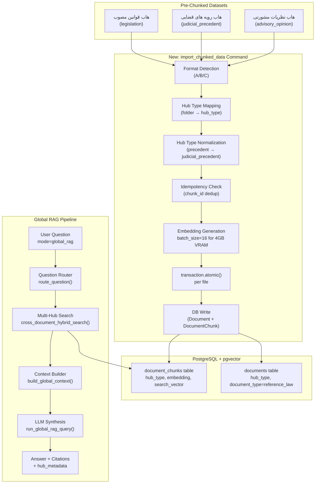

# Phase 2a Completion & Data Injection Plan

## Overview

This plan covers the remaining work to complete Phase 2a (Global RAG Lite) and inject the 6 pre-chunked Persian legal datasets into the 3 knowledge hubs.

## Current State Assessment

### ✅ Already Implemented (Phase 2a Code)
| Component | Status | File |
|-----------|--------|------|
| `hub_type` on `Document` model | ✅ Done | [`src/backend/documents/models.py:79`](../src/backend/documents/models.py:79) |
| `hub_type` on `DocumentChunk` model | ✅ Done | [`src/backend/documents/models.py:153`](../src/backend/documents/models.py:153) |
| `hub_metadata` on `Message` model | ✅ Done | [`src/backend/conversations/models.py:52`](../src/backend/conversations/models.py:52) |
| Question Router (`route_question()`) | ✅ Done | [`src/backend/conversations/question_router.py`](../src/backend/conversations/question_router.py) |
| Global RAG Service (`run_global_rag_query()`) | ✅ Done | [`src/backend/conversations/global_rag_service.py`](../src/backend/conversations/global_rag_service.py) |
| Cross-document hybrid search | ✅ Done | [`src/backend/documents/services/search_service.py:1287`](../src/backend/documents/services/search_service.py:1287) |
| Views with `mode="global_rag"` support | ✅ Done | [`src/backend/conversations/views.py:348`](../src/backend/conversations/views.py:348) |
| Serializers with `mode` field + `hub_metadata` | ✅ Done | [`src/backend/conversations/serializers.py:202`](../src/backend/conversations/serializers.py:202) |
| `import_reference_laws` command (raw text format) | ✅ Done | [`src/backend/documents/management/commands/import_reference_laws.py`](../src/backend/documents/management/commands/import_reference_laws.py) |
| Tests for Global RAG Service | ✅ Done | [`src/backend/conversations/tests/test_global_rag_service.py`](../src/backend/conversations/tests/test_global_rag_service.py) |
| Tests for Question Router | ✅ Done | [`src/backend/conversations/tests/test_question_router.py`](../src/backend/conversations/tests/test_question_router.py) |
| Tests for import command | ✅ Done | [`src/backend/documents/tests/test_import_reference_laws.py`](../src/backend/documents/tests/test_import_reference_laws.py) |

### ❌ Remaining Work
| Component | Status | Details |
|-----------|--------|---------|
| Pre-chunked data ingestion command | ❌ Missing | Need new command for pre-chunked JSON format |
| Data injection into hubs | ❌ Not Run | 6 JSON files need to be ingested |
| Pending DB migrations | ❌ Unknown | Need to check if migrations are up-to-date |
| Run existing tests | ❌ Not Run | Need to verify all tests pass |
| Update reference docs | ❌ Not Done | `api-registry.md` and `database-schema.md` need updates |

## Chunked Dataset Structure Analysis

### Folder → Hub Type Mapping
| Folder Name | Hub Type | Files |
|-------------|----------|-------|
| `هاب قوانین مصوب` | `legislation` | `chunks_قوانین_مهم.json`, `chunks_قانون_مجازات_اسلامی.json` |
| `هاب رویه های قضایی` | `judicial_precedent` | `chunks_آرای_وحدت_رویه.json`, `chunks_آرای_هیئت_عمومی_دیوان_عدالت_اداری.json` |
| `هاب نظریات مشورتی و رویه عملی` | `advisory_opinion` | `chunks_مشروح_نشست_های_قضایی.json`, `chunks_نظرات_مشورتی.json` |

### Format A — Legislation Hub (2 files)
```json
{
  "source_file": "قانون مجازات اسلامی.json",
  "total_chunks": 1018,
  "chunks": [
    {
      "chunk_id": "madde_1_اول_ـ_كليات",
      "madde_number": 1,
      "madde_raw": "ماده 1 ...",
      "text": "ماده 1 ...",
      "metadata": {
        "source": "قانون مجازات اسلامي",
        "hub_type": "legislation",
        "summary": "...",
        "approval_authority": "...",
        "approval_date": "1392/02/01",
        "status": "معتبر",
        "kitab": "كتاب اول ـ كليات",
        "bakhsh": "بخش اول ـ مواد عمومي",
        "fasl": "فصل اول ـ تعاريف",
        "char_count": 164,
        "line_count": 1
      }
    }
  ]
}
```
- **Structure**: Object with `source_file`, `total_chunks`, `chunks` array
- **Each chunk**: Has `chunk_id`, `madde_number`, `madde_raw`, `text`, `metadata`
- **Metadata**: Contains `hub_type: "legislation"` (matches expected value)

### Format B — Precedent Hub (2 files)
```json
[
  {
    "text": "رای شماره ...",
    "chunk_type": "header",
    "section_name": null,
    "full_title": "...",
    "metadata": {
      "judgment_number": "140331390003018107",
      "issue_date": "1403/12/14",
      "court": "هیات عمومی دیوان عدالت اداری",
      "url": "...",
      "hub_type": "precedent"
    }
  }
]
```
- **Structure**: Flat array of chunk objects
- **Each chunk**: Has `text`, `chunk_type`, `section_name`, `full_title`, `metadata`
- **⚠️ Issue**: `hub_type` value is `"precedent"` but model expects `"judicial_precedent"`

### Format C — Advisory Hub (2 files)
```json
[
  {
    "chunk_id": "7/1403/878_metadata",
    "opinion_number": "7/1403/878",
    "issue_date": "1404/02/23",
    "source_type": "اداره حقوقی",
    "chunk_type": "metadata",
    "position": 1,
    "text": "نظریه مشورتی شماره ...",
    "url": "...",
    "parent_title": "...",
    "record_index": 0
  }
]
```
- **Structure**: Flat array of chunk objects
- **Each chunk**: Has `chunk_id`, `opinion_number`, `issue_date`, `source_type`, `chunk_type`, `position`, `text`, `url`, `parent_title`, `record_index`
- **No `hub_type` in metadata** — must be inferred from folder name

## Implementation Steps

### Step 1: Create `import_chunked_data` Management Command

**File**: [`src/backend/documents/management/commands/import_chunked_data.py`](../src/backend/documents/management/commands/import_chunked_data.py)

**Purpose**: A new management command specifically designed to ingest the pre-chunked JSON datasets. This is cleaner than modifying the existing `import_reference_laws` command because the data formats are fundamentally different.

**Key Design Decisions**:
1. **Folder-based hub mapping**: The command accepts a `--data-dir` pointing to the root of `chunked_datasets`, and maps subdirectory names to hub types via a configurable mapping.
2. **Format detection**: Auto-detects Format A (legislation object structure) vs Format B/C (flat array structure) by checking if the JSON root is an object with a `"chunks"` key or an array.
3. **Hub type normalization**: Maps `"precedent"` → `"judicial_precedent"` during ingestion.
4. **No re-chunking**: Since data is already chunked, the command skips `ChunkingService.chunk_text()` entirely.
5. **Embedding generation**: Uses `batch_generate_embeddings()` on the `text` field of each chunk. Batch size optimized for bge-m3 on 4GB VRAM.
6. **Document grouping**: For Format A, each file becomes one Document with many chunks. For Format B/C, chunks are grouped by `full_title` (or `parent_title`) to form logical Documents.

**Command Interface**:
```bash
# Ingest all 6 files from the chunked_datasets directory
docker-compose exec backend python manage.py import_chunked_data \
  --data-dir /path/to/chunked_datasets

# Dry-run to preview
docker-compose exec backend python manage.py import_chunked_data \
  --data-dir /path/to/chunked_datasets --dry-run

# Specify owner user
docker-compose exec backend python manage.py import_chunked_data \
  --data-dir /path/to/chunked_datasets --user-id <UUID>
```

**Folder-to-Hub Mapping Logic**:
```python
FOLDER_HUB_MAP = {
    "هاب قوانین مصوب": "legislation",
    "هاب رویه های قضایی": "judicial_precedent",
    "هاب نظریات مشورتی و رویه عملی": "advisory_opinion",
}
```

**Format Detection Logic**:
```python
def detect_format(data):
    if isinstance(data, dict) and "chunks" in data:
        return "format_a"  # Legislation: {source_file, total_chunks, chunks: [...]}
    elif isinstance(data, list):
        return "format_b"  # Precedent/Advisory: [{text, chunk_type, ...}]
    else:
        raise ValueError("Unknown data format")
```

**Hub Type Normalization**:
```python
HUB_TYPE_ALIASES = {
    "precedent": "judicial_precedent",
    "judicial_precedent": "judicial_precedent",
    "legislation": "legislation",
    "advisory_opinion": "advisory_opinion",
    "advisory": "advisory_opinion",
}
```

**Idempotency via `chunk_id`** (Modification #1):
Each chunk in the datasets has a unique identifier (`chunk_id` for Format A/C, `judgment_number + chunk_type` for Format B). The command will:
1. Check if a `DocumentChunk` with matching `metadata__chunk_id` already exists
2. If yes: skip (or update if `--update` flag is passed)
3. If no: create new

```python
def _chunk_exists(chunk_id: str) -> bool:
    return DocumentChunk.objects.filter(
        metadata__chunk_id=chunk_id
    ).exists()
```

**Transactional Integrity per File** (Modification #2):
Each JSON file's entire ingestion is wrapped in `transaction.atomic()`. If any chunk fails (e.g., embedding error), the entire file's changes are rolled back — no partial state.

```python
for file_path in file_paths:
    try:
        with transaction.atomic():
            self._process_file(file_path, ...)
    except Exception as e:
        stats.errors.append(f"File {file_path} failed, rolled back: {e}")
```

**Optimized Embedding Batch Size for bge-m3 on 4GB VRAM** (Modification #3):
The embedding batch size must be tuned for the bge-m3 model running on 4GB VRAM. Based on bge-m3's memory profile (~2.5GB model load + ~1.5GB for compute):

- **Recommended batch size**: `B = 16` (conservative, safe for 4GB VRAM)
- The command will accept `--embedding-batch-size` (default: 16) to allow tuning
- This is passed to `batch_generate_embeddings()` which already handles sub-batching

```python
parser.add_argument(
    "--embedding-batch-size",
    type=int,
    default=16,
    help="Batch size for embedding generation (bge-m3 on 4GB VRAM: 16).",
)
```

### Step 2: Write Tests for `import_chunked_data` Command

**File**: [`src/backend/documents/tests/test_import_chunked_data.py`](../src/backend/documents/tests/test_import_chunked_data.py)

**Test Cases**:
1. **Format A ingestion** — Validates that legislation JSON (object with `chunks` array) creates correct Document + DocumentChunk records
2. **Format B ingestion** — Validates that precedent JSON (flat array) creates correct records with hub type normalization
3. **Format C ingestion** — Validates that advisory JSON creates correct records with folder-based hub type
4. **Folder-to-hub mapping** — Tests all 3 folder name mappings
5. **Hub type normalization** — Tests `"precedent"` → `"judicial_precedent"` mapping
6. **Dry-run mode** — Validates no DB writes in dry-run
7. **Embedding generation** — Tests that embeddings are generated for each chunk
8. **Error handling** — Invalid JSON, missing fields, unknown folder names
9. **Idempotency** — Running the same command twice does not create duplicate chunks (Modification #1)
10. **Transactional rollback** — If a file fails mid-way, no partial data remains (Modification #2)
11. **Missing `text` field** — Validates that a `ValueError` is raised with a meaningful message when a chunk lacks the `text` field (Modification #4)

### Step 3: Run Pending Migrations

```bash
docker-compose exec backend python manage.py migrate
```

Check if any migrations are pending. If the `hub_type` columns were added via raw SQL (as indicated in `wip-context.md`), they may already be fake-applied. Verify with:
```bash
docker-compose exec backend python manage.py showmigrations
```

### Step 4: Run Existing Tests

Run all existing Phase 2a tests to verify nothing is broken:
```bash
docker-compose exec backend pytest documents/tests/test_import_reference_laws.py -v
docker-compose exec backend pytest conversations/tests/test_global_rag_service.py -v
docker-compose exec backend pytest conversations/tests/test_question_router.py -v
```

### Step 5: Inject Data into Hubs

```bash
# Copy chunked datasets into the container first
docker cp C:/Users/starlap/Desktop/chunked_datasets docuchat_backend:/data/chunked_datasets

# Dry-run first to validate
docker-compose exec backend python manage.py import_chunked_data \
  --data-dir /data/chunked_datasets --dry-run

# Actual import (batch size 16 for bge-m3 on 4GB VRAM)
docker-compose exec backend python manage.py import_chunked_data \
  --data-dir /data/chunked_datasets --embedding-batch-size 16
```

### Step 6: Verify Data Injection

Verify the data was correctly injected:
```bash
# Check document counts per hub
docker-compose exec backend python -c "
from documents.models import Document
for hub in ['legislation', 'judicial_precedent', 'advisory_opinion']:
    count = Document.objects.filter(hub_type=hub).count()
    chunk_count = sum(d.total_chunks for d in Document.objects.filter(hub_type=hub))
    print(f'{hub}: {count} documents, {chunk_count} chunks')
"
```

### Step 7: Update Reference Documentation

1. **Update [`docs/references/database-schema.md`](../docs/references/database-schema.md)**:
   - Document the `import_chunked_data` command
   - Note the pre-chunked data formats and folder-to-hub mapping

2. **Update [`docs/references/api-registry.md`](../docs/references/api-registry.md)**:
   - Document the `mode="global_rag"` parameter for conversation endpoints
   - Document `hub_metadata` in response format

3. **Update [`docs/active-task/wip-context.md`](../docs/active-task/wip-context.md)**:
   - Record completion of data injection
   - Note any issues encountered

### Step 8: End-to-End Verification

Test the full Global RAG pipeline:
1. Send a question with `mode="global_rag"` via the API
2. Verify the response includes citations from multiple hubs
3. Verify `hub_metadata` is present in the assistant message

## Architecture Diagram



## Data Format Mapping

| Chunked Data Field | Document Model Field | DocumentChunk Model Field | Notes |
|-------------------|---------------------|--------------------------|-------|
| `text` | — | `content` | Primary text content |
| `metadata.hub_type` | `hub_type` | `hub_type` | Normalized via `HUB_TYPE_ALIASES` |
| `metadata.source` | `title` | — | Used as document title |
| `metadata` (all) | — | `metadata` (JSONB) | Stored as-is |
| `metadata.summary` | — | `metadata.summary` | Persian summary |
| `metadata.approval_date` | — | `approval_date` | Denormalized for filtering |
| `metadata.status` | — | `legal_status` | Denormalized for filtering |
| `metadata.source` | — | `law_name` | Denormalized for filtering |
| `chunk_id` | — | `metadata.chunk_id` | Original chunk identifier (used for idempotency) |
| `chunk_type` | — | `metadata.chunk_type` | e.g., header, section, question, answer |
| Folder name | `hub_type` | `hub_type` | Primary hub type source (Format B/C) |

## Risk Assessment

| Risk | Impact | Mitigation |
|------|--------|------------|
| Embedding API rate limits / VRAM OOM | Medium | Batch size 16 for bge-m3 on 4GB VRAM; `batch_generate_embeddings` with sub-batching |
| Hub type mismatch (`precedent` vs `judicial_precedent`) | Low | Normalization mapping in the command |
| Large file sizes (70K+ lines for advisory opinions) | Low | Stream processing, no full-file loading issues |
| Duplicate data on re-run | Low | Idempotency check via `chunk_id` before insert |
| Partial file ingestion on crash | Low | `transaction.atomic()` per file ensures rollback |
| Migration state inconsistency | Medium | Check with `showmigrations` before running |

## Execution Order

1. **Step 1**: Create `import_chunked_data` management command
2. **Step 2**: Write tests for the new command
3. **Step 3**: Run pending migrations
4. **Step 4**: Run all existing tests
5. **Step 5**: Inject data into hubs (dry-run first, then actual)
6. **Step 6**: Verify data injection
7. **Step 7**: Update reference documentation
8. **Step 8**: End-to-end verification
