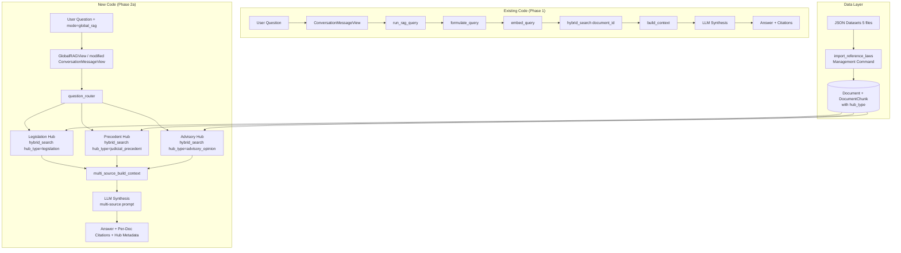

# Phase 2a Implementation Plan — Global RAG (Lite)

## Overview

Transform the system from single-document Q&A to a **multi-hub legal researcher**. Users ask legal questions in Persian, and the system queries three specialized legal knowledge hubs in parallel, then synthesizes a comprehensive answer with precise citations.

**Mode:** `mode: "global_rag"` parameter enables multi-hub mode (backward compatible).

---

## Architecture Diagram



---

## Step-by-Step Implementation Tasks

### Step 1: Database Schema Changes — Add `hub_type` Fields

**Files to modify:**
- [`src/backend/documents/models.py`](src/backend/documents/models.py)
- [`docs/references/database-schema.md`](docs/references/database-schema.md)

**Changes:**

1. **`Document` model** — Add `hub_type` field:
   ```python
   HUB_TYPE_CHOICES = [
       (None, 'Not a reference document'),
       ('legislation', 'Legislation - قوانین مصوب'),
       ('judicial_precedent', 'Judicial Precedent - رویه‌های قضایی'),
       ('advisory_opinion', 'Advisory Opinions - نظریات مشورتی'),
   ]
   hub_type = models.CharField(
       max_length=50, null=True, blank=True, db_index=True,
       choices=HUB_TYPE_CHOICES,
       help_text="Legal hub type for reference law documents.",
   )
   ```

2. **`DocumentChunk` model** — Add denormalized `hub_type` field:
   ```python
   hub_type = models.CharField(
       max_length=50, null=True, blank=True, db_index=True,
       help_text="Denormalized hub type for efficient per-hub filtering.",
   )
   ```

3. **Generate migration**: `python manage.py makemigrations documents`

4. **Update** [`docs/references/database-schema.md`](docs/references/database-schema.md) with new columns.

### Step 2: Add `hub_metadata` to `Message` Model

**Files to modify:**
- [`src/backend/conversations/models.py`](src/backend/conversations/models.py)
- [`docs/references/database-schema.md`](docs/references/database-schema.md)

**Changes:**

1. **`Message` model** — Add `hub_metadata` JSONB field:
   ```python
   hub_metadata = models.JSONField(null=True, blank=True, default=None)
   ```

2. **Generate migration**: `python manage.py makemigrations conversations`

3. **Update** [`docs/references/database-schema.md`](docs/references/database-schema.md).

### Step 3: Create JSON Ingestion Management Command

**New file:** [`src/backend/documents/management/commands/import_reference_laws.py`](src/backend/documents/management/commands/import_reference_laws.py)

**Purpose:** Import 5 JSON dataset files → create `Document` (one per record) + `DocumentChunk` with proper chunking.

**Command signature:**
```bash
python manage.py import_reference_laws --data-dir "C:\Users\starlap\Desktop\دیتا ست ها"
```

**Logic:**
1. Scan `--data-dir` for JSON files matching known patterns.
2. For each JSON file, determine `hub_type` from filename:
   - `قوانین مهم.json` → `legislation`
   - `آرای وحدت رویه.json` → `judicial_precedent`
   - `آرای هیئت عمومی دیوان عدالت اداری.json` → `judicial_precedent`
   - `نظرات مشورتی اداره کل حقوقی.json` → `advisory_opinion`
   - `مشروح نشست های قضایی.json` → `advisory_opinion`
3. For each record in the JSON array:
   - Create a `Document` with `document_type='reference_law'`, `hub_type=<detected>`, `user=<admin/superuser>`, `status='completed'`, `processing_status='completed'`.
   - Extract text content from the record (handle varying JSON structures).
   - Call `ChunkingService.chunk_text()` to split into chunks.
   - Create `DocumentChunk` records with `hub_type` set.
   - Generate embeddings for all chunks via `batch_generate_embeddings()`.
4. Log summary: how many documents and chunks created per hub.

**JSON structure handling:** The 5 files likely have different schemas. The command should:
- Try common keys: `"text"`, `"content"`, `"متن"`, `"شرح"`, `"رای"`, `"نظر"`.
- Use `title` or `"عنوان"` for document title.
- Fall back to filename + index if no title found.

### Step 4: Create `multi_hub_search()` Function

**New file:** [`src/backend/conversations/global_rag_service.py`](src/backend/conversations/global_rag_service.py)

**Purpose:** Search across all reference documents by hub type, returning labeled chunks.

**Function signature:**
```python
def multi_hub_search(
    query_text: str,
    query_vector: list[float],
    top_k_per_hub: int = 5,
) -> dict[str, list[dict[str, Any]]]:
```

**Logic:**
1. For each hub type (`legislation`, `judicial_precedent`, `advisory_opinion`):
   - Call `hybrid_search()` with `filters={"hub_type": hub_type}`.
   - Note: `hybrid_search` currently filters by `document_id`. We need to modify it (or create a variant) that can search **across all reference documents** of a given hub type, not just a single document.
2. Return `{"legislation": [...], "judicial_precedent": [...], "advisory_opinion": [...]}`.

**Modification to `hybrid_search()`:** The current `hybrid_search()` requires a `document_id`. We need to add an overload or new function `hybrid_search_by_hub(hub_type, query_vector, query_text, top_k)` that:
- Queries `DocumentChunk.objects.filter(hub_type=hub_type, embedding__isnull=False)` instead of filtering by `document_id`.
- Applies the same vector + keyword + trigram RRF fusion logic.

**Alternative approach (less invasive):** Create a new function `cross_document_hybrid_search()` in [`search_service.py`](src/backend/documents/services/search_service.py) that accepts `hub_type` instead of `document_id`.

### Step 5: Create Question Router (LLM)

**New file:** [`src/backend/conversations/question_router.py`](src/backend/conversations/question_router.py)

**Purpose:** LLM decomposes the user's question and routes sub-queries to relevant hubs.

**Function signature:**
```python
@dataclass
class RoutingResult:
    legislation_query: str  # Sub-query for legislation hub (or empty if not relevant)
    precedent_query: str    # Sub-query for judicial precedent hub
    advisory_query: str     # Sub-query for advisory opinions hub
    original_question: str  # The original user question

def route_question(question: str) -> RoutingResult:
```

**Logic:**
1. Call the chat provider with a system prompt that instructs the LLM to:
   - Analyze the user's Persian legal question.
   - Determine which of the 3 legal hubs are relevant.
   - For each relevant hub, generate a focused sub-query optimized for that hub's content type.
   - Output JSON with keys: `legislation_query`, `precedent_query`, `advisory_query`.
   - Empty string for hubs that are not relevant.
2. Parse the JSON response.
3. Fall back to using the original question for all hubs on failure.

**System prompt design:**
```
You are a Persian legal question router. Your task is to analyze a user's legal
question and determine which of three legal knowledge hubs are relevant:

1. Legislation (قوانین مصوب) — Laws passed by the Islamic Consultative Assembly
2. Judicial Precedent (رویه‌های قضایی) — Supreme Court binding precedents and
   Administrative Justice Court rulings
3. Advisory Opinions (نظریات مشورتی) — Legal advisory opinions from the
   Legal Department and judicial meeting minutes

For each relevant hub, generate a focused search query that would retrieve
the most relevant documents from that hub. For hubs that are not relevant,
output an empty string.

Output ONLY valid JSON:
{
  "legislation_query": "...",
  "precedent_query": "...",
  "advisory_query": "..."
}
```

### Step 6: Create Multi-Source Context Builder

**New file:** [`src/backend/conversations/global_rag_service.py`](src/backend/conversations/global_rag_service.py) (same file as Step 4)

**Purpose:** Build a context string where chunks are labeled by hub type + document title.

**Function signature:**
```python
def build_multi_source_context(
    hub_results: dict[str, list[dict[str, Any]]],
    top_k_total: int = 15,
) -> str:
```

**Logic:**
1. Flatten all hub results into a single list, labeling each chunk with:
   - `[Source N | Hub: Legislation | Document: قانون مدنی]`
   - `[Source N | Hub: Judicial Precedent | Document: رأی وحدت رویه شماره...]`
2. Interleave results from different hubs for diversity.
3. Apply token budget trimming (same as `build_context()`).
4. Return formatted context string.

### Step 7: Create Global RAG Synthesis Prompt

**New file:** [`src/backend/conversations/global_rag_service.py`](src/backend/conversations/global_rag_service.py)

**Purpose:** System prompt for the multi-source LLM synthesis.

**Function signature:**
```python
def build_global_rag_system_prompt() -> str:
```

**Prompt content:**
```
You are a Persian legal research assistant (پژوهشگر حقوقی). You have access to
three legal knowledge hubs:

1. **Legislation (قوانین مصوب)** — Official laws passed by the Islamic
   Consultative Assembly.
2. **Judicial Precedent (رویه‌های قضایی)** — Binding precedents from the
   Supreme Court and the Administrative Justice Court.
3. **Advisory Opinions (نظریات مشورتی)** — Legal advisory opinions from the
   Legal Department and judicial meeting minutes.

Answer the user's question based ONLY on the context provided below. The
context includes chunks from one or more hubs, each labeled with [Source N]
and its hub type and document title.

Instructions:
- If the context does not contain enough information, say "I don't have enough
  information to answer that question based on the provided legal references."
- When citing information, ALWAYS include the source number AND the hub type.
  Example: "بر اساس ماده ۲۲ قانون مدنی [Source 1 | Legislation]"
- If multiple hubs provide information on the same topic, synthesize them
  together, noting which hub each piece of information comes from.
- Prioritize Legislation over other hubs in case of conflict (laws supersede
  precedents and opinions).
- Write your answer in formal Persian legal language.
```

### Step 8: Create `run_global_rag_query()` Function

**New file:** [`src/backend/conversations/global_rag_service.py`](src/backend/conversations/global_rag_service.py)

**Purpose:** The main entry point for Global RAG queries (analogous to `run_rag_query()`).

**Function signature:**
```python
def run_global_rag_query(
    question: str,
    conversation_history: list[dict[str, str]] | None = None,
    top_k_per_hub: int = 5,
) -> dict[str, Any]:
```

**Logic:**
1. Call `route_question(question)` to get sub-queries per hub.
2. For each hub with a non-empty sub-query:
   - Call `formulate_query(sub_query)` for HyDE optimization.
   - Call `embed_query(formulation.vector_query)`.
   - Call `multi_hub_search()` with the hub's sub-query.
3. Call `build_multi_source_context()` with all hub results.
4. Build messages array with `build_global_rag_system_prompt()` + history + context.
5. Call chat provider.
6. Extract citations (enhanced to include hub_type and document_title).
7. Return result with `hub_metadata` containing per-hub stats.

**Return dict:**
```python
{
    "content": str,           # The synthesized answer
    "sources": list[dict],    # Enhanced citations with hub_type + document_title
    "token_usage": dict,      # Token usage
    "hub_metadata": {         # NEW: per-hub metadata
        "hubs_queried": ["legislation", "judicial_precedent"],
        "hubs_with_results": ["legislation"],
        "total_chunks_retrieved": 12,
        "per_hub": {
            "legislation": {"chunks": 5, "documents": ["قانون مدنی", ...]},
            ...
        }
    }
}
```

### Step 9: Create Global RAG API Endpoint

**New file:** [`src/backend/conversations/views.py`](src/backend/conversations/views.py) (modify existing)

**Option A (Recommended):** Add `mode` parameter to existing endpoints.

**Modify [`AskQuestionSerializer`](src/backend/conversations/serializers.py):**
```python
mode = serializers.ChoiceField(
    required=False,
    default="local_rag",
    choices=["local_rag", "global_rag"],
    help_text="'local_rag' for single-document Q&A, 'global_rag' for multi-hub legal research.",
)
```

**Modify [`ConversationMessageView.post()`](src/backend/conversations/views.py):**
```python
mode = validated_data.get("mode", "local_rag")
if mode == "global_rag":
    # For global_rag, conversation.document_id is ignored (we search all ref docs)
    result = run_global_rag_query(
        question=question,
        conversation_history=conversation_history,
    )
else:
    result = run_rag_query(
        question=question,
        document_id=str(conversation.document_id),
        conversation_history=conversation_history,
    )
```

**Option B:** Create a separate endpoint `POST /conversations/{id}/global-query/`.

**Recommendation:** Option A is cleaner — the `mode` parameter is simpler for the frontend.

### Step 10: Update Serializers for `hub_metadata`

**Modify [`MessageSerializer`](src/backend/conversations/serializers.py):**
```python
hub_metadata = serializers.JSONField(
    read_only=True,
    allow_null=True,
    help_text="Multi-hub query metadata for global RAG responses.",
)
```

### Step 11: Update API Registry

**Modify [`docs/references/api-registry.md`](docs/references/api-registry.md):**
- Document the new `mode` parameter on existing endpoints.
- Document the new `hub_metadata` field in responses.
- Document the new `import_reference_laws` management command.

### Step 12: Write Tests

**New test files:**
- [`src/backend/conversations/tests/test_global_rag_service.py`](src/backend/conversations/tests/test_global_rag_service.py)
- [`src/backend/conversations/tests/test_question_router.py`](src/backend/conversations/tests/test_question_router.py)
- [`src/backend/documents/tests/test_import_reference_laws.py`](src/backend/documents/tests/test_import_reference_laws.py)

**Test coverage:**
1. `test_question_router.py`:
   - Test routing a legislation-only question.
   - Test routing a precedent-only question.
   - Test routing a multi-hub question.
   - Test fallback on LLM failure.
2. `test_global_rag_service.py`:
   - Test `multi_hub_search()` returns correct hub types.
   - Test `build_multi_source_context()` labels chunks correctly.
   - Test `run_global_rag_query()` end-to-end with mocked LLM.
3. `test_import_reference_laws.py`:
   - Test JSON parsing with different structures.
   - Test hub type detection from filename.
   - Test document creation and chunking.

---

## File Change Summary

| File | Action | Description |
|------|--------|-------------|
| `src/backend/documents/models.py` | Modify | Add `hub_type` to `Document` and `DocumentChunk` |
| `src/backend/conversations/models.py` | Modify | Add `hub_metadata` to `Message` |
| `src/backend/documents/management/commands/import_reference_laws.py` | **Create** | JSON ingestion management command |
| `src/backend/documents/services/search_service.py` | Modify | Add `cross_document_hybrid_search()` by hub_type |
| `src/backend/conversations/question_router.py` | **Create** | LLM question routing logic |
| `src/backend/conversations/global_rag_service.py` | **Create** | Multi-hub search, context builder, synthesis |
| `src/backend/conversations/rag_service.py` | No change | Backward compatible |
| `src/backend/conversations/serializers.py` | Modify | Add `mode` to `AskQuestionSerializer`, `hub_metadata` to `MessageSerializer` |
| `src/backend/conversations/views.py` | Modify | Route to `run_global_rag_query()` when `mode="global_rag"` |
| `src/backend/conversations/urls.py` | No change | Reuses existing routes |
| `docs/references/database-schema.md` | Modify | Add `hub_type` and `hub_metadata` columns |
| `docs/references/api-registry.md` | Modify | Document new mode parameter and hub_metadata |
| `docs/active-task/wip-context.md` | Modify | Update after each step |

---

## Execution Order

1. **Step 1** → DB schema: add `hub_type` to `Document` + `DocumentChunk`, generate migration
2. **Step 2** → DB schema: add `hub_metadata` to `Message`, generate migration
3. **Step 3** → Ingestion command: `import_reference_laws`
4. **Step 4** → Search: `cross_document_hybrid_search()` in `search_service.py`
5. **Step 5** → Router: `question_router.py`
6. **Step 6** → Context: `build_multi_source_context()` in `global_rag_service.py`
7. **Step 7** → Prompt: `build_global_rag_system_prompt()` in `global_rag_service.py`
8. **Step 8** → Main entry: `run_global_rag_query()` in `global_rag_service.py`
9. **Step 9** → API: modify serializers + views for `mode` parameter
10. **Step 10** → Serializers: add `hub_metadata` to `MessageSerializer`
11. **Step 11** → Docs: update `api-registry.md` and `database-schema.md`
12. **Step 12** → Tests: write tests for all new functionality
13. **Run migrations** → `docker-compose exec backend python manage.py migrate`
14. **Ingest data** → `docker-compose exec backend python manage.py import_reference_laws --data-dir "C:\Users\starlap\Desktop\دیتا ست ها"`
15. **Run tests** → `docker-compose exec backend pytest`

---

## Key Design Decisions

1. **Backward compatibility**: All existing Phase 1 functionality remains unchanged. The `mode` parameter defaults to `"local_rag"`.
2. **No new Conversation model changes**: Global RAG conversations still have a `document_id` FK, but it's ignored when `mode="global_rag"`. This avoids complex migration of existing conversations.
3. **Denormalized `hub_type` on chunks**: Enables efficient per-hub filtering without JOINs.
4. **Separate service file**: `global_rag_service.py` keeps the new multi-hub logic isolated from the existing single-document RAG service.
5. **LLM routing**: The question router is a lightweight LLM call (similar to `formulate_query`), not a complex classifier. It falls back gracefully.
