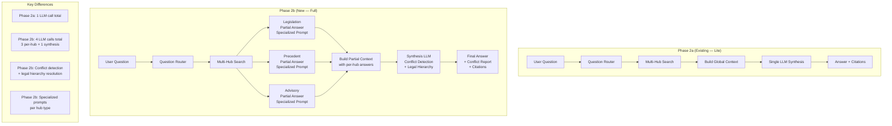

# Phase 2b Implementation Plan — Global RAG (Full)

## Overview

Transform the Global RAG pipeline from a **single-pass synthesis** (Phase 2a — Lite) to a **per-hub partial answer + synthesis** architecture (Phase 2b — Full). Each hub generates its own specialized answer using a tailored prompt, then a synthesis step merges them with conflict detection and legal hierarchy resolution.

**Current Architecture (Phase 2a — Lite):**
```
User Question → Route → Search All Hubs → Build Context → Single LLM Call → Answer
```

**Target Architecture (Phase 2b — Full):**
```
User Question → Route → Search All Hubs → Per-Hub Partial Answers (3 LLM calls) 
    → Build Partial Context → Synthesis LLM Call (conflict detection + merge) → Final Answer
```

---

## Architecture Diagram



---

## Step-by-Step Implementation Tasks

### Step 1: Create Per-Hub Specialized Prompts

**File:** [`src/backend/conversations/global_rag_service.py`](src/backend/conversations/global_rag_service.py)

**What:** Add three specialized system prompts, one for each hub type. Each prompt instructs the LLM to act as a specialist in that legal domain and produce a **partial answer** focused only on that hub's data.

**New functions to add:**

1. **`build_hub_system_prompt(hub_type: str) -> str`** — Returns a specialized prompt for the given hub type.

   - **`legislation` prompt:** "You are a Persian legal legislation specialist. Your task is to answer the user's question based ONLY on the legislation context provided below. Cite specific article numbers, law names, and chapter references. If the legislation does not contain enough information, say so clearly. Answer in formal Persian legal language."

   - **`judicial_precedent` prompt:** "You are a Persian judicial precedent specialist. Your task is to answer the user's question based ONLY on the judicial precedent context provided below. Cite specific judgment numbers, court names, and dates. If the precedent does not contain enough information, say so clearly. Answer in formal Persian legal language."

   - **`advisory_opinion` prompt:** "You are a Persian legal advisory opinion specialist. Your task is to answer the user's question based ONLY on the advisory opinion context provided below. Cite specific opinion numbers, issuing authorities, and dates. If the advisory opinions do not contain enough information, say so clearly. Answer in formal Persian legal language."

2. **`build_synthesis_system_prompt() -> str`** — Returns the synthesis prompt that:
   - Instructs the LLM to merge partial answers from all three hubs
   - Detects conflicts/contradictions between hubs
   - Resolves conflicts using legal hierarchy: Legislation > Judicial Precedent > Advisory Opinions
   - Reports conflicts explicitly with a `[Conflict]` marker
   - Produces a final comprehensive answer in Persian

**Design Notes:**
- Each per-hub prompt includes the **original user question** plus the hub's context chunks
- The synthesis prompt receives **all three partial answers** (not the raw chunks) plus the original question
- This reduces token usage in the synthesis step since partial answers are already condensed

---

### Step 2: Implement Per-Hub Partial Answer Generation

**File:** [`src/backend/conversations/global_rag_service.py`](src/backend/conversations/global_rag_service.py)

**New function:** `generate_hub_partial_answer(hub_type: str, question: str, chunks: list[dict]) -> dict`

**Logic:**
1. Build a mini-context from the hub's chunks using `build_global_context()` (but only for one hub)
2. Build the specialized system prompt for this hub type
3. Call the chat provider with:
   - System: hub-specific prompt
   - User: `"Context:\n{context}\n\nQuestion: {question}"`
4. Return dict with keys: `content` (partial answer), `token_usage`, `chunks_used`

**Error handling:**
- If the hub has no chunks, return a partial answer saying "No relevant information found in this hub."
- If the LLM call fails, log the error and return a partial answer with an error note (don't fail the entire pipeline)

---

### Step 3: Implement Answer Synthesis with Conflict Detection

**File:** [`src/backend/conversations/global_rag_service.py`](src/backend/conversations/global_rag_service.py)

**New function:** `synthesize_answers(question: str, partial_answers: dict[str, dict], hub_results: dict[str, dict]) -> dict`

**Logic:**
1. Build a synthesis context from the partial answers:
   ```
   === [Legislation — قوانین مصوب] ===
   {partial answer from legislation hub}

   === [Judicial Precedent — رویه‌های قضایی] ===
   {partial answer from judicial_precedent hub}

   === [Advisory Opinions — نظریات مشورتی] ===
   {partial answer from advisory_opinion hub}
   ```
2. Build the synthesis system prompt
3. Call the chat provider with:
   - System: synthesis prompt
   - User: `"Partial Answers:\n{synthesis_context}\n\nOriginal Question: {question}"`
4. Extract citations from the final answer (using existing `extract_citations`)
5. Return dict with keys: `content` (final answer), `token_usage`, `sources`

**Conflict Detection Strategy:**
- The synthesis prompt explicitly asks the LLM to identify contradictions
- Conflicts are marked with `[Conflict]` in the answer text
- Legal hierarchy for resolution: Legislation (highest) > Judicial Precedent > Advisory Opinions (lowest)
- If a conflict is detected, the answer explains both positions and states which prevails

---

### Step 4: Refactor `run_global_rag_query()` for Phase 2b

**File:** [`src/backend/conversations/global_rag_service.py`](src/backend/conversations/global_rag_service.py)

**Modify** the existing `run_global_rag_query()` function to:

1. **Route** the question (same as Phase 2a) — unchanged
2. **Search** each relevant hub (same as Phase 2a) — unchanged
3. **Generate per-hub partial answers** (NEW) — call `generate_hub_partial_answer()` for each hub that has chunks
4. **Synthesize** partial answers (NEW) — call `synthesize_answers()`
5. **Extract citations** from the final answer (same as Phase 2a)
6. **Return** result with `content`, `sources`, `token_usage`, `hub_metadata`, `partial_answers` (NEW field)

**New field in return dict:**
- `partial_answers` (dict[str, dict]) — Stores each hub's partial answer content and token usage for transparency/debugging

**Token Budget Considerations:**
- Phase 2b uses 4 LLM calls instead of 1
- Each per-hub call uses a smaller context (only that hub's chunks)
- The synthesis call uses condensed partial answers instead of raw chunks
- Total token usage may be similar or slightly higher, but quality should improve significantly

---

### Step 5: Update `hub_metadata` to Include Partial Answers

**File:** [`src/backend/conversations/global_rag_service.py`](src/backend/conversations/global_rag_service.py)

**Modify** the `hub_metadata` construction in `run_global_rag_query()` to include:
- `partial_answer` (str) — The partial answer generated for this hub
- `partial_answer_token_usage` (dict) — Token usage for this hub's partial answer generation

This enables the frontend to display per-hub answers if desired, and provides full transparency.

---

### Step 6: Update API Response Serializer

**File:** [`src/backend/conversations/serializers.py`](src/backend/conversations/serializers.py)

**Modify** `MessageSerializer` to include the new `partial_answers` field in the response when `mode == "global_rag"`.

**Add field:**
```python
partial_answers = serializers.JSONField(read_only=True, required=False)
```

**Note:** The `partial_answers` data is stored in `hub_metadata` on the `Message` model, so no new database migration is needed. The serializer reads it from the message's `hub_metadata` field.

---

### Step 7: Update Frontend to Display Per-Hub Answers (Optional Enhancement)

**File:** [`src/frontend/src/components/chat/MessageBubble.tsx`](src/frontend/src/components/chat/MessageBubble.tsx)

**What:** If the message has `hub_metadata` with `partial_answers`, display collapsible sections showing each hub's partial answer alongside the final synthesis.

**Design:**
- Show the final synthesized answer as the main message content
- Below the answer, show a "Partial Answers" expandable section
- Inside, show each hub's partial answer in a labeled card with hub icon/color
- Legislation: blue, Judicial Precedent: green, Advisory Opinions: orange

**Note:** This is a visual enhancement. The core functionality works without it. Mark as **optional** — can be deferred.

---

### Step 8: Write Tests

**File:** [`src/backend/conversations/tests/test_global_rag_service.py`](src/backend/conversations/tests/test_global_rag_service.py)

**New test classes to add:**

1. **`BuildHubSystemPromptTests`**
   - `test_legislation_prompt_contains_specialized_instructions`
   - `test_judicial_precedent_prompt_contains_specialized_instructions`
   - `test_advisory_opinion_prompt_contains_specialized_instructions`
   - `test_synthesis_prompt_contains_conflict_detection_instructions`
   - `test_synthesis_prompt_contains_legal_hierarchy`

2. **`GenerateHubPartialAnswerTests`**
   - `test_generates_partial_answer_for_hub_with_chunks` (mock LLM)
   - `test_returns_empty_answer_for_hub_with_no_chunks`
   - `test_handles_llm_error_gracefully`
   - `test_uses_correct_system_prompt_per_hub_type`

3. **`SynthesizeAnswersTests`**
   - `test_merges_partial_answers_into_final_answer` (mock LLM)
   - `test_detects_conflicts_between_hubs` (mock LLM to return conflict)
   - `test_handles_single_hub_synthesis`
   - `test_handles_all_hubs_empty`

4. **`RunGlobalRagQueryPhase2bTests`**
   - `test_full_pipeline_generates_partial_answers` (mock all dependencies)
   - `test_partial_answers_included_in_hub_metadata`
   - `test_token_usage_includes_all_llm_calls`
   - `test_backward_compatible_with_phase_2a_response_format`

**Test count:** ~15 new tests

---

### Step 9: Update Reference Documentation

**Files to update:**
- [`docs/references/api-registry.md`](docs/references/api-registry.md) — Document the new `partial_answers` field in the Global RAG response
- [`docs/references/database-schema.md`](docs/references/database-schema.md) — No schema changes needed (uses existing `hub_metadata` JSONB field)
- [`docs/active-task/wip-context.md`](docs/active-task/wip-context.md) — Record Phase 2b completion

---

## Implementation Order

| Step | Description | Files | Dependencies |
|------|-------------|-------|-------------|
| 1 | Create per-hub specialized prompts | `global_rag_service.py` | None |
| 2 | Implement per-hub partial answer generation | `global_rag_service.py` | Step 1 |
| 3 | Implement answer synthesis with conflict detection | `global_rag_service.py` | Step 1, 2 |
| 4 | Refactor `run_global_rag_query()` | `global_rag_service.py` | Step 2, 3 |
| 5 | Update `hub_metadata` with partial answers | `global_rag_service.py` | Step 4 |
| 6 | Update API response serializer | `serializers.py` | Step 5 |
| 7 | Update frontend (optional) | `MessageBubble.tsx` | Step 6 |
| 8 | Write tests | `test_global_rag_service.py` | Step 1-5 |
| 9 | Update reference docs | `api-registry.md`, `wip-context.md` | Step 8 |

---

## Key Design Decisions

### Why 4 LLM calls instead of 1?
- **Quality:** Each hub specialist focuses only on its domain, producing more accurate and detailed answers
- **Conflict detection:** The synthesis step explicitly compares answers, catching contradictions that a single-pass approach would miss
- **Traceability:** Partial answers can be inspected independently for debugging or transparency

### Why not use the existing `build_global_context()` for partial answers?
- The existing function builds a combined context from all hubs. For per-hub answers, we need a **single-hub context** built from only that hub's chunks.
- We can reuse `build_global_context()` by passing a `hub_results` dict with only one hub's data.

### Conflict Detection Approach
- **LLM-based** (not rule-based): The synthesis prompt instructs the LLM to detect and report conflicts
- **Legal hierarchy:** Legislation > Judicial Precedent > Advisory Opinions
- **Explicit markers:** `[Conflict]` in the answer text makes conflicts visible to the user
- **Future enhancement:** Could add rule-based conflict detection for specific known contradictions (e.g., law vs. unified precedent)

### Token Usage Impact
- Phase 2a: 1 LLM call with large context (all hub chunks)
- Phase 2b: 3 small-context calls (per-hub) + 1 small-context call (partial answers)
- Net effect: Similar or slightly higher total tokens, but much better quality since each call has focused context

---

## Rollback Strategy

If Phase 2b causes issues:
1. The `mode` parameter (`local_rag` vs `global_rag`) provides clean separation
2. To revert to Phase 2a behavior, simply restore the old `run_global_rag_query()` implementation
3. The old `build_global_system_prompt()` and `build_global_context()` functions remain unchanged and can be reused
4. All existing Phase 2a tests continue to pass (backward compatibility is maintained)
