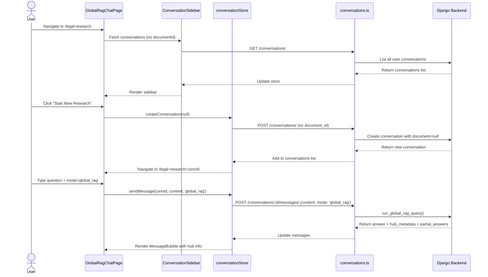
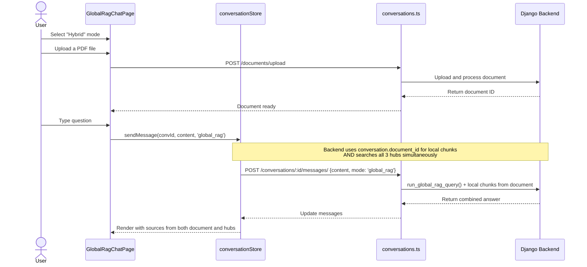

# Phase 3 — Frontend UI Refactoring & Global RAG Chat Interface

## Overview

This plan covers the complete frontend UI refactoring needed to properly support the Global RAG (Phase 2) system. The backend is fully implemented (Phase 2a + 2b completed), but the frontend still only supports **document-scoped chat** (`/documents/:documentId/chat`). There is no dedicated **Global RAG chat page** where users can ask Persian legal questions across all 3 hubs without selecting a document first.

Additionally, we need a **hybrid mode** for power users who want to upload a document AND query the Global RAG hubs simultaneously.

---

## Current State Assessment

### ✅ Backend — Fully Implemented (No changes needed)

| Component | Status | File |
|-----------|--------|------|
| `mode="global_rag"` in `AskQuestionSerializer` | ✅ Done | [`src/backend/conversations/serializers.py:202`](../src/backend/conversations/serializers.py:202) |
| `run_global_rag_query()` with Phase 2b (per-hub + synthesis) | ✅ Done | [`src/backend/conversations/global_rag_service.py`](../src/backend/conversations/global_rag_service.py) |
| `hub_metadata` + `partial_answers` in response | ✅ Done | [`src/backend/conversations/serializers.py:45`](../src/backend/conversations/serializers.py:45) |
| Streaming endpoint with Global RAG support | ✅ Done | [`src/backend/conversations/views.py:491`](../src/backend/conversations/views.py:491) |
| Data injected into 3 hubs (18,927 chunks) | ✅ Done | See [`docs/references/database-schema.md:485`](../docs/references/database-schema.md:485) |
| 38 tests passing | ✅ Done | [`docs/active-task/wip-context.md:100`](../docs/active-task/wip-context.md:100) |

### ❌ Frontend — Needs Refactoring

| Component | Status | Issue |
|-----------|--------|-------|
| Chat routing | ❌ Document-only | Only `/documents/:documentId/chat` exists. No Global RAG chat route. |
| Conversation creation | ❌ Document-bound | `createConversation()` always requires `documentId`. Global RAG conversations don't need a document. |
| `Conversation` model (frontend types) | ❌ `document_id` required | Backend `Conversation.document` is nullable in concept but frontend always passes `document_id`. |
| `ChatPage` | ❌ Document-scoped | Header shows document title, sidebar lists conversations per-document. |
| `ConversationSidebar` | ❌ Document-scoped | Fetches conversations filtered by `document_id`. |
| `MessageInput` | ❌ No mode selector | Always sends `mode: "local_rag"`. No UI to switch to `"global_rag"`. |
| `MessageBubble` | ⚠️ Partial | Shows `partial_answers` and `hub_metadata` but only in collapsible sections. |
| `ChatWindow` | ❌ No mode awareness | Empty state text is document-focused. No Global RAG starter questions. |
| `DashboardPage` | ❌ No Global RAG entry | No link or card to start a Global RAG chat. |
| `Sidebar` | ❌ No Global RAG nav | "Conversations" nav item is disabled. No "Legal Research" nav item. |
| `App.tsx` routing | ❌ No Global RAG routes | No `/legal-research` or `/global-rag` route defined. |

---

## Proposed Architecture

### New Routes

```
/legal-research                    → GlobalRagChatPage (no document, no file)
/legal-research/:conversationId    → GlobalRagChatPage (with active conversation)
/legal-research-with-file          → GlobalRagChatPage (with file upload + global RAG)
/legal-research-with-file/:conversationId → GlobalRagChatPage (with file + active conversation)
```

### Backend Changes Needed

The backend `Conversation` model currently has `document = ForeignKey(Document, ...)` which is **NOT nullable**. For Global RAG conversations (no document), we need to make this nullable.

**Files to modify:**
1. [`src/backend/conversations/models.py:19`](../src/backend/conversations/models.py:19) — Make `document` field nullable (`null=True, blank=True`)
2. [`src/backend/conversations/serializers.py:145`](../src/backend/conversations/serializers.py:145) — Make `document_id` optional in `ConversationCreateSerializer`
3. [`src/backend/conversations/views.py:112`](../src/backend/conversations/views.py:112) — Handle optional document in conversation creation
4. New migration for the nullable `document` field

---

## Detailed Implementation Plan

### Step 1: Backend — Make `Conversation.document` Nullable

**Why:** Global RAG conversations don't belong to any specific user-uploaded document. They are system-wide legal research sessions.

**Changes:**

#### 1a. [`src/backend/conversations/models.py:19`](../src/backend/conversations/models.py:19)
```python
# Before:
document = models.ForeignKey(Document, on_delete=models.CASCADE, related_name='conversations')

# After:
document = models.ForeignKey(
    Document, on_delete=models.CASCADE, related_name='conversations',
    null=True, blank=True,
)
```

#### 1b. Create migration
```bash
docker-compose exec backend python manage.py makemigrations conversations
docker-compose exec backend python manage.py migrate conversations
```

#### 1c. [`src/backend/conversations/serializers.py:145`](../src/backend/conversations/serializers.py:145) — Make `document_id` optional
- Change `document_id = serializers.UUIDField(required=True)` → `required=False`
- Update `validate_document_id()` to return `None` if no document_id provided
- When `document_id` is None, skip document existence/ownership/status validation

#### 1d. [`src/backend/conversations/views.py:112`](../src/backend/conversations/views.py:112) — Handle optional document
- If `validated_data["document_id"]` is None, create conversation without document
- Update `ConversationDetailSerializer` to handle `document=None` (return `document_id: null`, `document_title: null`)

#### 1e. [`src/backend/conversations/views.py:348`](../src/backend/conversations/views.py:348) — Handle null document in message sending
- When `mode="global_rag"`, the conversation may have `document=None`. This is fine because Global RAG doesn't use `conversation.document_id`.
- When `mode="local_rag"` and `conversation.document` is None, return 400 error: "Local RAG requires a document. Use global_rag mode or create a conversation with a document."

---

### Step 2: Frontend — API Layer Updates

#### 2a. [`src/frontend/src/api/conversations.ts`](../src/frontend/src/api/conversations.ts) — Update types

```typescript
// Make document_id optional in Conversation
export interface Conversation {
  id: string;
  document_id: string | null;  // ← changed from string
  document_title: string | null;  // ← changed from string
  title: string | null;
  message_count: number;
  created_at: string;
  updated_at: string;
}

// Make document_id optional in createConversation
export async function createConversation(
  documentId?: string,  // ← changed from required to optional
  title?: string,
): Promise<Conversation>
```

#### 2b. [`src/frontend/src/api/conversations.ts`](../src/frontend/src/api/conversations.ts) — Add `mode` parameter to `sendMessage`

```typescript
export async function sendMessage(
  conversationId: string,
  content: string,
  mode?: 'local_rag' | 'global_rag',  // ← new parameter
): Promise<Message>
```

Update the API call to pass `mode` in the request body when provided.

#### 2c. [`src/frontend/src/api/conversations.ts`](../src/frontend/src/api/conversations.ts) — Update `sendMessageStream` to accept `mode`

```typescript
export function sendMessageStream(
  conversationId: string,
  content: string,
  mode?: 'local_rag' | 'global_rag',  // ← new parameter
  ...
): AbortController
```

---

### Step 3: Frontend — Store Updates

#### 3a. [`src/frontend/src/stores/conversationStore.ts`](../src/frontend/src/stores/conversationStore.ts)

- Update `createConversation` to accept optional `documentId`
- Update `sendMessage` and `sendMessageStream` to accept optional `mode` parameter
- Add a new state field `ragMode: 'local_rag' | 'global_rag'` to track current mode
- Add action `setRagMode(mode)` to switch between modes

---

### Step 4: Frontend — New Components

#### 4a. Create [`src/frontend/src/components/chat/ModeSelector.tsx`](../src/frontend/src/components/chat/ModeSelector.tsx)

A toggle/selector component that lets users switch between:
- **Local RAG** (document-only) — default
- **Global RAG** (legal hubs only) — no document needed
- **Hybrid RAG** (document + legal hubs) — requires file upload

**Visual design:**
```
┌─────────────────────────────────────────────┐
│  🔍 Research Mode                           │
│                                             │
│  ○ Local RAG      ● Global RAG    ○ Hybrid  │
│    (Document)     (Legal Hubs)   (Both)     │
└─────────────────────────────────────────────┘
```

#### 4b. Create [`src/frontend/src/components/chat/HubStatusBadge.tsx`](../src/frontend/src/components/chat/HubStatusBadge.tsx)

A compact badge showing which hubs were queried and their status (found results / no results / error). Displayed in the chat header when in Global RAG mode.

```
[⚖️ قوانین مصوب ✓] [🔨 رویه‌های قضایی ✓] [📚 نظریات مشورتی ✗]
```

#### 4c. Create [`src/frontend/src/components/chat/GlobalRagEmptyState.tsx`](../src/frontend/src/components/chat/GlobalRagEmptyState.tsx)

A Persian-language empty state for Global RAG chat with starter questions like:
- "مجازات جعل اسناد رسمی چیست؟"
- "شرایط فسخ نکاح چیست؟"
- "آخرین آرای وحدت رویه درباره کلاهبرداری"

---

### Step 5: Frontend — Page Updates

#### 5a. Create [`src/frontend/src/pages/GlobalRagChatPage.tsx`](../src/frontend/src/pages/GlobalRagChatPage.tsx)

A new chat page specifically for Global RAG. Similar to `ChatPage` but:

1. **No document header** — Shows "پژوهشگر حقوقی" (Legal Researcher) as the title
2. **Mode selector** — Shows `ModeSelector` component
3. **Hub status** — Shows `HubStatusBadge` when in Global RAG mode
4. **File upload area** — When in "Hybrid" mode, shows a file upload dropzone
5. **Persian-first UI** — All text in Persian, RTL layout support
6. **Conversation sidebar** — Lists ALL conversations (not filtered by document), or filtered by `document_id=null` for pure Global RAG conversations

**Key differences from `ChatPage`:**
- Route params: `/:conversationId?` (no `documentId`)
- Sidebar: Fetches conversations with `document_id=null` (Global RAG conversations)
- Header: Shows "پژوهشگر حقوقی" with hub icons
- Empty state: Persian legal starter questions
- Message input: Shows mode selector

#### 5b. Update [`src/frontend/src/pages/DashboardPage.tsx`](../src/frontend/src/pages/DashboardPage.tsx)

Add a "Legal Research" card that navigates to `/legal-research`:

```
┌──────────────────────────────┐
│  ⚖️ Legal Research           │
│  Ask Persian legal questions │
│  across all 3 legal hubs     │
│                              │
│  [Start Research →]          │
└──────────────────────────────┘
```

#### 5c. Update [`src/frontend/src/components/layout/Sidebar.tsx`](../src/frontend/src/components/layout/Sidebar.tsx)

- Enable the "Conversations" nav item (currently disabled)
- Add a new nav item: "Legal Research" → `/legal-research` with a `Scale` icon
- The "Conversations" nav should show ALL conversations (not filtered by document)

#### 5d. Update [`src/frontend/src/App.tsx`](../src/frontend/src/App.tsx)

Add new routes:
```typescript
// Global RAG routes — outside AppShell
{ path: '/legal-research', element: <GlobalRagChatPage /> },
{ path: '/legal-research/:conversationId', element: <GlobalRagChatPage /> },
{ path: '/legal-research-with-file', element: <GlobalRagChatPage /> },
{ path: '/legal-research-with-file/:conversationId', element: <GlobalRagChatPage /> },
```

---

### Step 6: Frontend — Component Refactoring

#### 6a. Update [`src/frontend/src/components/chat/ChatWindow.tsx`](../src/frontend/src/components/chat/ChatWindow.tsx)

- Accept a `mode` prop (`'local_rag' | 'global_rag'`)
- Pass `mode` to `MessageInput`
- Show different empty state based on mode (`EmptyState` for local, `GlobalRagEmptyState` for global)
- Pass `mode` to `sendMessage` / `sendMessageStream` calls

#### 6b. Update [`src/frontend/src/components/chat/MessageInput.tsx`](../src/frontend/src/components/chat/MessageInput.tsx)

- Accept a `mode` prop
- Change placeholder text based on mode:
  - `local_rag`: "Ask a question about this document..."
  - `global_rag`: "سوال حقوقی خود را بپرسید..."
  - `hybrid`: "سوال خود را از اسناد و هاب‌های حقوقی بپرسید..."
- Pass `mode` to `onSend(content, mode)` callback

#### 6c. Update [`src/frontend/src/components/chat/MessageBubble.tsx`](../src/frontend/src/components/chat/MessageBubble.tsx)

- Improve the `PartialAnswersSection` to be more visible (not hidden behind collapsible by default)
- Add hub-type icons next to citations in `SourceCitations`
- Show `hub_metadata` summary (chunks found per hub) in a compact header bar above the message

#### 6d. Update [`src/frontend/src/components/chat/ConversationSidebar.tsx`](../src/frontend/src/components/chat/ConversationSidebar.tsx)

- Accept optional `documentId` prop
- When `documentId` is not provided, fetch ALL conversations (not filtered)
- Show a visual indicator for Global RAG conversations (e.g., ⚖️ icon next to title)

---

### Step 7: New API Endpoint — List All Conversations

The current `GET /conversations/` endpoint already supports filtering by `document_id`. When no `document_id` is provided, it returns ALL conversations for the user. This is already implemented — no backend changes needed.

However, we need to ensure the frontend can distinguish between:
- **Document conversations** (`document_id` is not null) — shown in document chat sidebar
- **Global RAG conversations** (`document_id` is null) — shown in legal research sidebar

---

### Step 8: Persian (RTL) Support

#### 8a. Add RTL layout support

- Add `dir="rtl"` to the `GlobalRagChatPage` wrapper
- Ensure all Persian text renders correctly with RTL alignment
- Update Tailwind config if needed for RTL variants

#### 8b. Persian translations

- All new UI text should be in Persian
- Create a simple translation map or use inline Persian strings
- Key phrases:
  - "Legal Research" → "پژوهشگر حقوقی"
  - "Ask a legal question..." → "سوال حقوقی خود را بپرسید..."
  - "Legislation" → "قوانین مصوب"
  - "Judicial Precedent" → "رویه‌های قضایی"
  - "Advisory Opinions" → "نظریات مشورتی"
  - "Research Mode" → "حالت پژوهش"
  - "Hybrid" → "ترکیبی"
  - "Start New Research" → "شروع پژوهش جدید"

---

## Data Flow Diagrams

### Flow 1: Pure Global RAG Chat (No Document)



### Flow 2: Hybrid Mode (Document + Global RAG)



---

## File Creation/Modification Summary

### New Files to Create

| # | File | Purpose |
|---|------|---------|
| 1 | [`src/frontend/src/pages/GlobalRagChatPage.tsx`](../src/frontend/src/pages/GlobalRagChatPage.tsx) | Main Global RAG chat page |
| 2 | [`src/frontend/src/components/chat/ModeSelector.tsx`](../src/frontend/src/components/chat/ModeSelector.tsx) | Local/Global/Hybrid mode toggle |
| 3 | [`src/frontend/src/components/chat/HubStatusBadge.tsx`](../src/frontend/src/components/chat/HubStatusBadge.tsx) | Hub query status indicator |
| 4 | [`src/frontend/src/components/chat/GlobalRagEmptyState.tsx`](../src/frontend/src/components/chat/GlobalRagEmptyState.tsx) | Persian empty state with starter questions |

### Files to Modify

| # | File | Changes |
|---|------|---------|
| 5 | [`src/backend/conversations/models.py:19`](../src/backend/conversations/models.py:19) | Make `document` ForeignKey nullable |
| 6 | `src/backend/conversations/migrations/0003_...py` | New migration for nullable document |
| 7 | [`src/backend/conversations/serializers.py:145`](../src/backend/conversations/serializers.py:145) | Make `document_id` optional in create serializer |
| 8 | [`src/backend/conversations/views.py:112`](../src/backend/conversations/views.py:112) | Handle null document in create + message |
| 9 | [`src/frontend/src/api/conversations.ts`](../src/frontend/src/api/conversations.ts) | Update types, add `mode` param to sendMessage |
| 10 | [`src/frontend/src/stores/conversationStore.ts`](../src/frontend/src/stores/conversationStore.ts) | Add `ragMode` state, update actions |
| 11 | [`src/frontend/src/components/chat/ChatWindow.tsx`](../src/frontend/src/components/chat/ChatWindow.tsx) | Accept `mode` prop, conditional rendering |
| 12 | [`src/frontend/src/components/chat/MessageInput.tsx`](../src/frontend/src/components/chat/MessageInput.tsx) | Accept `mode` prop, dynamic placeholder |
| 13 | [`src/frontend/src/components/chat/MessageBubble.tsx`](../src/frontend/src/components/chat/MessageBubble.tsx) | Better hub metadata display |
| 14 | [`src/frontend/src/components/chat/ConversationSidebar.tsx`](../src/frontend/src/components/chat/ConversationSidebar.tsx) | Optional documentId, Global RAG indicators |
| 15 | [`src/frontend/src/pages/DashboardPage.tsx`](../src/frontend/src/pages/DashboardPage.tsx) | Add Legal Research card |
| 16 | [`src/frontend/src/components/layout/Sidebar.tsx`](../src/frontend/src/components/layout/Sidebar.tsx) | Add Legal Research nav, enable Conversations |
| 17 | [`src/frontend/src/App.tsx`](../src/frontend/src/App.tsx) | Add Global RAG routes |
| 18 | [`docs/references/api-registry.md`](../docs/references/api-registry.md) | Document nullable document_id |
| 19 | [`docs/references/database-schema.md`](../docs/references/database-schema.md) | Document nullable conversation.document |

---

## Execution Order

### Step 1: Backend — Nullable Conversation.document
- Modify model, create migration, run migration
- Update serializer (optional document_id)
- Update views (handle null document)
- Run existing tests to ensure backward compatibility

### Step 2: Frontend — API Types & Store
- Update TypeScript interfaces in `conversations.ts`
- Add `mode` parameter to `sendMessage` / `sendMessageStream`
- Update `conversationStore` with `ragMode` state

### Step 3: Frontend — New Components
- Create `ModeSelector.tsx`
- Create `HubStatusBadge.tsx`
- Create `GlobalRagEmptyState.tsx`

### Step 4: Frontend — Page & Routing
- Create `GlobalRagChatPage.tsx`
- Update `App.tsx` with new routes
- Update `Sidebar.tsx` with Legal Research nav
- Update `DashboardPage.tsx` with Legal Research card

### Step 5: Frontend — Component Refactoring
- Update `ChatWindow.tsx` for mode awareness
- Update `MessageInput.tsx` for mode awareness
- Update `MessageBubble.tsx` for better hub display
- Update `ConversationSidebar.tsx` for optional documentId

### Step 6: Testing & Verification
- Run all backend tests
- Manual UI verification:
  - Pure Global RAG chat flow
  - Hybrid mode (file upload + Global RAG)
  - Local RAG backward compatibility
  - Persian RTL rendering
  - Hub metadata display in messages

### Step 7: Documentation
- Update `api-registry.md`
- Update `database-schema.md`
- Update `wip-context.md`

---

## Risk Assessment

| Risk | Impact | Mitigation |
|------|--------|------------|
| Making `document` nullable breaks existing conversations | Low | Existing conversations have `document_id` set; null only for new Global RAG conversations |
| Frontend assumes `document_id` is always present | Medium | Update all TypeScript types and add null checks |
| Local RAG breaks for conversations without document | Low | Add validation: return 400 if `mode=local_rag` and `document=None` |
| Persian RTL layout issues | Medium | Test thoroughly with Persian text; use `dir="auto"` for mixed content |
| Streaming + Global RAG doesn't stream tokens | Low | Backend already sends full content as one token for Global RAG (non-streaming). This is acceptable for Phase 3. |

---

## Backend Gap Analysis

**What's already implemented:**
- ✅ `mode="global_rag"` parameter in `AskQuestionSerializer`
- ✅ `run_global_rag_query()` with Phase 2b per-hub + synthesis
- ✅ `hub_metadata` and `partial_answers` in response
- ✅ Streaming endpoint with Global RAG support (sends full content as one token)
- ✅ Data injected into all 3 hubs

**What needs backend changes:**
- ❌ `Conversation.document` is NOT nullable — needs migration
- ❌ `ConversationCreateSerializer.document_id` is required — needs to be optional
- ❌ `ConversationMessageView` doesn't validate that local_rag requires a document

These are the ONLY backend changes needed. Everything else (Global RAG pipeline, search, routing, synthesis) is fully implemented and tested.
