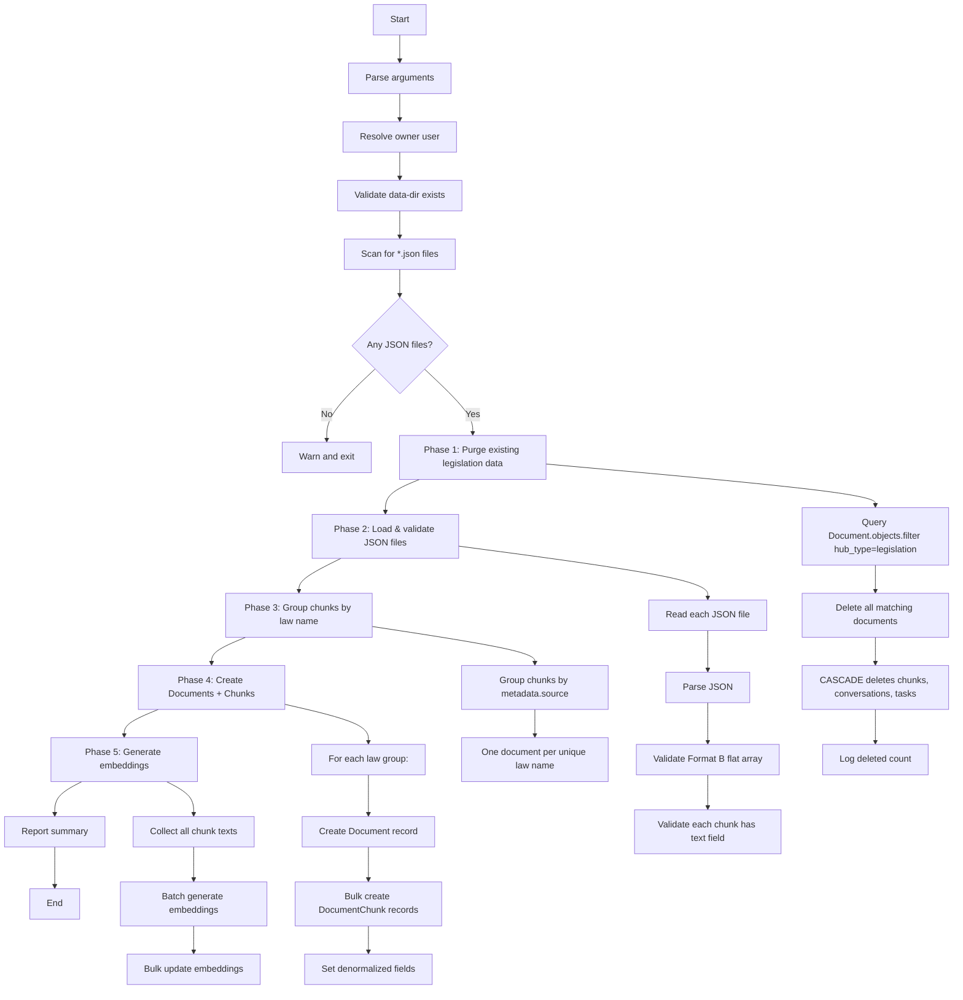

# Plan: Purge & Re-import Legislation Hub (هاب قوانین مصوب)

## Objective

Completely delete all existing data for the **legislation** hub (`hub_type='legislation'`) from the database, then re-import the corrected, pre-chunked JSON dataset from `C:\Users\starlap\Desktop\chunked_datasets\هاب قوانین مصوب\laws\` — generating embeddings for all chunks.

---

## Background

- The current legislation hub data was imported via [`import_chunked_data`](src/backend/documents/management/commands/import_chunked_data.py) and contains **2 documents with 4,612 chunks** (as recorded in [`database-schema.md`](docs/references/database-schema.md:487)).
- The data is **incomplete and has issues** (the user reports it was "ناقص" and had "مشکلاتی").
- A new, corrected dataset exists at `C:\Users\starlap\Desktop\chunked_datasets\هاب قوانین مصوب\laws\` containing **~98-99 JSON files** — one per law.
- Each JSON file is a **flat array** (Format B in the import command's terminology) of chunk objects with `chunk_id`, `text`, `metadata` fields.
- The files are **already chunked** — they only need embedding before storage.

---

## Data Format Analysis

Each JSON file in the `laws/` directory follows this structure (Format B — flat array):

```json
[
  {
    "chunk_id": "قانون_مجازات_اسلامی-madde_1_کتاب_اول_-_کلیات",
    "madde_number": 1,
    "madde_suffix": "",
    "madde_raw": "ماده 1\n...",
    "text": "ماده 1 ...",
    "metadata": {
      "source": "قانون مجازات اسلامی",
      "hub_type": "legislation",
      "approval_date": "1392/02/01",
      "approval_authority": "مجلس شورای اسلامی",
      "status": "معتبر",
      "summary": "...",
      "kitab": "کتاب اول - کلیات",
      "bakhsh": "بخش اول - مواد عمومی",
      "fasl": "فصل اول - تعاریف",
      "mabhath": "",
      "char_count": 131,
      "line_count": 2
    }
  }
]
```

Key observations:
- **Format**: Flat JSON array → detected as **Format B** by `import_chunked_data`
- **Document grouping**: The existing command groups Format B by `full_title` or `parent_title`. However, these laws don't have `full_title` or `parent_title` — they only have `metadata.source` (the law name). So we need a **new grouping strategy**: group by `metadata.source` (the law name).
- **Hub type**: Already set to `"legislation"` in metadata — but the folder-based hub type (`folder_hub_type`) should be authoritative.
- **Chunk IDs**: Unique per chunk, can be used for idempotency.
- **Metadata fields**: Rich metadata including `source` (law name), `approval_date`, `status` (legal status), `kitab` (book), `bakhsh` (section), `fasl` (chapter).

---

## Proposed Solution: New Management Command

Create a **new management command** called `reimport_legislation_hub` that performs the purge-and-reimport in one atomic flow.

### Why a new command instead of modifying `import_chunked_data`?

1. **Safety**: A dedicated command prevents accidental deletion of other hubs.
2. **Different grouping logic**: The existing `import_chunked_data` groups Format B by `full_title`/`parent_title`, but these laws need grouping by `metadata.source`.
3. **Clear separation of concerns**: The purge operation is destructive and should be explicit.
4. **Single responsibility**: The existing command is already complex with 3 format types.

---

## Detailed Design

### Command: `reimport_legislation_hub`

**File**: [`src/backend/documents/management/commands/reimport_legislation_hub.py`](src/backend/documents/management/commands/reimport_legislation_hub.py)

#### Arguments

| Argument | Type | Required | Default | Description |
|----------|------|----------|---------|-------------|
| `--data-dir` | str | Yes | — | Path to the directory containing the JSON files (e.g., `/data/chunked_datasets/هاب قوانین مصوب/laws`) |
| `--dry-run` | flag | No | False | Validate without making any changes |
| `--user-id` | str | No | First superuser | Owner of the imported documents |
| `--embedding-batch-size` | int | No | 16 | Batch size for embedding generation |
| `--skip-embedding` | flag | No | False | Skip embedding generation (useful for testing) |

#### Workflow



#### Phase 1: Purge Existing Legislation Data

```python
# Query all documents belonging to the legislation hub
docs_to_delete = Document.objects.filter(
    document_type='reference_law',
    hub_type='legislation'
)

# Log what will be deleted
total_docs = docs_to_delete.count()
total_chunks = DocumentChunk.objects.filter(
    document__in=docs_to_delete
).count()

# Delete (CASCADE will remove chunks, conversations, tasks)
docs_to_delete.delete()
```

**Important considerations:**
- CASCADE delete will remove all related `DocumentChunk` records
- Conversations linked to these documents will also be deleted (per `on_delete=CASCADE` on the `conversations.document` FK)
- Processing tasks linked to these documents will also be deleted
- This is safe because legislation hub conversations are Global RAG conversations (no `document_id`), so no user conversations are affected
- The operation should be wrapped in `transaction.atomic()` for safety

#### Phase 2: Load & Validate JSON Files

Read each `.json` file from the `--data-dir` directory:
1. Parse JSON — handle `JSONDecodeError` gracefully
2. Validate it's a flat array (Format B) — reject if not
3. Validate each chunk has a non-empty `text` field
4. Validate each chunk has `metadata.source` (law name) for grouping

#### Phase 3: Group Chunks by Law Name

Group all chunks by `metadata.source` (the law name). Each unique law name becomes one `Document` record.

```python
doc_groups: dict[str, list[dict]] = {}
for chunk in all_chunks:
    law_name = chunk.get("metadata", {}).get("source")
    if not law_name:
        stats.errors.append(f"Chunk {chunk.get('chunk_id')} missing metadata.source")
        continue
    doc_groups.setdefault(law_name, []).append(chunk)
```

#### Phase 4: Create Documents + Chunks

For each law group (inside `transaction.atomic()`):

1. **Create Document**:
   - `user` = resolved owner
   - `title` = law name (from `metadata.source`)
   - `filename` = `{law_name}.txt`
   - `original_filename` = `{law_name}.txt`
   - `file_path` = `""` (no actual file)
   - `file_size` = total content length
   - `mime_type` = `"text/plain"`
   - `storage_type` = `"local"`
   - `status` = `"completed"`
   - `document_type` = `"reference_law"`
   - `hub_type` = `"legislation"`
   - `processing_status` = `"completed"`
   - `total_chunks` = len(chunks)
   - `extracted_text` = concatenation of all chunk texts
   - `extracted_text_length` = len(extracted_text)
   - `extraction_method` = `"import_chunked"`

2. **Create DocumentChunk records** (bulk_create):
   - `document` = the created Document
   - `chunk_index` = sequential index
   - `page_start` = 1 (default, no page info in data)
   - `page_end` = 1 (default)
   - `content` = chunk `text`
   - `token_count` = None (can be computed later)
   - `embedding` = None initially (set in Phase 5)
   - `hub_type` = `"legislation"`
   - `metadata` = chunk metadata (with `hub_type` added)
   - `law_name` = `metadata.source`
   - `legal_status` = `metadata.status`
   - `approval_date` = parsed from `metadata.approval_date` (format: `YYYY/MM/DD`)
   - `legal_type` = `"article"` (since these are law articles)

3. **Store chunk_id in metadata** for idempotency (in case of re-run)

#### Phase 5: Generate Embeddings

After all documents and chunks are created:

1. Collect all chunk texts across all documents
2. Process in batches of `--embedding-batch-size` (default 16)
3. Call `batch_generate_embeddings()` for each batch
4. Bulk update embeddings on `DocumentChunk`

**Skip if `--skip-embedding` is set** (for testing/dry-run).

#### Idempotency

The command should be safe to re-run:
- Phase 1 purge deletes ALL existing legislation data
- Phase 2-5 re-imports from scratch
- If the command fails mid-way, re-running will purge any partial data and start fresh

However, to be extra safe, we should also check for existing chunks by `metadata__chunk_id` before creating (as the existing `import_chunked_data` does), in case the purge phase is skipped or partially completed.

#### Dry-Run Mode

In `--dry-run` mode:
- Phase 1: Report how many documents and chunks would be deleted (don't actually delete)
- Phase 2-3: Report how many JSON files found and how many law groups detected
- Phase 4: Report how many documents and chunks would be created
- Phase 5: Report how many embeddings would be generated
- Do NOT write anything to the database

---

## Volume Mount Strategy

The chunked datasets are on the **host** at `C:\Users\starlap\Desktop\chunked_datasets\`. The Docker containers don't have access to this path by default.

**Option A: Add a volume mount to docker-compose.yml**

Add to the `backend` service's `volumes` section in [`docker-compose.yml`](docker-compose.yml:107):
```yaml
volumes:
  - ./src/backend:/app
  - backend_static:/app/staticfiles
  - backend_media:/app/media
  - C:/Users/starlap/Desktop/chunked_datasets:/data/chunked_datasets  # NEW
```

Then run:
```bash
docker-compose exec backend python manage.py reimport_legislation_hub \
  --data-dir /data/chunked_datasets/هاب قوانین مصوب/laws
```

**Option B: Copy files into the container**

```bash
docker cp "C:\Users\starlap\Desktop\chunked_datasets\هاب قوانین مصوب\laws" docuchat_backend:/tmp/laws_data
docker-compose exec backend python manage.py reimport_legislation_hub \
  --data-dir /tmp/laws_data
```

**Recommendation**: Option A is cleaner and more maintainable. Add the volume mount to `docker-compose.yml`.

---

## Files to Create/Modify

### New Files

| File | Description |
|------|-------------|
| [`src/backend/documents/management/commands/reimport_legislation_hub.py`](src/backend/documents/management/commands/reimport_legislation_hub.py) | The new management command |
| [`src/backend/documents/tests/test_reimport_legislation_hub.py`](src/backend/documents/tests/test_reimport_legislation_hub.py) | Tests for the new command |

### Modified Files

| File | Change |
|------|--------|
| [`docker-compose.yml`](docker-compose.yml:107) | Add volume mount for chunked datasets |
| [`docs/references/database-schema.md`](docs/references/database-schema.md:487) | Update the "Data Injected" table for legislation hub |
| [`docs/active-task/wip-context.md`](docs/active-task/wip-context.md) | Update WIP state |

---

## Test Plan

Create comprehensive tests in [`src/backend/documents/tests/test_reimport_legislation_hub.py`](src/backend/documents/tests/test_reimport_legislation_hub.py):

| # | Test Case | Description |
|---|-----------|-------------|
| 1 | `test_purge_existing_legislation_data` | Verify existing legislation docs/chunks are deleted |
| 2 | `test_purge_only_legislation_not_other_hubs` | Verify other hubs (judicial_precedent, advisory_opinion) are NOT affected |
| 3 | `test_import_single_law_file` | Import one JSON file, verify 1 document + N chunks created |
| 4 | `test_import_multiple_law_files` | Import multiple files, verify correct document count |
| 5 | `test_grouping_by_metadata_source` | Verify chunks are grouped by `metadata.source` |
| 6 | `test_denormalized_fields_populated` | Verify `law_name`, `legal_status`, `approval_date`, `legal_type` are set |
| 7 | `test_hub_type_is_legislation` | Verify all documents and chunks have `hub_type='legislation'` |
| 8 | `test_embeddings_generated` | Verify embeddings are created for all chunks |
| 9 | `test_dry_run_no_changes` | Verify dry-run mode doesn't modify DB |
| 10 | `test_idempotency_re_run` | Verify re-running is safe (purge + re-import) |
| 11 | `test_missing_text_field_validation` | Verify error on chunks without `text` |
| 12 | `test_invalid_json_handling` | Verify graceful handling of corrupt JSON files |
| 13 | `test_empty_directory` | Verify graceful handling of empty data-dir |
| 14 | `test_skip_embedding_flag` | Verify `--skip-embedding` skips embedding generation |
| 15 | `test_embedding_batch_size` | Verify custom batch size is respected |

---

## Execution Steps (for Code Mode)

### Step 1: Add volume mount to docker-compose.yml

Add the chunked datasets volume mount to the `backend` and `celery_worker` services.

### Step 2: Create the management command

Create [`src/backend/documents/management/commands/reimport_legislation_hub.py`](src/backend/documents/management/commands/reimport_legislation_hub.py) with:

1. **Imports** — reuse patterns from `import_chunked_data.py`
2. **Constants** — `FOLDER_HUB_MAP`, `HUB_TYPE_ALIASES`, `VALID_HUB_TYPES`, `DEFAULT_EMBEDDING_BATCH_SIZE`
3. **`ImportStats` dataclass** — track files_processed, documents_created, chunks_created, chunks_embedded, documents_deleted, chunks_deleted, errors, skipped
4. **`Command` class** with:
   - `add_arguments()` — `--data-dir`, `--dry-run`, `--user-id`, `--embedding-batch-size`, `--skip-embedding`
   - `handle()` — main orchestration
   - `_get_default_owner()` — reuse from `import_chunked_data`
   - `_purge_existing_legislation()` — Phase 1
   - `_load_and_validate_files()` — Phase 2
   - `_group_chunks_by_law()` — Phase 3
   - `_import_law_group()` — Phase 4 (create Document + Chunks)
   - `_generate_embeddings()` — Phase 5
   - `_report()` — print summary

### Step 3: Create tests

Create [`src/backend/documents/tests/test_reimport_legislation_hub.py`](src/backend/documents/tests/test_reimport_legislation_hub.py) with the test cases listed above.

### Step 4: Run the actual import

```bash
# 1. Restart containers to pick up volume mount
docker-compose down
docker-compose up -d

# 2. Dry-run first
docker-compose exec backend python manage.py reimport_legislation_hub \
  --data-dir /data/chunked_datasets/هاب قوانین مصوب/laws \
  --dry-run

# 3. Actual import
docker-compose exec backend python manage.py reimport_legislation_hub \
  --data-dir /data/chunked_datasets/هاب قوانین مصوب/laws

# 4. Verify
docker-compose exec backend python manage.py fix_hub_types audit
```

### Step 5: Update documentation

- Update [`docs/references/database-schema.md`](docs/references/database-schema.md:487) with new legislation hub stats
- Update [`docs/active-task/wip-context.md`](docs/active-task/wip-context.md)

---

## Risk Assessment

| Risk | Impact | Mitigation |
|------|--------|------------|
| Accidental deletion of other hubs | High | Command explicitly filters by `hub_type='legislation'` only |
| Long-running embedding (98 files × ~avg 200 chunks = ~19,600 chunks) | Medium | Batch processing with configurable batch size; progress logging |
| Container restart required for volume mount | Low | Documented in execution steps |
| User conversations linked to legislation docs | Low | Global RAG conversations have `document_id=NULL`; document-scoped conversations with legislation docs would be deleted (acceptable since data is being replaced) |
| Disk space for embeddings | Low | Embeddings are 1024-dim floats (~4KB each); ~19,600 chunks × 4KB ≈ 78MB |

---

## Estimated Stats After Re-import

| Metric | Current | Expected After |
|--------|---------|----------------|
| Documents (legislation) | 2 | ~98-99 (one per law) |
| Chunks (legislation) | 4,612 | ~19,000-20,000 (estimated) |
| Embeddings | 4,612 | ~19,000-20,000 |
| JSON files processed | — | ~98-99 |
