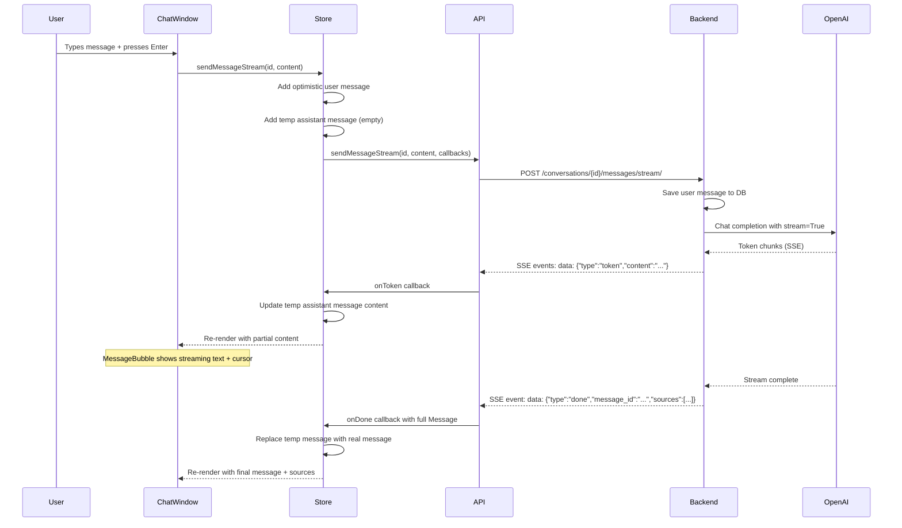
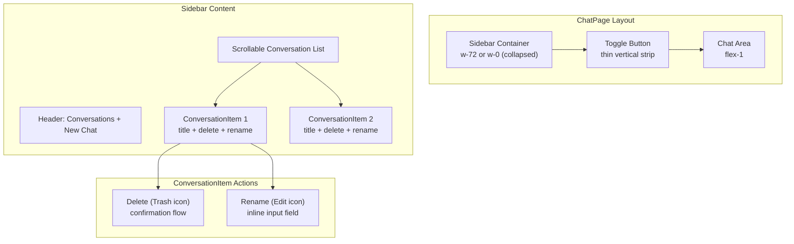

# Refactor Plan: Chat Page Improvements (6 Issues)

## Overview

This plan addresses 6 issues identified in the Chat feature after initial implementation of Task 7 (ChatPage Route & Layout Integration). Each issue is scoped with specific files to modify, the approach, and acceptance criteria.

---

## Issue 1: Missing Back Button from Chat Page

**Problem:** When inside a chat (`/documents/:documentId/chat/:conversationId`), there is no way to navigate back to the document detail page on desktop. On mobile there's a back button, but desktop has none.

**Solution:** Add a back button to the desktop header of [`ChatPage.tsx`](src/frontend/src/pages/ChatPage.tsx).

**Changes:**

1. **`src/frontend/src/pages/ChatPage.tsx`** — Add a desktop header row (hidden on mobile, visible on `md:` and above) with:
   - Back button (`ArrowLeft` icon) navigating to `/documents/${documentId}`
   - Document title label (see Issue 5)
   - The existing mobile header already has a back button — keep it.

**Acceptance Criteria:**
- Desktop view shows a back button in the top-left of the chat area
- Clicking back navigates to `/documents/:documentId`
- Mobile view already has the back button — unchanged

---

## Issue 2: Sidebar Collapse/Expand Toggle Button

**Problem:** The conversation sidebar on desktop is always visible (fixed `w-72`). There is no way to collapse it to gain more space for the chat area.

**Solution:** Add a toggle button on the sidebar edge that collapses/expands the sidebar. Use a state variable `sidebarCollapsed` in [`ChatPage.tsx`](src/frontend/src/pages/ChatPage.tsx).

**Changes:**

1. **`src/frontend/src/pages/ChatPage.tsx`** — Add:
   - `sidebarCollapsed` state (boolean, default `false`)
   - Toggle button (a thin vertical bar or chevron button) positioned at the right edge of the sidebar
   - When collapsed: sidebar width becomes `0` or `w-0` (hidden), toggle button remains visible
   - When expanded: sidebar shows at `w-72` as before
   - Pass `sidebarCollapsed` to the desktop sidebar wrapper div to control width

2. **`src/frontend/src/components/chat/ConversationSidebar.tsx`** — No changes needed (the collapse is handled by the parent's width wrapper).

**Acceptance Criteria:**
- A toggle button is visible on the right edge of the sidebar on desktop
- Clicking the toggle collapses the sidebar (conversation list hidden)
- Clicking again expands it back
- The chat area fills the vacated space when sidebar is collapsed
- Mobile drawer behavior is unaffected

---

## Issue 3: Message Streaming (Real-time Response Display)

**Problem:** Currently, the frontend waits for the entire assistant response before displaying it. The user sees a loading state, then the full message appears. This is a poor UX for long responses.

**Current Flow:**
1. User sends message → optimistic user message added
2. `POST /conversations/{id}/messages/` called
3. Backend calls OpenAI API synchronously (can take 5-30 seconds)
4. Full response returned as JSON → assistant message added to state

**Solution:** Implement Server-Sent Events (SSE) streaming so the assistant response appears token-by-token as it's generated.

### Backend Changes

1. **`src/backend/conversations/views.py`** — Add a new streaming endpoint or modify `ConversationMessageView`:
   - Add a `StreamingConversationMessageView` (or modify existing) that:
     - Accepts POST with `{ content: "..." }`
     - Persists the user message immediately
     - Calls the chat provider's streaming API (e.g., OpenAI `stream=True`)
     - Returns a `StreamingHttpResponse` with `Content-Type: text/event-stream`
     - Each SSE event contains a JSON chunk: `data: {"type": "token", "content": "..."}`
     - Final event contains the complete message metadata: `data: {"type": "done", "message_id": "...", "sources": [...], "token_usage": {...}}`
   - The existing non-streaming endpoint can remain as fallback.

2. **`src/backend/conversations/urls.py`** — Add a new URL pattern:
   ```python
   path("<uuid:conversation_id>/messages/stream/", StreamingConversationMessageView.as_view(), name="conversation-messages-stream"),
   ```

3. **`src/backend/conversations/rag_service.py`** — Add a streaming variant `run_rag_query_stream` that yields tokens instead of returning the full response. This requires:
   - The chat provider to support streaming (OpenAI does via `stream=True`)
   - Yielding `(token_text, is_done, final_metadata)` tuples

4. **`src/backend/providers/`** — The provider interface needs a `chat_stream` method that yields tokens. Check the existing provider registry.

### Frontend Changes

1. **`src/frontend/src/api/conversations.ts`** — Add:
   ```typescript
   export async function sendMessageStream(
     conversationId: string,
     content: string,
     onToken: (token: string) => void,
     onDone: (message: Message) => void,
     onError: (error: Error) => void,
   ): Promise<AbortController>
   ```
   - Uses `fetch` with `ReadableStream` to parse SSE events
   - Returns an `AbortController` for cancellation

2. **`src/frontend/src/stores/conversationStore.ts`** — Add:
   - `streamingContent: string` to state (the partial assistant response being built)
   - `sendMessageStream` action that:
     - Adds optimistic user message
     - Creates a temporary assistant message with `id: 'temp-assistant-' + uuid` and empty content
     - Calls `sendMessageStream` API, updating `streamingContent` on each token
     - On done: replaces temp message with real message from server
   - Keep existing `sendMessage` as fallback

3. **`src/frontend/src/components/chat/ChatWindow.tsx`** — Update to:
   - Use `sendMessageStream` when available, fallback to `sendMessage`
   - Pass `streamingContent` to `MessageBubble` for the streaming message

4. **`src/frontend/src/components/chat/MessageBubble.tsx`** — Already has `isStreaming` prop and cursor animation (`▌`). The streaming content should be passed as the message content for the temp assistant message.

**Acceptance Criteria:**
- After sending a message, the assistant response appears token-by-token in real-time
- The typing cursor (`▌`) blinks at the end while streaming
- Sources and token usage appear only after streaming completes
- Error handling works during streaming (connection lost, etc.)
- The existing non-streaming path still works as fallback

---

## Issue 4: RTL (Right-to-Left) Layout for Persian/Farsi Text

**Problem:** When the user asks questions in Persian/Farsi or the document contains Persian text, the message content is not rendered with proper RTL direction. This causes incorrect text alignment and readability issues.

**Solution:** Add `dir="auto"` attribute to message content containers so the browser automatically detects text direction.

**Changes:**

1. **`src/frontend/src/components/chat/MessageBubble.tsx`** — Add `dir="auto"` to:
   - The user message `<p>` element (line 114)
   - The assistant message `<div className="prose ...">` element (line 116)
   - The source citation content preview `<p>` element (line 69)

**Acceptance Criteria:**
- Persian/Farsi text in messages is right-aligned automatically
- English text remains left-aligned
- Mixed text renders correctly
- No visual regression for English-only content

---

## Issue 5: Missing Document Title in Chat Page Header

**Problem:** The chat page header doesn't display the document title. The user has to remember which document they're chatting about.

**Solution:** Display the document title in the chat page header, sourced from the active conversation's `document_title` field (already available in the API response).

**Changes:**

1. **`src/frontend/src/pages/ChatPage.tsx`** — Add document title display:
   - In the desktop header (new, see Issue 1): show document title as a label
   - In the mobile header: show document title next to the back button
   - Source the title from `useConversationStore(s => s.activeConversation?.document_title)` or from the conversation list item
   - When no conversation is active (NoConversationSelected state), fetch the document title via a separate API call or pass it as a prop

2. **`src/frontend/src/api/conversations.ts`** — The `Conversation` and `ConversationDetail` types already have `document_title: string`. No API changes needed.

3. **Alternative approach for NoConversationSelected state:** Fetch the document title from the document detail API when no conversation is active. Add a `useEffect` in `ChatPage` to fetch document info if needed.

**Acceptance Criteria:**
- The document title is visible in the chat page header at all times
- When a conversation is active, the title comes from `activeConversation.document_title`
- When no conversation is active, the title is fetched from the document API
- The title is displayed on both desktop and mobile

---

## Issue 6: Rename Conversation Option

**Problem:** Conversations in the sidebar history have no rename option. Users can only delete them. They need the ability to rename conversations for better organization.

### Backend Changes

1. **`src/backend/conversations/views.py`** — Add a `patch` method to `ConversationDetailView`:
   ```python
   def patch(self, request: Request, conversation_id: str) -> Response:
       conversation, error = _get_conversation_or_error(conversation_id, request)
       if error:
           return error
       
       title = request.data.get("title", "").strip()
       if not title:
           return Response(
               {"error": "validation_error", "message": "Title cannot be empty."},
               status=status.HTTP_400_BAD_REQUEST,
           )
       
       conversation.title = title
       conversation.save(update_fields=["title"])
       
       serializer = ConversationListSerializer(conversation)
       return Response(serializer.data, status=status.HTTP_200_OK)
   ```

2. **`src/backend/conversations/urls.py`** — No changes needed. The existing `/<uuid:conversation_id>/` route already handles PATCH via `ConversationDetailView.as_view()`.

3. **`src/backend/conversations/serializers.py`** — No changes needed. `ConversationListSerializer` already has `title` as a writable field (`required=False, allow_blank=True`).

### Frontend Changes

1. **`src/frontend/src/api/conversations.ts`** — Add:
   ```typescript
   export async function renameConversation(
     conversationId: string,
     title: string,
   ): Promise<Conversation> {
     try {
       const { data } = await apiClient.patch<Conversation>(
         `conversations/${conversationId}/`,
         { title },
       );
       return data;
     } catch (error) {
       handleError(error);
     }
   }
   ```

2. **`src/frontend/src/stores/conversationStore.ts`** — Add:
   - `renameConversation` action that calls the API and updates the conversation in the list
   - Also updates `activeConversation.title` if the renamed conversation is active

3. **`src/frontend/src/components/chat/ConversationSidebar.tsx`** — Add rename UI:
   - Add a rename button (pencil/edit icon) next to the delete button in `ConversationItem`
   - On click: switch the conversation title text to an inline `<input>` field
   - On Enter or blur: call `renameConversation` API
   - On Escape: cancel and revert to display mode
   - Add `renamingId` state to track which conversation is being renamed

**Acceptance Criteria:**
- Each conversation in the sidebar has a rename (edit) icon visible on hover
- Clicking rename switches the title to an editable input field
- Pressing Enter saves the new title via API
- Pressing Escape cancels the rename
- The updated title appears immediately in the sidebar
- The updated title is reflected in the active conversation header
- Backend validates that title is not empty

---

## Implementation Order

The issues should be implemented in this order to minimize merge conflicts:

| Order | Issue | Dependencies | Effort |
|-------|-------|-------------|--------|
| 1 | Issue 4: RTL support | None | Small (1 file) |
| 2 | Issue 5: Document title | None | Small (1 file) |
| 3 | Issue 1: Back button | Issue 5 (header layout) | Small (1 file) |
| 4 | Issue 2: Sidebar toggle | None | Medium (1 file) |
| 5 | Issue 6: Rename conversation | None | Medium (4 files: backend + frontend) |
| 6 | Issue 3: Streaming | Provider streaming support | Large (6+ files) |

---

## Architecture Diagram: Streaming Flow



---

## Architecture Diagram: Sidebar Layout



---

## Files Modified Summary

| File | Issue(s) | Change Type |
|------|----------|-------------|
| `src/frontend/src/components/chat/MessageBubble.tsx` | 4 (RTL) | Modify — add `dir="auto"` |
| `src/frontend/src/pages/ChatPage.tsx` | 1, 2, 5 (back, toggle, title) | Modify — add header, toggle, title |
| `src/frontend/src/api/conversations.ts` | 3, 6 (stream, rename) | Modify — add functions |
| `src/frontend/src/stores/conversationStore.ts` | 3, 6 (stream, rename) | Modify — add actions |
| `src/frontend/src/components/chat/ConversationSidebar.tsx` | 6 (rename) | Modify — add rename UI |
| `src/frontend/src/components/chat/ChatWindow.tsx` | 3 (stream) | Modify — use stream |
| `src/backend/conversations/views.py` | 3, 6 (stream, rename) | Modify — add PATCH + streaming view |
| `src/backend/conversations/urls.py` | 3 (stream) | Modify — add streaming route |
| `src/backend/conversations/rag_service.py` | 3 (stream) | Modify — add streaming variant |
| `src/backend/providers/` (check registry) | 3 (stream) | Modify — add stream support |
