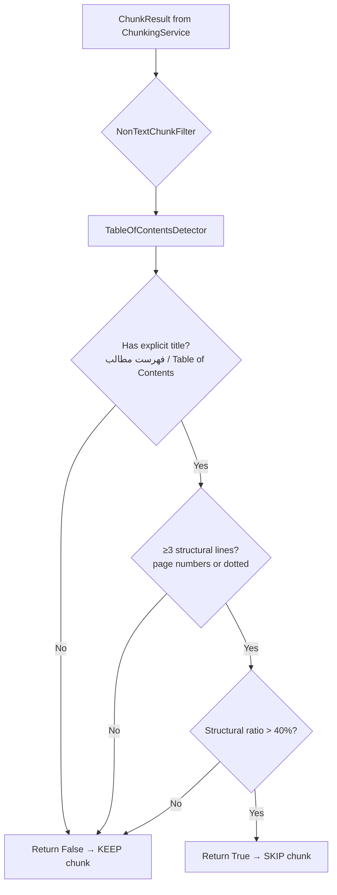

# Implementation Plan: Safe Non-Text Section Filtering for Persian Legal Chunking

## Problem

When chunking Persian legal documents, certain sections are **not actual legal content** but structural artifacts (table of contents, headers, footers, page numbers, etc.). These sections, if chunked and embedded, pollute the vector database with meaningless content, degrading RAG retrieval quality.

The user's provided example focuses on **Table of Contents (فهرست مطالب)** detection, but the architecture should be extensible to other non-text patterns.

## Design Goals

1. **Conservative (Safe) Approach** — High precision over recall. Only skip chunks we are **very confident** are non-text. False negatives (keeping a non-text chunk) are acceptable; false positives (removing a real content chunk) are **not**.
2. **Low False Positive Rate** — The detection must be strict enough that legitimate Persian legal text (e.g., an article containing the word "فهرست" in its body) is never accidentally filtered.
3. **Extensible** — New non-text detectors can be added without modifying existing code.
4. **Minimal Performance Impact** — Detection runs once per chunk, not per character.
5. **Configurable** — Feature can be enabled/disabled via Django settings.

## Architecture

### Where to Hook In

The filtering should happen **after chunking** but **before persisting to the database**. The natural location is in [`src/backend/documents/tasks/document_processing.py`](src/backend/documents/tasks/document_processing.py) at the `chunk_document()` task, specifically between:

1. Line 622: `chunk_results = chunking_service.chunk_text(...)` — chunks are produced
2. Line 634-649: `chunks_to_create = [...]` — chunks are converted to DB model instances

A new filter function will be called to **remove** any `ChunkResult` that is detected as non-text content.

### Component Design

```
┌─────────────────────────────────────────────────────────┐
│                   ChunkingService                        │
│  chunk_text() → List[ChunkResult]                        │
└─────────────────────┬───────────────────────────────────┘
                      │
                      ▼
┌─────────────────────────────────────────────────────────┐
│              NonTextChunkFilter                          │  ← NEW
│  filter_chunks(chunks) → List[ChunkResult]               │
│                                                          │
│  Uses a chain of Detector strategies:                    │
│    • TableOfContentsDetector                             │
│    • (future) HeaderFooterDetector                       │
│    • (future) PageNumberDetector                         │
└─────────────────────┬───────────────────────────────────┘
                      │
                      ▼
┌─────────────────────────────────────────────────────────┐
│              DocumentChunk.bulk_create()                  │
│  Only "real" content chunks are persisted                │
└─────────────────────────────────────────────────────────┘
```

### New File: [`src/backend/documents/services/non_text_filter.py`](src/backend/documents/services/non_text_filter.py)

This file will contain:

1. **`NonTextChunkFilter`** — Orchestrator class that runs all registered detectors.
2. **`BaseDetector`** — Abstract base class for detectors.
3. **`TableOfContentsDetector`** — The primary detector (from the user's code).

#### `BaseDetector` (Abstract)

```python
class BaseDetector(ABC):
    """Abstract base for non-text content detectors."""
    
    @abstractmethod
    def is_non_text(self, chunk_text: str) -> bool:
        """Return True if the chunk is non-text content (should be skipped).
        
        Must be conservative — return False when uncertain.
        """
        ...
```

#### `TableOfContentsDetector`

Implements the user's provided logic with these refinements:

**Detection Criteria (Conservative):**

1. **Explicit Title Check** (first 300 chars):
   - `فهرست مطالب` or `فهرست مندرجات` or `Table of Contents`
   - If absent → return `False` (not a TOC)

2. **Structural Line Check**:
   - Lines ending with digits (page numbers)
   - Lines containing dotted patterns (`...` or `…`)
   - At least **3 structural lines** required

3. **Ratio Check**:
   - Structural lines / total lines > **0.4** (40%)
   - This is the key conservative threshold

**Why this is safe (low FP):**
- Requires an explicit title — a random article containing dotted text won't match
- Requires ≥3 structural lines — a single line with a number won't trigger
- Requires >40% ratio — even if title matches, most content must be structural
- Persian legal articles rarely have >40% of lines ending in digits or containing dots

#### `NonTextChunkFilter` (Orchestrator)

```python
class NonTextChunkFilter:
    """Filters out non-text chunks from chunking results.
    
    Uses a chain of detectors. A chunk is removed if ANY detector
    marks it as non-text.
    """
    
    def __init__(self, detectors: Optional[List[BaseDetector]] = None):
        self.detectors = detectors or [TableOfContentsDetector()]
    
    def filter_chunks(
        self, chunks: List[ChunkResult]
    ) -> List[ChunkResult]:
        """Remove chunks detected as non-text content.
        
        Args:
            chunks: List of ChunkResult from ChunkingService.
            
        Returns:
            Filtered list with non-text chunks removed.
        """
        return [
            chunk for chunk in chunks
            if not self._is_non_text(chunk.content)
        ]
    
    def _is_non_text(self, text: str) -> bool:
        for detector in self.detectors:
            if detector.is_non_text(text):
                return True
        return False
```

### Integration Point

In [`src/backend/documents/tasks/document_processing.py`](src/backend/documents/tasks/document_processing.py), modify `chunk_document()`:

```python
# After chunking, before DB persistence
from documents.services.non_text_filter import NonTextChunkFilter

# ... existing chunking code ...
chunk_results = chunking_service.chunk_text(...)

# NEW: Filter out non-text chunks
non_text_filter = NonTextChunkFilter()
chunk_results = non_text_filter.filter_chunks(chunk_results)

# ... existing persistence code ...
```

### Configuration

Add to [`src/backend/config/settings.py`](src/backend/config/settings.py):

```python
# Non-Text Chunk Filtering
NON_TEXT_CHUNK_FILTERING_ENABLED = env.bool('NON_TEXT_CHUNK_FILTERING_ENABLED', default=True)
```

And in `chunk_document()`:

```python
if getattr(settings, 'NON_TEXT_CHUNK_FILTERING_ENABLED', True):
    non_text_filter = NonTextChunkFilter()
    chunk_results = non_text_filter.filter_chunks(chunk_results)
```

## Files to Modify

| File | Change |
|------|--------|
| [`src/backend/documents/services/non_text_filter.py`](src/backend/documents/services/non_text_filter.py) | **NEW** — `NonTextChunkFilter`, `BaseDetector`, `TableOfContentsDetector` |
| [`src/backend/documents/tasks/document_processing.py`](src/backend/documents/tasks/document_processing.py) | Integrate filter between chunking and persistence |
| [`src/backend/config/settings.py`](src/backend/config/settings.py) | Add `NON_TEXT_CHUNK_FILTERING_ENABLED` setting |
| [`src/backend/documents/tests/test_non_text_filter.py`](src/backend/documents/tests/test_non_text_filter.py) | **NEW** — Tests for the filter |

## Test Plan

### Test File: [`src/backend/documents/tests/test_non_text_filter.py`](src/backend/documents/tests/test_non_text_filter.py)

#### `TestTableOfContentsDetector`

| Test | Input | Expected |
|------|-------|----------|
| `test_toc_with_title_and_page_numbers` | "فهرست مطالب\nمقدمه... ۱\nفصل اول... ۲\nفصل دوم... ۳" | `True` (is non-text) |
| `test_toc_with_dotted_lines` | "فهرست مطالب\nمقدمه........ ۱\nفصل اول...... ۲" | `True` (≥3 structural, >40%) |
| `test_no_title_returns_false` | "مقدمه... ۱\nفصل اول... ۲\nفصل دوم... ۳" | `False` (no explicit title) |
| `test_few_structural_lines` | "فهرست مطالب\nمقدمه... ۱\nفصل اول... ۲" | `False` (only 2 structural lines, <3) |
| `test_low_structural_ratio` | "فهرست مطالب\nمقدمه... ۱\nمتن بلند اینجا قرار دارد که نسبت را پایین می‌آورد\nمتن بلند دیگر\nمتن بلند دیگر" | `False` (ratio <0.4) |
| `test_english_toc` | "Table of Contents\nIntroduction... 1\nChapter 1... 2" | `True` |
| `test_legal_article_not_toc` | "ماده ۱: فهرست اموال منقول شامل موارد زیر است:\n۱- خودرو\n۲- ملک\n۳- اثاثیه" | `False` (no TOC title, no page numbers) |
| `test_empty_text` | `""` | `False` |
| `test_whitespace_only` | `"   \n  "` | `False` |

#### `TestNonTextChunkFilter`

| Test | Input | Expected |
|------|-------|----------|
| `test_filters_toc_chunks` | Mix of real chunks + 1 TOC chunk | TOC chunk removed |
| `test_passes_all_real_chunks` | All real content chunks | All preserved |
| `test_empty_chunks_list` | `[]` | `[]` |
| `test_single_toc_chunk` | 1 TOC chunk | `[]` |

#### `TestIntegrationWithChunkingService`

| Test | Input | Expected |
|------|-------|----------|
| `test_toc_at_start_of_document` | Legal doc with TOC before articles | TOC chunk filtered, article chunks preserved |
| `test_toc_in_middle_of_document` | Legal doc with TOC between chapters | TOC chunk filtered |

## Implementation Steps (Ordered)

### Step 1: Create [`src/backend/documents/services/non_text_filter.py`](src/backend/documents/services/non_text_filter.py)

- Implement `BaseDetector` abstract class
- Implement `TableOfContentsDetector` with the conservative logic from the user's code
- Implement `NonTextChunkFilter` orchestrator

### Step 2: Add Setting in [`src/backend/config/settings.py`](src/backend/config/settings.py)

- Add `NON_TEXT_CHUNK_FILTERING_ENABLED` setting (default `True`)

### Step 3: Integrate Filter in [`src/backend/documents/tasks/document_processing.py`](src/backend/documents/tasks/document_processing.py)

- Import `NonTextChunkFilter`
- After `chunk_results = chunking_service.chunk_text(...)`, apply filter if enabled
- Update `total_chunks` count after filtering

### Step 4: Create Tests in [`src/backend/documents/tests/test_non_text_filter.py`](src/backend/documents/tests/test_non_text_filter.py)

- `TestTableOfContentsDetector` — 9 test cases
- `TestNonTextChunkFilter` — 4 test cases
- `TestIntegrationWithChunkingService` — 2 test cases

### Step 5: Update [`docs/active-task/wip-context.md`](docs/active-task/wip-context.md)

- Document what was implemented
- Note the new setting and its default value

## Mermaid Diagram: Detection Flow



## Mermaid Diagram: Integration in Pipeline

```flowchart TD
    A[extract_text_from_pdf] --> B[chunk_document task]
    B --> C[ChunkingService.chunk_text]
    C --> D{NonTextChunkFilter enabled?}
    D -->|Yes| E[NonTextChunkFilter.filter_chunks]
    D -->|No| F[Skip filtering]
    E --> G[DocumentChunk.bulk_create]
    F --> G
    G --> H[Update document.total_chunks]
```

## Risk Assessment

| Risk | Mitigation |
|------|------------|
| **False positive**: A real legal article is filtered out | Conservative thresholds (title required, ≥3 lines, >40% ratio). Persian legal articles rarely match all three. |
| **False negative**: A TOC is not detected | Acceptable — better to keep a TOC chunk than lose real content. The TOC will have low relevance scores in RAG anyway. |
| **Performance overhead** | Detection is O(n) per chunk with simple regex. Negligible compared to embedding generation. |
| **Extensibility burden** | `BaseDetector` abstract class makes adding new detectors trivial — just implement `is_non_text()`. |
