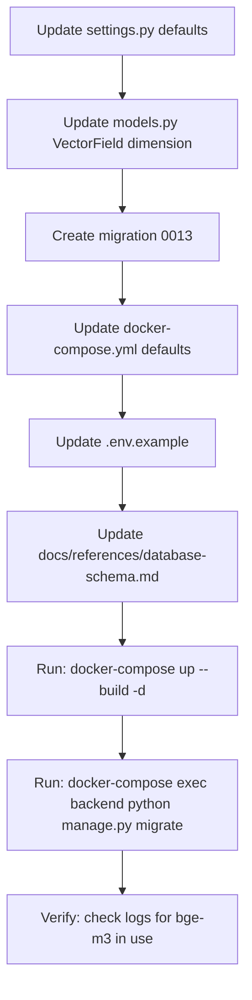

# Plan: Switch Ollama Embedding Model from `nomic-embed-text` to `bge-m3`

## Overview

Change the Ollama embedding model from `nomic-embed-text` (768-dim) to `bge-m3` (1024-dim). Since this is a **fresh project** (no existing documents/chunks in the database), no data migration or re-embedding is needed.

## Key Facts

| Item | Current Value | New Value |
|------|--------------|-----------|
| Embedding model | `nomic-embed-text` | `bge-m3` |
| Embedding dimension | 768 | 1024 |
| Provider | `ollama` | `ollama` (unchanged) |
| Existing data | None (fresh project) | N/A |

## Files to Modify

### 1. [`src/backend/config/settings.py`](src/backend/config/settings.py:38) — Django settings

**Changes:**
- Line 38: Change `OLLAMA_EMBEDDING_MODEL` default from `'nomic-embed-text'` to `'bge-m3'`
- Line 39: Change `EMBEDDING_DIMENSION` default from `768` to `1024`
- Line 255: Change `OLLAMA_EMBEDDING_MODEL` env default from `'nomic-embed-text'` to `'bge-m3'`
- Line 256: Change `EMBEDDING_DIMENSION` env default from `768` to `1024`

### 2. [`src/backend/documents/models.py`](src/backend/documents/models.py:122) — DocumentChunk model

**Changes:**
- Line 122: Change `VectorField(dimensions=768, ...)` to `VectorField(dimensions=1024, ...)`

### 3. [`docker-compose.yml`](docker-compose.yml:104) — Docker Compose environment variables

**Changes (3 services: `backend`, `celery_worker`, `celery_beat`):**
- Line 104 (backend): Change `OLLAMA_EMBEDDING_MODEL` default from `nomic-embed-text` to `bge-m3`
- Line 107 (backend): Change `EMBEDDING_DIMENSION` default from `768` to `1024`
- Line 161 (celery_worker): Same changes as backend
- Line 164 (celery_worker): Same changes as backend
- Line 206 (celery_beat): Same changes as backend
- Line 209 (celery_beat): Same changes as backend

### 4. [`.env.example`](.env.example:113) — Environment template

**Changes:**
- Line 113: Change `OLLAMA_EMBEDDING_MODEL=nomic-embed-text` to `OLLAMA_EMBEDDING_MODEL=bge-m3`
- Line 197: Change `EMBEDDING_DIMENSION=768` to `EMBEDDING_DIMENSION=1024`

### 5. [`docs/references/database-schema.md`](docs/references/database-schema.md:67) — Schema documentation

**Changes:**
- Line 67: Update `embedding` column description from `VECTOR(768)` to `VECTOR(1024)`
- Line 78: Update comment about default embedding dimension
- Line 227: Update migration notes from `768 (Ollama nomic-embed-text)` to `1024 (Ollama bge-m3)`

### 6. [`docs/references/api-registry.md`](docs/references/api-registry.md) — API documentation

Check if any API docs reference the embedding dimension (e.g., search endpoints). Update if found.

### 7. **New migration file** — `src/backend/documents/migrations/0013_change_embedding_dim_to_1024.py`

Create a new Django migration that:
1. Drops the existing `idx_chunks_embedding` ivfflat index
2. Alters the `embedding` column from `VECTOR(768)` to `VECTOR(1024)`
3. Re-creates the ivfflat index on the new column type

This follows the exact pattern of [`0005_change_embedding_dim_to_768.py`](src/backend/documents/migrations/0005_change_embedding_dim_to_768.py).

## Files That Do NOT Need Changes

| File | Reason |
|------|--------|
| [`src/backend/providers/ollama_embedding.py`](src/backend/providers/ollama_embedding.py) | Reads `settings.OLLAMA_EMBEDDING_MODEL` and `settings.EMBEDDING_DIMENSION` dynamically — no hardcoded values |
| [`src/backend/providers/registration.py`](src/backend/providers/registration.py) | Provider registration is unchanged (still `ollama`) |
| [`src/backend/documents/services/embedding_service.py`](src/backend/documents/services/embedding_service.py) | Delegates to provider — no hardcoded dimension |
| [`src/backend/documents/services/search_service.py`](src/backend/documents/services/search_service.py) | Validates dimension against `settings.EMBEDDING_DIMENSION` dynamically (line 328) |
| [`src/backend/conversations/rag_service.py`](src/backend/conversations/rag_service.py) | No hardcoded dimension references |
| [`src/backend/documents/checks.py`](src/backend/documents/checks.py) | pgvector index check — no dimension hardcoded |
| Frontend code | No embedding dimension references |

## Execution Order (Step-by-Step)



### Step 1 — Update Django settings defaults
Modify [`src/backend/config/settings.py`](src/backend/config/settings.py) — change the two default values for `OLLAMA_EMBEDDING_MODEL` and `EMBEDDING_DIMENSION`.

### Step 2 — Update DocumentChunk model
Modify [`src/backend/documents/models.py`](src/backend/documents/models.py:122) — change `VectorField(dimensions=768)` to `VectorField(dimensions=1024)`.

### Step 3 — Create migration
Create [`src/backend/documents/migrations/0013_change_embedding_dim_to_1024.py`](src/backend/documents/migrations/) following the pattern of migration 0005:
- Drop ivfflat index
- Alter field dimension to 1024
- Re-create ivfflat index

### Step 4 — Update docker-compose.yml
Update all 3 services (`backend`, `celery_worker`, `celery_beat`) — change `OLLAMA_EMBEDDING_MODEL` and `EMBEDDING_DIMENSION` defaults.

### Step 5 — Update .env.example
Update the two relevant lines.

### Step 6 — Update database-schema.md
Update the `embedding` column definition and migration notes.

### Step 7 — Rebuild and migrate
```bash
docker-compose up --build -d
docker-compose exec backend python manage.py migrate
```

### Step 8 — Verify
Check the backend logs to confirm `bge-m3` is being used for embeddings:
```bash
docker-compose logs backend | grep -i "embedding"
```

## Rollback Plan

If something goes wrong:

1. **Revert code changes** — Undo all file modifications above
2. **Roll back migration** — `docker-compose exec backend python manage.py migrate documents 0012`
3. **Rebuild** — `docker-compose up --build -d`

Since there's no existing data, rollback is clean and safe.
