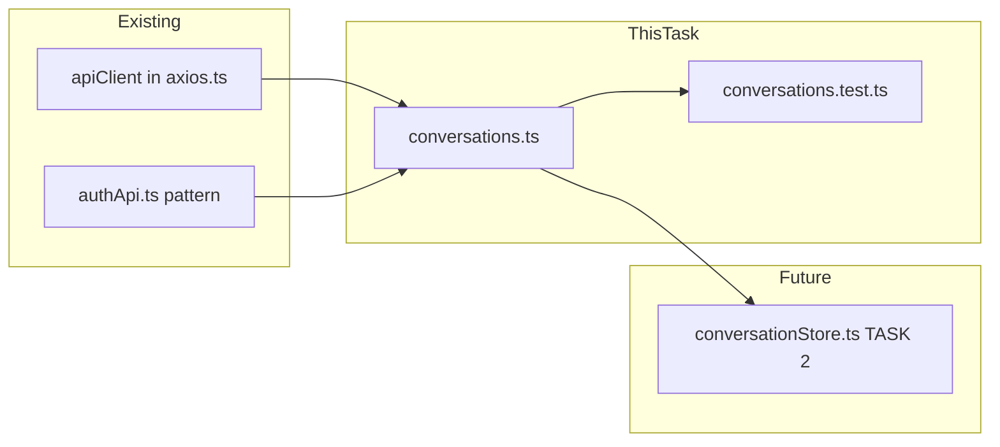

# Plan — TASK 1: Conversation API Service Layer

**Epic:** E10 — Frontend Chat Interface  
**File to Create:** [`src/frontend/src/api/conversations.ts`](src/frontend/src/api/conversations.ts)  
**Test File:** [`src/frontend/tests/api/conversations.test.ts`](src/frontend/tests/api/conversations.test.ts)  
**Test Type:** Vitest (pure non-UI logic)  
**Depends On:** Nothing (uses existing [`apiClient`](src/frontend/src/api/axios.ts) from E08)

---

## 1. TypeScript Interfaces

Based on the backend serializers in [`conversations/serializers.py`](src/backend/conversations/serializers.py) and the API registry in [`docs/references/api-registry.md`](docs/references/api-registry.md), define these interfaces:

### `Conversation` (list item shape)
```typescript
export interface Conversation {
  id: string;
  document_id: string;
  document_title: string;
  title: string | null;
  message_count: number;
  created_at: string;
  updated_at: string;
}
```
Maps to [`ConversationListSerializer`](src/backend/conversations/serializers.py:62).

### `MessageSource` (source citation)
```typescript
export interface MessageSource {
  chunk_id: string;
  page_start: number;
  page_end: number;
  content_preview?: string;
  relevance_score: number;
}
```
Maps to the `sources` JSON field in [`MessageSerializer`](src/backend/conversations/serializers.py:19).

### `TokenUsage` (token stats)
```typescript
export interface TokenUsage {
  prompt_tokens: number;
  completion_tokens: number;
  total_tokens: number;
}
```
Maps to the `token_usage` JSON field in [`MessageSerializer`](src/backend/conversations/serializers.py:19).

### `Message` (single message)
```typescript
export interface Message {
  id: string;
  role: 'user' | 'assistant' | 'system';
  content: string;
  sources: MessageSource[];
  token_usage: TokenUsage | null;
  created_at: string;
}
```

### `ConversationDetail` (conversation with nested messages)
```typescript
export interface ConversationDetail {
  id: string;
  document_id: string;
  document_title: string;
  title: string | null;
  message_count: number;
  created_at: string;
  updated_at: string;
  messages: Message[];
}
```
Maps to [`ConversationDetailSerializer`](src/backend/conversations/serializers.py:121).

### `PaginatedConversations` (paginated list response)
```typescript
export interface PaginatedConversations {
  count: number;
  next: string | null;
  previous: string | null;
  results: Conversation[];
}
```
Follows the existing [`PaginatedResponse<T>`](src/frontend/src/types/document.ts:40) pattern.

### `DirectQueryResponse` (stateless query result)
```typescript
export interface DirectQueryResponse {
  answer: string;
  sources: MessageSource[];
  token_usage: TokenUsage;
}
```
Maps to the `/documents/{id}/query` response in the API registry.

---

## 2. API Functions (6 total)

All functions follow the existing [`authApi.ts`](src/frontend/src/api/authApi.ts) pattern — import `apiClient` from [`axios.ts`](src/frontend/src/api/axios.ts), use typed generics, destructure `data` from the response.

### 2.1 `createConversation(documentId, title?)`
- **Method:** `POST`
- **Endpoint:** `conversations/`
- **Request Body:** `{ document_id: string; title?: string }`
- **Response:** `Conversation` (201 Created)
- **Error:** Non-2xx → throw typed error

### 2.2 `listConversations(documentId?, page?)`
- **Method:** `GET`
- **Endpoint:** `conversations/`
- **Query Params:** `document_id` (optional), `page` (optional, default 1)
- **Response:** `PaginatedConversations` (200 OK)
- **Error:** Non-2xx → throw typed error

### 2.3 `getConversation(conversationId)`
- **Method:** `GET`
- **Endpoint:** `conversations/{id}/`
- **Response:** `ConversationDetail` (200 OK)
- **Error:** Non-2xx → throw typed error

### 2.4 `deleteConversation(conversationId)`
- **Method:** `DELETE`
- **Endpoint:** `conversations/{id}/`
- **Response:** `void` (204 No Content)
- **Error:** Non-2xx → throw typed error

### 2.5 `sendMessage(conversationId, content)`
- **Method:** `POST`
- **Endpoint:** `conversations/{id}/messages/`
- **Request Body:** `{ content: string }`
- **Response:** `Message` (201 Created — returns the *assistant* message)
- **Error:** Non-2xx → throw typed error

### 2.6 `directQuery(documentId, question, topK?)`
- **Method:** `POST`
- **Endpoint:** `documents/{id}/query`
- **Request Body:** `{ question: string; top_k?: number }`
- **Response:** `DirectQueryResponse` (200 OK)
- **Error:** Non-2xx → throw typed error

---

## 3. Error Handling

Create a typed error class or function to handle non-2xx responses:

```typescript
export class ApiError extends Error {
  constructor(
    public status: number,
    message: string,
    public data?: unknown,
  ) {
    super(message);
    this.name = 'ApiError';
  }
}
```

Each function wraps the `apiClient` call in a try/catch. If `axios.isAxiosError(error)`, extract `error.response?.status` and `error.response?.data` and throw `ApiError`. Otherwise re-throw.

---

## 4. Test Plan (TDD — RED first)

**Test File:** [`src/frontend/tests/api/conversations.test.ts`](src/frontend/tests/api/conversations.test.ts)

### Mock Strategy
- Mock `@/api/axios` module using `vi.mock`
- Provide a mock `apiClient` object with `post`, `get`, `delete` methods (each `vi.fn()`)
- Each test sets up the mock return value, calls the function, asserts the correct method/URL/body was called, and asserts the returned data shape

### Test Cases

#### `createConversation`
1. Calls `apiClient.post` with `'conversations/'` and `{ document_id, title }`
2. Returns the `Conversation` object on success
3. Throws `ApiError` on 400 (validation error)
4. Throws `ApiError` on 403 (document not owned)
5. Throws `ApiError` on 404 (document not found)
6. Works without optional `title`

#### `listConversations`
1. Calls `apiClient.get` with `'conversations/'` and params `{ document_id, page }`
2. Returns `PaginatedConversations` on success
3. Works without any filters (no params)
4. Works with only `document_id`
5. Works with only `page`
6. Throws `ApiError` on 401

#### `getConversation`
1. Calls `apiClient.get` with `'conversations/{id}/'`
2. Returns `ConversationDetail` with nested `messages`
3. Throws `ApiError` on 404
4. Throws `ApiError` on 403

#### `deleteConversation`
1. Calls `apiClient.delete` with `'conversations/{id}/'`
2. Returns `void` on 204
3. Throws `ApiError` on 404
4. Throws `ApiError` on 403

#### `sendMessage`
1. Calls `apiClient.post` with `'conversations/{id}/messages/'` and `{ content }`
2. Returns the assistant `Message` with `sources` and `token_usage`
3. Throws `ApiError` on 400 (empty content)
4. Throws `ApiError` on 429 (rate limit)
5. Throws `ApiError` on 502 (RAG service error)

#### `directQuery`
1. Calls `apiClient.post` with `'documents/{id}/query'` and `{ question, top_k }`
2. Returns `DirectQueryResponse` with `answer`, `sources`, `token_usage`
3. Works without optional `topK` (defaults to 5)
4. Throws `ApiError` on 422 (document not processed)
5. Throws `ApiError` on 502 (RAG service error)

---

## 5. Implementation Order (TDD Flow)

```
Step 1 (RED):   Write all test cases → verify they fail
Step 2 (GREEN): Implement interfaces + ApiError class + all 6 functions → verify tests pass
Step 3 (REFACTOR): Clean up code, ensure no `any` types, verify tests still pass
```

---

## 6. Acceptance Criteria Checklist

- [ ] All 6 functions call correct endpoint with correct HTTP method
- [ ] Auth token attached via shared `apiClient` (no manual token handling)
- [ ] Non-2xx responses throw typed `ApiError`
- [ ] No `any` types anywhere in the file
- [ ] All TypeScript interfaces are properly typed
- [ ] Tests pass: `docker-compose exec frontend npx vitest run tests/api/conversations.test.ts`

---

## 7. File Structure

```
src/frontend/
├── src/
│   ├── api/
│   │   ├── axios.ts          ← existing (no changes)
│   │   ├── authApi.ts        ← existing (no changes)
│   │   └── conversations.ts  ← CREATE (this task)
│   └── types/
│       └── document.ts       ← existing (no changes)
└── tests/
    └── api/
        └── conversations.test.ts  ← CREATE (this task)
```

---

## 8. Mermaid Dependency Diagram


