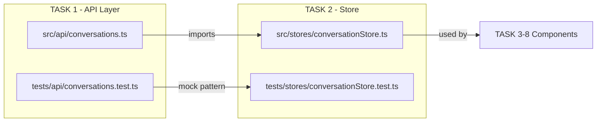
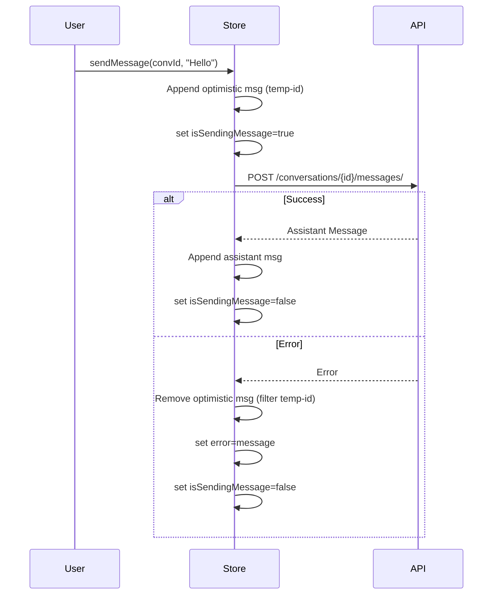

# Plan — Task 2: Conversation Store (Zustand)

**Epic:** E10 — Frontend Chat Interface  
**File to Create:** [`src/frontend/src/stores/conversationStore.ts`](src/frontend/src/stores/conversationStore.ts)  
**Test File:** [`src/frontend/tests/stores/conversationStore.test.ts`](src/frontend/tests/stores/conversationStore.test.ts)  
**Test Type:** Vitest (pure non-UI logic)  
**Depends On:** TASK 1 (API layer — [`src/frontend/src/api/conversations.ts`](src/frontend/src/api/conversations.ts))  
**Store Pattern Reference:** [`src/frontend/src/stores/authStore.ts`](src/frontend/src/stores/authStore.ts)  

---

## Overview

Create a Zustand store that manages the global state for conversations and messages. The store wraps the API functions from TASK 1 and adds:

- Loading/error state management
- **Optimistic updates** in `sendMessage` (append user message immediately, rollback on failure)
- List caching (no full refetch after `createConversation`)

---

## Step 1: RED — Write Failing Tests

**File:** [`src/frontend/tests/stores/conversationStore.test.ts`](src/frontend/tests/stores/conversationStore.test.ts)

### Test Structure

Follow the pattern from [`src/frontend/tests/auth/authStore.test.ts`](src/frontend/tests/auth/authStore.test.ts):

1. **Mock the API module** (`@/api/conversations`) **BEFORE** importing the store (using `vi.mock` at top level)
2. **Mock data** — reuse the same mock shapes from [`src/frontend/tests/api/conversations.test.ts`](src/frontend/tests/api/conversations.test.ts)
3. **Helper** `resetStore()` — calls `useConversationStore.setState(initialState)` to get a fresh store between tests
4. **`beforeEach`** — `vi.clearAllMocks()`, `vi.resetModules()`
5. **`afterEach`** — `vi.restoreAllMocks()`

### Test Cases

#### `fetchConversations`

| # | Test | Assertions |
|---|------|------------|
| 1 | Sets `conversations` and clears loading/error on success | `listConversations` called with `documentId`, `conversations` = mock list, `isLoadingConversations` = false, `error` = null |
| 2 | Sets `error` and clears loading on failure | `listConversations` rejects, `error` = error message, `isLoadingConversations` = false, `conversations` unchanged |

#### `createConversation`

| # | Test | Assertions |
|---|------|------------|
| 3 | Appends new conversation to list on success | `createConversation` called with `documentId` + `title`, `conversations` includes new item, returns the `Conversation` |
| 4 | Propagates error without modifying list | `createConversation` rejects, `conversations` unchanged, error propagates |

#### `loadConversation`

| # | Test | Assertions |
|---|------|------------|
| 5 | Sets `activeConversation` and clears loading/error on success | `getConversation` called with `conversationId`, `activeConversation` = mock detail, `isLoadingMessages` = false, `error` = null |
| 6 | Sets `error` and clears loading on failure | `getConversation` rejects, `error` = error message, `isLoadingMessages` = false, `activeConversation` unchanged |

#### `sendMessage` — Optimistic Update

| # | Test | Assertions |
|---|------|------------|
| 7 | Appends optimistic user message immediately with temp `id` | Before API resolves: `activeConversation.messages` has 1 extra message with `role: 'user'`, `content: 'Hello'`, `id` starts with `'temp-'`, `isSendingMessage` = true |
| 8 | On success, replaces optimistic message with real user message + appends assistant response | After resolve: optimistic message updated with real `id`, assistant message appended, `isSendingMessage` = false, `error` = null |
| 9 | On error, removes optimistic message and sets `error` | After reject: optimistic message removed (messages back to original length), `error` = error message, `isSendingMessage` = false |
| 10 | `isSendingMessage` toggles correctly through the lifecycle | Starts false → true during request → false after resolve/reject |

#### `deleteConversation`

| # | Test | Assertions |
|---|------|------------|
| 11 | Removes conversation from list and clears `activeConversation` if deleted | `deleteConversation` called with `conversationId`, conversation removed from list, `activeConversation` set to null if it was the deleted one |
| 12 | Sets `error` on failure | `deleteConversation` rejects, `error` = error message, list unchanged |

#### `clearActiveConversation` / `clearError`

| # | Test | Assertions |
|---|------|------------|
| 13 | `clearActiveConversation` sets `activeConversation` to null | After calling, `activeConversation` = null |
| 14 | `clearError` sets `error` to null | After calling, `error` = null |

### Mock Data

```typescript
const mockConversation: Conversation = {
  id: 'conv-1',
  document_id: 'doc-1',
  document_title: 'Test Document',
  title: 'Questions about Chapter 5',
  message_count: 3,
  created_at: '2026-04-18T10:00:00Z',
  updated_at: '2026-04-18T11:00:00Z',
};

const mockConversationDetail: ConversationDetail = {
  ...mockConversation,
  messages: [
    {
      id: 'msg-0',
      role: 'user',
      content: 'What is discussed in chapter 5?',
      sources: [],
      token_usage: null,
      created_at: '2026-04-18T10:05:00Z',
    },
    {
      id: 'msg-1',
      role: 'assistant',
      content: 'Chapter 5 discusses machine learning concepts.',
      sources: [{ chunk_id: 'chunk-1', page_start: 45, page_end: 47, content_preview: '...', relevance_score: 0.92 }],
      token_usage: { prompt_tokens: 3500, completion_tokens: 250, total_tokens: 3750 },
      created_at: '2026-04-18T10:05:15Z',
    },
  ],
};

const mockAssistantMessage: Message = {
  id: 'msg-2',
  role: 'assistant',
  content: 'Here is the answer to your question.',
  sources: [],
  token_usage: null,
  created_at: '2026-04-18T10:10:00Z',
};
```

---

## Step 2: GREEN — Implement the Store

**File:** [`src/frontend/src/stores/conversationStore.ts`](src/frontend/src/stores/conversationStore.ts)

### State Shape

```typescript
interface ConversationState {
  conversations: Conversation[];
  activeConversation: ConversationDetail | null;
  isLoadingConversations: boolean;
  isLoadingMessages: boolean;
  isSendingMessage: boolean;
  error: string | null;
}

interface ConversationActions {
  fetchConversations: (documentId: string) => Promise<void>;
  createConversation: (documentId: string, title?: string) => Promise<Conversation>;
  loadConversation: (conversationId: string) => Promise<void>;
  sendMessage: (conversationId: string, content: string) => Promise<void>;
  deleteConversation: (conversationId: string) => Promise<void>;
  clearActiveConversation: () => void;
  clearError: () => void;
}

type ConversationStore = ConversationState & ConversationActions;
```

### Initial State

```typescript
const initialState: ConversationState = {
  conversations: [],
  activeConversation: null,
  isLoadingConversations: false,
  isLoadingMessages: false,
  isSendingMessage: false,
  error: null,
};
```

### Action Implementations

#### `fetchConversations(documentId)`

```
1. set({ isLoadingConversations: true, error: null })
2. Call listConversations(documentId) from the API module
3. set({ conversations: data.results, isLoadingConversations: false })
4. On error: set({ error: error.message, isLoadingConversations: false })
```

#### `createConversation(documentId, title?)`

```
1. Call createConversation(documentId, title) from the API module
2. set((state) => ({ conversations: [newConv, ...state.conversations] }))
3. Return the new conversation
4. On error: throw (caller handles)
```

#### `loadConversation(conversationId)`

```
1. set({ isLoadingMessages: true, error: null })
2. Call getConversation(conversationId) from the API module
3. set({ activeConversation: data, isLoadingMessages: false })
4. On error: set({ error: error.message, isLoadingMessages: false })
```

#### `sendMessage(conversationId, content)` — Optimistic Update

```
1. Generate tempId = 'temp-' + crypto.randomUUID() (or Date.now().toString())
2. Create optimistic message:
   {
     id: tempId,
     role: 'user',
     content,
     sources: [],
     token_usage: null,
     created_at: new Date().toISOString(),
   }
3. set((state) => ({
     isSendingMessage: true,
     error: null,
     activeConversation: state.activeConversation
       ? { ...state.activeConversation, messages: [...state.activeConversation.messages, optimisticMsg] }
       : null,
   }))
4. Call sendMessage(conversationId, content) from the API module
5. On success:
   set((state) => ({
     isSendingMessage: false,
     activeConversation: state.activeConversation
       ? {
           ...state.activeConversation,
           messages: state.activeConversation.messages.map((m) =>
             m.id === tempId ? { ...m, id: assistantMsg.id } : m
           ).concat(assistantMsg),
         }
       : null,
   }))
   // Wait — the API returns only the assistant message.
   // The user message was already persisted server-side.
   // So we need to:
   // a) Replace the temp user message with a "real" user message (we can keep it but update id)
   // b) Append the assistant response
   //
   // Actually, simpler approach: the temp user message stays (just update its id to something stable),
   // and we append the assistant response.
   // But the API returns only the assistant message. The user message was already saved server-side.
   // So we should:
   // - Keep the optimistic user message (update its temp id to a proper one if needed, or just leave it)
   // - Append the assistant response from the API
   //
   // Simplest correct approach:
   set((state) => ({
     isSendingMessage: false,
     activeConversation: state.activeConversation
       ? {
           ...state.activeConversation,
           messages: [...state.activeConversation.messages, assistantMsg],
         }
       : null,
   }))
   
6. On error:
   set((state) => ({
     isSendingMessage: false,
     error: error.message,
     activeConversation: state.activeConversation
       ? {
           ...state.activeConversation,
           messages: state.activeConversation.messages.filter((m) => m.id !== tempId),
         }
       : null,
   }))
```

**IMPORTANT DESIGN DECISION:** The API's `sendMessage` returns only the **assistant** message (the user message is persisted server-side before the RAG call). So the optimistic user message stays in the list (it's correct content-wise), and we append the assistant response. On error, we remove the optimistic user message since the server didn't persist it.

#### `deleteConversation(conversationId)`

```
1. Call deleteConversation(conversationId) from the API module
2. set((state) => ({
     conversations: state.conversations.filter((c) => c.id !== conversationId),
     activeConversation:
       state.activeConversation?.id === conversationId ? null : state.activeConversation,
   }))
3. On error: set({ error: error.message })
```

#### `clearActiveConversation()`

```
set({ activeConversation: null })
```

#### `clearError()`

```
set({ error: null })
```

### Imports

```typescript
import { create } from 'zustand';
import {
  listConversations,
  createConversation as apiCreateConversation,
  getConversation,
  sendMessage as apiSendMessage,
  deleteConversation as apiDeleteConversation,
} from '@/api/conversations';
import type { Conversation, ConversationDetail, Message } from '@/api/conversations';
```

**Note:** The store imports from `@/api/conversations` (not `@/api/authApi`), following the same delegation pattern as [`authStore.ts`](src/frontend/src/stores/authStore.ts). The store does NOT call `fetch` directly.

---

## Step 3: REFACTOR

- Ensure no `any` types exist in the store or test file
- Ensure the store does not import or call `fetch` directly — all API calls go through `@/api/conversations`
- Verify that `sendMessage` correctly handles the edge case where `activeConversation` is null (should be a no-op or throw)
- Consider extracting the temp ID generation into a small helper

---

## Execution Commands

### Run tests (inside Docker):
```bash
docker-compose exec frontend npx vitest run tests/stores/conversationStore.test.ts
```

### Run with UI (watch mode):
```bash
docker-compose exec frontend npx vitest tests/stores/conversationStore.test.ts
```

---

## Acceptance Checklist

- [ ] Optimistic user message appears before API responds
- [ ] On API error, optimistic message is removed and `error` is set
- [ ] `isSendingMessage` is `true` during the request and `false` after
- [ ] Store does not call `fetch` directly (delegates to `conversations.ts`)
- [ ] All tests pass
- [ ] No `any` types in new files
- [ ] `wip-context.md` updated after completion

---

## Dependency Flow



## Optimistic Update Flow


