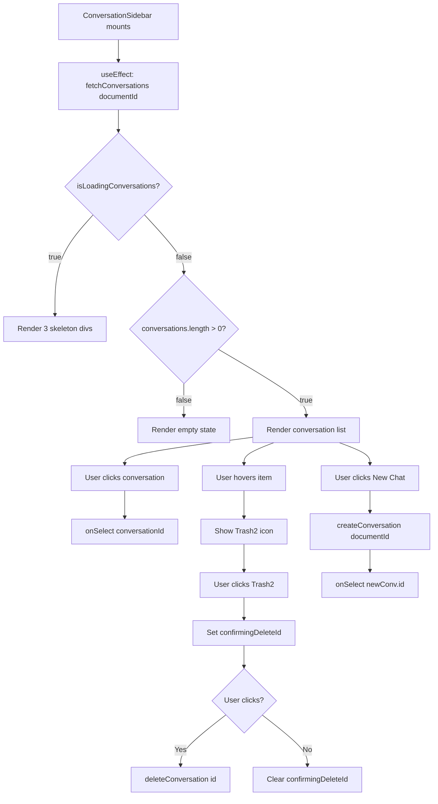

# Plan — Task 3: ConversationSidebar Component

## Overview

Implement the [`ConversationSidebar`](src/frontend/src/components/chat/ConversationSidebar.tsx) component — a left sidebar that lists all conversations for a given document. Users can create new conversations, select existing ones, and delete conversations with inline confirmation.

**Depends On:** TASK 2 (Conversation Store) — ✅ Already implemented  
**Test Type:** Visual First — Manual UI verification only

---

## Files to Create/Modify

| Action | File | Purpose |
|--------|------|---------|
| Create | [`src/frontend/src/components/chat/ConversationSidebar.tsx`](src/frontend/src/components/chat/ConversationSidebar.tsx) | Main component |
| Modify | [`docs/active-task/wip-context.md`](docs/active-task/wip-context.md) | Update after completion |

---

## Implementation Steps

### Step 1: Create the `chat/` directory structure

Ensure the directory [`src/frontend/src/components/chat/`](src/frontend/src/components/chat/) exists.

### Step 2: Implement `ConversationSidebar.tsx`

#### Props Interface

```typescript
interface ConversationSidebarProps {
  documentId: string;
  activeConversationId: string | null;
  onSelect: (conversationId: string) => void;
}
```

#### Component Structure (pseudocode)

```
┌─────────────────────────────┐
│ Header: "Conversations"     │
│ [PlusIcon] "New Chat"       │
├─────────────────────────────┤
│ Scrollable div              │
│ ┌─────────────────────────┐ │
│ │ Loading State:          │ │
│ │ 3× <div animate-pulse>  │ │
│ ├─────────────────────────┤ │
│ │ Empty State:            │ │
│ │ "No conversations yet." │ │
│ ├─────────────────────────┤ │
│ │ Conversation Item       │ │
│ │ ┌─────────────────────┐ │ │
│ │ │ Title / "Untitled"  │ │ │
│ │ │ "2 hours ago"       │ │ │
│ │ │ [Trash2 on hover]   │ │ │
│ │ └─────────────────────┘ │ │
│ │   Delete Confirmation:  │ │
│ │   "Delete? [Yes] [No]"  │ │
│ └─────────────────────────┘ │
└─────────────────────────────┘
```

#### Key Behaviors

1. **On mount:** Call `useConversationStore.getState().fetchConversations(documentId)` via `useEffect`.
2. **Loading state:** When `isLoadingConversations === true`, render 3 skeleton divs with `animate-pulse` class.
3. **Empty state:** When `conversations.length === 0 && !isLoadingConversations`, show centered muted text.
4. **Conversation list:** Map over `conversations` array, render each as a clickable row.
5. **Active state:** If `conversation.id === activeConversationId`, apply `bg-primary/10 text-primary` + left border accent (`border-l-2 border-primary`).
6. **Relative time:** Use a helper function to format `updated_at` as "just now", "2 hours ago", "3 days ago", etc.
7. **Hover delete:** Show `Trash2` icon on row hover. Clicking it sets local `confirmingDeleteId` state.
8. **Delete confirmation:** When `confirmingDeleteId` matches, show "Delete? [Yes] [No]" inline. Yes → calls `deleteConversation(id)`. No → clears `confirmingDeleteId`.
9. **New Chat:** Clicking "New Chat" button calls `createConversation(documentId)`, then calls `onSelect(newConv.id)`.

#### State Management

| State | Type | Purpose |
|-------|------|---------|
| `confirmingDeleteId` | `string \| null` | Tracks which conversation is in delete confirmation mode |

#### Helper: `formatRelativeTime(dateString: string): string`

```typescript
function formatRelativeTime(dateString: string): string {
  const now = Date.now();
  const date = new Date(dateString).getTime();
  const diffMs = now - date;
  const diffSeconds = Math.floor(diffMs / 1000);
  const diffMinutes = Math.floor(diffSeconds / 60);
  const diffHours = Math.floor(diffMinutes / 60);
  const diffDays = Math.floor(diffHours / 24);

  if (diffSeconds < 60) return 'just now';
  if (diffMinutes < 60) return `${diffMinutes} minute${diffMinutes !== 1 ? 's' : ''} ago`;
  if (diffHours < 24) return `${diffHours} hour${diffHours !== 1 ? 's' : ''} ago`;
  if (diffDays < 30) return `${diffDays} day${diffDays !== 1 ? 's' : ''} ago`;
  return new Date(dateString).toLocaleDateString();
}
```

#### Imports Needed

```typescript
import { useEffect, useState } from 'react';
import { PlusIcon, Trash2, MessageSquare } from 'lucide-react';
import { cn } from '@/lib/utils';
import { Button } from '@/components/ui/button';
import { useConversationStore } from '@/stores/conversationStore';
import type { Conversation } from '@/api/conversations';
```

**Note:** `ScrollArea` from shadcn/ui is not installed. Use a simple `div` with `overflow-y-auto flex-1` instead.

#### Tailwind Classes Reference

| Element | Classes |
|---------|---------|
| Container | `w-72 h-full border-r bg-background flex flex-col` |
| Header | `p-4 border-b` |
| Header title | `text-sm font-semibold text-muted-foreground uppercase tracking-wider` |
| New Chat button | `w-full justify-start gap-2` variant `outline` size `sm` |
| List container | `flex-1 overflow-y-auto p-2 space-y-1` |
| Item (default) | `flex items-center justify-between rounded-md px-3 py-2 text-sm cursor-pointer hover:bg-accent` |
| Item (active) | `bg-primary/10 text-primary border-l-2 border-primary` |
| Item title | `truncate flex-1` |
| Item time | `text-xs text-muted-foreground shrink-0 ml-2` |
| Delete icon | `h-4 w-4 text-muted-foreground hover:text-destructive` |
| Delete confirm | `text-xs text-muted-foreground flex items-center gap-1` |
| Skeleton | `h-10 rounded-md bg-muted animate-pulse` |
| Empty state | `flex flex-col items-center justify-center h-full text-sm text-muted-foreground p-4 text-center` |

### Step 3: Visual Verification

1. The component needs to be rendered somewhere to be visible. Since TASK 7 (ChatPage) is not yet implemented, the developer should either:
   - **Option A:** Temporarily render `ConversationSidebar` in an existing page (e.g., [`DocumentDetailPage`](src/frontend/src/pages/documents/DocumentDetailPage.tsx)) with hardcoded props for visual testing.
   - **Option B:** Create a minimal test route.

   **Recommendation:** Option A — add a temporary rendering in `DocumentDetailPage` with a mock `documentId`, then remove it after visual approval.

2. **STOP** and wait for user to manually verify in the browser.
3. After approval, remove the temporary rendering.
4. **No automated tests needed** — manual verification only.

---

## Dependency Check

| What's needed | Status |
|---------------|--------|
| [`conversationStore`](src/frontend/src/stores/conversationStore.ts) | ✅ Already implemented (TASK 2) |
| [`conversations.ts`](src/frontend/src/api/conversations.ts) API types | ✅ Already implemented (TASK 1) |
| [`Button`](src/frontend/src/components/ui/button.tsx) component | ✅ Already exists |
| [`cn` utility](src/frontend/src/lib/utils.ts) | ✅ Already exists |
| `lucide-react` (`PlusIcon`, `Trash2`, `MessageSquare`) | ✅ Already in `package.json` |
| `ScrollArea` shadcn/ui component | ❌ Not installed — use `div` with `overflow-y-auto` instead |

---

## Execution Order for Code Mode

```
Step 1: Create src/frontend/src/components/chat/ directory
Step 2: Create ConversationSidebar.tsx with full implementation
Step 3: Temporarily render in DocumentDetailPage for visual testing
Step 4: Wait for user browser approval
Step 5: Remove temporary rendering
Step 6: Update wip-context.md
```

---

## Mermaid Diagram: Component Flow



---

## Acceptance Criteria

- [ ] Component renders with correct props: `documentId`, `activeConversationId`, `onSelect`
- [ ] Loading state shows 3 skeleton divs with `animate-pulse`
- [ ] Empty state shows centered message when no conversations
- [ ] Conversation list shows title (or "Untitled Chat" fallback) + relative time
- [ ] Active conversation has `bg-primary/10 text-primary` + left border accent
- [ ] Hovering a conversation reveals `Trash2` delete icon
- [ ] Clicking delete icon shows inline "Delete? [Yes] [No]" confirmation
- [ ] "Yes" calls `deleteConversation` and removes item from list
- [ ] "No" dismisses confirmation
- [ ] "New Chat" button calls `createConversation(documentId)` then `onSelect`
- [ ] No `any` types used
- [ ] `wip-context.md` updated
