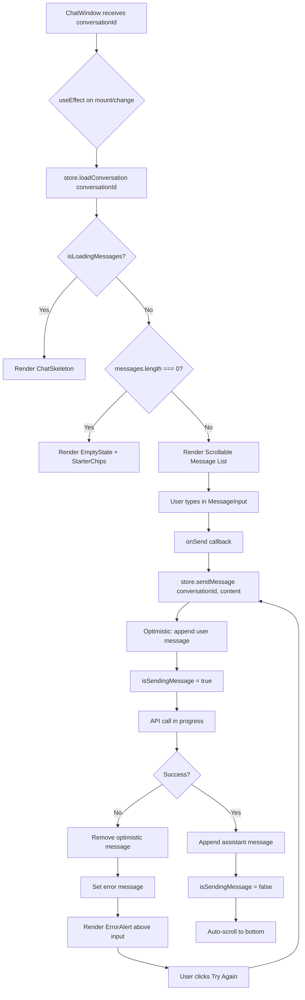
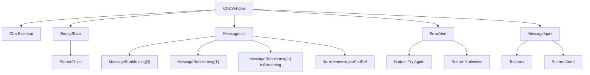

# Implementation Plan — Task 6: ChatWindow Component

**Status:** Draft for Review  
**File to Create:** [`src/frontend/src/components/chat/ChatWindow.tsx`](src/frontend/src/components/chat/ChatWindow.tsx)  
**Test Type:** Visual First — Manual UI verification only  
**Depends On:** TASK 3 (ConversationSidebar), TASK 4 (MessageBubble), TASK 5 (MessageInput)

---

## Overview

The `ChatWindow` is the orchestrator component that ties together [`MessageBubble`](src/frontend/src/components/chat/MessageBubble.tsx), [`MessageInput`](src/frontend/src/components/chat/MessageInput.tsx), and the [`conversationStore`](src/frontend/src/stores/conversationStore.ts) into a cohesive chat experience. It manages loading states, empty states, message sending flow, error handling, and auto-scroll.

---

## Component Interface

```typescript
interface ChatWindowProps {
  conversationId: string;
}
```

The component receives only a `conversationId` prop. It reads all other state from the Zustand store.

---

## Detailed Implementation Steps

### Step 1: Create the Component Scaffold

**File:** [`src/frontend/src/components/chat/ChatWindow.tsx`](src/frontend/src/components/chat/ChatWindow.tsx)

Create the file with the following structure:

```
ChatWindow/
  ├── Imports (React, store, sub-components, UI primitives, icons)
  ├── ChatWindowProps interface
  ├── Skeleton sub-component (loading state)
  ├── EmptyState sub-component (0 messages)
  ├── ErrorAlert sub-component (non-blocking error banner)
  ├── StarterChips sub-component (3 clickable suggestions)
  ├── Main ChatWindow component
  │   ├── useEffect: loadConversation on mount/conversationId change
  │   ├── Render logic:
  │   │   ├── isLoadingMessages → Skeleton
  │   │   ├── messages.length === 0 → EmptyState + StarterChips
  │   │   ├── messages.length > 0 → ScrollArea + MessageBubble list
  │   │   ├── error → ErrorAlert (above input)
  │   │   └── MessageInput (always at bottom)
  │   └── Auto-scroll via messagesEndRef
  └── Default export
```

### Step 2: Loading State — Skeleton

**Purpose:** Show while `isLoadingMessages === true` (initial load).

**Design:**
- 4-5 skeleton message bubbles (alternating user/assistant alignment)
- Use `animate-pulse` + `bg-muted` for skeleton blocks
- User skeletons: right-aligned, narrower width
- Assistant skeletons: left-aligned, wider width
- No text, just rounded rectangles

```tsx
function ChatSkeleton() {
  return (
    <div className="flex-1 space-y-4 p-4 overflow-hidden">
      {[1, 2, 3, 4].map((i) => (
        <div
          key={i}
          className={cn(
            'flex',
            i % 2 === 0 ? 'justify-end' : 'justify-start',
          )}
        >
          <div
            className={cn(
              'h-16 rounded-2xl bg-muted animate-pulse',
              i % 2 === 0 ? 'w-2/3 rounded-tr-none' : 'w-4/5',
            )}
          />
        </div>
      ))}
    </div>
  );
}
```

### Step 3: Empty State — "Ask your first question"

**Purpose:** Show when `messages.length === 0` and not loading.

**Design:**
- Centered vertically in the message area
- Large icon: `MessageSquare` from `lucide-react`
- Title: "Ask your first question"
- Subtitle: "Start a conversation about this document"
- Below: 3 clickable starter chips (see Step 4)

```tsx
function EmptyState({ onSend }: { onSend: (content: string) => void }) {
  return (
    <div className="flex-1 flex flex-col items-center justify-center px-6 text-center">
      <MessageSquare className="h-12 w-12 text-muted-foreground mb-4" />
      <h2 className="text-xl font-semibold tracking-tight">
        Ask your first question
      </h2>
      <p className="mt-1 text-sm text-muted-foreground max-w-sm">
        Start a conversation about this document. The AI will answer based on
        the document content.
      </p>
      <StarterChips onSend={onSend} />
    </div>
  );
}
```

### Step 4: Starter Chips

**Purpose:** 3 clickable suggestion chips to help users get started quickly.

**Design:**
- Horizontal row of 3 pill-shaped buttons
- Each chip is a `Button` with `variant="outline"` and `size="sm"`
- On click: calls `onSend(chipText)` which triggers the sending flow

**Suggested chips (configurable):**
1. "Summarize this document"
2. "What are the key findings?"
3. "Explain the main concepts"

```tsx
const STARTER_QUESTIONS = [
  'Summarize this document',
  'What are the key findings?',
  'Explain the main concepts',
];

function StarterChips({ onSend }: { onSend: (content: string) => void }) {
  return (
    <div className="mt-6 flex flex-wrap justify-center gap-2">
      {STARTER_QUESTIONS.map((question) => (
        <Button
          key={question}
          variant="outline"
          size="sm"
          onClick={() => onSend(question)}
          className="rounded-full text-xs"
        >
          {question}
        </Button>
      ))}
    </div>
  );
}
```

### Step 5: Message List with Auto-Scroll

**Purpose:** Render the list of messages inside a scrollable container with automatic scroll-to-bottom.

**Design:**
- Use a simple `div` with `overflow-y-auto` and `flex-1` (no Radix ScrollArea dependency needed — a native scroll container is simpler and sufficient)
- Map over `activeConversation.messages` and render [`MessageBubble`](src/frontend/src/components/chat/MessageBubble.tsx) for each
- **Last assistant message:** pass `isStreaming={isSendingMessage}` to show the blinking cursor
- **Auto-scroll:** use a `useEffect` that triggers `messagesEndRef.current?.scrollIntoView({ behavior: 'smooth' })` whenever `messages.length` changes or `isSendingMessage` changes
- **Accessibility:** add `role="log"` and `aria-live="polite"` to the message container

```tsx
const messagesEndRef = useRef<HTMLDivElement>(null);

// Auto-scroll when messages change
useEffect(() => {
  messagesEndRef.current?.scrollIntoView({ behavior: 'smooth' });
}, [messages.length, isSendingMessage]);
```

### Step 6: Sending Flow

**Purpose:** Handle user message submission through the store.

**Flow:**
1. User types in [`MessageInput`](src/frontend/src/components/chat/MessageInput.tsx) and clicks Send / presses Enter
2. `onSend` callback fires → calls `store.sendMessage(conversationId, content)`
3. Store optimistically adds the user message (see [`conversationStore.sendMessage`](src/frontend/src/stores/conversationStore.ts:94))
4. Store sets `isSendingMessage = true`
5. API call is made; on success, assistant message is appended
6. `isSendingMessage` returns to `false`
7. Auto-scroll triggers on each state change

**Implementation:**
```tsx
const handleSend = useCallback(
  (content: string) => {
    sendMessage(conversationId, content);
  },
  [conversationId, sendMessage],
);
```

### Step 7: Error Handling — Non-blocking Alert

**Purpose:** Show errors (429 rate limit, 502 server error, network errors) without blocking the UI.

**Design:**
- Positioned above [`MessageInput`](src/frontend/src/components/chat/MessageInput.tsx), below the message list
- Uses shadcn/ui [`Alert`](src/frontend/src/components/ui/alert.tsx) with `variant="destructive"`
- Icon: `AlertCircle` from `lucide-react`
- Shows a human-readable error message
- "Try again" button that calls `store.sendMessage()` again with the last attempted content
- **Dismissible:** X button to clear the error via `store.clearError()`
- **Non-blocking:** MessageInput remains interactive; user can type new messages

**Error message mapping:**
| HTTP Status | Display Message |
|-------------|-----------------|
| 429 | "Too many requests. Please wait a moment and try again." |
| 502 | "The server is temporarily unavailable. Please try again." |
| Other | Use the error message from the API or a generic fallback |

```tsx
function ErrorAlert({
  message,
  onRetry,
  onDismiss,
}: {
  message: string;
  onRetry: () => void;
  onDismiss: () => void;
}) {
  return (
    <Alert variant="destructive" className="mx-4 mb-2">
      <AlertCircle className="h-4 w-4" />
      <AlertTitle>Error</AlertTitle>
      <AlertDescription className="flex items-center justify-between">
        <span>{message}</span>
        <div className="flex gap-2">
          <Button variant="outline" size="sm" onClick={onRetry}>
            Try Again
          </Button>
          <Button variant="ghost" size="sm" onClick={onDismiss}>
            <X className="h-4 w-4" />
          </Button>
        </div>
      </AlertDescription>
    </Alert>
  );
}
```

### Step 8: Main Component Assembly

**Full component logic:**

```tsx
export default function ChatWindow({ conversationId }: ChatWindowProps) {
  const activeConversation = useConversationStore((s) => s.activeConversation);
  const isLoadingMessages = useConversationStore((s) => s.isLoadingMessages);
  const isSendingMessage = useConversationStore((s) => s.isSendingMessage);
  const error = useConversationStore((s) => s.error);
  const loadConversation = useConversationStore((s) => s.loadConversation);
  const sendMessage = useConversationStore((s) => s.sendMessage);
  const clearError = useConversationStore((s) => s.clearError);

  const messagesEndRef = useRef<HTMLDivElement>(null);
  const messages = activeConversation?.messages ?? [];

  // Load conversation on mount / id change
  useEffect(() => {
    loadConversation(conversationId);
  }, [conversationId, loadConversation]);

  // Auto-scroll
  useEffect(() => {
    messagesEndRef.current?.scrollIntoView({ behavior: 'smooth' });
  }, [messages.length, isSendingMessage]);

  const handleSend = useCallback(
    (content: string) => {
      sendMessage(conversationId, content);
    },
    [conversationId, sendMessage],
  );

  const handleRetry = useCallback(() => {
    // Re-trigger sendMessage with the last attempted content
    // This requires tracking the last attempted message
    // See Step 9 for retry logic
  }, []);

  // Render logic...
}
```

### Step 9: "Try Again" Retry Logic

**Challenge:** The "Try Again" button needs to know what message to resend. The store removes the optimistic message on error, so we need to track the last attempted content locally.

**Solution:** Use a `lastAttemptedContent` ref that gets set before calling `sendMessage` and is used by the retry handler.

```tsx
const lastAttemptedContent = useRef<string>('');

const handleSend = useCallback(
  (content: string) => {
    lastAttemptedContent.current = content;
    sendMessage(conversationId, content);
  },
  [conversationId, sendMessage],
);

const handleRetry = useCallback(() => {
  if (lastAttemptedContent.current) {
    sendMessage(conversationId, lastAttemptedContent.current);
  }
}, [conversationId, sendMessage]);
```

### Step 10: Render Logic — Complete

```tsx
return (
  <div className="flex flex-col h-full">
    {/* Message area */}
    {isLoadingMessages ? (
      <ChatSkeleton />
    ) : messages.length === 0 ? (
      <EmptyState onSend={handleSend} />
    ) : (
      <div
        className="flex-1 overflow-y-auto p-4 space-y-4"
        role="log"
        aria-live="polite"
        aria-busy={isSendingMessage}
      >
        {messages.map((msg, index) => (
          <MessageBubble
            key={msg.id}
            message={msg}
            isStreaming={
              index === messages.length - 1 &&
              msg.role === 'assistant' &&
              isSendingMessage
            }
          />
        ))}
        <div ref={messagesEndRef} />
      </div>
    )}

    {/* Error alert */}
    {error && (
      <ErrorAlert
        message={error}
        onRetry={handleRetry}
        onDismiss={clearError}
      />
    )}

    {/* Input */}
    <MessageInput
      onSend={handleSend}
      isDisabled={isSendingMessage}
    />
  </div>
);
```

---

## Dependencies & New Files

### New shadcn/ui Components to Install

None required. The component uses:
- [`Alert`](src/frontend/src/components/ui/alert.tsx) — already exists
- [`Button`](src/frontend/src/components/ui/button.tsx) — already exists
- [`MessageBubble`](src/frontend/src/components/chat/MessageBubble.tsx) — already exists (TASK 4)
- [`MessageInput`](src/frontend/src/components/chat/MessageInput.tsx) — already exists (TASK 5)
- [`conversationStore`](src/frontend/src/stores/conversationStore.ts) — already exists (TASK 2)

### Icons Used (all from `lucide-react`, already installed)
- `MessageSquare` — empty state icon
- `AlertCircle` — error alert icon
- `X` — dismiss button

---

## Visual States Summary

| State | Condition | What to Render |
|-------|-----------|----------------|
| **Loading** | `isLoadingMessages === true` | [`ChatSkeleton`](#step-2-loading-state--skeleton) — 4 animated skeleton bubbles |
| **Empty** | `messages.length === 0 && !isLoadingMessages` | [`EmptyState`](#step-3-empty-state--ask-your-first-question) + [`StarterChips`](#step-4-starter-chips) |
| **Messages** | `messages.length > 0` | Scrollable message list with [`MessageBubble`](src/frontend/src/components/chat/MessageBubble.tsx) + auto-scroll |
| **Streaming** | Last message is assistant + `isSendingMessage` | `MessageBubble` with `isStreaming={true}` (blinking cursor) |
| **Error** | `error !== null` | Non-blocking [`ErrorAlert`](#step-7-error-handling--non-blocking-alert) above input with "Try Again" + dismiss |
| **Sending disabled** | `isSendingMessage === true` | [`MessageInput`](src/frontend/src/components/chat/MessageInput.tsx) shows spinner, input disabled |

---

## Data Flow Diagram



---

## Component Tree



---

## Files to Create

| # | File | Purpose |
|---|------|---------|
| 1 | [`src/frontend/src/components/chat/ChatWindow.tsx`](src/frontend/src/components/chat/ChatWindow.tsx) | Main ChatWindow orchestrator component |

## Files to Modify

| # | File | Change |
|---|------|--------|
| None | — | This task creates a standalone component; no existing files need modification |

## Files to Update After Implementation

| # | File | Change |
|---|------|--------|
| 1 | [`docs/active-task/wip-context.md`](docs/active-task/wip-context.md) | Update with completion status |

---

## Acceptance Criteria

1. ✅ Component accepts `conversationId` prop and loads conversation on mount/change
2. ✅ Skeleton loading state shown while `isLoadingMessages === true`
3. ✅ Message list renders [`MessageBubble`](src/frontend/src/components/chat/MessageBubble.tsx) for each message
4. ✅ Last assistant message receives `isStreaming={isSendingMessage}`
5. ✅ Auto-scroll to bottom on new messages
6. ✅ Empty state with icon + "Ask your first question" + 3 starter chips
7. ✅ Clicking a starter chip sends that question
8. ✅ Sending flow: `onSend` → `store.sendMessage()` → optimistic user message
9. ✅ Error handling: non-blocking [`Alert`](src/frontend/src/components/ui/alert.tsx) above input
10. ✅ "Try Again" button resends the last attempted message
11. ✅ Error is dismissible via X button
12. ✅ No automated tests (Visual First approach)
13. ✅ No `any` types
14. ✅ All TypeScript strict

---

## Execution Order for Code Mode

1. **Create** [`src/frontend/src/components/chat/ChatWindow.tsx`](src/frontend/src/components/chat/ChatWindow.tsx) with all sub-components
2. **Create** a temporary test route in [`App.tsx`](src/frontend/src/App.tsx) for visual verification (e.g., `/test-chat-window`)
3. **Run** `docker-compose up` and verify in browser
4. **Iterate** based on visual feedback
5. **Remove** temporary test route after approval
6. **Update** [`docs/active-task/wip-context.md`](docs/active-task/wip-context.md)
