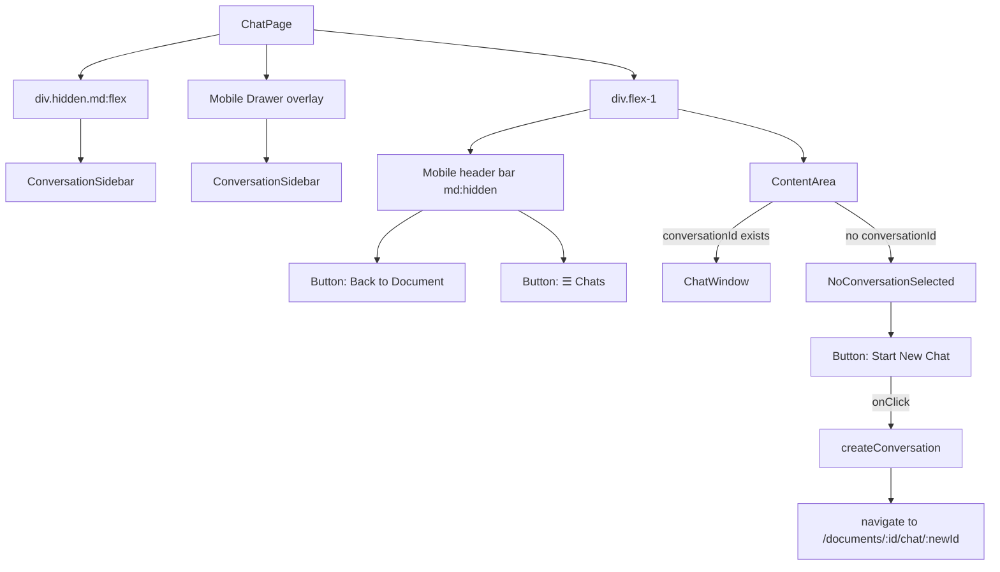
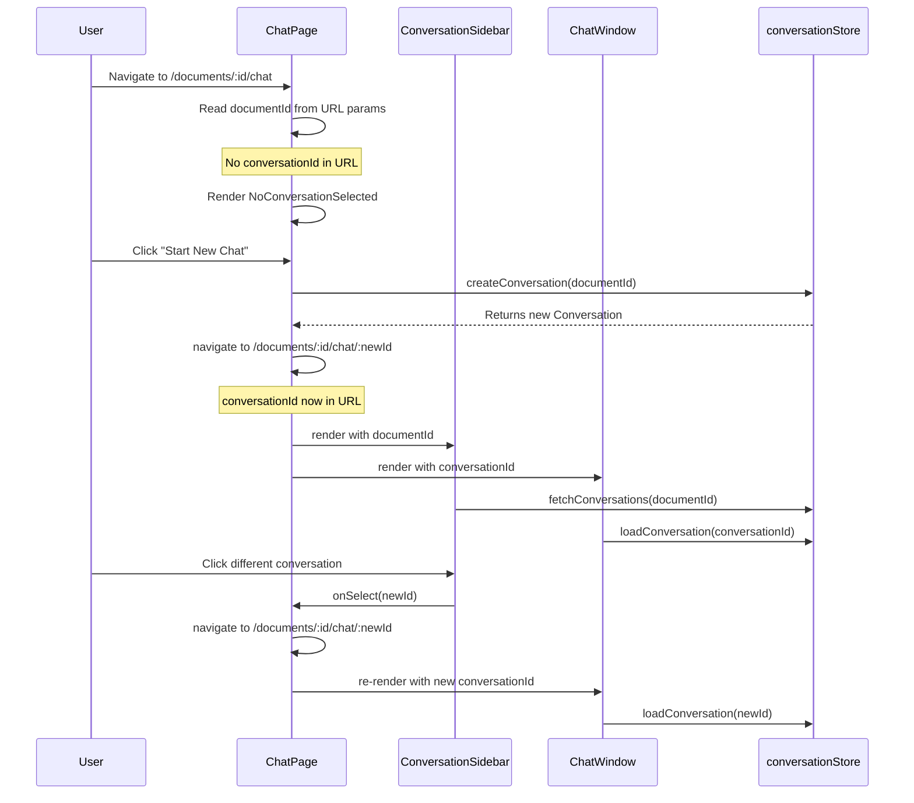

# Implementation Plan — Task 7: ChatPage Route & Layout Integration

**Status:** Draft for Review  
**Files to Create:**
- [`src/frontend/src/pages/ChatPage.tsx`](src/frontend/src/pages/ChatPage.tsx) ← **create**

**Files to Modify:**
- [`src/frontend/src/App.tsx`](src/frontend/src/App.tsx) ← add route
- [`src/frontend/src/pages/documents/DocumentDetailPage.tsx`](src/frontend/src/pages/documents/DocumentDetailPage.tsx) ← update "Chat with Document" button

**Test Type:** Visual First — Manual UI verification only  
**Depends On:** TASK 6 (ChatWindow component)

---

## Overview

Task 7 wires together the existing chat components ([`ConversationSidebar`](src/frontend/src/components/chat/ConversationSidebar.tsx), [`ChatWindow`](src/frontend/src/components/chat/ChatWindow.tsx), [`conversationStore`](src/frontend/src/stores/conversationStore.ts)) into a full-page chat experience with proper routing, mobile-responsive layout, and a navigation entry point from the document detail page.

The key architectural decision: **ChatPage lives OUTSIDE the `AppShell` layout** because the chat UI needs a full-height, no-container-padding layout (sidebar + chat window filling the viewport). The `AppShell` adds `container mx-auto p-6` padding which would break the two-panel design.

---

## Routes

| Route | Component | Purpose |
|-------|-----------|---------|
| `/documents/:documentId/chat` | `ChatPage` | New conversation (no `conversationId`) |
| `/documents/:documentId/chat/:conversationId` | `ChatPage` | Resume existing conversation |

Both routes are **nested inside `PrivateRoute` but OUTSIDE `AppShell`** to avoid the container padding.

---

## Detailed Implementation Steps

### Step 1: Create [`ChatPage.tsx`](src/frontend/src/pages/ChatPage.tsx)

**File:** [`src/frontend/src/pages/ChatPage.tsx`](src/frontend/src/pages/ChatPage.tsx)

#### 1.1 Component Interface & State

```typescript
export default function ChatPage() {
  const { documentId, conversationId } = useParams<{
    documentId: string;
    conversationId?: string;
  }>();
  const navigate = useNavigate();

  // Mobile sidebar drawer state
  const [sidebarOpen, setSidebarOpen] = useState(false);
```

#### 1.2 Layout Structure

```
┌──────────────────────────────────────────────────────┐
│  ChatPage (h-screen flex flex-row)                   │
│  ┌──────────────┐  ┌──────────────────────────────┐  │
│  │ Conversation  │  │  ChatWindow                  │  │
│  │ Sidebar       │  │                              │  │
│  │ (w-72)        │  │  (flex-1)                    │  │
│  │               │  │                              │  │
│  │ hidden on md↓ │  │                              │  │
│  └──────────────┘  └──────────────────────────────┘  │
└──────────────────────────────────────────────────────┘
```

**Desktop (`md` and up):**
- Sidebar: `w-72` (288px), visible, `hidden md:flex flex-col`
- ChatWindow: `flex-1`, fills remaining space

**Mobile (below `md`):**
- Sidebar: hidden by default, slides in as a drawer overlay
- A floating "☰ Chats" button in the top-left of the chat area to open the drawer
- Drawer: fixed overlay with backdrop, slides from left

#### 1.3 Mobile Drawer Implementation

Use a simple overlay pattern (no Radix Dialog needed — it's a custom slide-over):

```tsx
{/* Mobile sidebar toggle button — visible only on mobile */}
<button
  className="md:hidden absolute top-4 left-4 z-10 p-2 rounded-md hover:bg-accent"
  onClick={() => setSidebarOpen(true)}
  aria-label="Open conversations list"
>
  <MessageSquare className="h-5 w-5" />
  <span className="ml-1 text-sm font-medium">Chats</span>
</button>

{/* Mobile drawer overlay */}
{sidebarOpen && (
  <div className="fixed inset-0 z-40 md:hidden">
    {/* Backdrop */}
    <div
      className="fixed inset-0 bg-black/50"
      onClick={() => setSidebarOpen(false)}
    />
    {/* Drawer panel */}
    <div className="fixed inset-y-0 left-0 z-50 w-72 bg-background shadow-xl">
      <ConversationSidebar
        documentId={documentId!}
        activeConversationId={conversationId ?? null}
        onSelect={(id) => {
          navigate(`/documents/${documentId}/chat/${id}`);
          setSidebarOpen(false);
        }}
      />
    </div>
  </div>
)}
```

#### 1.4 Desktop Sidebar

```tsx
{/* Desktop sidebar — hidden on mobile */}
<div className="hidden md:flex flex-col">
  <ConversationSidebar
    documentId={documentId!}
    activeConversationId={conversationId ?? null}
    onSelect={(id) => {
      navigate(`/documents/${documentId}/chat/${id}`);
    }}
  />
</div>
```

#### 1.5 ChatWindow Area

```tsx
<div className="flex-1 flex flex-col relative">
  {/* Mobile header with back + sidebar toggle */}
  <div className="md:hidden flex items-center gap-2 border-b px-4 py-3">
    <Button
      variant="ghost"
      size="sm"
      onClick={() => navigate(`/documents/${documentId}`)}
      aria-label="Back to document"
    >
      <ArrowLeft className="h-4 w-4" />
    </Button>
    <Button
      variant="outline"
      size="sm"
      onClick={() => setSidebarOpen(true)}
      className="gap-2"
    >
      <MessageSquare className="h-4 w-4" />
      Chats
    </Button>
    <div className="flex-1" />
    {/* Document title could go here */}
  </div>

  {conversationId ? (
    <ChatWindow conversationId={conversationId} />
  ) : (
    <NoConversationSelected documentId={documentId!} />
  )}
</div>
```

#### 1.6 NoConversationSelected Sub-Component

When the user navigates to `/documents/:documentId/chat` without a `conversationId`, show a centered prompt to start a new chat:

```tsx
function NoConversationSelected({ documentId }: { documentId: string }) {
  const navigate = useNavigate();
  const createConversation = useConversationStore((s) => s.createConversation);

  const handleNewChat = async () => {
    try {
      const conv = await createConversation(documentId);
      navigate(`/documents/${documentId}/chat/${conv.id}`, { replace: true });
    } catch {
      // Error handled by store
    }
  };

  return (
    <div className="flex-1 flex flex-col items-center justify-center px-6 text-center">
      <MessageSquare className="h-16 w-16 text-muted-foreground mb-4" />
      <h2 className="text-2xl font-semibold tracking-tight">
        Document Chat
      </h2>
      <p className="mt-2 text-sm text-muted-foreground max-w-md">
        Start a new conversation or select an existing one from the sidebar to
        ask questions about this document.
      </p>
      <Button className="mt-6 gap-2" onClick={handleNewChat}>
        <PlusIcon className="h-4 w-4" />
        Start New Chat
      </Button>
    </div>
  );
}
```

#### 1.7 Full ChatPage Component Tree



#### 1.8 Data Flow



---

### Step 2: Modify [`App.tsx`](src/frontend/src/App.tsx)

**Changes:**

1. Import `ChatPage`
2. Add two new routes **inside `PrivateRoute` but OUTSIDE `AppShell`**:

```typescript
import ChatPage from '@/pages/ChatPage';

// Inside PrivateRoute children, BEFORE the AppShell route:
{
  element: <PrivateRoute />,
  children: [
    // Chat routes — outside AppShell (no container padding)
    { path: '/documents/:documentId/chat', element: <ChatPage /> },
    { path: '/documents/:documentId/chat/:conversationId', element: <ChatPage /> },
    
    // AppShell routes (with container padding)
    {
      element: <AppShell />,
      children: [
        { path: '/dashboard', element: <DashboardPage /> },
        { path: '/documents', element: <DocumentListPage /> },
        { path: '/documents/upload', element: <UploadPage /> },
        { path: '/documents/:documentId', element: <DocumentDetailPage /> },
      ],
    },
  ],
},
```

**Important:** The chat routes must be placed **before** the `AppShell` route inside the same `PrivateRoute` wrapper. React Router matches the first matching route, so `/documents/:documentId/chat` will match before `/documents/:documentId`.

---

### Step 3: Modify [`DocumentDetailPage.tsx`](src/frontend/src/pages/documents/DocumentDetailPage.tsx)

**Changes:**

1. **Update the "Start Chat" button** (currently at line 117-119 and 293-297):
   - Change the navigation target from `/conversations/new?documentId=${documentId}` to `/documents/${documentId}/chat`
   - Add visibility condition: only show when `document.status === 'completed'` (or `document.processing_status === 'completed'`)
   - Keep the `MessageSquare` icon
   - Change button text from "Start Chat" to "Chat with Document"

2. **Current code to change** (lines 117-119):
```typescript
// OLD:
const handleStartChat = () => {
  navigate(`/conversations/new?documentId=${documentId}`);
};

// NEW:
const handleStartChat = () => {
  navigate(`/documents/${documentId}/chat`);
};
```

3. **Current code to change** (lines 293-297):
```tsx
{/* OLD: */}
<Button onClick={handleStartChat}>
  <MessageSquare className="mr-2 h-4 w-4" />
  Start Chat
</Button>

{/* NEW: */}
{document.status === 'completed' && (
  <Button onClick={handleStartChat}>
    <MessageSquare className="mr-2 h-4 w-4" />
    Chat with Document
  </Button>
)}
```

**Note on `document.status` vs `document.processing_status`:** Looking at the [`Document` type](src/frontend/src/types/document.ts:7), there's both `status: string` and `processing_status?: string`. The [`DocumentDetailPage`](src/frontend/src/pages/documents/DocumentDetailPage.tsx:224) already uses `document.processing_status ?? document.status` for the display badge. For the chat button visibility, use `document.processing_status === 'completed'` since that's the more specific field. If `processing_status` is undefined, fall back to `document.status === 'completed'`.

---

### Step 4: Visual Verification

1. Run `docker-compose up`
2. Navigate to a document detail page → verify "Chat with Document" button appears only when document is completed
3. Click "Chat with Document" → verify navigation to `/documents/:id/chat`
4. Verify the two-panel layout (sidebar + chat area)
5. Verify "Start New Chat" button creates a conversation and navigates
6. Verify sidebar conversation selection navigates correctly
7. Resize to mobile width → verify sidebar is hidden, "☰ Chats" button appears
8. Click "☰ Chats" → verify drawer slides in
9. Select a conversation from drawer → verify drawer closes and chat loads
10. Verify back button navigates to document detail page

---

## Files to Create

| # | File | Purpose |
|---|------|---------|
| 1 | [`src/frontend/src/pages/ChatPage.tsx`](src/frontend/src/pages/ChatPage.tsx) | Full-page chat with two-panel layout, mobile drawer, routing |

## Files to Modify

| # | File | Change |
|---|------|--------|
| 1 | [`src/frontend/src/App.tsx`](src/frontend/src/App.tsx) | Add `/documents/:documentId/chat` and `/documents/:documentId/chat/:conversationId` routes outside AppShell |
| 2 | [`src/frontend/src/pages/documents/DocumentDetailPage.tsx`](src/frontend/src/pages/documents/DocumentDetailPage.tsx) | Update "Start Chat" → "Chat with Document", add `document.status === 'completed'` condition, fix navigation target |

## Files to Update After Implementation

| # | File | Change |
|---|------|--------|
| 1 | [`docs/active-task/wip-context.md`](docs/active-task/wip-context.md) | Update with completion status |

---

## Acceptance Criteria

1. ✅ `ChatPage.tsx` created with two-panel layout (sidebar 288px + chat flex-1)
2. ✅ Routes `/documents/:documentId/chat` and `/documents/:documentId/chat/:conversationId` registered outside AppShell
3. ✅ On mount (no conversationId): `NoConversationSelected` state with "Start New Chat" button
4. ✅ "Start New Chat" creates conversation via store and navigates to it
5. ✅ URL param `conversationId` → passes to `ChatWindow` as prop
6. ✅ Sidebar selection → navigates via `useNavigate` to update URL
7. ✅ Mobile (< `md`): sidebar hidden, "☰ Chats" button opens slide-over drawer
8. ✅ Mobile drawer has backdrop overlay, closes on backdrop click or selection
9. ✅ Mobile header has back button to document detail page
10. ✅ `DocumentDetailPage`: "Chat with Document" button with `MessageSquare` icon
11. ✅ "Chat with Document" only visible when `document.processing_status === 'completed'`
12. ✅ Navigation target updated from `/conversations/new?documentId=...` to `/documents/:documentId/chat`
13. ✅ No automated tests (Visual First approach)
14. ✅ All TypeScript strict, no `any` types

---

## Execution Order for Code Mode

1. **Create** [`src/frontend/src/pages/ChatPage.tsx`](src/frontend/src/pages/ChatPage.tsx) with:
   - `NoConversationSelected` sub-component
   - Mobile drawer overlay with backdrop
   - Desktop sidebar (hidden on mobile)
   - ChatWindow area with mobile header
   - `useParams` to read `documentId` and optional `conversationId`
   - `useNavigate` for sidebar selection
   - `useConversationStore` for `createConversation`

2. **Modify** [`src/frontend/src/App.tsx`](src/frontend/src/App.tsx):
   - Add `import ChatPage from '@/pages/ChatPage';`
   - Add two chat routes inside `PrivateRoute` but before `AppShell`

3. **Modify** [`src/frontend/src/pages/documents/DocumentDetailPage.tsx`](src/frontend/src/pages/documents/DocumentDetailPage.tsx):
   - Update `handleStartChat` navigation target
   - Wrap the "Chat with Document" button in `document.processing_status === 'completed'` condition
   - Change button text from "Start Chat" to "Chat with Document"

4. **Run** `docker-compose up` and verify in browser

5. **Iterate** based on visual feedback

6. **Update** [`docs/active-task/wip-context.md`](docs/active-task/wip-context.md)
